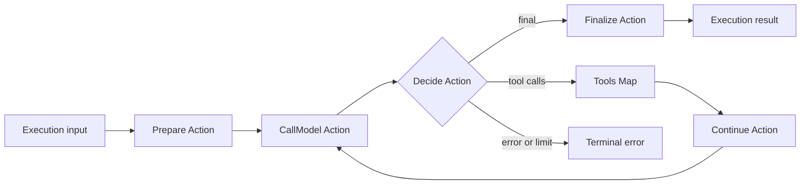

> Target seam design. This document is pending approval.

# Shared AI execution design

## Architecture and contract status

- Architecture category: [Shared AI execution](../ARCHITECTURE.md).
- Owning subsystem: Runtime.State, Flow, ReasonFlow, Prepare, CallModel, Decide, ToolsFlow, ToolAttempt, and OutputState.
- Complete target: Keep one bounded execution path for all authoring forms and methods. Preserve advanced streaming, cancellation, retry, and effect contracts without making temporary execution state a portable conversation value.
- Decision boundary: Resolve portable public Execution types, explicit Map concurrency, and the exact public cancellation contract against current core APIs.
- Current implementation, module links, example proof, and exact differences:
  [alignment](alignment.md). This design is a target, not an API reference.

The requirements and proposed signatures below remain pending approval.
Illustrative types are not evidence that a module or function exists. A
requirement is not removed merely because the current implementation differs.
Use the alignment matrix to distinguish current behavior from the full target.

## Selected direction: complete the runtime split

`EXE-DEC-005` — User-selected direction, 2026-09-15. This decision does not
approve this document or authorize implementation.

Keep the existing execution structure. Runtime owns model and tool execution,
limits, usage, output validation, and output repair. Reasoning remains one
internal dispatcher, with explicit method selection from the Profile. Each
method owns its transitions, diagnostics, and validated `method_state`.

Use the existing Reasoning functions as the starting contract. Do not add a
method registry or a new execution framework for this change. The standalone
ReAct adapter owns ReAct Config/State conversion and its existing token format.
Shared execution does not use that adapter state as its common state model.

Request transformers receive the prepared request, a small common execution
view, and the Profile. Output repair reads the query directly, without a ReAct
State conversion. The exact common-view fields and transformer callback
compatibility remain open migration questions in seams 02 and 90.

Preserve all eight methods and advanced capabilities, canonical `Jido.Session`
and `Jido.Thread`, Agent + DSL + Profile authoring, native ReqLLM contracts,
and core Jido topology ownership. This is an ownership decision, not approval
of the illustrative public Execution types below.

## Proposed execution-to-orchestration boundary

The [private request adapter proposal](../07_request_sessions/design.md#proposed-data-boundary)
carries execution facts out and returns control decisions. Runtime owns
temporary native execution state, algorithm execution through the existing
Reasoning dispatcher, and safe boundary positions. Method semantics remain
owned by seam 05 under EXE-DEC-005.

Orchestration owns pending-input order and queue access. A shared control point
for pending input and checkpoints is a proposal, not a settled contract.
Preserve wait-for-entry-commit behavior unless explicitly changed. This
boundary does not require a public execution model or a second conversation
store.

## Conversation evidence and completion

The [selected commit policy](../07_request_sessions/design.md#selected-conversation-commit-policy)
keeps committed intermediate work as evidence without promoting failed or
cancelled work into the next default model conversation. Runtime reports
completed tool results and unresolved calls accurately; it does not invent
results to make a tool exchange complete. Orchestration owns promotion.

## Scope and owner

- Owner: Jido AI runtime Actions, AI Flow definitions, and normalized AI stream items.
- In scope: One bounded model-tool request, Flow assembly, AI limits, context progression, model and tool continuations, stream order, cancellation result, and terminal result.
- Out of scope: The Flow engine, Agent commit, durable workflow, durable queue, generic retry scheduler, provider integration details, and session admission.

## V2 capability anchor

V2 supplied ReAct loops, model calls, parallel tools, streaming, timeouts, cancellation, steering points, usage limits, and final results. V3 keeps these behaviors and replaces Strategy callbacks, worker loops, and TaskSupervisor ownership with `Jido.Flow` and `Jido.Exec`.

| V2 capability | V3 target |
| --- | --- |
| Strategy loop | A canonical Flow with terminal `Dispatch` continuations |
| Strategy state | Portable execution input and Action result data |
| Parallel tool workers | `Jido.Flow.Map` with `max_concurrency` |
| Ordered tool aggregation | Map output order and explicit `Reduce` when aggregation is semantic |
| Iteration guard | AI limits plus Exec `max_continuations` and timeout |
| Worker cancellation | Public `Jido.Exec.cancel/1` through the owning session runtime |
| Token callbacks | One ordered Jido AI event stream |

## Model

One AI execution starts with portable input:

```elixir
%Jido.AI.Execution.Input{
  profile_id: atom(),
  request_id: String.t(),
  run_id: String.t(),
  query: Jido.AI.Query.t(),
  context: Jido.Session.t(),
  controls: map(),
  limits: Jido.AI.Execution.Limits.t(),
  metadata: map()
}
```

Runtime resources, stream sinks, provider clients, and cancellation handles are supplied in Exec context. They are not fields of this input.

The canonical ReAct shape is:



This diagram describes semantic continuation. The canonical stored Flow has no cycle. `Jido.Flow.Dispatch` returns the next executable and `Jido.Exec` enforces `max_continuations`.

The generated Flow uses:

- `Step` for preparation, one model call, one decision, one tool attempt, and finalization.
- `Map` for an ordered, bounded batch of independent tool attempts.
- `Reduce` only when an AI algorithm has a serial aggregation rule.
- `Choice` for static data-only branch selection.
- `Dispatch` for a dynamic next executable or terminal result.
- `Iterate` for a bounded loop with explicit state when the complete loop is statically known.
- `Subflow` for a reusable reasoning method or tool batch.

The Flow module DSL is the primary surface for developer-authored custom Flows. `Jido.Flow.Builder` is the primary lowering tool for a validated AI Profile because the profile is runtime data. Both produce a canonical `%Jido.Flow{}`.

## Requirements

### Canonical execution

`EXE-REQ-001`: Every multi-step AI request shall execute as a validated `Jido.Flow` through the public `Jido.Exec` contract.

`EXE-REQ-002`: A profile lowerer shall build the same semantic Flow for module DSL, direct profile, and codec authoring forms.

`EXE-REQ-003`: Developer-authored AI Flows shall use the standard `Jido.Flow` module DSL and AI Actions; Jido AI shall not define a competing graph DSL.

`EXE-REQ-004`: Runtime profile data shall enter Flow input or Exec context and shall not be captured as changing data in a compiled Flow module.

`EXE-REQ-005`: The execution Flow shall have one declared output that is a normalized terminal result or a normalized error.

### Model-tool progression

`EXE-REQ-006`: A model-call Action shall return a normalized Turn and shall not execute a tool.

`EXE-REQ-007`: A decision Action shall select finalization, a tool batch, another approved model operation, or a terminal error.

`EXE-REQ-008`: A dynamic decision shall use `Jido.Flow.Dispatch` or an equivalent public Flow component and shall not invoke an internal workflow runner.

`EXE-REQ-009`: When the model selects multiple independent tools, the execution Flow shall use `Jido.Flow.Map` with an explicit positive `max_concurrency`.

`EXE-REQ-010`: Tool results added to context shall retain the original model call order, independent of completion order.

`EXE-REQ-011`: After a tool batch completes, a continuation Action shall add the assistant tool-call turn and all tool results to context before the next model call.

### Bounds and retries

`EXE-REQ-012`: Each execution shall have positive limits for total timeout, model calls, tool calls, reasoning iterations, and Flow continuations.

`EXE-REQ-013`: The effective limit shall be the most restrictive value from package policy, profile policy, trusted request policy, and Exec options.

`EXE-REQ-014`: When any limit is reached, execution shall stop with a stable resource-limit error and a partial safe usage summary.

`EXE-REQ-015`: When model or tool policy permits another attempt, the execution Flow shall represent the attempt as a bounded continuation or Iterate step.

`EXE-REQ-016`: Jido AI execution code shall not start an independent retry supervisor or persist live retry state.

`EXE-REQ-017`: When retry policy requests a delay, execution shall use an approved host Action or return an unsupported-policy error; it shall not sleep inside the tool bridge.

### Streaming and events

`EXE-REQ-018`: One execution shall assign stable request, run, model-call, and tool-call identifiers before related events are emitted.

`EXE-REQ-019`: The event stream shall preserve causal order for one model call and monotonic sequence order for its deltas.

`EXE-REQ-020`: A parallel tool batch can emit completion events in completion order, but its batch result shall preserve authored call order.

`EXE-REQ-021`: A stream shall emit exactly one terminal item: completed, failed, cancelled, or interrupted.

`EXE-REQ-022`: Token and progress events shall be bounded and shall use seam 12 sanitization before transport.

### Cancellation and completion

`EXE-REQ-023`: When the owner cancels live execution, Jido AI shall call the public Exec cancellation contract and shall not send a private worker message.

`EXE-REQ-024`: Cancellation shall stop pending continuations and child tool work according to Exec cleanup rules.

`EXE-REQ-025`: A terminal success shall contain the final typed value, final context update, usage, safe metadata, and proposed effects.

`EXE-REQ-026`: The execution result shall not commit Agent state or dispatch post-commit Directives.

### Turn and session parity

`EXE-REQ-027`: Turn mode and session mode shall use the same canonical AI Flow, model gateway, tool bridge, limits, and terminal result contract.

`EXE-REQ-028`: Differences between Turn mode and session mode shall be limited to admission, process lifetime, streaming transport, and commit timing.

### Stored and direct Flow forms

`EXE-REQ-029`: When a host stores or transports a custom AI Flow, it shall use `Jido.Flow.Codec` with a trusted Flow registry and shall not use a Jido AI-specific graph format.

`EXE-REQ-030`: When Jido AI constructs a Flow directly, it shall use public canonical Flow component constructors and the same validation as DSL, Builder, and Codec forms.

## Public contract

Recommended values:

```elixir
Jido.AI.Execution.Input.t()
Jido.AI.Execution.Limits.t()
Jido.AI.Execution.Event.t()
Jido.AI.Execution.Result.t()
```

Recommended Flow entry point:

```elixir
Jido.AI.Execution.flow(profile) ::
  {:ok, Jido.Flow.t()} | {:error, Jido.AI.Error.t()}

Jido.AI.Execution.run(input, context, opts \\ []) ::
  {:ok, Jido.AI.Execution.Result.t()} | {:error, Jido.AI.Error.t()}
```

`run/3` is a thin call to `Jido.Exec`. It does not have a separate worker implementation.

Recommended terminal status values are `:completed`, `:failed`, `:cancelled`, and `:interrupted`. A resource-limit error remains `:failed` with a stable limit code.

Flow component contracts consume only standard Action outputs and errors. Jido AI does not depend on extra values that direct Action execution can return but Flow discards.

## Invariants

- `EXE-INV-001`: One multi-step AI request has one canonical Flow execution.
- `EXE-INV-002`: Every loop, continuation, timeout, and concurrency value is bounded.
- `EXE-INV-003`: Jido AI does not execute Runic or any private Flow runtime directly.
- `EXE-INV-004`: Tool batch output order follows model call order.
- `EXE-INV-005`: One execution stream has one terminal item.
- `EXE-INV-006`: Turn and session modes share AI semantics.
- `EXE-INV-007`: An execution result is a proposal until core Jido commits it.
- `EXE-INV-008`: Live Exec state is never portable or durable.
- `EXE-INV-009`: Every authoring form produces the same canonical Flow contract.

## Downstream guarantees

| Consumer seam | Guaranteed contract |
| --- | --- |
| 05 Reasoning | Standard Actions and Flow components for method execution |
| 06 Runtime integration | One candidate-ready terminal result without a hidden commit |
| 07 Sessions | One shared execution function, stream, cancel path, and terminal state |
| 08 Capabilities | Stable control and policy points |
| 10 Authoring | Deterministic Flow lowering from profiles |
| 11 Checkpoints | Portable semantic state separated from live Exec state |
| 12 Observation | Stable correlation and event order |

## Open design decisions

| ID | Question | Recommended option | Effect |
| --- | --- | --- | --- |
| `EXE-DEC-001` | Is terminal `Dispatch` or `Iterate` the canonical ReAct loop? | Terminal `Dispatch` for dynamic model choice; `Iterate` for statically bounded method loops | Uses each Flow component for its natural case |
| `EXE-DEC-002` | Can Jido AI supply a delay Action? | No default delay Action in V3 | Avoids blocking workers and generic scheduler ownership |
| `EXE-DEC-003` | Does standalone streaming need a private Agent? | Only if the session seam proves a separate Agent lifecycle | Prevents process duplication |
| `EXE-DEC-004` | Is delta emission a stable execution guarantee? | Ordering and terminal behavior are stable; delta content is provider-dependent | Gives consumers useful guarantees without provider coupling |
