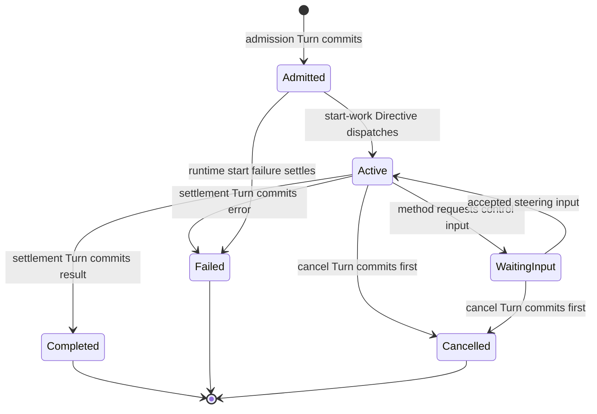

> Target seam design. This document is pending approval.

# Request sessions and active input design

## Scope and owner

- Owner: `Jido.AI.Request`, `Jido.AI.Session`, request record Actions, session Plugin runtime, pending-input behavior, and public request convenience calls.
- In scope: Request IDs, handles, committed records, admission, Turn and session modes, await, stream, sync, cancellation, steering, injection, settlement, retention, and inspection.
- Out of scope: Generic job queues, private AgentServer protocols, durable workflows, model and tool semantics, provider transports, and durable event logs.

## V2 capability anchor

V2 supplied `ask`, `ask_sync`, request handles, await, streams, cancellation, steering, per-request options, busy policy, correlation, and standalone ReAct. V3 keeps this public experience but uses core AgentServer calls, Plugin admission, committed request records, post-commit session work, and the shared AI Flow.

| V2 capability | V3 target |
| --- | --- |
| Request handle with server identity | Explicit local-only handle plus portable committed record |
| Strategy busy state | Session Plugin admission and one committed pending record |
| Worker start during request | Post-commit session Directive dispatch |
| Worker completion callback | Correlated public settlement command and Turn |
| Stream sink in request data | Process-local sink owned by session runtime |
| Steering mailbox | Bounded correlated control queue at approved operation points |
| Standalone runner | Thin local session facade over the same Agent and Flow contracts |

## Model

Profiles select one of two modes.

### Turn mode

One admitted query Signal resolves to the canonical AI Flow. Model and tool I/O complete before the Turn returns. Core Jido validates and commits one final candidate. Turn mode has no long-lived AI session runtime and does not provide live steering.

### Session mode

The request lifecycle is:



The committed `Request.Record` uses stable terminal status values. `Active` and `WaitingInput` are live inspection states unless the Agent commits a specific progress snapshot. The session runtime owns live tasks, Exec handles, stream sinks, control queues, and transient completions.

The public `Request.Handle` is local-only because it contains an AgentServer reference. It is not stored in Agent state or encoded. The portable request record contains IDs, query, profile and method IDs, status, terminal result or error, timestamps, bounded metadata, and retention policy.

## Requirements

### Admission and identity

`SES-REQ-001`: Every AI request shall have a nonempty request ID and run ID before admission commits.

`SES-REQ-002`: A request ID shall identify the logical request and a run ID shall identify one live execution attempt.

`SES-REQ-003`: When the same request ID already exists in retained Agent state, admission shall reject the request as a duplicate.

`SES-REQ-004`: For the first V3 release, session admission shall reject a new request while another request record is pending for the same Agent.

`SES-REQ-005`: `ask/3` shall return a handle only after the admission candidate and request record commit successfully.

`SES-REQ-006`: Untrusted request input shall not set a runtime stream sink, provider client, credential, or transport option.

### Request modes

`SES-REQ-007`: Turn mode shall execute the canonical AI Flow inside one core Turn and shall return only after the final candidate commits or the Turn fails.

`SES-REQ-008`: Session mode shall commit admission before it starts model or tool work.

`SES-REQ-009`: Session mode shall start live work only from a validated post-commit Directive owned by the session Plugin.

`SES-REQ-010`: Turn and session modes shall use the same effective profile, model gateway, tool bridge, reasoning method, limits, output validation, and result contract.

### Records and settlement

`SES-REQ-011`: A committed request record shall be portable and shall not contain a server reference, PID, task, monitor, stream sink, provider object, or Exec handle.

`SES-REQ-012`: The session Plugin shall own request records under one declared Agent state key.

`SES-REQ-013`: A settlement shall match both request ID and run ID and shall reject stale or duplicate settlement.

`SES-REQ-014`: A successful settlement shall assemble the complete candidate Agent, update the declared result and history fields, update the request record, and return approved Directives in one Turn result.

`SES-REQ-015`: A failed settlement shall preserve the prior domain state except for the terminal request record and approved failure metadata.

`SES-REQ-016`: A committed request outcome shall be authoritative even if a later terminal stream item cannot be delivered.

`SES-REQ-017`: Request retention shall never evict pending work and shall use a deterministic order for terminal record eviction.

### Await and stream

`SES-REQ-018`: `await/2` shall use public AgentServer or session APIs and shall select the record by request ID.

`SES-REQ-019`: An await timeout shall not change the committed request status or cancel the request unless the caller explicitly requests cancellation.

`SES-REQ-020`: A request stream shall be an ordered best-effort live view and shall not be described as a durable event log.

`SES-REQ-021`: A request stream shall contain exactly one terminal item when its sink remains available through termination.

`SES-REQ-022`: If a stream sink terminates, the request shall continue unless profile policy explicitly requires stream ownership.

### Cancellation and active input

`SES-REQ-023`: A cancellation request shall name a request ID or resolve unambiguously to the single pending request.

`SES-REQ-024`: If cancellation commits before settlement, the record shall become `:cancelled`, pending continuations shall stop, and later settlement shall be stale.

`SES-REQ-025`: If settlement commits before cancellation, cancellation shall return `:request_already_finished` and shall not replace the terminal result.

`SES-REQ-026`: The cancellation contract shall state that it cannot roll back a model call, tool call, or other external effect that completed before cancellation.

`SES-REQ-027`: Steering and injection shall be available only for a method and profile that declare active-input support.

`SES-REQ-028`: A control item shall include a control ID, kind, visible content, expected request ID, source, and bounded references.

`SES-REQ-029`: A control acknowledgement shall state whether the item was queued, rejected, or applied; a queued result shall not claim consumption.

`SES-REQ-030`: The live control queue shall be bounded and shall not be stored as a generic Agent mailbox.

### Standalone use and inspection

`SES-REQ-031`: Standalone request APIs shall use the same public Agent, Plugin, Flow, Exec, and request contracts as authored Agents.

`SES-REQ-032`: A standalone facade shall own and stop any local AgentServer that it creates.

`SES-REQ-033`: Session inspection shall separate the committed request record from transient live samples.

`SES-REQ-034`: Inspection shall bound trace and metadata size and shall mark truncated data.

## Public contract

Recommended local handle:

```elixir
%Jido.AI.Request.Handle{
  id: String.t(),
  run_id: String.t(),
  server: Jido.AgentServer.server(),
  profile_id: atom()
}
```

The handle is explicitly local-only. Recommended portable record:

```elixir
%Jido.AI.Request.Record{
  id: String.t(),
  run_id: String.t(),
  profile_id: atom(),
  method: atom(),
  query: Jido.AI.Query.t(),
  status: :pending | :completed | :failed | :cancelled | :interrupted,
  result: term() | nil,
  error: Jido.AI.Error.t() | nil,
  inserted_at: integer(),
  completed_at: integer() | nil,
  metadata: map()
}
```

Recommended API:

```elixir
AgentModule.ask(server, query, opts \\ []) ::
  {:ok, Request.Handle.t()} | {:error, Jido.AI.Error.t()}

AgentModule.ask_stream(server, query, opts \\ []) ::
  {:ok, %{request: Request.Handle.t(), events: Enumerable.t()}} |
  {:error, Jido.AI.Error.t()}

AgentModule.ask_sync(server, query, opts \\ []) ::
  {:ok, term()} | {:error, Jido.AI.Error.t()}

Jido.AI.Request.await(handle, opts \\ []) ::
  {:ok, term()} | {:error, term()}

Jido.AI.Session.cancel(handle_or_server, opts \\ []) ::
  {:ok, :cancelled} | {:error, term()}

Jido.AI.Session.steer(handle_or_server, content, opts \\ []) ::
  {:ok, Jido.AI.ControlAck.t()} | {:error, term()}
```

## Invariants

- `SES-INV-001`: A request ID identifies one logical request; a run ID identifies one execution attempt.
- `SES-INV-002`: A session starts live work only after admission commit.
- `SES-INV-003`: One Agent has at most one pending AI session in the first V3 release.
- `SES-INV-004`: A request record is portable; a request handle is local-only.
- `SES-INV-005`: Settlement and cancellation are correlated and stale-safe.
- `SES-INV-006`: A committed result is authoritative over live stream delivery.
- `SES-INV-007`: Steering is bounded AI control, not a generic mailbox.
- `SES-INV-008`: Standalone use does not have a separate AI execution engine.

## Downstream guarantees

| Consumer seam | Guaranteed contract |
| --- | --- |
| 08 Capabilities | Stable admission, request state, controls, and settlement hooks |
| 09 Skills | Request-scoped activation and runtime lifetime |
| 10 Authoring | Stable `:turn` and `:session` profile modes and generated calls |
| 11 Checkpoints | Portable request records and explicit active-run semantics |
| 12 Observation | Stable request and run correlation and terminal states |
| 90 Delivery | Public V2 request experience with V3 runtime ownership |

## Open design decisions

| ID | Question | Recommended option | Effect |
| --- | --- | --- | --- |
| `SES-DEC-001` | How many sessions can be pending per Agent? | One for the first V3 release | Keeps Plugin state and steering deterministic |
| `SES-DEC-002` | Is the request handle portable? | No | Keeps process identity out of data contracts |
| `SES-DEC-003` | Does await timeout cancel work? | No | Separates caller patience from request policy |
| `SES-DEC-004` | What wins a cancellation race? | The first committed terminal transition | Uses core commit as the authority |
| `SES-DEC-005` | Is the event stream durable? | No | Keeps durable event delivery outside Jido AI |
