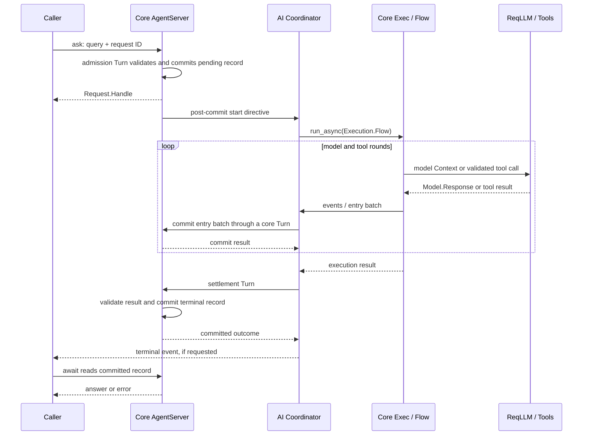

# Jido AI architecture

> Start here for the package architecture.
> Review status: Pending approval. Code baseline: `4ed6402f` on `v3-spike`,
> plus the uncommitted runtime refinement described below.
> This overview consolidates the former `architecture-seams.md`.
> Detailed requirements and evidence remain in the numbered seam folders.

## 1. The central distinction

**Session and Thread hold interaction data. Execution runs Flows. Reasoning selects
steps. Orchestration controls live requests. Core Jido validates and commits.**

There is one main authoring model: `Jido.AI.Agent` + DSL + Profile.
Capabilities and skills extend that model. They do not introduce another Agent
or execution framework. All eight reasoning methods and standalone ReAct remain
in scope.

This document separates three things:

- **Current:** behavior or structure present in the source.
- **Selected direction:** a discussed design choice, not a claim of implementation.
- **Open:** a contract that still needs a decision or evidence.

Document approval is separate from all three. The [design index](README.md)
owns approval status and the dependency graph. Every seam has a briefing,
a target design, and an alignment file. This overview introduces no new
requirement IDs and does not approve the detailed targets.

## 2. Package boundaries

| Owner | Responsibility |
| --- | --- |
| `jido_ai` | AI authoring, models, tools, reasoning, request orchestration, policy, and canonical Session/Thread values |
| Core `jido` | Agent values, AgentServer, Plugins, candidate validation, commits, directives, supervision, and topology |
| `jido_action` | Actions, Instructions, Flow graphs, and in-memory Exec |
| `jido_signal` | Signal envelope, serialization, routing, dispatch, and local bus |
| ReqLLM / LLMDB | Native provider and model contracts |
| `jido_browser` | Browser adapters and browser Actions consumed through the normal tool bridge |
| Host application | Credentials, external services, durable stores, deployment, business policy, and durable orchestration |

Jido AI supplies AI decisions and data to lower-package execution contracts.
It does not replace AgentServer, Flow, Exec, or Signal transport. External work
before commit has no implied rollback. A checkpoint cannot undo a tool effect.

See [boundary design](00_boundary_invariants/design.md) and
[boundary evidence](00_boundary_invariants/alignment.md).

## 3. Values, state, and process owners

| Value or owner | Role | Not its role |
| --- | --- | --- |
| `Profile` | Validated model, tool, method, limits, output, and memory configuration | Live service container |
| `Jido.Session` | Portable interaction value owning one Thread | Request process or worker |
| `Jido.Thread` / `Entry` | Ordered canonical interaction log | Second execution engine |
| `Query`, `Model.Response`, `Output`, `Usage` | AI input, one normalized model response, output contract, and usage | Core Turn or request lifecycle |
| `Thread.Projection` | Derive model-facing messages from canonical entries | Independent context store |
| `Execution.State` | Temporary execution data, including model Context | Portable Session or checkpoint |
| `Request.Handle` / `Stream` | Local access to admitted work and events | Durable identity or stored context |
| `Request.Record` | Request status and outcome retained in Agent state | Worker state |
| `Orchestration.Coordinator` | Worker lifetime, ordered commits, cancellation, and completion | Core validation or a general scheduler |
| ReAct `State` / `Token` | Standalone adapter state and resume encoding | The shared execution model for all methods |
| AI resource owner — selected target | AgentServer-scoped catalogs/providers; Session-scoped activations | A global lazy registry or request-scoped activation store |

Native provider values can exist during execution. Portable exports select and
validate data explicitly. Runtime PIDs, callbacks, clients, and secrets do not
become portable data merely because a containing map has a schema.

Source: [Session](../../lib/jido_session.ex),
[Thread](../../lib/jido_thread.ex), [Entry](../../lib/jido_thread/entry.ex),
[Profile](../../lib/jido_ai/profile.ex),
[Execution.State](../../lib/jido_ai/execution/state.ex),
[Projection](../../lib/jido_ai/thread/projection.ex).

## 4. Execution and commit boundaries

```text
Agent + DSL + Profile
        |
        v
Authoring lowers configuration to core routes and Plugins
        |
        v
AgentServer admission through AI/core integration
        |
        v
Orchestration: active request, input, lifetime, completion
        |
        v
Execution: bounded shared Flow execution
        +--> Reasoning: method decisions and transitions
        +--> Model.Transport --> ReqLLM
        +--> Tools.Executor --> Jido.Exec --> Action / Flow
        |
        v
Orchestration: ordered entry commits and settlement
        |
        v
Core Jido: candidate validation and commit
        |
        v
Delivery through the core contracts
```

All AI Agent requests use one lifecycle: admission, Flow execution, settlement.
There is no Profile request mode. A core Turn admits the request and returns
before model work finishes. Further core Turns commit entries and the outcome.
The request can outlive each Turn. Retained Session/Thread data is optional.
Standalone ReAct uses the same execution through its adapter.

Runtime produces execution results and evidence. Orchestration coordinates
their commits. Core performs validation and commit. Receiving an event is not
proof that its entries committed; acknowledging a checkpoint is not proof of
durable storage. The proposed batch/receipt boundary makes these distinctions
explicit without creating another context store.

Coordinator lifetime and ordered commit work remain together. Extracting helper
functions does not create new process owners.

Source: [Authoring](../../lib/jido_ai/authoring.ex),
[Execution.Flow](../../lib/jido_ai/execution/flow.ex),
[Coordinator](../../lib/jido_ai/orchestration/coordinator.ex),
[settlement](../../lib/jido_ai/orchestration/settle.ex),
[standalone runner](../../lib/jido_ai/reasoning/react/runner.ex).

### One request: values and sequence

`ask/3` returns a `Request.Handle`. `ask_sync/3` submits the same request and
waits for its outcome. `ask_stream/3` selects provider streaming and adds an
event sink to that lifecycle. The same Agent supports buffered and streamed
calls. There is no `requests` block or field in Profile. Steering and activity
timers belong to Profile `controls`; streaming belongs to the call.
A core generated route helper returns the admission Agent revision, not the
answer. The host application setting `:max_retained_requests` (default `100`)
limits retained request records, not concurrency. Each Coordinator captures
the setting at startup; callers and Profiles cannot override it.
Pending records are kept; older terminal records are removed first.
Each Agent accepts one active AI request. Further requests receive `:busy`.



Context means the selected model-facing messages. Session owns a Thread; Thread
stores entries; Projection builds Context from those entries. An execution
context is a separate service and metadata map passed to Actions. A model
response is not a core Turn. A complete request can contain many responses and
many short core Turns.

### Process ownership

The Coordinator is a core-managed Plugin runtime, not an Agent or subagent.
There is one Coordinator per AgentServer, not one per request. It owns execution
handles, cancellation, and settlement. `Execution` modules own no GenServer.

```text
Jido.AgentSupervisor (DynamicSupervisor)
├── AgentServer
└── PluginChild (lifecycle wrapper, linked to the AgentServer)
    └── private Supervisor (linked to the wrapper)
        └── Orchestration.Coordinator
            ├── Delivery (linked; isolates Signal delivery)
            └── optional pending-input queue (monitors its owner)

Core Exec task supervisor
└── Flow execution (Coordinator owns its async handle)
```

The wrapper and AgentServer are supervisor siblings. The wrapper's private
supervisor is a linked process, not a child registered under the wrapper.
Core owns this lifecycle. AI does not add a competing Agent supervisor.
The Coordinator uses `Jido.Exec.handle_message/2` and `cancel/1`; it does not
wrap blocking Exec in another work Task. Short settlement Tasks keep calls
back to AgentServer out of Coordinator callbacks.

Delivery and the optional input queue retain their existing isolation contracts.
They are not subagents. Consolidating them requires separate queue and failure
tests. No throughput or distributed recovery claim follows from this layout.
Coordinator restart marks unfinished requests interrupted; it does not replay
tool side effects.

### Selected refinement: one private execution bridge

Implementation scope is selected; the migration is not yet complete.
`Orchestration.ExecutionBinding` will carry trusted, request-local ownership
data. `Orchestration.ExecutionBridge` will own the internal calls for progress,
ordered entry commits, input, and checkpoint acknowledgment. Neither is a
process, public extension point, or portable Context value.

Progress acceptance, entry commit, and checkpoint continuation have distinct
meanings. Core Exec remains the completion path; Coordinator remains the
lifetime and settlement owner. See the
[detailed contract](07_request_sessions/design.md#selected-private-execution-bridge)
and [migration evidence](07_request_sessions/alignment.md#selected-bridge-refinement).

### Flow mechanics versus AI meaning

| Lower-package mechanism | AI responsibility above it |
| --- | --- |
| Action / Instruction | Tool schema, context, allowed calls, and result meaning |
| Flow dependencies, Choice, Dispatch | Model/tool decisions and next-step selection |
| Map / Reduce | Tool policy and interpretation of collected results |
| Iterate / continuations | Method state, stopping rules, and AI budgets |
| Exec timeout, concurrency, cancellation | AI limits, cancellation outcome, and usage |
| Core candidate and directives | AI result placement and post-commit intent |

Reasoning search state is useful AI data, not automatically a duplicate
scheduler. Remove duplicate mechanics based on responsibility, not module names.
Generic retry scheduling remains a boundary question; current bounded
tool-attempt delays do not establish a general retry service.
Live Exec state is not a durable checkpoint.

## 5. Architectural seams

Module names use the `Jido.AI.` prefix unless stated otherwise. Folders organize
contracts; they are not a one-to-one source layout.

### 00 — Package boundary and invariants

**Owns:** package duties, portability, effect timing, and cross-seam rules.

**Current:** AI uses core Agent/Plugin and Action/Flow/Exec contracts.

**Direction:** validated data, stable identities, explicit order, and explicit
state changes before additional adapters or processes.

**Open:** release wording, generic retry ownership, and exact compatibility
guarantees. No new execution framework is selected.

[Design](00_boundary_invariants/design.md) · [Evidence and gaps](00_boundary_invariants/alignment.md)

### 01 — Canonical interaction and AI values

**Modules:** `Jido.Session`, `Jido.Thread.*`, `Query`, `Model.Response` / `Model.Content`, `Output`,
`Usage.*`, `Error.*`, `Thread.Projection`.

**Current:** one canonical Session/Thread replaces the old context store.
Projection derives Context; Model.Response normalizes responses and does not execute tools.

**Direction:** retain permitted admitted input, consumed steering, and committed
intermediate work as evidence. Advance default model context only after
successful settlement. Exclude failed/cancelled work and unresolved tool
exchanges from that completed view. Retention remains subject to storage permissions.

**Open:** promotion metadata, entry-batch/receipt schemas, duplicate IDs,
revision conflicts, codec versions, and error guarantees. Success-only projection
is not complete in current code.

[Design](01_ai_values/design.md) · [Evidence and gaps](01_ai_values/alignment.md)

### 02 — Model integration and request preparation

**Modules:** `Models`, `Model.{Transport,Options,Messages,Generate}`,
`PromptBuilder`, `Actions.LLM.*`.

**Current:** native ReqLLM/LLMDB contracts with separate transport, options, and
message preparation. Transport can still resolve process-local bindings.

**Direction:** pass explicit bindings to workers. MockLLM uses explicit request
options through the same runtime path. Shared transformers use a small common
execution view and Profile, not ReAct adapter state.

**Open:** callback compatibility, named transform stages, and retained ModelRef
proposals. Native contracts remain the baseline; rich-model export is out of scope.

[Design](02_model_gateway/design.md) · [Evidence and gaps](02_model_gateway/alignment.md)

### 03 — Tools, sources, and effect policy

**Modules:** `ToolCatalog`, `ToolAdapter`, `ToolSource`, `ToolContext`,
`ToolInterceptor`, `ToolResult`, `Tools.Executor`, `Effects.*`.

**Current:** shared tool execution, validation, interception, result conversion,
and effect policy exist. Source declarations alone do not prove execution.

**Direction:** one Action/Flow execution boundary. Runtime chooses when to call;
this seam owns tool admission, bindings, result meaning, and effect policy.

**Open:** dynamic sources remain on hold. Catalog snapshots, approvals,
replay-safe effects, and model-facing delegation contracts remain advanced work.
External effects cannot be rolled back by a later failed Agent commit.

[Design](03_tool_bridge/design.md) · [Evidence and gaps](03_tool_bridge/alignment.md)

### 04 — Shared AI execution

**Modules:** `Execution.State`, `Prepare`, `Flow`, `ModelFlow`,
model/tool steps, `Decide`, and output-state helpers.

**Current:** shared validated execution state and Flows exist, but common paths
still contain ReAct-specific conversion and method-state assumptions.

**Direction:** Runtime owns common model/tool execution, limits, usage, output
validation, and repair. It does not own final Agent commits.

**Open:** common execution-view fields and the private Orchestration interface.
Portable public Execution proposals do not describe today's temporary State.

[Design](04_ai_execution/design.md) · [Evidence and gaps](04_ai_execution/alignment.md)

### 05 — Reasoning and planning methods

**Modules:** `Reasoning.*`, method machines/results, reasoning and planning Actions.

**Current:** ReAct, CoT, CoD, AoT, ToT, GoT, TRM, and Adaptive remain supported methods.

**Direction:** one Profile-selected internal dispatcher. Each method owns its
transitions, validated state, scores, stopping rules, and diagnostics. ReAct
conversion and token encoding stay in its standalone adapter.

**Open:** common method results, trusted custom methods, and portable executable
Plan proposals. The cleanup does not require a registry or a new method framework.
Business workflow execution remains outside this seam.

[Design](05_reasoning_planning/design.md) · [Evidence and gaps](05_reasoning_planning/alignment.md)

### 06 — Core runtime and Signal integration

**Modules:** `Configuration.Plugin.*`, `Orchestration.Plugin.*`, `Signal.*`,
route and directive adapters.

**Current:** Plugins connect AI execution to Agent and AgentServer contracts.

**Direction:** one supervised AI resource owner per AgentServer through the core
Plugin runtime-child contract. Bind selected services once through runtime
context and pass them explicitly to workers. Use the selected Jido Task Supervisor.
A required integration Plugin is not an optional capability.

**Open:** owner placement, restart behavior, route/purity/delivery matrices, and
integration-layer consolidation. Core continues to own topology and commits.

[Design](06_runtime_signal_integration/design.md) · [Evidence and gaps](06_runtime_signal_integration/alignment.md)

### 07 — Request orchestration and active input

**Modules:** `Request.*`, `Orchestration.*`, `PendingInputServer`,
`Thread.Control.*`, `Thread.Operation`.

**Current:** live admission, steering, cancellation, transcript commits,
settlement, inspection, and delivery. Session itself is a value.

**Direction:** keep lifetime and ordered commit coordination together. Preserve
logical request identity across retry/resume, but give restarted execution a
new attempt identity. Retain earlier outcomes. Distinguish execution, commit,
delivery, and uncertain failure. Accept linked delegated results once while the
parent request is active.

**Open:** validated private messages, batch/receipt details, safe points,
context transfer, cancellation propagation, and result admission rules.
Cancellation does not prove that external effects stopped.

[Design](07_request_sessions/design.md) · [Evidence and gaps](07_request_sessions/alignment.md)

### 08 — Capabilities and policy

**Modules:** `Capability`, `ReasoningCapability`, `PluginConfig`, optional
`Plugins.*`, `ModelRouter`, `Quota.*`, `Retrieval.Store`.

**Current:** Profile-bound and defaults-bound capability paths exist.

**Direction:** explicit required stages, validated declarations, and one internal
preparation result. Run required stages only; reject unavailable stages without
implicit fallback. Simple non-model capabilities need no Profile.

**Open:** final semantic stage order and core callback integration. Routing,
retrieval, quota, and state-version proposals remain. Durable memory and
authoritative billing are host/service responsibilities.

[Design](08_capabilities_policy/design.md) · [Evidence and gaps](08_capabilities_policy/alignment.md)

### 09 — Skills and resources

**Modules:** `Skill.*`, `Actions.Skill.*`.

**Current:** discovery, loading, prompts, tools, and resources exist. Registry
still supports lazy startup.

**Direction:** catalogs/providers belong to the Agent runtime. Activations are
keyed by canonical Session ID. Request completion, cancellation, and worker
failure retain them; explicit Session closure clears them. Delegated targets
resolve permitted resource IDs through their own binding and Session scope.

**Open:** activation survival after AgentServer restart, dependency/collision
rules, shared resources across Agents, and atomic restoration. Resource transfer
does not itself authorize activation or executable content.

[Design](09_skills_resources/design.md) · [Evidence and gaps](09_skills_resources/alignment.md)

### 10 — Authoring and portable definitions

**Modules:** `Agent.*`, `DSL.*`, `Profile.*`, `Authoring.*`, `Portable`,
`Configuration.*`, `Instructions`, `Control`.

**Current:** Agent + DSL + Profile, validated lowering, portable definitions,
and authoring tests.

**Direction:** one authoring model over core Jido. Configuration describes
behavior; lowering adds the required routes, Plugins, and state. It does not
create another runtime.

**Open:** reducing repeated preparation and indirect lookup, exact integration
structure, codec/version guarantees, and declaration-versus-execution parity.
No blanket Plugin removal is implied.

[Design](10_authoring_definitions/design.md) · [Evidence and gaps](10_authoring_definitions/alignment.md)

### 11 — Checkpoints and resume

**Modules:** `Execution.Checkpoint`, ReAct `Checkpoint`, `State`, `Token`,
and Orchestration recovery integration.

**Current:** shared checkpoint boundary with ReAct encoding. Adapter run identity
does not yet establish the selected request/attempt model.

**Direction:** resume keeps the logical request, creates a new attempt, and
preserves earlier outcomes. Uncertain external effects block automatic repetition
without evidence, supported deduplication, or explicit caller authority. Unknown
core commit outcome is not permission to repeat a commit.

**Open:** binding restoration, Session activation survival, compatibility windows,
V2 imports, and recovery when content storage is disabled. Snapshots do not
promise durable execution or exactly-once effects.

[Design](11_checkpoints_resume/design.md) · [Evidence and gaps](11_checkpoints_resume/alignment.md)

### 12 — Observation and diagnostics

**Modules:** `Observe.*`, `Observe.Event`, `Telemetry`, `Signal.*`,
`Orchestration.Inspection`.

**Current:** sanitization, typed Signals, telemetry, and bounded inspection.

**Direction:** separate default-off permissions for rich-content streaming and
storage. Reasoning uses separate trusted permissions. Diagnostics needs trusted
access and explicit content permission. Telemetry contains no content.
Permitted output still removes credentials and enforces size limits.

**Open:** option names, migration, common versioned event contracts, and consistent
enforcement across projections. Stream permission never grants storage permission.

[Design](12_observation_diagnostics/design.md) · [Evidence and gaps](12_observation_diagnostics/alignment.md)

### 90 — Migration and delivery

**Modules:** `Test.*`, `TestCase`, `Quality.Checkpoint`, package Mix tasks.

**Current:** execution CLI removed; install, skill, and quality tasks remain.
Package metadata still declares 2.3.0 while using V3 beta dependencies.

**Direction:** release evidence tied to specific contracts and supported consumer
paths. Existing tests and examples are the evidence locations, not a new test framework.

**Open:** compatibility/removal guidance, release version, performance, security,
operational evidence, and production support boundaries for store adapters.
A passing suite does not certify every retained proposal.

[Design](90_migration_delivery/design.md) · [Evidence and gaps](90_migration_delivery/alignment.md)

## 6. Delegation crosses existing seams

| Concern | Owner |
| --- | --- |
| Agent identity, child lifecycle, peer placement, topology | Core Jido; integration in 06 |
| Linked request/attempt identity, result admission, cancellation, parent commit | 07 |
| Model-facing delegation tool and input/output adaptation | 03 |
| Context selection and portable interaction data | 01, consumed by 07 |
| Target-side resource permissions and activation | 09 |
| Resume, duplicate/late results, uncertain effects | 11 with 07 |
| Correlation and lineage observations | 12 |

A delegated peer need not become a supervised child. Cancelling delegated work
does not imply stopping the peer. The target still needs bounded fan-out,
collection, depth/budget limits, target-failure behavior, and handoff authority.
Inert source declarations and callable reasoning are not proof of this protocol.

## 7. Source layout

```text
lib/
├── jido_ai.ex
├── jido_session.ex              portable Jido.Session
├── jido_thread.ex               portable Jido.Thread
├── jido_thread/entry.ex         portable Jido.Thread.Entry
├── jido_ai/
│   ├── agent/ + dsl/ + profile/ authoring and validation
│   ├── orchestration/          live request ownership
│   ├── execution/              shared Flow work; no GenServer
│   ├── configuration/          portable overrides and state-only Plugin
│   ├── request/                handles, retained records, streams
│   ├── observe/                event values and projection policy
│   ├── thread/                 AI projection and controls
│   ├── model/                  provider integration
│   ├── tools/                  shared tool executor
│   ├── reasoning/              methods and standalone ReAct adapter
│   ├── actions/ + plugins/     callable and core integration adapters
│   ├── skill/                  optional skills and resources
│   └── ...                     values, policy, observation, support
└── mix/tasks/                  consumer and development tools
```

This is not an exhaustive inventory. Root tool files still coexist with
`tools/`; standalone ReAct adapters share the method directory. These are
organization questions, not proof of duplicate engines. The
[source API inventory](../v3-spike/api-inventory.json) lists the full surface.

## 8. Retained migration rationale

The former seam research compared V2.3 with the early V3 port. Its useful
dispositions remain below; stale paths and historical compile failures are not
current evidence. Detailed advanced requirements remain in the seam designs.

| Earlier capability or structure | Current direction and reason |
| --- | --- |
| Strategy-based Agent macros and private Strategy runtime shell | Agent + DSL + Profile over core Agent/Plugin; preserve AI semantics, not duplicate execution machinery |
| Reasoning machines, scores, candidates, planning values | Retain AI algorithms and data; generic plan execution uses Flow or the host |
| Model facade, aliases, options, standalone LLM Actions | Retain native integration; no extra public wrapper merely to match old pseudocode |
| Tool catalog, adapter, interceptor, result, effects | Retain one bridge; graph mechanics use Flow/Exec |
| Worker/runner Agents and package-owned generic worker pools | Separate identity only where meaningful; use core supervision for execution mechanics |
| Standalone ReAct stream and tokens | Preserve public use through shared execution; exact adapter lifecycle can still be simplified |
| Old Context/history stores and StateOps execution | Canonical Session/Thread; core owns candidate validation and commit |
| Old in-Turn execution directives | Actions/Flows execute work; core directives describe post-commit work |
| Retrieval, routing, quota, chat, planning, reasoning capabilities | Retain optional policy; durable services and authoritative accounting remain external |
| Skills, resource augmentation, manifests, activation | Retain with explicit trust, ownership, and Session scope |
| Agent checkpoint versus AI checkpoint | Core owns Agent persistence contracts; AI owns portable AI phase/effect/binding data |
| Durable queues, distributed recovery, exactly-once execution | Host or separately approved durable layer, not in-memory Exec |
| Errors, usage, typed Signals, safe observation | Retain AI meaning using lower-package transport and execution contracts |
| CLI, installer, quality tooling, consumer test helpers | Execution CLI removed; review remaining tools under delivery, not as a new runtime |
| Browser-specific behavior | Browser package owns adapters; AI consumes ordinary Actions |

Dynamic discovery, catalog snapshots, approvals, custom methods, executable
plans, richer recovery, and delegation remain visible target work. Their absence
is not grounds for silent deletion. Conversely, old proposals are not automatic
implementation mandates. Rich-model export is explicitly out of scope; dynamic
tool sources remain deferred.

Historical source and detailed migration evidence remain in
[the history audit](../v3-spike/history-audit.md),
[feature map](../v3-spike/feature-map.md), and
[the old root checkpoint](../v3-spike/root-package-checkpoint.md).
Git history retains the replaced seam research. Its old approval statements do
not override today's document review table.

## 9. Evidence and the next review

Start with [values](01_ai_values/README.md) and
[Orchestration](07_request_sessions/README.md) to settle context promotion,
request/attempt meaning, and commit acknowledgement. Then review explicit
bindings and resource lifetime, followed by method-neutral execution and the
optional policy layers. The full prerequisite graph stays in [the index](README.md).

Use existing unit tests for value and transition rules, runtime integration
tests for ownership and failures, and examples for the public authoring path.
An example proves its stated case, not the complete architecture.

| Evidence entry point | What to inspect |
| --- | --- |
| [Authoring tests](../../test/authoring/agents/authoring_test.exs) | Public definitions and validation |
| [Context tests](../../test/jido_ai/conversation_runtime_test.exs) | Canonical values across requests |
| [Tool-round example](../../test/examples/01_authoring/01_02_tool_flow/multi_round_test.exs) | Dependent real tool results through MockLLM |
| [Request lifecycle example](../../test/examples/02_requests/02_01_session/02_01_session_test.exs) | Admission, failure, cancellation, and runtime cleanup |
| [Core Plugin tests](../../test/jido_ai/plugin_facets_test.exs) | Integration facets |
| [Checkpoint tests](../../test/jido_ai/execution/checkpoint_test.exs) | Shared recovery boundary |
| [Observation tests](../../test/jido_ai/observe_test.exs) | Safe output projections |

Current request transcript commits can retain failed query/tool work for
the next model projection even when the last successful reply stays unchanged.
That is a design gap, not an accepted failure policy. See
[transcript integration](../../lib/jido_ai/orchestration/transcript.ex) and
[projection](../../lib/jido_ai/thread/projection.ex); the owning value and
Orchestration alignment files track success-only context promotion.

Foundation verification at `53d19f77`: formatting, forced compilation with
warnings as errors, API inventory validation, and the full unit, authoring,
and example suite passed: 2,809 tests, one existing exclusion. This is a dated
code-baseline result, not certification of the target designs. This subsequent
consolidation changes documentation only.

Open review priorities are the batch/receipt contract, attempt representation,
activation survival across restart, transformer compatibility, capability stage
order, delegation authority, and content-permission enforcement. These are
contract decisions before they are file-layout changes.
