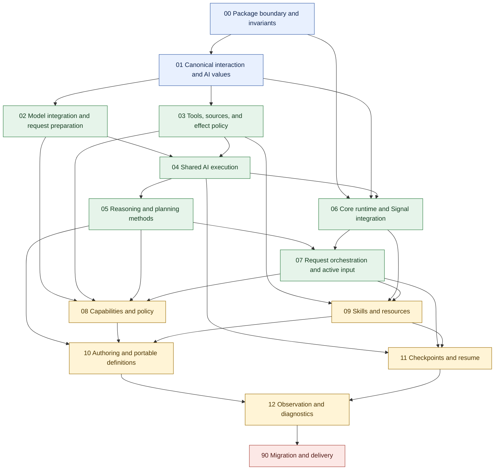

> Design navigation and implementation status index.
> Code in `lib/`, public module documentation, and executable tests define current behavior.

# Jido AI V3 design

Adapted from the core Jido design index. Start with
[the architecture overview](ARCHITECTURE.md) for the current seams, modules,
state owners, and the distinction between implemented and proposed behavior.
Follow [the design instructions](AGENTS.md) for reviews and edits.

The numbered folders define the review areas. They are not a claim that every
target contract is implemented. When design and code differ, code remains the
current baseline until a design change is approved and implemented.

The complete target remains in scope. This reconciliation is not an MVP cut.
Advanced work stays visible even when it needs a decision or has no runtime
implementation.

## Subsystem map

Existing folder names and requirement prefixes remain stable. Seam 07 is now
described as request orchestration; its existing folder name is retained to
avoid breaking links. `Jido.Session` belongs to seam 01, not the live API in 07.

| Order | Architectural seam | Folder | Requirement prefix |
| --- | --- | --- | --- |
| 00 | Package boundary and invariants | [00_boundary_invariants](00_boundary_invariants/README.md) | `BND` |
| 01 | Canonical interaction and AI values | [01_ai_values](01_ai_values/README.md) | `VAL` |
| 02 | Model integration and request preparation | [02_model_gateway](02_model_gateway/README.md) | `MDL` |
| 03 | Tools, sources, and effect policy | [03_tool_bridge](03_tool_bridge/README.md) | `TLS` |
| 04 | Shared AI execution | [04_ai_execution](04_ai_execution/README.md) | `EXE` |
| 05 | Reasoning and planning methods | [05_reasoning_planning](05_reasoning_planning/README.md) | `RSN` |
| 06 | Core runtime and Signal integration | [06_runtime_signal_integration](06_runtime_signal_integration/README.md) | `INT` |
| 07 | Request orchestration and active input | [07_request_sessions](07_request_sessions/README.md) | `SES` |
| 08 | Capabilities and policy | [08_capabilities_policy](08_capabilities_policy/README.md) | `CAP` |
| 09 | Skills and resources | [09_skills_resources](09_skills_resources/README.md) | `SKL` |
| 10 | Authoring and portable definitions | [10_authoring_definitions](10_authoring_definitions/README.md) | `AUT` |
| 11 | Checkpoints and resume | [11_checkpoints_resume](11_checkpoints_resume/README.md) | `RES` |
| 12 | Observation and diagnostics | [12_observation_diagnostics](12_observation_diagnostics/README.md) | `OBS` |
| 90 | Migration and delivery | [90_migration_delivery](90_migration_delivery/README.md) | `DEL` |

Delegation is a cross-seam target: 07 owns linked request behavior, 03 owns
model-facing tool adaptation, 06 owns core topology integration, 11 owns resume
and uncertain effects, and 12 owns lineage observations. There is no separate
implemented delegation subsystem. A dedicated folder is an open organization
decision, not a new runtime requirement.

## Review method

Review each seam against the same five questions:

1. What does the current implementation do?
2. What complete target design do we want?
3. What differences exist between current and target behavior?
4. Which decisions are needed before implementation?
5. What evidence will show that the seam is aligned?

Cross-system decisions belong in [boundary design](00_boundary_invariants/design.md).
Current cross-system evidence and gaps belong in
[boundary alignment](00_boundary_invariants/alignment.md). Detailed rules belong
in the folder that owns the concept.

Do not turn an old proposal into a mandatory implementation task merely because
its alignment file says “Missing.” Do not delete it merely because it is missing.

## Current evidence and target status

Approval, implementation, and evidence are separate.

| Evidence state | Meaning |
| --- | --- |
| Implemented and evidenced | Current code and a direct test support the stated behavior |
| Implemented; evidence incomplete | Implementation exists, but the complete assertion is not proved |
| Partially implemented | Only part of the target contract exists |
| Proposed; not implemented | Retained target work, not a current capability |
| Decision required | A material contract or ownership difference needs review |
| Superseded | An explicit decision replaces the requirement; retain its ID and replacement link |
| Not revalidated | An older assessment has not been checked against current source |

Record each claim with code, example, and test links where applicable. An
example is proof of its documented case, not a complete requirement matrix.
Keep detailed edge-case proof in unit and authoring tests.

All 14 seam briefings, target designs, and alignment files have been reconciled
with the current architecture map. Acceptance tables are rebuilt from the
actual target requirement IDs, not the old migration assessments. Evidence
states distinguish relevant implementation from complete requirement proof.
The review does not certify every target requirement or grant design approval.

## Example-driven design audit

The initial acceptance matrices indexed **408 numbered requirements** and named
matching example tests or an explicit evidence gap. This is not complete design
conformance. In particular, a related example does not prove every clause of a
requirement.

| Evidence classification | Requirements | Meaning |
| --- | ---: | --- |
| Related example evidence | 310 | A matching scenario exists; full requirement assertion coverage remains incomplete |
| Passing target scenario | 22 | Target scenarios pass after the runtime repair; documented proof limits still apply |
| To be implemented — reproduced | 0 | The 12 reproduced assertions from the initial audit are repaired |
| Public-contract gate | 32 | A required API, field, or adapter contract is missing or not selected; no fictional API test was added |
| Source or release check | 38 | Consumer examples alone cannot prove package ownership, compatibility, or release policy |
| Wording reconciliation | 5 | Apply the later selected decision; correct the older wording without treating it as a runtime bug |
| Deferred | 1 | Dynamic tool sources remain on hold |

Follow each seam's **Acceptance matrix** for the exact requirement, related
test, observed failure, or missing acceptance case. Newer requirements that
were absent from the old matrices are included. Named-document approval remains
pending. Advanced target work has not been removed.

### Executed evidence

Run from `jido_ai`:

```sh
mix examples --seed 0
mix test test/examples --only design_requirement --seed 0
mix test --include authoring --include example --warnings-as-errors --seed 0
```

The **initial audit** MockLLM run on 2026-09-15 completed with **667 of 679 tests passing and
12 failures**. All 12 failures are new target checks. The existing 660 examples
passed. The 19 added target cases had 7 passes and 12 failures. These are historical
test counts, not requirement-conformance counts. No checks are skipped to hide
the failures. No live provider call was made for this audit.

Initial audit baseline: `v3-spike`, HEAD
`7bb011e98349af8bf580e7b93afa60990972beae`, with uncommitted example, test,
formatter, and documentation changes. No `lib/` or dependency changes. This
is not a stable-release pass. The implementation follow-up now also changes
`lib/`, tests, examples, and API inventory. Dependencies remain unchanged.

### Prior repair checkpoint

- [Values and projection](01_ai_values/alignment.md#acceptance-matrix):
  successful settlement promotes context; incomplete tool exchanges and
  hidden-thinking summaries are excluded from default projection.
- [Request settlement](07_request_sessions/alignment.md#acceptance-matrix):
  failed and cancelled input stays in execution evidence, not completed context.
- [Model completion](02_model_gateway/alignment.md#acceptance-matrix):
  nonempty truncated output fails without an answer commit.
- [Tool recovery](03_tool_bridge/alignment.md#acceptance-matrix):
  unknown tools return correlated model-visible errors. A mixed batch performs
  no partial tool work.
- [Content permissions](12_observation_diagnostics/alignment.md#acceptance-matrix):
  default-off stream/storage and reasoning permissions are separate. Inspection
  requires trusted Profile permission plus explicit content access. Missing
  retained content cannot silently become resumable model state.

These repairs do not close the advanced API gates below. They preserve all eight
reasoning methods and use the existing Agent, Flow, Session, and Thread owners.

Repair verification on 2026-09-15, before checkpoint `4ed6402f`:

- `mix compile --force --warnings-as-errors`: passed.
- `mix test --include authoring --include example --warnings-as-errors --seed 0`:
  2,853 passed, zero failures, one existing flaky exclusion. No new skips.
- `mix format --check-formatted`: passed.
- All 408 requirement IDs remain in the acceptance matrices; no IDs were removed.
- Local links in the changed Markdown files are valid.

This run used deterministic model responses. No live provider call was made.
These are historical verification results, not a release certification.

### Runtime refinement verification

The current implementation uses `v3-spike`, checkpoint `4ed6402f`, plus
uncommitted source, test, example, and documentation changes. Dependencies and
package versions are unchanged.

- `Execution` owns shared AI Flow execution. `Orchestration` keeps the
  core-managed Coordinator and request settlement.
- All AI Agent requests use one admission, execution, and settlement lifecycle.
  Profile request modes and configurable busy handling are removed.
- `ask/3` returns a request handle. `ask_sync/3` waits for settlement.
  Core route helpers return admission state, not a completed answer.
- Context is the model input view. `Model.Response` names a model response,
  distinct from a core Jido Turn.
- Direct model-call tickets own quota accounting. Mirrored worker usage Signals
  do not charge the quota again or change unknown usage to zero.

See the [architecture overview](ARCHITECTURE.md) for the execution sequence and
process owners. The [API migration map](../v3-spike/public-api-map.md#migration-from-the-previous-v3-draft)
lists changed names and removed configuration fields.

Verification on 2026-09-15:

- Force compile with warnings as errors: passed.
- Full unit, authoring, and example suite with seed 0: **2,856 passed**, zero
  failures, one existing flaky exclusion. No new skips.
- Format check and generated API inventory check: passed.
- All 408 design requirement IDs remain present. Superseded mode requirements
  keep their IDs and state the replacement decision.

Tests used deterministic model responses, including MockLLM examples. No live
provider call was made. This run does not prove production load capacity or
complete conformance to the advanced target design. Document approval remains
pending.

### Request configuration refinement verification

The follow-up removes `requests` from the DSL, Profile, codecs, and examples.
Streaming is selected per call: `ask_stream/3` enables it, while `ask/3` and
`ask_sync/3` default to buffered calls. An event sink enables streaming unless
the caller sets `stream: false` for lifecycle events only.

Steering and activity timers now belong to `controls`. Request-record retention
is a positive host setting, captured at Coordinator startup. It is not Profile
policy, Context retention, or a concurrency limit. The core-managed Coordinator
and process tree are unchanged. Separate buffered/streamed example Agents are
consolidated into one Agent per example.

The refactor also fixes buffered model failures losing method diagnostics:
provider errors are converted to portable values before reasoning methods
attach tree, phase, and completed-usage details.

Verification on 2026-09-15:

- Force compile with warnings as errors: passed.
- Full unit, authoring, and example suite with seed 0: **2,863 passed**, zero
  failures, one existing flaky exclusion. No new skips.
- Format, generated API inventory, and diff whitespace checks: passed.
- All 408 design requirement IDs remain present. Changed documentation links
  outside example templates are valid.

Tests used deterministic model responses, including MockLLM HTTP/SSE examples.
No live provider call was made. Dependency pins and package versions are
unchanged. These checks do not certify the advanced target design or a release.

### Later decisions and remaining work

The selected Execution–Orchestration refinement adds nine private-boundary
requirements: EXE-REQ-031/032 and SES-REQ-049 through 055. The owning alignment
files track their evidence separately from the initial 408-requirement audit.
The private bridge is implemented. Its focused tests cover trusted binding,
commit waits and uncertainty, stale data, input sealing, owner loss, and direct
ownerless Actions. Public batch/receipt types and method-neutral callback
values remain separate work.
All earlier identifiers and advanced targets remain. Document approval is
still pending. See the
[private bridge contract](07_request_sessions/design.md#selected-private-execution-bridge).

Use Session-scoped skill activation, not the older request-scoped wording.
Use distinct execution-attempt identity, not a new ReAct run ID as a substitute.
Do not restore the removed execution CLI. Keep dynamic sources deferred.

The API gates include linked delegation, capability policy stages, transform
contracts, execution-attempt reporting, and uncertain-effect handling. Their
matrix rows name the missing scenario. They have not been run through invented
stubs, and they are not counted as passed. Continue full-clause assertion review
for the related-evidence rows before claiming that the complete design is
proved.

## Seam document pattern

Use [the architectural seam template](SEAM_TEMPLATE.md):

- `README.md`: briefing, ownership, decisions, and major gaps.
- `design.md`: complete target contract and EARS requirements.
- `alignment.md`: current evidence, gap register, ordered work packages,
  migration, and acceptance matrix.

Do not create separate briefing, gap-analysis, or evidence files. Keep each
fact in its owning document and link to it. Formal implementation plans follow
approval of seam intent and requirements; they are not part of this
documentation-only reconciliation.

## Alignment dependency order

The arrows are planning prerequisites, not runtime call direction. Read
cross-cutting authoring and observation contracts early; finalize their full
alignment after the contracts they expose are settled.



| Stage | Seams | Review outcome |
| --- | --- | --- |
| Foundation | 00, 01 | Package ownership, canonical values, and error boundaries |
| Integration | 02, 03 | Native model contracts, tools, sources, and effects |
| Execution | 04, 05 | Shared execution and all reasoning methods |
| Runtime ownership | 06, 07 | Core integration, orchestration, and delegation boundaries |
| Composition | 08, 09 | Capabilities, policy, skills, and resources |
| Authoring and recovery | 10, 11 | Complete authoring and recovery contracts |
| Operations and release | 12, 90 | Observation, migration, and release evidence |

Advanced work participates in this same graph. Dependency order does not
exclude it from the target.

## Requirement format

Use EARS, the Easy Approach to Requirements Syntax, for required target behavior:

| Pattern | Form |
| --- | --- |
| Ubiquitous | `The <owner> shall <required response>.` |
| Event-driven | `When <trigger>, the <owner> shall <required response>.` |
| State-driven | `While <state>, the <owner> shall <required response>.` |
| Unwanted behavior | `If <unwanted condition>, then the <owner> shall <required response>.` |
| Optional feature | `Where <feature is enabled>, the <owner> shall <required response>.` |
| Combined | `Where <feature>, while <state>, when <trigger>, the <owner> shall <required response>.` |

Give each requirement a stable ID, such as `SES-REQ-001`, and one observable
behavior. Name its owner. Use measurable limits. Link it to current evidence
or a required acceptance test. Retire IDs explicitly; do not reuse them.

An EARS statement does not grant approval or prove implementation.

## Document review status

This table is the source of truth for document approval. Only explicit approval
of a named document changes its status to `Approved`. Approval of a general
direction does not approve every document. No core Jido approval status is
inherited by this package.

| Document | Status |
| --- | --- |
| [Design index](README.md) | Pending approval |
| [Design instructions](AGENTS.md) | Pending approval |
| [Architecture overview](ARCHITECTURE.md) | Pending approval |
| [Seam template](SEAM_TEMPLATE.md) | Pending approval |
| [Package boundary and invariants: briefing](00_boundary_invariants/README.md) | Pending approval |
| [Package boundary and invariants: design](00_boundary_invariants/design.md) | Pending approval |
| [Package boundary and invariants: alignment](00_boundary_invariants/alignment.md) | Pending approval |
| [Canonical interaction and AI values: briefing](01_ai_values/README.md) | Pending approval |
| [Canonical interaction and AI values: design](01_ai_values/design.md) | Pending approval |
| [Canonical interaction and AI values: alignment](01_ai_values/alignment.md) | Pending approval |
| [Model integration and request preparation: briefing](02_model_gateway/README.md) | Pending approval |
| [Model integration and request preparation: design](02_model_gateway/design.md) | Pending approval |
| [Model integration and request preparation: alignment](02_model_gateway/alignment.md) | Pending approval |
| [Tools, sources, and effect policy: briefing](03_tool_bridge/README.md) | Pending approval |
| [Tools, sources, and effect policy: design](03_tool_bridge/design.md) | Pending approval |
| [Tools, sources, and effect policy: alignment](03_tool_bridge/alignment.md) | Pending approval |
| [Shared AI execution: briefing](04_ai_execution/README.md) | Pending approval |
| [Shared AI execution: design](04_ai_execution/design.md) | Pending approval |
| [Shared AI execution: alignment](04_ai_execution/alignment.md) | Pending approval |
| [Reasoning and planning methods: briefing](05_reasoning_planning/README.md) | Pending approval |
| [Reasoning and planning methods: design](05_reasoning_planning/design.md) | Pending approval |
| [Reasoning and planning methods: alignment](05_reasoning_planning/alignment.md) | Pending approval |
| [Core runtime and Signal integration: briefing](06_runtime_signal_integration/README.md) | Pending approval |
| [Core runtime and Signal integration: design](06_runtime_signal_integration/design.md) | Pending approval |
| [Core runtime and Signal integration: alignment](06_runtime_signal_integration/alignment.md) | Pending approval |
| [Request orchestration and active input: briefing](07_request_sessions/README.md) | Pending approval |
| [Request orchestration and active input: design](07_request_sessions/design.md) | Pending approval |
| [Request orchestration and active input: alignment](07_request_sessions/alignment.md) | Pending approval |
| [Capabilities and policy: briefing](08_capabilities_policy/README.md) | Pending approval |
| [Capabilities and policy: design](08_capabilities_policy/design.md) | Pending approval |
| [Capabilities and policy: alignment](08_capabilities_policy/alignment.md) | Pending approval |
| [Skills and resources: briefing](09_skills_resources/README.md) | Pending approval |
| [Skills and resources: design](09_skills_resources/design.md) | Pending approval |
| [Skills and resources: alignment](09_skills_resources/alignment.md) | Pending approval |
| [Authoring and portable definitions: briefing](10_authoring_definitions/README.md) | Pending approval |
| [Authoring and portable definitions: design](10_authoring_definitions/design.md) | Pending approval |
| [Authoring and portable definitions: alignment](10_authoring_definitions/alignment.md) | Pending approval |
| [Checkpoints and resume: briefing](11_checkpoints_resume/README.md) | Pending approval |
| [Checkpoints and resume: design](11_checkpoints_resume/design.md) | Pending approval |
| [Checkpoints and resume: alignment](11_checkpoints_resume/alignment.md) | Pending approval |
| [Observation and diagnostics: briefing](12_observation_diagnostics/README.md) | Pending approval |
| [Observation and diagnostics: design](12_observation_diagnostics/design.md) | Pending approval |
| [Observation and diagnostics: alignment](12_observation_diagnostics/alignment.md) | Pending approval |
| [Migration and delivery: briefing](90_migration_delivery/README.md) | Pending approval |
| [Migration and delivery: design](90_migration_delivery/design.md) | Pending approval |
| [Migration and delivery: alignment](90_migration_delivery/alignment.md) | Pending approval |

## Delivery evidence

[Delivery alignment](90_migration_delivery/alignment.md) owns release readiness.
The [source API inventory](../v3-spike/api-inventory.json) and
[current API map](../v3-spike/public-api-map.md) help locate current contracts.
Neither an API inventory nor a passing example proves the complete target.

The [architecture overview](ARCHITECTURE.md) consolidates the former seam
research and retains its migration rationale. Detailed advanced proposals stay
in the owning seam designs. Historical source remains available in Git history;
no advanced requirement is removed by this consolidation.
