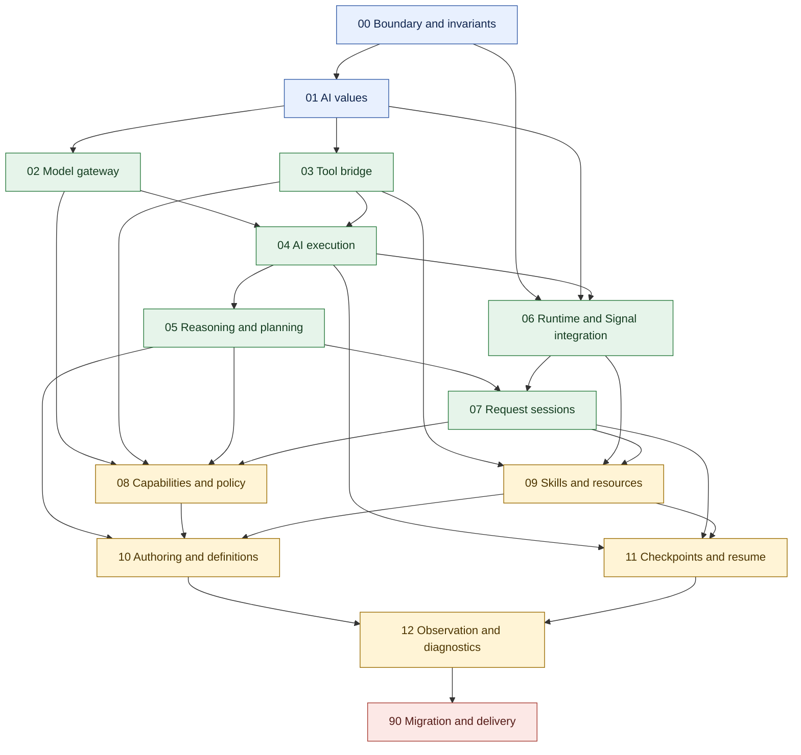

# Jido AI V3 design seams

Status: Seam map approved; target designs and alignment plans pending review

This directory defines the proposed Jido AI V3 architecture. The V2 package is the capability baseline. The V3 target uses canonical Jido Agent, Plugin, Turn, Directive, Flow, Exec, Signal, and DSL contracts.

Current source and executable tests remain the canonical evidence for implemented behavior. The `design.md` files state a proposed target. They do not state that the target is implemented.

## Dependency tree

Arrows point from a prerequisite seam to a seam that builds on it.

## Build order

| Stage | Seams | Result |
| --- | --- | --- |
| Foundation | 00, 01 | Stable ownership, invariants, values, and errors |
| Provider and tool boundaries | 02, 03 | Provider-neutral model calls and safe Action tools |
| Execution | 04, 05 | One Flow-based AI loop and method-specific reasoning |
| Core integration | 06, 07 | Correct Agent, Plugin, Signal, and request lifecycle use |
| Composition | 08, 09 | Capability Plugins and bounded skills |
| Authoring and recovery | 10, 11 | Portable DSL definitions and portable resume data |
| Operations and release | 12, 90 | Safe observation, migration, and release gates |

Seams in the same stage can be reviewed in parallel only when their listed prerequisites are approved.

## Seam index

| Seam | Briefing | Target design | Alignment plan | Prefix |
| --- | --- | --- | --- | --- |
| 00 — Package boundary and invariants | [README](00_boundary_invariants/README.md) | [Design](00_boundary_invariants/design.md) | [Alignment](00_boundary_invariants/alignment.md) | `BND` |
| 01 — AI values and result contracts | [README](01_ai_values/README.md) | [Design](01_ai_values/design.md) | [Alignment](01_ai_values/alignment.md) | `VAL` |
| 02 — Model gateway and request preparation | [README](02_model_gateway/README.md) | [Design](02_model_gateway/design.md) | [Alignment](02_model_gateway/alignment.md) | `MDL` |
| 03 — Tool bridge and effect policy | [README](03_tool_bridge/README.md) | [Design](03_tool_bridge/design.md) | [Alignment](03_tool_bridge/alignment.md) | `TLS` |
| 04 — Bounded AI execution and streaming | [README](04_ai_execution/README.md) | [Design](04_ai_execution/design.md) | [Alignment](04_ai_execution/alignment.md) | `EXE` |
| 05 — Reasoning and planning methods | [README](05_reasoning_planning/README.md) | [Design](05_reasoning_planning/design.md) | [Alignment](05_reasoning_planning/alignment.md) | `RSN` |
| 06 — Core runtime and Signal integration | [README](06_runtime_signal_integration/README.md) | [Design](06_runtime_signal_integration/design.md) | [Alignment](06_runtime_signal_integration/alignment.md) | `INT` |
| 07 — Request sessions and active input | [README](07_request_sessions/README.md) | [Design](07_request_sessions/design.md) | [Alignment](07_request_sessions/alignment.md) | `SES` |
| 08 — AI capabilities and policy | [README](08_capabilities_policy/README.md) | [Design](08_capabilities_policy/design.md) | [Alignment](08_capabilities_policy/alignment.md) | `CAP` |
| 09 — Skills and resource augmentation | [README](09_skills_resources/README.md) | [Design](09_skills_resources/design.md) | [Alignment](09_skills_resources/alignment.md) | `SKL` |
| 10 — AI authoring and portable definitions | [README](10_authoring_definitions/README.md) | [Design](10_authoring_definitions/design.md) | [Alignment](10_authoring_definitions/alignment.md) | `AUT` |
| 11 — AI checkpoints and resume | [README](11_checkpoints_resume/README.md) | [Design](11_checkpoints_resume/design.md) | [Alignment](11_checkpoints_resume/alignment.md) | `RES` |
| 12 — Observation and diagnostics | [README](12_observation_diagnostics/README.md) | [Design](12_observation_diagnostics/design.md) | [Alignment](12_observation_diagnostics/alignment.md) | `OBS` |
| 90 — Migration, delivery, and consumer support | [README](90_migration_delivery/README.md) | [Design](90_migration_delivery/design.md) | [Alignment](90_migration_delivery/alignment.md) | `DEL` |

## Review rule

Review the briefing first. Review the target design only after its prerequisite seams are acceptable. All target designs and alignment plans remain pending until they receive explicit approval. An alignment plan can record current evidence before approval, but implementation work stays blocked until the matching design is approved.

- [Architecture research and seam map](architecture-seams.md)
- [Seam document template](SEAM_TEMPLATE.md)
