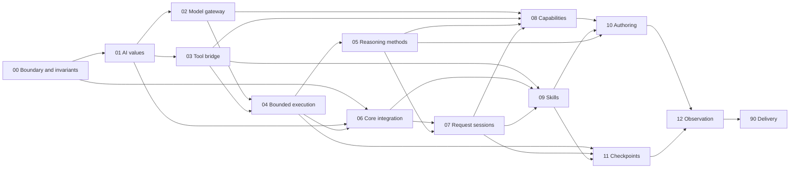

# Jido AI V3 Architecture Seams

> Retained research snapshot from the early V3 migration. Its current-fact
> sections, source paths, and test blockers are not current evidence.
> Use [ARCHITECTURE.md](ARCHITECTURE.md) for the current overview and
> [README.md](README.md) for document review status. The proposals, requirement
> rationale, and capability inventory below remain available for review.
> Historical approval statements below do not approve changed documents.

Status: Seam map approved on 2026-09-08; seam contracts pending approval

This document separates current facts from recommendations. The seam organization is approved. The target contracts and open decisions in each seam are not approved yet.

## 1. Purpose and evidence rule

This document has three purposes:

1. Define the present Jido AI V3 package boundary.
2. Compare the V2 capability set with the current V3 implementation.
3. Propose small architecture seams for review and later requirements work.

The evidence rule is:

- Current source and current tests are the canonical evidence for implemented behavior.
- Public contracts in `jido`, `jido_action`, and `jido_signal` are canonical for package ownership.
- Old guides, old source, commit history, and migration notes show intent and history. They do not override current source or tests.
- A source file shows that code exists. A passing test shows only the behavior that the test covers.
- A failing or non-compiling test is an active gap. This document does not hide such a gap.
- A recommendation is not a current fact. Each recommendation section uses explicit proposal language.

Evidence was read from the following repositories and branches:

| Package | Branch | Role in this analysis |
| --- | --- | --- |
| `jido_ai` | `v3-spike` | Target package and current implementation |
| `jido` | `v3-spike` | Agent, Plugin, Turn, Directive, commit, and OTP runtime contracts |
| `jido_action` | `release/v3` | Action, Instruction, Flow, and Exec contracts |
| `jido_signal` | `release/v3` | Signal envelope, routing, dispatch, and bus contracts |

The V2 inventory uses the `jido_ai` `v2.3.0` tag and the reviewed history after V2. The V2.3 tree contains 170 production Elixir files and 165 test files. The V2 package overview is at `v2.3.0:guides/user/package_overview.md`. The V2 runtime description is at `v2.3.0:guides/developer/architecture_and_runtime_flow.md`. The primary post-V2 history records are `docs/v3-spike/history-audit.md`, `docs/v3-spike/feature-map.md`, and `docs/v3-spike/root-package-checkpoint.md`. These files are supporting evidence only.

## 2. Current Jido AI V3 package boundary

### 2.1 Current facts

Jido AI owns AI-specific behavior and contracts:

- Model integration through ReqLLM.
- Model selection, aliases, request options, and response normalization.
- AI query, context, turn, output, usage, and error values.
- Provider tool descriptions, tool result conversion, tool policy, and tool callbacks.
- AI reasoning and planning methods.
- AI request admission, request records, streams, steering, and AI cancellation semantics.
- AI capability Plugins, such as model routing, policy, retrieval, and quota.
- AI skill definitions, prompt and resource augmentation, and skill runtime policy.
- AI-specific checkpoint data and resume-token conversion.
- AI telemetry events and typed AI Signal data.
- Portable AI authoring data and the lowering of that data to core Agent and Flow values.

The current authoring layer states this direction directly:

- `lib/jido_ai/agent/definition.ex:2-20` builds a V3 Agent from an AI profile, a core Flow, and a session Plugin.
- `lib/jido_ai/profile.ex:2-8` defines static AI policy that lowers to core Agent and Flow data.
- `lib/jido_ai/authoring/authoring.ex:42-126` lowers profiles to ordinary core Agent definitions.
- `lib/jido_ai/authoring/authoring.ex:163-243` builds the reasoning Flow with `Jido.Flow.Builder`.
- `lib/jido_ai/authoring/plugin_stack.ex:2-12` composes AI Plugins and assigns store supervision to the host application.

Jido AI does not own these lower-level systems:

- Agent state, Turn evaluation, candidate validation, commit, Directives, AgentServer, and the OTP runtime. The `jido` package owns these systems.
- Action and Flow definition, graph validation, graph execution, continuations, local concurrency, execution timeout, and execution cancellation. The `jido_action` package owns these systems.
- Signal envelopes, serialization, routing, dispatch, and the local Signal bus. The `jido_signal` package owns these systems.
- Browser adapters and browser Actions. The `jido_browser` package owns these systems.
- Durable workflow history, application storage services, deployment, distributed execution, and product policy. A host application or a separate orchestration package owns these systems.

Core evidence for this boundary includes:

- `../jido/lib/jido/agent.ex:2-21` defines the Agent as the canonical immutable value and separates direct command evaluation from server commit.
- `../jido/lib/jido/agent.ex:458-477` maps one Signal to one Action or Flow Turn.
- `../jido/lib/jido/agent/command/runner.ex:29-42` sends Action and Flow execution through `Jido.Exec`.
- `../jido/lib/jido/agent/command/runner.ex:120-133` normalizes the result, protects Plugin state, validates Directives, and validates the candidate Agent.
- `../jido/lib/jido/plugin.ex:2-28` assigns admission, preparation, Plugin state, and post-commit runtime work to the core Plugin contract.
- `../jido/lib/jido/agent/turn.ex:2-11` defines a Turn as an Action or Flow executable plus input.
- `../jido/lib/jido/agent/directive.ex:2-13` defines Directives as post-commit effects.
- `../jido_action/lib/jido_flow.ex:2-13` defines Flow as the canonical validated graph.
- `../jido_action/lib/jido_exec.ex:2-41` defines the public execution boundary and states that execution state is not a persistent checkpoint.
- `../jido_signal/AGENTS.md` assigns Signal envelopes, routing, dispatch, and the local bus to `jido_signal`.

### 2.2 Current boundary problems

The implementation is in migration. Some names and modules still imply ownership that is now in another package:

- `mix.exs` still describes Jido AI as the owner of “Actions, Workflows, and LLM orchestration.” Flow is now a `jido_action` responsibility.
- Some V2 strategy and runner structures remain in the tree. They can make Jido AI look like a second execution engine.
- `lib/jido_ai/operations/runtime.ex:782-872` contains AI tool retry classification and a local sleep-based backoff. The AI classification is in scope. A generic retry scheduler is not.
- `lib/jido_ai/operations/react_runner.ex:2-8` still has a private runtime process for a standalone stream. It uses shared Flow semantics, but its process ownership needs a clear boundary test.
- Legacy checkpoint code is not aligned with the present core Agent definition contract. The current checkpoint test does not compile. See section 4.4.

## 3. V2 capability inventory and disposition

The following inventory uses V2.3 source, V2 guides, and the post-V2 history audit. The disposition is a recommendation for the V3 target. It is not a statement that all migration work is complete.

| V2 capability | V3 disposition | Reason and target owner |
| --- | --- | --- |
| Agent macros and convenience agents | Replace | Keep the AI authoring purpose, but replace V2 Strategy-based generation with portable profiles that lower to a core `Jido.Agent`, core Plugins, and `Jido.Flow`. |
| Strategy callbacks and private Strategy state | Remove | Core Turn and Plugin contracts replace the runtime shell. Keep only AI algorithms and portable AI state. |
| ReAct, Chain-of-Thought, Chain-of-Draft, Adaptive, Tree-of-Thoughts, Graph-of-Thoughts, and TRM methods | Retain in `jido_ai` | These are AI reasoning policies. Express their executable shape with Actions and Flows. |
| Reasoning machines, scores, candidates, and result values | Retain in `jido_ai` | These values encode AI method semantics. Remove any generic scheduler duty from them. |
| ReqLLM facade, model aliases, routing, and provider options | Retain in `jido_ai` | Model integration is the primary package duty. Provider resources remain host-owned. |
| Standalone LLM Actions | Retain in `jido_ai` | Jido AI defines model-specific Actions. `Jido.Exec` executes them. |
| Tool catalog, adapter, result, interceptor, and provider conversion | Retain in `jido_ai` | These contracts translate between Jido Actions and model-provider tool protocols. |
| Generic tool-loop branching, fan-out, reduction, and iteration | Move to `Jido.Flow` and `Jido.Exec` | Flow owns graph shape, Choice, Map, Reduce, Iterate, Dispatch, continuations, local concurrency, timeout, and cancellation. |
| AI selection of the next tool or next model action | Retain in `jido_ai` | The decision is model and policy behavior. It returns a Flow continuation or a terminal AI result. |
| Generic retries and backoff scheduling | Move to the correct execution or host layer | Jido AI can classify AI failures and state a retry policy. It must not become a general retry engine. `Jido.Exec` currently has no retry contract, so host policy or a future approved lower-level contract must do the scheduling. |
| Public request handles, await, stream, sync, cancel, and steer calls | Retain in `jido_ai` | These are the public AI request experience. Their process mechanics must use public Jido runtime contracts. |
| Busy checks, admission, commit, and process cancellation mechanics | Replace | Use core AgentServer and Plugin admission, candidate, commit, and cancellation contracts. Jido AI keeps request IDs and AI admission policy. |
| Pending input and active-request steering | Retain in `jido_ai` | Keep bounded AI input semantics. Do not create a generic mailbox or job-control system. |
| Standalone ReAct streams and resume tokens | Replace | Keep the public AI surface. Use the same AI Flow and session semantics as the Agent path. Keep only AI data in tokens. |
| Query, multimodal content, context, history, and turn projection | Retain in `jido_ai` | These values are AI-domain contracts. They must remain portable and process-free. |
| Structured output, parsing, validation, repair, and result metadata | Retain in `jido_ai` | These are AI response semantics. Zoi and provider details stay behind the public result contract. |
| State effects and generic StateOps | Replace | Return a complete candidate Agent and core Directives. Core Jido owns state validation and commit. |
| LLM and tool Directives that execute work inside a Turn | Replace | Use Actions and Flows for work before commit. Use core Directives and Plugin runtime callbacks only for post-commit work. |
| Typed AI signals | Retain in `jido_ai` | Jido AI owns the event type and AI data schema. `jido_signal` owns the envelope, router, dispatcher, and bus. |
| Chat, planning, reasoning, model-routing, policy, retrieval, and quota Plugins | Replace | Keep supported AI capabilities, but implement them through the current `Jido.Plugin` contract and explicit host resources. |
| Planning prompt, plan values, and plan evaluation | Retain in `jido_ai` | These are AI semantics. Generic plan execution and business workflow execution belong to Flow or the host. |
| Retrieval query, enrichment, and memory-facing AI policy | Retain in `jido_ai` | Keep AI retrieval contracts and adapters. The host owns service processes and durable stores. |
| Quota admission and AI usage accounting | Retain in `jido_ai` | Keep AI policy and usage values. The host or a billing service owns authoritative durable accounting. |
| Skill specification, activation, prompt assembly, tool assembly, and resource use | Retain in `jido_ai` | This is presently an AI feature. Keep filesystem access and provider clients explicit. Revisit package extraction only after the V3 contract is stable. |
| Agent checkpoint content | Move to `jido` | Core Jido owns Agent checkpoint and persistence contracts. |
| AI checkpoint content and AI resume conversion | Retain in `jido_ai` | Keep only portable AI phase, domain, effect, binding, and remaining-work data. Never store live `Jido.Exec` state. |
| Durable recovery, durable queues, and exactly-once work | Defer | These are not current Jido AI or `Jido.Exec` duties. A host application or separate durable orchestration package must own them. |
| AI errors and retry classification | Retain in `jido_ai` | Keep AI error codes, normalization, redaction, and retry eligibility. Compose lower-package errors without hiding their cause. |
| AI telemetry, usage events, and safe observation | Retain in `jido_ai` | Keep AI event meaning and redaction. Use core observation and `jido_signal` transport contracts. |
| Test helpers for AI consumers | Retain in `jido_ai` | Keep stable helpers that test public AI contracts. Do not expose private runtime state through helpers. |
| CLI, installer, and content quality tools | Defer | Keep supported user behavior, but complete runtime and authoring boundaries first. Put delivery work in a final seam. |
| Worker Agents, runner Agents, and package-owned TaskSupervisor behavior | Remove | Use a child Agent only when separate Agent identity and lifecycle are real product requirements. Use core runtime and Exec supervisors for execution mechanics. |
| Browser-specific tool behavior | Move to `jido_browser` | Jido AI can consume browser Actions through the normal tool bridge. It must not own browser adapters. |

## 4. Current V3 implemented baseline

This section reports implemented source and test evidence. It does not claim that the full migration is complete.

### 4.1 Authoring and lowering

The current V3 branch has a complete first authoring path:

- `lib/jido_ai/profile.ex:11-65` defines the portable profile fields.
- `lib/jido_ai/profile.ex:68-126` validates inert profile data.
- `lib/jido_ai/agent/definition.ex:183-425` provides Agent macros and request calls.
- `lib/jido_ai/authoring/authoring.ex:42-126` lowers profiles to core Agent data.
- `lib/jido_ai/authoring/authoring.ex:163-243` creates the core reasoning Flow.
- `lib/jido_ai/authoring/plugin_stack.ex:95-102` rejects the old package-owned TaskSupervisor option.

Executable test evidence:

- `test/jido_ai/authoring/full_spec_parity_test.exs:218-294` covers full profile parity.
- `test/jido_ai/authoring/agent_dsl_test.exs:95-185` covers the Agent DSL surface.
- `test/jido_ai/authoring/runtime_boundary_test.exs:49-102` covers the runtime boundary.
- `examples/v3/test/examples/02_requests/02_19_model_options_test.exs:8-394` covers model-option ownership and propagation.

### 4.2 Model, tool, data, and output contracts

The following source is implemented:

- `lib/jido_ai.ex` exposes the model generation facade and dynamic configuration.
- `lib/jido_ai/models.ex` resolves models and performs text, object, and stream requests through ReqLLM.
- `lib/jido_ai/query.ex` defines text, content, and file-reference queries.
- `lib/jido_ai/context.ex` defines conversation entries and model-message projection.
- `lib/jido_ai/turn.ex` normalizes model responses, content, tool calls, and tool execution data.
- `lib/jido_ai/output.ex` validates, parses, repairs, fingerprints, and annotates structured output.
- `lib/jido_ai/usage.ex` normalizes and merges usage values.
- `lib/jido_ai/operations/tool_catalog.ex:2` defines the validated catalog for provider tools and core Actions.
- `lib/jido_ai/tool_adapter.ex`, `lib/jido_ai/tool_result.ex`, and `lib/jido_ai/tool_interceptor.ex` define provider conversion, tool results, and callback behavior.

Executable test evidence:

- `test/jido_ai/tool_adapter_test.exs:99-328`
- `test/jido_ai/tool_interceptor_test.exs:67-153`
- `test/jido_ai/operations/tool_result_test.exs:8-63`
- `test/jido_ai/output_test.exs:34-156`
- `test/jido_ai/context_refs_test.exs:9-105`
- `test/jido_ai/turn_test.exs:46-833`
- `test/jido_ai/usage_test.exs:4-133`
- `examples/v3/test/examples/03_tools/03_01_dynamic_catalog_test.exs:18-330`

### 4.3 Bounded execution, sessions, capabilities, and integration

The current implementation already uses core Flow for important execution shapes:

- `lib/jido_ai/operations/runtime.ex:324-555` implements model-call preparation, controls, usage, history, events, and response handling.
- `lib/jido_ai/operations/runtime.ex:557-780` implements the AI decision step and returns Flow continuations.
- `lib/jido_ai/operations/runtime.ex:782-872` executes one tool attempt through `Jido.Exec` and applies AI retry classification.
- `lib/jido_ai/operations/runtime.ex:917-955` defines the next-batch continuation.
- `lib/jido_ai/operations/runtime.ex:957-987` builds tool and reasoning Flows from core Flow components.
- `lib/jido_ai/operations/tool_calling/flow.ex:1-134` exposes tool-call Flows and continuations.
- `lib/jido_ai/orchestration/session.ex:2` defines request admission and completion through the core Agent and Plugin model.
- `lib/jido_ai/orchestration/actions.ex:64-193` implements request admission and pending records.
- `lib/jido_ai/orchestration/actions.ex:195-275` settles an AI result into a candidate Agent and Directives.
- `lib/jido_ai/orchestration/actions.ex:277-331` defines AI cancellation semantics.
- `lib/jido_ai/orchestration/plugin.ex:2` owns portable request records and starts work only after admission commit.
- `lib/jido_ai/request.ex:1-154` defines request handles and public send and await calls.
- `lib/jido_ai/operations/react_runner.ex:2-8` implements the standalone request stream with a private V3 Agent and the shared Flow.

The current tree also contains implemented capability Plugins, retrieval and quota store contracts, reasoning modules, typed AI Signals, skill modules, error normalization, and observation helpers.

Representative executable test evidence:

- `test/jido_ai/request_test.exs:72-548`
- `test/jido_ai/react/runtime_runner_test.exs:374-2319`
- `examples/v3/test/examples/02_requests/02_01_session_test.exs:38-569`
- `examples/v3/test/examples/07_retrieval/07_01_memory_test.exs:11-500`
- `examples/v3/test/examples/08_planning/08_01_planning_test.exs:25-352`
- `examples/v3/test/examples/09_reasoning/09_10_adaptive_test.exs:40-471`
- `examples/v3/test/examples/13_policy/13_01_quota_test.exs:11-716`
- `examples/v3/test/examples/16_capabilities/16_04_plugin_stack_test.exs:29-500`
- `examples/v3/test/examples/18_skills/18_01_skill_runtime_test.exs:54-485`
- `test/jido_ai/signal_surface_test.exs:4-15`
- `test/jido_ai/observe_test.exs:6-310`

### 4.4 Verification status and known failure

On 2026-09-08, a focused current-branch test run passed 30 tests:

```text
mix test \
  test/jido_ai/authoring/full_spec_parity_test.exs \
  test/jido_ai/authoring/runtime_boundary_test.exs \
  test/jido_ai/authoring/agent_dsl_test.exs \
  test/jido_ai/operations/tool_result_test.exs \
  test/jido_ai/tool_interceptor_test.exs

30 tests, 0 failures
```

The current `test/jido_ai/checkpoint_test.exs` does not compile. The compiler reports `Jido.Error.ValidationError` with “Unknown Agent definition key” at the test Agent definition near `test/jido_ai/checkpoint_test.exs:18`. Therefore, the checkpoint tests at `test/jido_ai/checkpoint_test.exs:45-146` are present but are not current passing evidence.

The earlier migration checkpoint in `docs/v3-spike/root-package-checkpoint.md` records 2,070 of 2,430 root tests passing and 1,192 of 1,196 acceptance tests passing. Those numbers describe that checkpoint. They are not a statement about the present full suite.

For comparison, the focused lower-package Flow verification passed 88 tests on 2026-09-08:

```text
mix test \
  test/jido_exec/flow_contract_test.exs \
  test/jido_exec/iterator_execution_test.exs \
  test/jido_exec/terminal_transition_test.exs \
  test/jido_exec/async_execution_test.exs \
  test/jido_flow/canonical_authoring_test.exs

88 tests, 0 failures
```

These tests cover canonical Flow authoring, Flow execution, bounded iteration, terminal continuations, asynchronous execution, cancellation, and cleanup. Exact references include:

- `../jido_action/test/jido_flow/canonical_authoring_test.exs:131-314`
- `../jido_action/test/jido_exec/flow_contract_test.exs:177-360`
- `../jido_action/test/jido_exec/iterator_execution_test.exs:28-316`
- `../jido_action/test/jido_exec/terminal_transition_test.exs:217-517`
- `../jido_action/test/jido_exec/async_execution_test.exs:25-278`

## 5. Jido.Flow boundary analysis

### 5.1 Current Flow ownership

`Jido.Flow` is a validated, in-memory execution graph. `Jido.Exec` is its public execution boundary. The current contract supports four authoring forms that produce the same `%Jido.Flow{}` value:

- A module DSL.
- `Jido.Flow.Builder`.
- Codec and JSON input.
- Direct constructors.

Evidence: `../jido_action/lib/jido_flow.ex:2-13` and `../jido_action/test/jido_flow/canonical_authoring_test.exs:131-314`.

Flow and Exec own the following mechanics:

| Mechanic | Lower-package owner | Current contract |
| --- | --- | --- |
| Work unit | `Jido.Action` | One validated unit of executable work |
| Call frame | `Jido.Instruction` | Action plus parameters and execution options |
| Data dependencies and order | `Jido.Flow` | Input references and explicit `after` dependencies |
| Static branch | `Jido.Flow.Choice` | Select one branch from graph data |
| Dynamic terminal branch | `Jido.Flow.Dispatch` | Select the next executable or terminal value at runtime |
| Parallel collection | `Jido.Flow.Map` | Bounded local fan-out with `max_concurrency` |
| Serial aggregation | `Jido.Flow.Reduce` | Ordered fold over values; see `../jido_action/lib/jido_flow/reduce.ex:2-9` |
| Bounded local loop | `Jido.Flow.Iterate` | Explicit state, completion condition, and iteration limit; see `../jido_action/lib/jido_flow/iterate.ex:2-8` and `../jido_action/lib/jido_flow/iterate.ex:126-205` |
| Nested graph | `Jido.Flow.Subflow` | Reuse another Flow inside a graph |
| Continuation | `Jido.Flow.Dispatch` and `Jido.Exec` | Return the next executable within the same bounded execution |
| Execution | `Jido.Exec` | Sync, async, and step-wise local execution |
| Resource bounds | `Jido.Exec` | Timeout, maximum continuations, and local concurrency |
| Live cancellation | `Jido.Exec` | Owner-bound cancellation and worker cleanup |

`Jido.Exec` does not provide durable orchestration, persistence, durable queues, automatic retries, cross-deployment recovery, distributed scheduling, or deployment-safe continuation. Its step state is live execution state, not a checkpoint. Evidence: `../jido_action/guides/execution.md:88-90`, `../jido_action/guides/execution.md:132-260`, and `../jido_action/guides/continuations.md:95-155`.

### 5.2 AI ownership above Flow

Jido AI must own the meaning of an AI execution:

- Which model to call.
- How to build model messages.
- Which tools the model can see.
- Whether a proposed tool call is allowed.
- How to convert a provider tool call to a Jido Action.
- How to interpret a model response.
- How to record AI context, usage, output, and domain effects.
- Whether an AI-specific error is eligible for another attempt.
- How an AI reasoning method scores candidates and decides completion.
- Which AI progress, token, usage, or completion events to publish.
- What portable AI state is sufficient for an approved resume operation.

Jido AI can define Actions and Flows that implement these semantics. It must call the public Flow and Exec contracts for graph execution.

### 5.3 Overlap that must leave Jido AI

The following generic mechanics must not remain as independent Jido AI subsystems:

- A second graph builder for tool calls or reasoning steps.
- A second dependency resolver or wave scheduler.
- Custom parallel fan-out when `Jido.Flow.Map` provides the required contract.
- Custom serial aggregation when `Jido.Flow.Reduce` provides the required contract.
- Custom bounded looping when `Jido.Flow.Iterate` or a terminal continuation provides the required contract.
- Generic child-worker ownership, timeout, cancellation, and cleanup.
- A package-owned TaskSupervisor that exists only to execute Action or Flow work.
- Generic retry queues and backoff scheduling.
- Persisted `Jido.Exec` state or the claim that a live Flow state is a durable checkpoint.
- In-Turn model or tool work hidden behind old execution Directives.
- Generic business workflow or plan execution.

Current source is partly aligned:

- `lib/jido_ai/authoring/authoring.ex:163-243` builds a core Flow.
- `lib/jido_ai/operations/runtime.ex:957-987` uses core Map and Dispatch components.
- `lib/jido_ai/operations/tool_calling/flow.ex:1-134` uses core Flow continuations.
- `lib/jido_ai/authoring/plugin_stack.ex:95-102` rejects the old TaskSupervisor.

The remaining runner, retry, checkpoint, and reasoning-machine code needs a seam-by-seam audit. A name such as “machine” is not itself a defect. The boundary question is whether the module owns AI decision data or duplicates generic execution mechanics.

## 6. Approved architectural seam map

The seam names, numbers, ownership areas, and dependency direction are approved. Each detailed target contract remains pending approval in its seam documents.

### 6.1 Summary

| Number | Seam | Requirement prefix | Primary result |
| --- | --- | --- | --- |
| 00 | Package boundary and invariants | `BND` | One bright line and common rules |
| 01 | AI values and result contracts | `VAL` | Portable public AI data |
| 02 | Model gateway and request preparation | `MDL` | One provider-neutral model boundary |
| 03 | Tool bridge and effect policy | `TLS` | Safe Action-to-provider tool integration |
| 04 | Bounded AI execution and streaming | `EXE` | One Flow-based request execution model |
| 05 | Reasoning and planning methods | `RSN` | AI algorithms without a second engine |
| 06 | Core runtime and Signal integration | `INT` | Correct Agent, Plugin, Directive, and Signal use |
| 07 | Request sessions and active input | `SES` | One request lifecycle and control surface |
| 08 | AI capabilities and policy | `CAP` | Composable AI Plugin behavior |
| 09 | Skills and resource augmentation | `SKL` | Bounded and portable skill behavior |
| 10 | AI authoring and portable definitions | `AUT` | One inert definition and lowering path |
| 11 | AI checkpoints and resume | `RES` | Portable AI resume data without live Exec state |
| 12 | Observation and diagnostics | `OBS` | Safe, correlated AI telemetry |
| 90 | Migration, delivery, and consumer support | `DEL` | Release gates, compatibility, docs, CLI, and helpers |

The number is an organization aid. It is not the full dependency order.

### 6.2 Seam 00: Package boundary and invariants

| Field | Proposal |
| --- | --- |
| Owner | Jido AI maintainers, with approval from the `jido`, `jido_action`, and `jido_signal` owners for shared boundaries |
| Scope | Define package ownership, stable terms, portability rules, state versus runtime resources, effect timing, and public-contract tests. |
| Non-goals | No model feature, runtime feature, compatibility shim, or new abstraction. |
| Current implementation | Ownership is spread across `AGENTS.md`, `mix.exs`, `docs/v3-spike/*`, current source, and sibling-package design files. The `mix.exs` package description is stale. |
| Planned target | One approved bright-line document and a small invariant set that every other seam uses. Remove claims that Jido AI owns generic workflow execution. |
| Public contracts | Package dependency direction, portable-data rule, candidate-before-commit rule, post-commit Directive rule, and no-private-runtime-access rule. |
| Dependencies | None. This is the foundation seam. |
| Open decisions | Is durable AI orchestration explicitly host-owned for V3, or will a separate package be named? Is the package description changed during this migration? |

Suggested requirements: `BND-REQ-001` and later.

### 6.3 Seam 01: AI values and result contracts

| Field | Proposal |
| --- | --- |
| Owner | `Jido.AI.Query`, `Jido.AI.Context`, `Jido.AI.Turn`, `Jido.AI.Output`, `Jido.AI.Usage`, and `Jido.AI.Error` maintainers |
| Scope | Define portable input, content, conversation, model-turn, output, usage, metadata, and error contracts. Define validation, redaction, serialization, and version rules. |
| Non-goals | No provider call, process, store, Flow scheduling, request admission, or Agent commit. |
| Current implementation | `lib/jido_ai/query.ex`, `lib/jido_ai/context.ex`, `lib/jido_ai/turn.ex`, `lib/jido_ai/output.ex`, `lib/jido_ai/usage.ex`, and `lib/jido_ai/error.ex`; tests in `test/jido_ai/context_refs_test.exs:9-105`, `test/jido_ai/turn_test.exs:46-833`, `test/jido_ai/output_test.exs:34-156`, and `test/jido_ai/usage_test.exs:4-133`. |
| Planned target | One stable value layer that all model, tool, session, checkpoint, and authoring seams use. Process-local provider terms stay at adapters. |
| Public contracts | Constructors, schemas, normalization, projection to provider-neutral messages, result tuples, usage merge, error codes, and safe inspection. |
| Dependencies | Seam 00 only. |
| Open decisions | Which values are public structs? Which values need codecs and versions? Is output repair part of the value contract or the model gateway? |

Suggested requirements: `VAL-REQ-001` and later.

### 6.4 Seam 02: Model gateway and request preparation

| Field | Proposal |
| --- | --- |
| Owner | `Jido.AI`, `Jido.AI.Models`, model Actions, model routing, and request-transform maintainers |
| Scope | Resolve model aliases, validate provider options, build ReqLLM requests, perform text/object/stream calls, normalize responses, and expose model capabilities. |
| Non-goals | No Agent lifecycle, tool execution, generic retry scheduler, Flow engine, credential store, or provider-client supervisor. |
| Current implementation | `lib/jido_ai.ex`, `lib/jido_ai/models.ex`, model-routing capability modules, and the model-call part of `lib/jido_ai/operations/runtime.ex:324-555`. |
| Planned target | One provider-neutral gateway with explicit request data and explicit host-bound provider resources. Streaming and non-streaming calls share normalization rules. |
| Public contracts | Model reference, model selection, generation options, request transforms, response and stream event normalization, usage, and provider error conversion. |
| Dependencies | Seams 00 and 01. |
| Open decisions | Are aliases resolved at authoring time or request time? Which ReqLLM types can cross the public boundary? Where does structured-output repair execute? |

Suggested requirements: `MDL-REQ-001` and later.

### 6.5 Seam 03: Tool bridge and effect policy

| Field | Proposal |
| --- | --- |
| Owner | Tool catalog, adapter, result, interceptor, and AI effect-policy maintainers |
| Scope | Convert approved Jido Actions to provider tools, validate tool calls, bind tool context, run one tool attempt through `Jido.Exec`, normalize results, and propose Agent state and Directives. |
| Non-goals | No generic graph execution, retry scheduler, TaskSupervisor, browser adapter, business transaction, or Agent commit. |
| Current implementation | `lib/jido_ai/operations/tool_catalog.ex`, `lib/jido_ai/tool_adapter.ex`, `lib/jido_ai/tool_result.ex`, `lib/jido_ai/tool_interceptor.ex`, and `lib/jido_ai/operations/runtime.ex:782-872`. Tests include `test/jido_ai/tool_adapter_test.exs:99-328`, `test/jido_ai/tool_interceptor_test.exs:67-153`, and `test/jido_ai/operations/tool_result_test.exs:8-63`. |
| Planned target | A small provider-tool bridge. It runs each selected Action through public Exec contracts and returns portable AI result and effect data. Flow owns batches and continuations. |
| Public contracts | Tool catalog entry, provider schema, call identity, context binding, attempt result, interceptor callbacks, effect-policy result, and AI retry classification. |
| Dependencies | Seams 00 and 01; it consumes Action and Exec public contracts. |
| Open decisions | Can a tool return core Directives directly? Which tool errors can the model see? Is sleep-based backoff removed, host-owned, or supported by a future Exec contract? |

Suggested requirements: `TLS-REQ-001` and later.

### 6.6 Seam 04: Bounded AI execution and streaming

| Field | Proposal |
| --- | --- |
| Owner | AI runtime Action and Flow maintainers |
| Scope | Define one bounded model/tool request, assemble its Flow, enforce AI limits, order stream events, track usage and context, and return candidate-domain data or a terminal result. |
| Non-goals | No new graph engine, durable workflow, persistent Exec state, generic queue, Agent commit, or unbounded continuation. |
| Current implementation | `lib/jido_ai/operations/runtime.ex:324-987`, `lib/jido_ai/operations/tool_calling/flow.ex:1-134`, and Flow construction in `lib/jido_ai/authoring/authoring.ex:163-243`. Runtime test coverage is concentrated in `test/jido_ai/react/runtime_runner_test.exs:374-2319`. |
| Planned target | One shared Flow-based execution path for Agent requests and standalone requests. AI code supplies decisions and data; `Jido.Flow` and `Jido.Exec` supply mechanics and bounds. |
| Public contracts | Execution input, model/tool limits, event order, continuation data, terminal result, cancellation result, and resource-bound errors. |
| Dependencies | Seams 00 through 03. It also depends on stable public Flow and Exec contracts. |
| Open decisions | Is `Jido.Flow.Iterate` or terminal `Dispatch` the canonical model/tool loop? Which progress events are contractual? Does standalone streaming need a private Agent process? |

Suggested requirements: `EXE-REQ-001` and later.

### 6.7 Seam 05: Reasoning and planning methods

| Field | Proposal |
| --- | --- |
| Owner | Reasoning and planning algorithm maintainers |
| Scope | Define prompts, candidate data, scores, search policy, method-specific limits, completion rules, and method result types for supported AI methods. |
| Non-goals | No generic graph scheduler, parallel worker pool, lifecycle supervisor, durable plan runner, or business workflow. |
| Current implementation | Reasoning modules and machines under `lib/jido_ai/reasoning`, planning capability modules under `lib/jido_ai/operations/planning`, and examples such as `examples/v3/test/examples/08_planning/08_01_planning_test.exs:25-352` and `examples/v3/test/examples/09_reasoning/09_10_adaptive_test.exs:40-471`. |
| Planned target | Each method is portable AI policy plus Actions and Flow construction. Shared graph mechanics use Flow. Shared model calls use seam 02. |
| Public contracts | Method identifier, method options, state schema, candidate and score values, termination reason, result value, and deterministic test hooks. |
| Dependencies | Seams 00, 01, 02, and 04. Seam 03 is required only for methods that expose tools. |
| Open decisions | Which methods are public V3 commitments? Which machines contain reusable AI semantics? Which planning execution features move to Flow or to the host? |

Suggested requirements: `RSN-REQ-001` and later.

### 6.8 Seam 06: Core runtime and Signal integration

| Field | Proposal |
| --- | --- |
| Owner | AI integration maintainers, with core Jido and Signal contract review |
| Scope | Lower AI requests to core Turns, use Plugin admission and state ownership, form candidate Agents and Directives, bind trusted runtime resources, and define typed AI Signal data. |
| Non-goals | No private AgentServer message, core state mutation, custom commit, PID identity, Signal router, dispatcher, bus, or envelope implementation. |
| Current implementation | `lib/jido_ai/operations/runtime.ex:1-158`, `lib/jido_ai/orchestration/plugin.ex`, `lib/jido_ai/orchestration/actions.ex`, AI Signal modules, and authoring extension routes. Core contracts are in `../jido/lib/jido/plugin.ex:2-102` and `../jido/lib/jido/agent/extension.ex:2-28`. |
| Planned target | A thin integration layer that uses only public Jido, Exec, and Signal contracts. Plugin state is portable. Runtime handles remain outside Agent checkpoints. |
| Public contracts | AI route targets, Plugin keys, admission input, candidate data, AI Directives, runtime binding, typed Signal type and data, and post-commit effect rules. |
| Dependencies | Seams 00, 01, and 04. It consumes core Jido and `jido_signal` public contracts. |
| Open decisions | Which AI events are Signals and which are stream-only events? Which post-commit effects use Directives versus Plugin callbacks? Are all route-target options owned by the AI extension? |

Suggested requirements: `INT-REQ-001` and later.

### 6.9 Seam 07: Request sessions and active input

| Field | Proposal |
| --- | --- |
| Owner | Session, Request, PendingInput, and public request API maintainers |
| Scope | Define request identity, admission policy, portable request records, status, await, stream, sync, cancellation, steering, settlement, and active-input correlation. |
| Non-goals | No general job queue, private AgentServer protocol, durable workflow, provider transport, or custom process registry. |
| Current implementation | `lib/jido_ai/orchestration/session.ex`, `lib/jido_ai/orchestration/actions.ex:64-331`, `lib/jido_ai/orchestration/plugin.ex`, and `lib/jido_ai/request.ex:1-154`. Tests include `test/jido_ai/request_test.exs:72-548` and `examples/v3/test/examples/02_requests/02_01_session_test.exs:38-569`. |
| Planned target | One request lifecycle for authored Agents and standalone use. Core Jido owns process and commit mechanics. Seam 04 owns bounded execution. This seam owns AI request policy and user controls. |
| Public contracts | Request handle, request ID, status, result, timeout, cancel result, steering input, pending-input contract, busy and duplicate errors, and settlement events. |
| Dependencies | Seams 00, 01, 04, and 06. |
| Open decisions | Can more than one AI request be active for one Agent? What is the exact late-cancel result? Which steering points are stable public behavior? |

Suggested requirements: `SES-REQ-001` and later.

### 6.10 Seam 08: AI capabilities and policy

| Field | Proposal |
| --- | --- |
| Owner | Chat, planning, reasoning, model-routing, policy, retrieval, and quota capability maintainers |
| Scope | Provide composable AI Plugins and policy modules, including retrieval enrichment, model selection, limits, and usage admission. Define explicit external store interfaces. |
| Non-goals | No second Plugin platform, authoritative billing ledger, durable memory service, application supervision tree, or generic workflow engine. |
| Current implementation | Capability Plugins under `lib/jido_ai/authoring/plugins`, store contracts at `lib/jido_ai/retrieval/store.ex` and `lib/jido_ai/quota/store.ex`, and Plugin stack assembly in `lib/jido_ai/authoring/plugin_stack.ex:2-102`. Evidence includes `examples/v3/test/examples/07_retrieval/07_01_memory_test.exs:11-500`, `examples/v3/test/examples/13_policy/13_01_quota_test.exs:11-716`, and `examples/v3/test/examples/16_capabilities/16_04_plugin_stack_test.exs:29-500`. |
| Planned target | Each capability has one owned Plugin state key, pure pre-commit logic, explicit post-commit effects, and host-supplied resources. Capabilities compose without order-dependent hidden state. |
| Public contracts | Capability options, Plugin state schema, request hooks, model and tool policy decisions, store behavior, usage decision, and failure policy. |
| Dependencies | Seams 00, 01, 02, 03, 04, 05, 06, and 07 as applicable to each capability. |
| Open decisions | Which capabilities ship in the base package? Are retrieval and quota store implementations examples or supported production components? How are Plugin ordering conflicts reported? |

Suggested requirements: `CAP-REQ-001` and later.

### 6.11 Seam 09: Skills and resource augmentation

| Field | Proposal |
| --- | --- |
| Owner | `Jido.AI.Skill` and skill runtime maintainers |
| Scope | Define skill specifications, trusted discovery, activation, prompt content, Actions, Plugins, resources, options, request scoping, and audit data. |
| Non-goals | No unrestricted filesystem access, package manager, product marketplace, arbitrary code loader, provider-client owner, or independent execution engine. |
| Current implementation | Skill specification and macro code in `lib/jido_ai/skill/skill.ex`, resource and option binding in `lib/jido_ai/skill/runtime.ex`, and `examples/v3/test/examples/18_skills/18_01_skill_runtime_test.exs:54-485`. |
| Planned target | A portable skill contract with explicit trust and resource boundaries. Activated tools and Plugins enter the normal catalog, Plugin, session, and Flow paths. |
| Public contracts | Skill identity and version, manifest, activation result, prompt fragment, Action list, Plugin list, resource reference, option schema, and error values. |
| Dependencies | Seams 00, 01, 03, 06, and 07. Capability integration can depend on seam 08. |
| Open decisions | Must skills remain in `jido_ai` for all of V3? Which resource references are portable? Who approves executable skill content? |

Suggested requirements: `SKL-REQ-001` and later.

### 6.12 Seam 10: AI authoring and portable definitions

| Field | Proposal |
| --- | --- |
| Owner | Profile, Authoring, Agent DSL, codec, portable definition, and convenience-agent maintainers |
| Scope | Define inert AI profiles, module and data authoring parity, lowering to core Agent and Flow values, route targets, Plugin stack assembly, and public convenience calls. |
| Non-goals | No runtime side effect during compilation or decoding, second Flow DSL, hidden provider client, store supervisor, or behavior that exists only in one authoring form. |
| Current implementation | `lib/jido_ai/profile.ex`, `lib/jido_ai/agent/definition.ex`, `lib/jido_ai/authoring/authoring.ex`, and `lib/jido_ai/authoring/plugin_stack.ex`; tests in `test/jido_ai/authoring/full_spec_parity_test.exs:218-294`, `test/jido_ai/authoring/agent_dsl_test.exs:95-185`, and `test/jido_ai/authoring/runtime_boundary_test.exs:49-102`. |
| Planned target | One portable definition model. Module DSL, direct profile data, and codec input lower to the same Agent, Plugins, and Flow with the same validation. |
| Public contracts | Profile schema and version, DSL macros, codec form, lowering result, generated route ownership, default Plugin stack, and convenience request calls. |
| Dependencies | Seams 00 through 09. It must assemble approved contracts and must not invent new runtime behavior. |
| Open decisions | Which defaults are part of compatibility? Are model aliases portable? Which profile fields can contain callbacks? How is codec safety enforced? |

Suggested requirements: `AUT-REQ-001` and later.

### 6.13 Seam 11: AI checkpoints and resume

| Field | Proposal |
| --- | --- |
| Owner | AI checkpoint, ReAct checkpoint, token, migration, and resume maintainers; core Jido owns Agent checkpoint integration |
| Scope | Define versioned portable AI phase, domain data, effect data, remaining AI work, bindings, sanitization, migration, and conversion to a fresh request execution. |
| Non-goals | No persisted PID, task, monitor, stream process, anonymous function, provider client, secret, live `Jido.Exec` state, durable queue, or exactly-once guarantee. |
| Current implementation | `lib/jido_ai/reasoning/react/checkpoint.ex:6-37` defines AI-only checkpoint data and rejects Exec execution state. `lib/jido_ai/checkpoint.ex:2-8` provides legacy sanitization. Checkpoint-resume examples exist at `examples/v3/test/examples/14_resume/14_03_checkpoint_resume_test.exs:9-431`. The root checkpoint test currently does not compile. |
| Planned target | Core Jido checkpoints the Agent through public contracts. Jido AI stores only versioned AI data. Resume creates new live execution and states its duplicate-effect limits. |
| Public contracts | AI checkpoint schema and version, export, validation, migration, resume input, binding reattachment, sanitization errors, and compatibility window. |
| Dependencies | Seams 00, 01, 04, 06, 07, and 09. It also depends on the approved core Agent checkpoint contract. |
| Open decisions | What delivery guarantee is stated? Which completed external effects need idempotency keys? How many checkpoint versions are supported? Is legacy V2 checkpoint import required? |

Suggested requirements: `RES-REQ-001` and later.

### 6.14 Seam 12: Observation and diagnostics

| Field | Proposal |
| --- | --- |
| Owner | AI observation, telemetry, usage-event, and diagnostic maintainers |
| Scope | Define AI event names, measurements, metadata, correlation IDs, redaction, safe inspection, failure reporting, and links between requests, model calls, tool calls, and Signals. |
| Non-goals | No telemetry backend, log storage, Signal bus, provider dashboard, request control channel, or secret capture. |
| Current implementation | `lib/jido_ai/observe.ex`, typed AI Signal modules, runtime event emission, and `test/jido_ai/observe_test.exs:6-310`. |
| Planned target | One safe observation vocabulary across authored Agents and standalone requests. It composes core observation and Signal transport without duplicate event meaning. |
| Public contracts | Event name, lifecycle phase, correlation fields, duration and usage measurements, safe metadata, redaction rules, and error event shape. |
| Dependencies | Seams 00 through 11 for the events that each seam exposes. Core observe and `jido_signal` transport are external prerequisites. |
| Open decisions | Which events are compatibility contracts? Are token stream items telemetry, user output, or both? Which metadata is allowed by default? |

Suggested requirements: `OBS-REQ-001` and later.

### 6.15 Seam 90: Migration, delivery, and consumer support

| Field | Proposal |
| --- | --- |
| Owner | Package release, documentation, CLI, compatibility, and test-support maintainers |
| Scope | Remove or adapt V2 surfaces, update package metadata, define compatibility, provide CLI and test helpers, complete guides, run release gates, and verify sibling-package combinations. |
| Non-goals | No new production semantics, hidden compatibility runtime, mixed V2/V3 dependency set, or release before required seam contracts pass. |
| Current implementation | V2 migration records in `docs/v3-spike`, existing CLI and test helpers, current examples, and incomplete root and acceptance results in `docs/v3-spike/root-package-checkpoint.md`. |
| Planned target | A release checklist tied to approved seam requirements, explicit removals, current examples, public-contract tests, and one compatible V3 package set. |
| Public contracts | Deprecation and removal list, migration guide, test-helper contract, CLI surface, package metadata, release test matrix, and supported dependency versions. |
| Dependencies | All approved production seams, with documentation work allowed in parallel after each seam becomes stable. |
| Open decisions | Is V2 source compatibility required? Which old names get shims? Which CLI features ship in the first V3 release? What is the required full-suite pass gate? |

Suggested requirements: `DEL-REQ-001` and later.

## 7. Proposed dependency graph

Arrows point from a prerequisite seam to a dependent seam.



This graph omits some transitive arrows. For example, seam 10 depends on seam 00 through all its direct prerequisites. The graph shows the review path, not module calls.

## 8. Cross-package dependency rules

The proposed rules are:

1. Dependency direction is lower-level packages to higher-level packages: `jido_action` and `jido_signal` are lower than `jido`; `jido_ai` uses these packages; a host application uses all required packages. No lower package can depend on `jido_ai`.
2. `jido_ai` can define Actions and Flows. It cannot implement a competing Action, Flow, or Exec runtime.
3. `jido_ai` can define typed AI Signal data. It must use the `Jido.Signal` envelope and public router, dispatch, and bus contracts.
4. `jido_ai` can prepare a candidate Agent and Directives. Core Jido validates and commits the candidate and executes post-commit runtime work.
5. `jido_ai` Plugins can own one documented AI state key. They cannot read private AgentServer state, send private runtime messages, or treat a PID as durable identity.
6. `jido_ai` can bind process-local provider clients and store handles at runtime. These handles cannot enter Agent state, portable profiles, codecs, Signals, or checkpoints.
7. ReqLLM and model-provider dependencies remain in `jido_ai`. Core Jido and `jido_action` stay provider-neutral.
8. `jido_browser` owns browser automation adapters and browser Actions. Jido AI sees them only through its normal Action and tool contracts.
9. The host owns credentials, provider-client supervision, application stores, domain tools, deployment, durable queues, distributed work, and product policy.
10. Core Jido owns Agent checkpoint and persistence contracts. Jido AI owns only AI checkpoint data and conversion through public core callbacks.
11. `Jido.Exec` live state is not durable state. No Jido AI checkpoint or Signal can claim that it can restore a live Exec process.
12. Work before commit is not transactional. If an Action or Flow performs external I/O and a later commit fails, Jido AI cannot claim rollback. Idempotency and compensation are explicit host or tool concerns.
13. Local integration work can use sibling path dependencies with `override: true`. Release work must restore the approved package dependency form.
14. V3 tests use compatible V3 package branches. They do not mix a V2 dependency into a V3 test unless the test is explicitly for migration or compatibility.

A proposed boundary test must fail if Jido AI needs to do any of the following:

- Read private AgentServer state.
- Send a private server message.
- Construct a generated core name.
- Bypass the candidate Agent boundary.
- Dispatch post-commit work before commit.
- Treat a PID as a durable identity.
- Execute a Flow without the public `Jido.Exec` boundary.
- Build or route a Signal without the public `jido_signal` boundary.
- Persist a provider client, task, monitor, function, or live Exec state.

## 9. Suggested requirement-ID prefixes

Each seam must use one stable prefix in its later `design.md` file:

| Seam | Prefix | Example |
| --- | --- | --- |
| 00 Package boundary and invariants | `BND` | `BND-REQ-001` |
| 01 AI values and result contracts | `VAL` | `VAL-REQ-001` |
| 02 Model gateway and request preparation | `MDL` | `MDL-REQ-001` |
| 03 Tool bridge and effect policy | `TLS` | `TLS-REQ-001` |
| 04 Bounded AI execution and streaming | `EXE` | `EXE-REQ-001` |
| 05 Reasoning and planning methods | `RSN` | `RSN-REQ-001` |
| 06 Core runtime and Signal integration | `INT` | `INT-REQ-001` |
| 07 Request sessions and active input | `SES` | `SES-REQ-001` |
| 08 AI capabilities and policy | `CAP` | `CAP-REQ-001` |
| 09 Skills and resource augmentation | `SKL` | `SKL-REQ-001` |
| 10 AI authoring and portable definitions | `AUT` | `AUT-REQ-001` |
| 11 AI checkpoints and resume | `RES` | `RES-REQ-001` |
| 12 Observation and diagnostics | `OBS` | `OBS-REQ-001` |
| 90 Migration, delivery, and consumer support | `DEL` | `DEL-REQ-001` |

Do not reuse an ID after a requirement is removed. Mark it obsolete and add a new ID. Tests and alignment evidence must cite the exact requirement ID that they support.

## 10. Recommended review order

Review in dependency order:

1. Seam 00, package boundary and invariants.
2. Seam 01, AI values and result contracts.
3. Seams 02 and 03, model gateway and tool bridge. These can be reviewed in parallel after seam 01.
4. Seam 04, bounded AI execution and streaming.
5. Seam 05, reasoning and planning methods.
6. Seam 06, core runtime and Signal integration.
7. Seam 07, request sessions and active input.
8. Seams 08 and 09, capabilities and skills. These can be reviewed in parallel after their prerequisites are stable.
9. Seam 10, authoring and portable definitions.
10. Seam 11, checkpoints and resume.
11. Seam 12, observation and diagnostics.
12. Seam 90, migration, delivery, and consumer support.

This order puts the portable contracts before runtime composition. It also puts authoring after the behavior that authoring must describe.

## 11. Risks, blind spots, and approval questions

### 11.1 Current risks and blind spots

- The root checkpoint test does not compile against the current core Agent definition contract.
- The full current Jido AI suite was not run for this document. The last recorded root and acceptance runs were not fully green.
- Some V2 strategy and runner modules remain. A file-by-file ownership map is still required before removal work.
- AI retry classification and sleep-based backoff are in the same current tool-attempt implementation. The target scheduling owner is not yet approved.
- Standalone streaming uses a private Agent and process. The exact need for that lifecycle is not yet proven.
- Reasoning machines can contain both useful AI search state and duplicate scheduler logic. A name-based removal would be unsafe.
- Provider library types can leak through model, content, stream, or error values unless each public boundary has a contract test.
- Retrieval, quota, and skill resources can put process-local handles into portable data if binding rules are not strict.
- A checkpoint can record completed external effects but cannot roll them back. Resume semantics need an explicit duplicate-effect statement.
- Tool calls can perform external I/O before Agent commit. The package needs clear idempotency and failure documentation.
- Typed AI Signals can become a second control protocol if event and command roles are not separate.
- The present package description and some old documents can teach the wrong workflow ownership.
- The current branches contain active V3 work. Line references can move while this proposal is under review.

### 11.2 Questions that need approval

1. Approve, change, or reject the proposed 14-seam map.
2. Confirm that Jido AI owns AI request orchestration but does not own generic workflow execution or durable orchestration.
3. Confirm whether durable AI orchestration is host-owned for V3 or belongs in a named future package.
4. Choose the target owner for retry delay and backoff scheduling. The options are host policy, a future approved Exec contract, or a separate orchestration layer.
5. Confirm whether standalone streaming must keep a private Agent process or can use a smaller public runtime path.
6. Confirm which reasoning methods are public V3 commitments.
7. Confirm whether retrieval and quota store implementations are supported production components or reference adapters.
8. Confirm whether skills stay in `jido_ai` for the full V3 lifecycle.
9. Define the V2 compatibility target: no source compatibility, selected shims, or a stated compatibility window.
10. Define checkpoint delivery language and V2 checkpoint import requirements.
11. Decide which AI events and typed Signals are stable public contracts.
12. Set the release test gate after the current checkpoint compile failure and remaining suite failures are classified.

## 12. Seam document status and next step

All approved seam directories, briefing files, and pending target-design drafts now exist under `docs/design`. The package-local template is `docs/design/SEAM_TEMPLATE.md`. The dependency tree and build order are in `docs/design/README.md`.

Each completed seam document set will contain:

- `README.md`: a short briefing with purpose, owner, scope, non-goals, dependencies, current evidence, and open decisions.
- `design.md`: the approved target contract, EARS requirements with the seam prefix, invariants, public API or data shape, behavior, errors, and acceptance rules.
- `alignment.md`: exact current source and test evidence, gaps against each requirement, work order, migration effects, and verification status.

The local template is adapted from `../jido/docs/design/SEAM_TEMPLATE.md`. Do not copy core seams or proposed future core behavior as current Jido AI facts.

The next review should cover the target designs for seams 00 and 01. After each target is approved, create its `alignment.md`. Review the other targets in the dependency order in `docs/design/README.md`.
