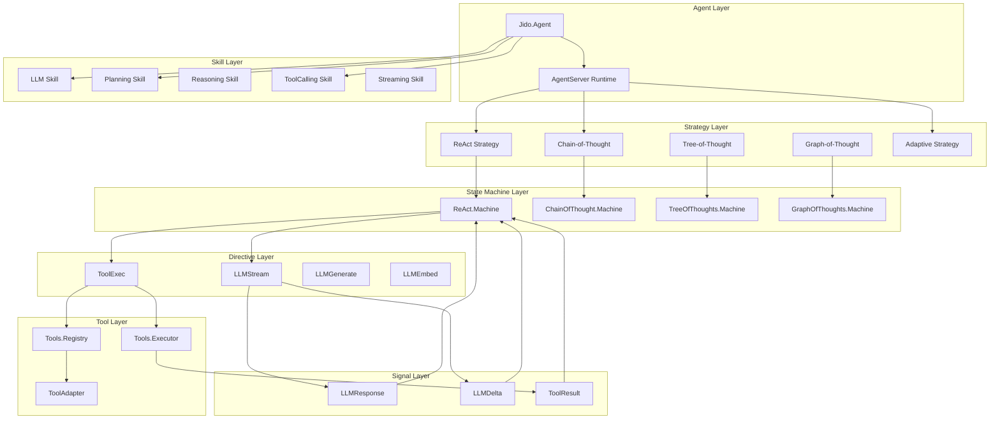
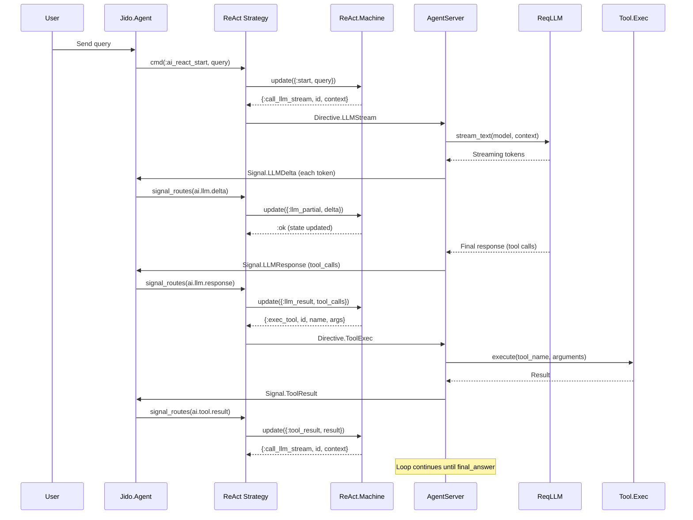

# Jido.AI Architecture Overview

This guide provides a comprehensive overview of the Jido.AI architecture, its core components, and how they work together to build AI-powered agents.

## Table of Contents

- [Introduction](#introduction)
- [Design Principles](#design-principles)
- [Architecture Diagram](#architecture-diagram)
- [Core Components](#core-components)
- [Data Flow](#data-flow)
- [Key Patterns](#key-patterns)

## Introduction

Jido.AI is the **AI integration layer** for the Jido ecosystem. It provides a unified interface for AI interactions built on [ReqLLM](https://hex.pm/packages/req_llm) and integrated with the Jido action framework.

### What Jido.AI Provides

- **Multi-LLM Support**: Anthropic, OpenAI, Google, and other providers through ReqLLM
- **Reasoning Strategies**: ReAct, Chain-of-Thought, Tree-of-Thought, Graph-of-Thought, TRM, and Adaptive
- **Tool System**: Execute Jido.Actions as tools for LLMs
- **State Management**: Pure state machines for predictable agent behavior
- **Signal-Driven Architecture**: Event-based communication between components
- **Skill Framework**: Modular capabilities (LLM, Planning, Reasoning, ToolCalling, Streaming)

## Design Principles

1. **Pure State Machines**: All reasoning strategies use pure functional state machines
2. **Directive Pattern**: Declarative side effects separate from business logic
3. **Signal-Driven Communication**: Components communicate via typed signals
4. **Composability**: Skills and strategies are composable building blocks
5. **Type Safety**: Zoi schemas and TypeSpecs throughout
6. **Observability**: Built-in telemetry and usage tracking

## Architecture Diagram



## Core Components

### 1. Facade Layer (`Jido.AI`)

The facade currently focuses on model alias resolution and runtime tool management.

```elixir
# Resolve model aliases
Jido.AI.resolve_model(:fast)

# Runtime tool management for ReAct agents
{:ok, _agent} = Jido.AI.register_tool(agent_pid, MyApp.Tools.Calculator)
{:ok, _agent} = Jido.AI.unregister_tool(agent_pid, "calculator")
{:ok, tools} = Jido.AI.list_tools(agent_pid)
```

### 2. Strategy Layer (`Jido.AI.Strategies.*`)

Strategies implement different reasoning patterns. Each strategy:

- Implements the `Jido.Agent.Strategy` behavior
- Uses a pure state machine for state transitions
- Returns directives describing side effects
- Routes signals to appropriate commands

| Strategy | Description | Use Case |
|----------|-------------|----------|
| `ReAct` | Reason-Act loop with tools | Multi-step reasoning with tool use |
| `ChainOfThought` | Step-by-step reasoning | Math, logic, common sense |
| `TreeOfThoughts` | Branching exploration | Puzzles, planning, creative writing |
| `GraphOfThoughts` | Graph-based reasoning | Multi-perspective analysis |
| `Adaptive` | Automatic strategy selection | Dynamic task routing |

### 3. State Machine Layer (`Jido.AI.*.Machine`)

Pure state machines using [Fsmx](https://hex.pm/packages/fsmx). Each machine:

- Has defined states and transitions
- Processes messages and returns directives
- Emits telemetry events
- Has no side effects (pure functional)

**ReAct Machine States:**
- `:idle` - Initial state, waiting for query
- `:awaiting_llm` - Waiting for LLM response
- `:awaiting_tool` - Waiting for tool execution
- `:completed` - Conversation complete
- `:error` - Error state

### 4. Directive Layer (`Jido.AI.Directive.*`)

Directives are declarative descriptions of side effects. The AgentServer runtime executes them.

| Directive | Purpose |
|-----------|---------|
| `LLMStream` | Stream LLM response with tools |
| `LLMGenerate` | Non-streaming text generation |
| `LLMEmbed` | Generate embeddings |
| `ToolExec` | Execute a tool (Jido.Action) |

```elixir
# Create an LLM streaming directive
directive = Directive.LLMStream.new!(%{
  id: "call_123",
  model: "anthropic:claude-haiku-4-5",
  context: messages,
  tools: tools
})
```

### 5. Tool System (`Jido.AI.*`)

The tool system bridges Jido.Actions and LLM tool calling without a global registry.

| Module | Purpose |
|--------|---------|
| `Jido.AI.Actions.ToolCalling.*` | Tool-calling actions (`CallWithTools`, `ExecuteTool`, `ListTools`) |
| `Jido.AI.Executor` | Consistent tool execution with normalization and timeout handling |
| `Jido.AI.ToolAdapter` | Converts Action modules to ReqLLM tool definitions |

```elixir
tools = Jido.AI.Executor.build_tools_map([MyApp.Actions.Calculator, MyApp.Actions.Search])

{:ok, result} =
  Jido.AI.Executor.execute("calculator", %{"a" => 1, "b" => 2, "operation" => "add"}, %{},
    tools: tools
  )
```

### 6. Signal Layer (`Jido.AI.Signal.*`)

Typed signals for event-driven communication.

| Signal | Type | Purpose |
|--------|------|---------|
| `LLMResponse` | `ai.llm.response` | LLM call completed |
| `LLMDelta` | `ai.llm.delta` | Streaming token chunk |
| `LLMError` | `ai.llm.error` | Structured error |
| `ToolResult` | `ai.tool.result` | Tool execution completed |
| `EmbedResult` | `ai.embed.result` | Embedding generated |
| `Usage` | `ai.usage` | Token usage tracking |

### 7. Plugin/Skill Framework (`Jido.AI.Plugins.*`, `Jido.AI.Skill.*`)

Skills provide modular capabilities. Each skill:

- Contains related actions
- Implements lifecycle callbacks
- Has its own Zoi schema for configuration

| Skill | Actions |
|-------|---------|
| `LLM` | Chat, Complete, Embed |
| `Planning` | Plan, Decompose, Prioritize |
| `Reasoning` | Analyze, Explain, Infer |
| `ToolCalling` | CallWithTools, ExecuteTool, ListTools |
| `Streaming` | StartStream, ProcessTokens, EndStream |

## Data Flow

### ReAct Agent Flow



## Key Patterns

### 1. Strategy Pattern

Different reasoning strategies can be swapped without changing agent code:

```elixir
use Jido.Agent,
  name: "my_agent",
  strategy: {Jido.AI.Strategies.ReAct, [tools: [Calculator], model: :fast]}

# Or swap to Adaptive for automatic strategy selection
use Jido.Agent,
  name: "my_agent",
  strategy: {Jido.AI.Strategies.Adaptive, [tools: [Calculator], model: :fast]}
```

### 2. Directive Pattern

Strategies return directives describing what to do, not doing it themselves:

```elixir
# Strategy returns a directive
{:exec_tool, id, "calculator", %{a: 1, b: 2, operation: "add"}}

# Runtime executes it via DirectiveExec protocol
defimpl Jido.AgentServer.DirectiveExec, for: Directive.ToolExec do
  def exec(directive, _input_signal, state) do
    # Execute tool asynchronously
    # Send result back as Signal.ToolResult
  end
end
```

### 3. Signal Routing

Strategies declare which signals they handle:

```elixir
def signal_routes(_ctx) do
  [
    {"ai.react.query", {:strategy_cmd, @start}},
    {"ai.llm.response", {:strategy_cmd, @llm_result}},
    {"ai.tool.result", {:strategy_cmd, @tool_result}},
    {"ai.llm.delta", {:strategy_cmd, @llm_partial}}
  ]
end
```

### 4. Pure State Machines

State transitions are pure functions returning directives:

```elixir
def update(%__MODULE__{status: "idle"} = machine, {:start, query, call_id}, env) do
  conversation = [system_message(system_prompt), user_message(query)]

  with_transition(machine, "awaiting_llm", fn machine ->
    machine = %{machine | conversation: conversation, iteration: 1}
    {machine, [{:call_llm_stream, call_id, conversation}]}
  end)
end
```

## Next Steps

- [Strategies Guide](./02_strategies.md) - Deep dive into reasoning strategies
- [State Machines Guide](./03_state_machines.md) - Pure state machine patterns
- [Directives Guide](./04_directives.md) - Declarative side effects
- [Signals Guide](./05_signals.md) - Event-driven communication
- [Tool System Guide](./06_tool_system.md) - Tool execution and registry
- [Skills Guide](./07_skills.md) - Skill framework
- [Configuration Guide](./08_configuration.md) - Model aliases and provider setup
