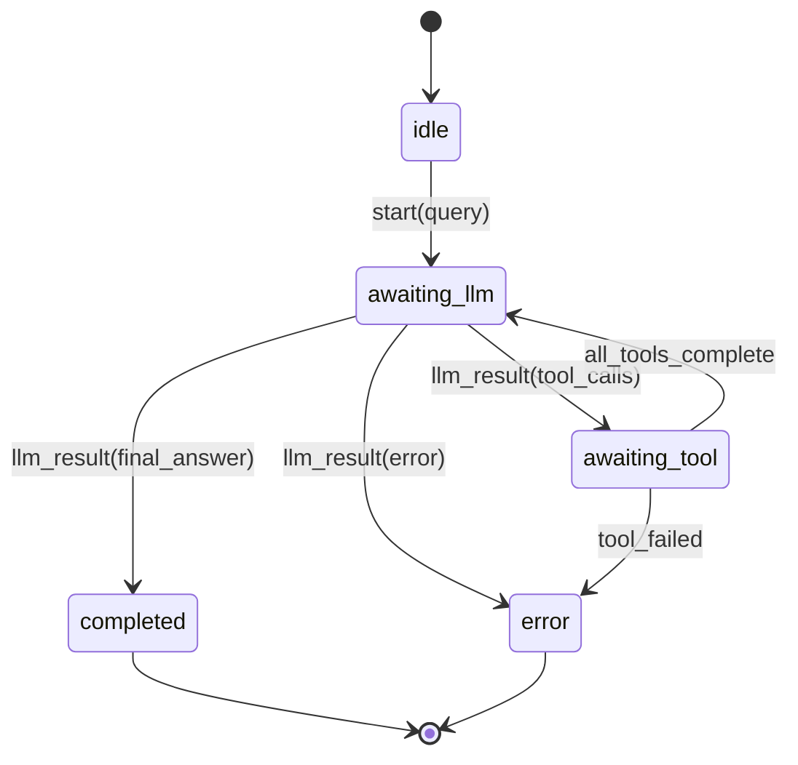
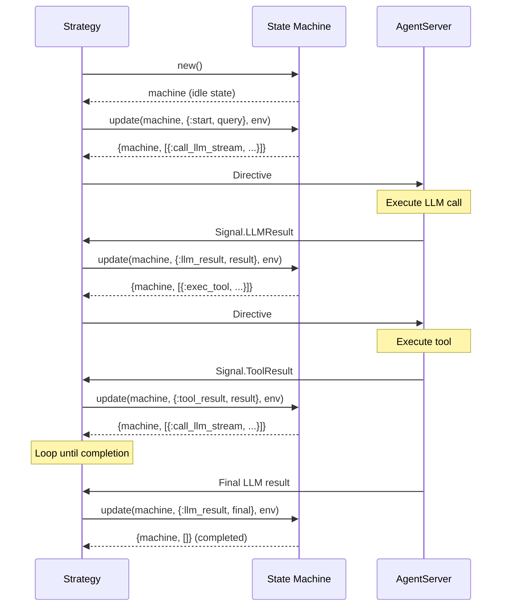

# State Machines Guide

This guide covers the pure state machine pattern used in Jido.AI strategies.

## Table of Contents

- [Overview](#overview)
- [Why Pure State Machines](#why-pure-state-machines)
- [Fsmx Integration](#fsmx-integration)
- [ReAct Machine](#react-machine)
- [State Machine Lifecycle](#state-machine-lifecycle)
- [Creating Custom Machines](#creating-custom-machines)

## Overview

All reasoning strategies in Jido.AI use **pure state machines** for state transitions. This means:

1. State transitions are pure functions
2. Side effects are described as directives
3. The same input always produces the same output
4. State machines can be serialized/deserialized



## Why Pure State Machines

### Benefits

1. **Predictability**: Same state + same message = same result
2. **Testability**: Easy to unit test without mocking side effects
3. **Debuggability**: State transitions are explicit
4. **Serialization**: Can save/restore state
5. **Inspection**: Full history of state changes possible

### Separation of Concerns

```elixir
# State Machine: Pure logic
{machine, directives} = Machine.update(machine, message, env)

# Strategy: Converts to SDK directives
directives = lift_directives(machine_directives, config)

# Runtime: Executes directives
AgentServer.execute(directive)
```

## Fsmx Integration

Jido.AI uses [Fsmx](https://hex.pm/packages/fsmx) for state machine management.

### Basic Usage

```elixir
use Fsmx.Struct,
  state_field: :status,
  transitions: %{
    "idle" => ["processing", "completed"],
    "processing" => ["completed", "error"],
    "completed" => [],
    "error" => []
  }

defstruct status: "idle",
          data: %{}
```

### Transition Helper

```elixir
defp with_transition(machine, new_status, fun) do
  case Fsmx.transition(machine, new_status, state_field: :status) do
    {:ok, machine} -> fun.(machine)
    {:error, _} -> {machine, []}
  end
end
```

## ReAct Machine

The `Jido.AI.ReAct.Machine` module is a complete example of the pattern.

### Module Definition

```elixir
defmodule Jido.AI.ReAct.Machine do
  use Fsmx.Struct,
    state_field: :status,
    transitions: %{
      "idle" => ["awaiting_llm"],
      "awaiting_llm" => ["awaiting_tool", "completed", "error"],
      "awaiting_tool" => ["awaiting_llm", "completed", "error"],
      "completed" => [],
      "error" => []
    }

  defstruct status: "idle",
            iteration: 0,
            conversation: [],
            pending_tool_calls: [],
            result: nil,
            current_llm_call_id: nil,
            termination_reason: nil,
            streaming_text: "",
            streaming_thinking: "",
            usage: %{},
            started_at: nil
end
```

### State Types

```elixir
@type status :: :idle | :awaiting_llm | :awaiting_tool | :completed | :error

@type pending_tool_call :: %{
  id: String.t(),
  name: String.t(),
  arguments: map(),
  result: term() | nil
}

@type usage :: %{
  optional(:input_tokens) => non_neg_integer(),
  optional(:output_tokens) => non_neg_integer(),
  optional(:total_tokens) => non_neg_integer()
}
```

### Message Types

```elixir
@type msg ::
  {:start, query :: String.t(), call_id :: String.t()} |
  {:llm_result, call_id :: String.t(), result :: term()} |
  {:llm_partial, call_id :: String.t(), delta :: String.t(), chunk_type :: atom()} |
  {:tool_result, call_id :: String.t(), result :: term()}
```

### Directive Types

```elixir
@type directive ::
  {:call_llm_stream, id :: String.t(), context :: list()} |
  {:exec_tool, id :: String.t(), tool_name :: String.t(), arguments :: map()}
```

### Update Function

```elixir
def update(%__MODULE__{status: "idle"} = machine, {:start, query, call_id}, env) do
  system_prompt = Map.fetch!(env, :system_prompt)
  conversation = [system_message(system_prompt), user_message(query)]
  started_at = System.monotonic_time(:millisecond)

  with_transition(machine, "awaiting_llm", fn machine ->
    machine =
      machine
      |> Map.put(:iteration, 1)
      |> Map.put(:conversation, conversation)
      |> Map.put(:pending_tool_calls, [])
      |> Map.put(:result, nil)
      |> Map.put(:termination_reason, nil)
      |> Map.put(:current_llm_call_id, call_id)
      |> Map.put(:streaming_text, "")
      |> Map.put(:streaming_thinking, "")
      |> Map.put(:usage, %{})
      |> Map.put(:started_at, started_at)

    {machine, [{:call_llm_stream, call_id, conversation}]}
  end)
end
```

### Serialization

```elixir
@doc """
Converts machine state to a map for storage in agent state.
"""
def to_map(%__MODULE__{} = machine) do
  machine
  |> Map.from_struct()
  |> Map.update!(:status, &status_to_atom/1)
end

@doc """
Creates a machine from a map (e.g., from agent state storage).
"""
def from_map(map) when is_map(map) do
  status =
    case map[:status] do
      s when is_atom(s) -> Atom.to_string(s)
      s when is_binary(s) -> s
      nil -> "idle"
    end

  %__MODULE__{
    status: status,
    iteration: map[:iteration] || 0,
    conversation: map[:conversation] || [],
    pending_tool_calls: map[:pending_tool_calls] || [],
    result: map[:result],
    current_llm_call_id: map[:current_llm_call_id],
    termination_reason: map[:termination_reason],
    streaming_text: map[:streaming_text] || "",
    streaming_thinking: map[:streaming_thinking] || "",
    usage: map[:usage] || %{},
    started_at: map[:started_at]
  }
end
```

## State Machine Lifecycle



### State Transitions for ReAct

| Current State | Message | Next State | Directives |
|---------------|---------|------------|------------|
| `:idle` | `{:start, query, call_id}` | `:awaiting_llm` | `{:call_llm_stream, call_id, context}` |
| `:awaiting_llm` | `{:llm_result, call_id, tool_calls}` | `:awaiting_tool` | `{:exec_tool, ...}` for each tool |
| `:awaiting_llm` | `{:llm_result, call_id, final_answer}` | `:completed` | `[]` |
| `:awaiting_tool` | `{:tool_result, call_id, result}` | `:awaiting_llm` | `{:call_llm_stream, ...}` |
| `:awaiting_tool` | All tools complete | `:awaiting_llm` | `{:call_llm_stream, ...}` |

## Creating Custom Machines

### Step 1: Define States and Transitions

```elixir
defmodule MyApp.MyMachine do
  use Fsmx.Struct,
    state_field: :status,
    transitions: %{
      "idle" => ["processing", "error"],
      "processing" => ["completed", "error"],
      "completed" => [],
      "error" => []
    }

  @type status :: :idle | :processing | :completed | :error

  defstruct status: "idle",
            data: %{},
            error: nil,
            result: nil
end
```

### Step 2: Define Types

```elixir
@type msg ::
  {:start, input :: term()} |
  {:process, data :: term()} |
  {:complete, result :: term()}

@type directive ::
  {:do_something, id :: String.t(), data :: map()} |
  {:do_another_thing, id :: String.t()}
```

### Step 3: Implement Update

```elixir
def new, do: %__MODULE__{}

def update(%__MODULE__{status: "idle"} = machine, {:start, input}, _env) do
  with_transition(machine, "processing", fn machine ->
    machine = %{machine | data: %{input: input}}
    {machine, [{:do_something, generate_id(), %{data: input}}]}
  end)
end

def update(%__MODULE__{status: "processing"} = machine, {:process, data}, _env) do
  # Process the data
  result = process_data(data)

  with_transition(machine, "completed", fn machine ->
    machine = %{machine | result: result}
    {machine, []}
  end)
end

def update(machine, _msg, _env) do
  {machine, []}
end
```

### Step 4: Add Serialization

```elixir
def to_map(%__MODULE__{} = machine) do
  machine
  |> Map.from_struct()
  |> Map.update!(:status, &String.to_atom/1)
end

def from_map(map) when is_map(map) do
  status =
    case map[:status] do
      s when is_atom(s) -> Atom.to_string(s)
      s when is_binary(s) -> s
      nil -> "idle"
    end

  %__MODULE__{
    status: status,
    data: Map.get(map, :data, %{}),
    error: Map.get(map, :error),
    result: Map.get(map, :result)
  }
end
```

### Step 5: Add Telemetry

```elixir
@telemetry_prefix [:my_app, :my_machine]

defp emit_telemetry(event, measurements, metadata) do
  :telemetry.execute(@telemetry_prefix ++ [event], measurements, metadata)
end

# Use in transitions
with_transition(machine, "processing", fn machine ->
  emit_telemetry(:start, %{system_time: System.system_time()}, %{
    input_type: typeof(machine.data.input)
  })
  # ...
end)
```

## Best Practices

1. **Keep state machines pure**: No side effects in update functions
2. **Use directives for side effects**: Describe what to do, don't do it
3. **Emit telemetry**: Track state transitions for observability
4. **Handle invalid transitions**: Return `{machine, []}` for unhandled messages
5. **Serialize atom states**: Store as strings in maps for compatibility

## Next Steps

- [Strategies Guide](./02_strategies.md) - Using state machines in strategies
- [Directives Guide](./04_directives.md) - Executing side effects
