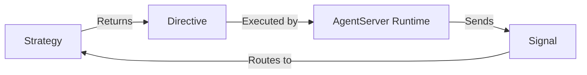
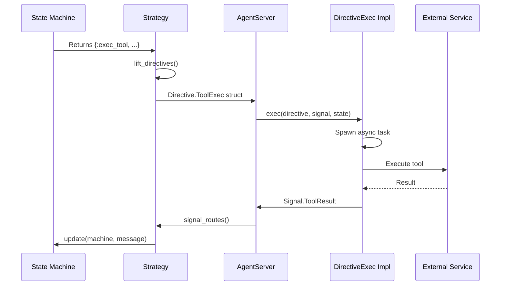
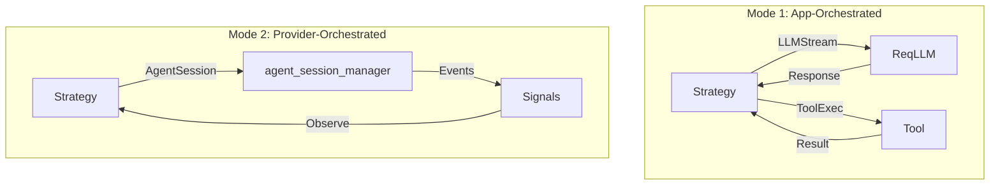

# Directives Guide

This guide covers the directive system in Jido.AI, which provides declarative side effects for agent execution.

## Table of Contents

- [Overview](#overview)
- [Available Directives](#available-directives)
- [Directive Lifecycle](#directive-lifecycle)
- [LLMStream Directive](#llmstream-directive)
- [ToolExec Directive](#toolexec-directive)
- [LLMGenerate Directive](#llmgenerate-directive)
- [LLMEmbed Directive](#llmembed-directive)
- [AgentSession Directive](#agentsession-directive)
- [Creating Custom Directives](#creating-custom-directives)

## Overview

Directives are **declarative descriptions of side effects**. Strategies return directives, and the AgentServer runtime executes them.

### Key Benefits

1. **Separation of Concerns**: Strategies don't execute side effects
2. **Testability**: Can test strategies without mocking
3. **Composability**: Directives can be batched and reordered
4. **Observability**: All side effects are explicit

### Directive Pattern



## Available Directives

| Directive | Module | Purpose |
|-----------|--------|---------|
| `LLMStream` | `Jido.AI.Directive.LLMStream` | Stream LLM response |
| `LLMGenerate` | `Jido.AI.Directive.LLMGenerate` | Generate non-streaming response |
| `LLMEmbed` | `Jido.AI.Directive.LLMEmbed` | Generate embeddings |
| `ToolExec` | `Jido.AI.Directive.ToolExec` | Execute a tool |
| `AgentSession` | `Jido.AI.Directive.AgentSession` | Delegate to autonomous agent |

## Directive Lifecycle



## LLMStream Directive

Streams an LLM response with optional tool support.

### Schema

```elixir
@schema Zoi.struct(__MODULE__, %{
  id: Zoi.string(description: "Unique call ID for correlation"),
  model: Zoi.string(description: "Model spec")
    |> Zoi.optional(),
  model_alias: Zoi.atom(description: "Model alias (e.g., :fast)")
    |> Zoi.optional(),
  system_prompt: Zoi.string(description: "Optional system prompt")
    |> Zoi.optional(),
  context: Zoi.any(description: "Conversation context"),
  tools: Zoi.list(Zoi.any(), description: "ReqLLM tools")
    |> Zoi.default([]),
  tool_choice: Zoi.any(description: "Tool choice mode")
    |> Zoi.default(:auto),
  max_tokens: Zoi.integer(description: "Max tokens")
    |> Zoi.default(1024),
  temperature: Zoi.number(description: "Temperature (0.0–2.0)")
    |> Zoi.default(0.2),
  timeout: Zoi.integer(description: "Timeout in milliseconds")
    |> Zoi.optional(),
  metadata: Zoi.map(description: "Tracking metadata")
    |> Zoi.default(%{})
}, coerce: true)
```

### Creating the Directive

```elixir
alias Jido.AI.Directive

# Using model alias
directive = Directive.LLMStream.new!(%{
  id: "call_123",
  model_alias: :fast,
  context: [
    %{role: :system, content: "You are a helpful assistant."},
    %{role: :user, content: "What is 2 + 2?"}
  ],
  tools: tools,
  max_tokens: 2048
})

# Using direct model spec
directive = Directive.LLMStream.new!(%{
  id: "call_123",
  model: "anthropic:claude-haiku-4-5",
  context: context,
  tools: tools
})
```

### Execution Behavior

The directive implementation:

1. Resolves model alias (if used)
2. Prepends system prompt (if provided)
3. Spawns an async task
4. Streams tokens from LLM
5. Sends `react.llm.delta` signals for each chunk
6. Sends `react.llm.response` signal on completion

### Signals Emitted

```elixir
# During streaming
%Jido.Signal{
  type: "react.llm.delta",
  data: %{
    call_id: "call_123",
    delta: "Hello",
    chunk_type: :content
  }
}

# On completion
%Jido.Signal{
  type: "react.llm.response",
  data: %{
    call_id: "call_123",
    result: {:ok, %{type: :final_answer, text: "Hello!"}}
  }
}
```

## ToolExec Directive

Executes a Jido.Action or Jido.AI.Tools.Tool as a tool.

### Schema

```elixir
@schema Zoi.struct(__MODULE__, %{
  id: Zoi.string(description: "Tool call ID from LLM"),
  tool_name: Zoi.string(description: "Name of the tool"),
  arguments: Zoi.map(description: "Arguments from LLM")
    |> Zoi.default(%{}),
  context: Zoi.map(description: "Execution context")
    |> Zoi.default(%{}),
  metadata: Zoi.map(description: "Tracking metadata")
    |> Zoi.default(%{})
}, coerce: true)
```

### Creating the Directive

```elixir
directive = Directive.ToolExec.new!(%{
  id: "tc_123",
  tool_name: "calculator",
  arguments: %{
    "a" => 1,
    "b" => 2,
    "operation" => "add"
  },
  context: %{
    agent_id: "agent_456"
  }
})
```

### Argument Normalization

LLM tool calls use string keys (JSON format). The executor normalizes them:

```elixir
# Before normalization (from LLM)
%{"a" => "1", "b" => "2", "operation" => "add"}

# After normalization (based on schema)
%{a: 1, b: 2, operation: "add"}
```

### Execution Flow

```elixir
defimpl Jido.AgentServer.DirectiveExec, for: Directive.ToolExec do
  def exec(directive, _input_signal, state) do
    agent_pid = self()

    Task.Supervisor.start_child(Jido.TaskSupervisor, fn ->
      result = Executor.execute(
        directive.tool_name,
        directive.arguments,
        directive.context
      )

      signal = Signal.ToolResult.new!(%{
        call_id: directive.id,
        tool_name: directive.tool_name,
        result: result
      })

      Jido.AgentServer.cast(agent_pid, signal)
    end)

    {:async, nil, state}
  end
end
```

## LLMGenerate Directive

Generates a non-streaming LLM response.

### Schema

```elixir
@schema Zoi.struct(__MODULE__, %{
  id: Zoi.string(description: "Unique call ID"),
  model: Zoi.string(description: "Model spec") |> Zoi.optional(),
  model_alias: Zoi.atom(description: "Model alias") |> Zoi.optional(),
  system_prompt: Zoi.string(description: "System prompt") |> Zoi.optional(),
  context: Zoi.any(description: "Conversation context"),
  tools: Zoi.list(Zoi.any()) |> Zoi.default([]),
  tool_choice: Zoi.any() |> Zoi.default(:auto),
  max_tokens: Zoi.integer() |> Zoi.default(1024),
  temperature: Zoi.number() |> Zoi.default(0.2),
  timeout: Zoi.integer() |> Zoi.optional(),
  metadata: Zoi.map() |> Zoi.default(%{})
}, coerce: true)
```

### When to Use

- When streaming is not needed
- For simple one-shot responses
- When you need the complete response before processing

```elixir
directive = Directive.LLMGenerate.new!(%{
  id: "call_123",
  model_alias: :fast,
  context: messages
})
```

## LLMEmbed Directive

Generates embeddings for text.

### Schema

```elixir
@schema Zoi.struct(__MODULE__, %{
  id: Zoi.string(description: "Unique call ID"),
  model: Zoi.string(description: "Embedding model"),
  texts: Zoi.any(description: "Text or list of texts"),
  dimensions: Zoi.integer(description: "Embedding dimensions")
    |> Zoi.optional(),
  timeout: Zoi.integer() |> Zoi.optional(),
  metadata: Zoi.map() |> Zoi.default(%{})
}, coerce: true)
```

### Usage

```elixir
# Single text
directive = Directive.LLMEmbed.new!(%{
  id: "embed_123",
  model: "openai:text-embedding-3-small",
  texts: "Hello, world!"
})

# Batch embedding
directive = Directive.LLMEmbed.new!(%{
  id: "embed_124",
  model: "openai:text-embedding-3-small",
  texts: ["Text 1", "Text 2", "Text 3"],
  dimensions: 1536
})
```

### Signal Emitted

```elixir
%Jido.Signal{
  type: "react.embed.result",
  data: %{
    call_id: "embed_123",
    result: {:ok, %{
      embeddings: [0.1, 0.2, ...],
      count: 1
    }}
  }
}
```

## AgentSession Directive

Delegates execution to an external autonomous agent via `agent_session_manager`.

Unlike `LLMStream` or `LLMGenerate`, this directive does not manage tool calls. The external agent (Claude Code CLI, Codex CLI, or any `agent_session_manager` adapter) handles everything autonomously. jido_ai observes events as signals but does not control tool execution.

> **Note:** This directive requires the optional `agent_session_manager` dependency.
> Add `{:agent_session_manager, "~> 0.2"}` to your `mix.exs` deps.

### Two Modes of AI Operation



### Schema

```elixir
@schema Zoi.struct(__MODULE__, %{
  id: Zoi.string(description: "Unique directive ID for correlation"),
  adapter: Zoi.atom(description: "agent_session_manager adapter module"),
  input: Zoi.string(description: "Prompt / task description"),
  session_id: Zoi.string(description: "Session ID to resume; nil for new")
    |> Zoi.optional(),
  session_config: Zoi.map(description: "Adapter-specific session configuration")
    |> Zoi.default(%{}),
  model: Zoi.string(description: "Model identifier")
    |> Zoi.optional(),
  timeout: Zoi.integer(description: "Timeout in ms for the entire agent run")
    |> Zoi.default(300_000),
  max_turns: Zoi.integer(description: "Max tool-use turns")
    |> Zoi.optional(),
  emit_events: Zoi.boolean(description: "Emit intermediate events as signals")
    |> Zoi.default(true),
  metadata: Zoi.map(description: "Arbitrary metadata")
    |> Zoi.default(%{})
}, coerce: true)
```

### Creating the Directive

```elixir
alias Jido.AI.Directive

# Delegate to Claude Code CLI
directive = Directive.AgentSession.new!(%{
  id: Jido.Util.generate_id(),
  adapter: AgentSessionManager.Adapters.ClaudeAdapter,
  input: "Refactor the authentication module to use JWT tokens",
  model: "claude-sonnet-4-5-20250929",
  timeout: 600_000,
  session_config: %{
    allowed_tools: ["read", "write", "bash"],
    working_directory: "/path/to/project"
  }
})

# Delegate to Codex CLI
directive = Directive.AgentSession.new!(%{
  id: Jido.Util.generate_id(),
  adapter: AgentSessionManager.Adapters.CodexAdapter,
  input: "Add comprehensive test coverage for the User module",
  session_config: %{
    working_directory: "/path/to/project"
  }
})
```

### Execution Behavior

The directive implementation:

1. Starts an `InMemorySessionStore` and the configured adapter
2. Spawns an async task via `Task.Supervisor`
3. Calls `SessionManager.run_once/4` which handles the full lifecycle
4. Streams intermediate events as `ai.agent_session.*` signals (if `emit_events: true`)
5. Sends a `Completed` or `Failed` signal when the agent finishes

### Signals Emitted

```elixir
# Agent started
%Jido.Signal{type: "ai.agent_session.started", data: %{session_id: "s1", run_id: "r1"}}

# Streaming text output
%Jido.Signal{type: "ai.agent_session.message", data: %{content: "Hello", delta: true}}

# Tool invocation observed
%Jido.Signal{type: "ai.agent_session.tool_call", data: %{tool_name: "write", status: :started}}

# Progress update
%Jido.Signal{type: "ai.agent_session.progress", data: %{tokens_used: %{input: 500}}}

# Completion
%Jido.Signal{type: "ai.agent_session.completed", data: %{output: "Done!", token_usage: %{}}}

# Failure
%Jido.Signal{type: "ai.agent_session.failed", data: %{reason: :timeout, error_message: "..."}}
```

### Handling in Strategy

```elixir
@impl true
def signal_routes(_ctx) do
  [
    # Mode 1 routes
    {"react.llm.response", {:strategy_cmd, :react_llm_result}},
    {"react.tool.result", {:strategy_cmd, :react_tool_result}},

    # Mode 2 routes
    {"ai.agent_session.completed", {:strategy_cmd, :agent_completed}},
    {"ai.agent_session.failed", {:strategy_cmd, :agent_failed}},
    {"ai.agent_session.message", {:strategy_cmd, :agent_message}}
  ]
end
```

### Relationship to Existing Directives

```
Jido.AI.Directive
├── LLMStream        (Mode 1: streaming completion via req_llm)
├── LLMGenerate      (Mode 1: blocking completion via req_llm)
├── LLMEmbed         (Mode 1: embedding generation via req_llm)
├── ToolExec         (Mode 1: execute a tool locally)
└── AgentSession     (Mode 2: delegate to autonomous agent)
```

## Creating Custom Directives

To create a custom directive:

### Step 1: Define the Directive Struct

```elixir
defmodule MyApp.Directive.MyCustomDirective do
  @moduledoc """
  Custom directive for my specific use case.
  """

  @schema Zoi.struct(
            __MODULE__,
            %{
              id: Zoi.string(description: "Unique ID"),
              data: Zoi.any(description: "My data"),
              options: Zoi.map(description: "Options")
                |> Zoi.default(%{})
            },
            coerce: true
          )

  @type t :: unquote(Zoi.type_spec(@schema))
  @enforce_keys Zoi.Struct.enforce_keys(@schema)
  defstruct Zoi.Struct.struct_fields(@schema)

  @doc false
  def schema, do: @schema

  @doc "Create a new directive."
  def new!(attrs) when is_map(attrs) do
    case Zoi.parse(@schema, attrs) do
      {:ok, directive} -> directive
      {:error, errors} -> raise "Invalid MyCustomDirective: #{inspect(errors)}"
    end
  end
end
```

### Step 2: Implement DirectiveExec Protocol

```elixir
defimpl Jido.AgentServer.DirectiveExec, for: MyApp.Directive.MyCustomDirective do
  @moduledoc """
  Executes the custom directive.
  """

  require Logger

  def exec(directive, _input_signal, state) do
    Logger.info("Executing custom directive: #{directive.id}")

    agent_pid = self()

    Task.Supervisor.start_child(Jido.TaskSupervisor, fn ->
      result = do_execute(directive)

      # Send result back as a signal
      signal = %Jido.Signal{
        type: "my_app.custom_result",
        data: %{
          directive_id: directive.id,
          result: result
        }
      }

      Jido.AgentServer.cast(agent_pid, signal)
    end)

    {:async, nil, state}
  end

  defp do_execute(directive) do
    # Your custom execution logic
    {:ok, %{processed: directive.data}}
  end
end
```

### Step 3: Use in Strategy

```elixir
defmodule MyApp.Strategies.MyStrategy do
  use Jido.Agent.Strategy

  alias MyApp.Directive.MyCustomDirective

  defp process_instruction(agent, %{action: :my_action, params: params}) do
    # Return your custom directive
    directive = MyCustomDirective.new!(%{
      id: generate_id(),
      data: params
    })

    {agent, [directive]}
  end
end
```

## Directive Helpers

### Model Resolution

The `Jido.AI.Helpers` module provides helper functions:

```elixir
alias Jido.AI.Helpers

# Resolve model alias to full spec
{:ok, model} = Helpers.resolve_model(:fast)
# => {:ok, "anthropic:claude-haiku-4-5"}

# Build messages from context with system prompt
messages = Helpers.build_directive_messages(context, system_prompt)
```

### Error Classification

```elixir
# Classify errors for telemetry
error_type = Helpers.classify_error(error)
# => :rate_limit | :auth | :timeout | :provider_error | :unknown
```

## Next Steps

- [Signals Guide](./05_signals.md) - Results from directive execution
- [Tool System Guide](./06_tool_system.md) - Tool execution details
- [Configuration Guide](./08_configuration.md) - Model aliases and providers
