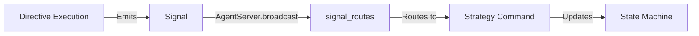

# Signals Guide

This guide covers the signal system in Jido.AI, which provides event-driven communication between components.

## Table of Contents

- [Overview](#overview)
- [Signal Types](#signal-types)
- [Signal Naming Convention](#signal-naming-convention)
- [ReqLLMResult Signal](#reqllmresult-signal)
- [ReqLLMPartial Signal](#reqllmpartial-signal)
- [ToolResult Signal](#toolresult-signal)
- [Signal Routing](#signal-routing)
- [Helper Functions](#helper-functions)

## Overview

Signals are the primary communication mechanism in Jido.AI. Components emit signals when events occur, and other components receive and process them.

### Key Benefits

1. **Decoupling**: Components don't need direct references
2. **Asynchronous**: Non-blocking communication
3. **Type Safety**: Signal schemas define data contracts
4. **Routing**: Automatic signal routing via `signal_routes/1`

### Signal Flow



## Signal Types

| Signal | Type | Emitted By | Purpose |
|--------|------|------------|---------|
| `ReqLLMResult` | `reqllm.result` | ReqLLM directives | LLM call completed |
| `ReqLLMPartial` | `reqllm.partial` | ReqLLMStream | Streaming token chunk |
| `ReqLLMError` | `reqllm.error` | ReqLLM directives | Structured error |
| `ToolResult` | `ai.tool_result` | ToolExec | Tool execution completed |
| `EmbedResult` | `ai.embed_result` | ReqLLMEmbed | Embedding generated |
| `UsageReport` | `ai.usage_report` | Telemetry | Token usage tracking |

## Signal Naming Convention

Jido.AI follows a consistent naming pattern:

- **ReqLLM signals**: `reqllm.<event>` - LLM-related events
- **Generic AI signals**: `ai.<event>` - General AI events

This naming convention makes it easy to:
- Identify signal sources
- Route signals to handlers
- Filter signal subscriptions

## ReqLLMResult Signal

Emitted when a ReqLLM call completes.

### Schema

```elixir
use Jido.Signal,
  type: "reqllm.result",
  default_source: "/reqllm",
  schema: [
    call_id: [type: :string, required: true, doc: "Correlation ID"],
    result: [type: :any, required: true, doc: "{:ok, result} | {:error, reason}"],
    usage: [type: :map, doc: "Token usage"],
    model: [type: :string, doc: "Model used"],
    duration_ms: [type: :integer, doc: "Request duration"],
    thinking_content: [type: :string, doc: "Extended thinking (reasoning models)"]
  ]
```

### Creating the Signal

```elixir
alias Jido.AI.Signal

# Successful result with tool calls
signal = Signal.ReqLLMResult.new!(%{
  call_id: "call_123",
  result: {:ok, %{
    type: :tool_calls,
    text: "",
    tool_calls: [
      %{id: "tc_1", name: "calculator", arguments: %{a: 1, b: 2, operation: "add"}}
    ]
  }},
  usage: %{input_tokens: 50, output_tokens: 20},
  model: "anthropic:claude-haiku-4-5",
  duration_ms: 1234
})

# Successful result with final answer
signal = Signal.ReqLLMResult.new!(%{
  call_id: "call_124",
  result: {:ok, %{
    type: :final_answer,
    text: "The answer is 42."
  }}
})

# Error result
signal = Signal.ReqLLMResult.new!(%{
  call_id: "call_125",
  result: {:error, %{type: :rate_limit, message: "Rate limit exceeded"}}
})
```

### Result Structure

When successful, the result contains:

```elixir
%{
  type: :tool_calls | :final_answer,
  text: String.t(),
  tool_calls: [%{
    id: String.t(),
    name: String.t(),
    arguments: map()
  }]
}
```

### Helper Functions

```elixir
# Extract tool calls from signal
tool_calls = Signal.extract_tool_calls(signal)
# => [%{id: "tc_1", name: "calculator", arguments: %{...}}]

# Check if signal contains tool calls
Signal.tool_call?(signal)
# => true or false

# Deprecated: use tool_call?/1 instead
Signal.is_tool_call?(signal)
```

## ReqLLMPartial Signal

Emitted incrementally during streaming LLM responses.

### Schema

```elixir
use Jido.Signal,
  type: "reqllm.partial",
  default_source: "/reqllm",
  schema: [
    call_id: [type: :string, required: true, doc: "Correlation ID"],
    delta: [type: :string, required: true, doc: "Text chunk"],
    chunk_type: [type: :atom, default: :content, doc: ":content or :thinking"]
  ]
```

### Creating the Signal

```elixir
# Content chunk
signal = Signal.ReqLLMPartial.new!(%{
  call_id: "call_123",
  delta: "Hello",
  chunk_type: :content
})

# Thinking chunk (for reasoning models)
signal = Signal.ReqLLMPartial.new!(%{
  call_id: "call_123",
  delta: "Let me think...",
  chunk_type: :thinking
})
```

### Handling in Strategy

```elixir
def update(%__MODULE__{status: "awaiting_llm"} = machine,
          {:llm_partial, call_id, delta, chunk_type}, _env) do
  if call_id == machine.current_llm_call_id do
    machine =
      case chunk_type do
        :content -> Map.update!(machine, :streaming_text, &(&1 <> delta))
        :thinking -> Map.update!(machine, :streaming_thinking, &(&1 <> delta))
        _ -> machine
      end

    {machine, []}
  else
    {machine, []}
  end
end
```

## ToolResult Signal

Emitted when a tool execution completes.

### Schema

```elixir
use Jido.Signal,
  type: "ai.tool_result",
  default_source: "/ai/tool",
  schema: [
    call_id: [type: :string, required: true, doc: "Tool call ID from LLM"],
    tool_name: [type: :string, required: true, doc: "Name of executed tool"],
    result: [type: :any, required: true, doc: "{:ok, result} | {:error, reason}"]
  ]
```

### Creating the Signal

```elixir
# Successful tool result
signal = Signal.ToolResult.new!(%{
  call_id: "tc_123",
  tool_name: "calculator",
  result: {:ok, %{result: 3}}
})

# Error result
signal = Signal.ToolResult.new!(%{
  call_id: "tc_124",
  tool_name: "calculator",
  result: {:error, "Division by zero"}
})
```

## Other Signal Types

### ReqLLMError

Structured error information:

```elixir
use Jido.Signal,
  type: "reqllm.error",
  schema: [
    call_id: [type: :string, required: true],
    error_type: [type: :atom, required: true],
    message: [type: :string, required: true],
    details: [type: :map, default: %{}],
    retry_after: [type: :integer]
  ]
```

### UsageReport

Token usage and cost tracking:

```elixir
use Jido.Signal,
  type: "ai.usage_report",
  schema: [
    call_id: [type: :string, required: true],
    model: [type: :string, required: true],
    input_tokens: [type: :integer, required: true],
    output_tokens: [type: :integer, required: true],
    total_tokens: [type: :integer],
    duration_ms: [type: :integer],
    metadata: [type: :map, default: %{}]
  ]
```

### EmbedResult

Embedding generation result:

```elixir
use Jido.Signal,
  type: "ai.embed_result",
  schema: [
    call_id: [type: :string, required: true],
    result: [type: :any, required: true]
  ]
```

Result structure:
```elixir
{:ok, %{
  embeddings: [0.1, 0.2, ...] | [[0.1, ...], [0.2, ...]],
  count: 1 | N
}}
```

## Signal Routing

Strategies declare which signals they handle via `signal_routes/1`:

```elixir
@impl true
def signal_routes(_ctx) do
  [
    # Route specific signal types to strategy commands
    {"react.user_query", {:strategy_cmd, :react_start}},
    {"reqllm.result", {:strategy_cmd, :react_llm_result}},
    {"ai.tool_result", {:strategy_cmd, :react_tool_result}},
    {"reqllm.partial", {:strategy_cmd, :react_llm_partial}}
  ]
end
```

### Route Types

| Route Type | Description |
|------------|-------------|
| `{:strategy_cmd, action}` | Route to strategy command |
| `{:skill_cmd, skill, action}` | Route to skill command |
| `{:handler, module, function}` | Route to custom handler |

### Signal Matching

Signals are matched by their `type` field:

```elixir
# This signal matches the "reqllm.result" route
%Jido.Signal{
  type: "reqllm.result",
  data: %{call_id: "call_123", result: {:ok, %{...}}}
}
```

## Helper Functions

### Extract Tool Calls

```elixir
@spec extract_tool_calls(Jido.Signal.t()) :: [map()]
def extract_tool_calls(%{type: "reqllm.result", data: %{result: {:ok, result}}}) do
  case result do
    %{type: :tool_calls, tool_calls: tool_calls} when is_list(tool_calls) -> tool_calls
    %{tool_calls: tool_calls} when is_list(tool_calls) and tool_calls != [] -> tool_calls
    _ -> []
  end
end
def extract_tool_calls(_signal), do: []
```

### Tool Call Check

```elixir
@spec tool_call?(Jido.Signal.t()) :: boolean()
def tool_call?(%{type: "reqllm.result", data: %{result: {:ok, result}}}) do
  case result do
    %{type: :tool_calls} -> true
    %{tool_calls: tool_calls} when is_list(tool_calls) and tool_calls != [] -> true
    _ -> false
  end
end
def tool_call?(_signal), do: false
```

### From ReqLLM Response

```elixir
@spec from_reqllm_response(map(), keyword()) :: {:ok, Jido.Signal.t()} | {:error, term()}
def from_reqllm_response(response, opts) do
  call_id = Keyword.fetch!(opts, :call_id)

  # Extract data from response
  tool_calls = extract_response_tool_calls(response)
  type = if tool_calls == [], do: :final_answer, else: :tool_calls
  text = extract_response_text(response)

  result = %{
    type: type,
    text: text,
    tool_calls: tool_calls
  }

  ReqLLMResult.new(%{
    call_id: call_id,
    result: {:ok, result}
  })
end
```

## Signal Best Practices

1. **Use required fields**: Mark required fields in schemas
2. **Provide context**: Include duration, usage, model info
3. **Handle errors**: Always return `{:ok, ...}` or `{:error, ...}`
4. **Match call IDs**: Correlate requests with responses using call IDs
5. **Type results**: Use atoms for result types (`:tool_calls`, `:final_answer`)

## Next Steps

- [Directives Guide](./04_directives.md) - Directives that emit signals
- [Strategies Guide](./02_strategies.md) - Signal routing in strategies
- [State Machines Guide](./03_state_machines.md) - Handling signals in state machines
