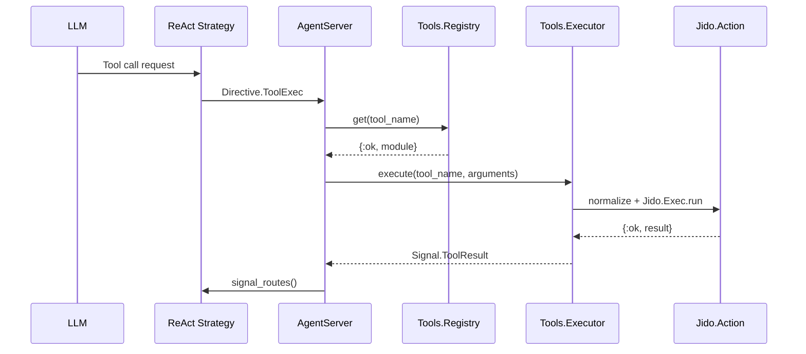

# Tool System Guide

This guide covers the tool system in Jido.AI, which bridges Jido.Actions and LLM tool calling.

## Table of Contents

- [Overview](#overview)
- [Architecture](#architecture)
- [Registry](#registry)
- [Executor](#executor)
- [ToolAdapter](#tooladapter)
- [Creating Tools](#creating-tools)

## Overview

The tool system enables LLMs to execute Jido.Actions as tools. It provides:

1. **Unified Registry**: Single source of truth for action discovery
2. **Validated Execution**: All actions run via `Jido.Exec.run/3`
3. **Argument Normalization**: Converts JSON arguments to atom keys
4. **Consistent Execution**: Standardized error handling and telemetry

### Tool Flow



## Architecture

### Components

| Module | Purpose |
|--------|---------|
| `Jido.AI.Tools.Registry` | Action storage and lookup |
| `Jido.AI.Executor` | Execution with timeout, telemetry, formatting |
| `Jido.AI.ToolAdapter` | Converts Actions to ReqLLM format |

### Storage

```
┌─────────────────────────────────────────┐
│         Tools.Registry                  │
├─────────────────────────────────────────┤
│  "calculator" → Calculator              │
│  "search"     → Search                  │
│  "weather"    → Weather                 │
└─────────────────────────────────────────┘
```

## Registry

The `Jido.AI.Tools.Registry` provides storage for Action modules used as tools.

### Starting the Registry

The registry auto-starts on first access. You can also start it explicitly:

```elixir
{:ok, _pid} = Jido.AI.Tools.Registry.start_link()
```

### Registration

```elixir
alias Jido.AI.Tools.Registry

# Register an action
:ok = Registry.register(MyApp.Actions.Calculator)

# Also available as register_action
:ok = Registry.register_action(MyApp.Actions.Calculator)

# Batch registration
:ok = Registry.register_actions([
  MyApp.Actions.Calculator,
  MyApp.Actions.Search
])
```

### Lookup

```elixir
# Safe lookup
{:ok, module} = Registry.get("calculator")
{:error, :not_found} = Registry.get("unknown")

# Bang version (raises on not found)
module = Registry.get!("calculator")
```

### Listing

```elixir
# List all registered actions
Registry.list_all()
# => [{"calculator", Calculator}, {"search", Search}]

# Also available as list_actions
Registry.list_actions()
# => [{"calculator", Calculator}, {"search", Search}]
```

### ReqLLM Conversion

```elixir
# Convert all to ReqLLM.Tool structs
tools = Registry.to_reqllm_tools()
ReqLLM.stream_text(model, messages, tools: tools)
```

### Management

```elixir
# Unregister by name
:ok = Registry.unregister("calculator")

# Clear all (useful for testing)
:ok = Registry.clear()
```

## Executor

The `Jido.AI.Executor` provides consistent action execution with timeout handling.

### Execution Flow

```elixir
def execute(tool_name, arguments, context \\ %{})
```

1. Lookup action in Registry
2. Normalize arguments (string keys → atom keys)
3. Execute via `Jido.Exec.run/3` (validates with schema)
4. Format and return result

### Argument Normalization

LLMs return tool call arguments with string keys (JSON format). The executor normalizes them:

```elixir
# Before (from LLM)
%{"a" => "1", "b" => "2", "operation" => "add"}

# After normalization (based on schema)
%{a: 1, b: 2, operation: "add"}
```

### Usage

```elixir
alias Jido.AI.Executor

# Execute by name (uses registry)
{:ok, result} = Executor.execute("calculator", %{
  "a" => 5,
  "b" => 3,
  "operation" => "add"
})

# Execute directly with module (bypasses registry)
{:ok, result} = Executor.execute_module(MyApp.Actions.Calculator, %{
  "a" => 5,
  "b" => 3
}, %{})

# With timeout
{:ok, result} = Executor.execute("search", %{"query" => "Elixir"}, %{}, timeout: 5000)
```

### Error Handling

The executor returns structured errors:

```elixir
{:error, %{error: "Tool not found: unknown", type: :not_found}}
{:error, %{error: "...", type: :execution_error, details: %{...}}}
{:error, %{error: "Tool execution timed out after 30000ms", type: :timeout}}
```

## ToolAdapter

The `Jido.AI.ToolAdapter` converts Jido.Actions to ReqLLM.Tool format.

### From Actions

```elixir
alias Jido.AI.ToolAdapter

# Single action
tool = ToolAdapter.from_action(MyApp.Actions.Calculator)
# => %ReqLLM.Tool{name: "calculator", description: "...", parameter_schema: %{...}}

# Multiple actions
tools = ToolAdapter.from_actions([
  MyApp.Actions.Calculator,
  MyApp.Actions.Search
])

# With prefix
tools = ToolAdapter.from_actions(actions, prefix: "myapp_")
```

### Lookup

```elixir
# Find action by tool name
{:ok, action} = ToolAdapter.lookup_action("calculator", action_modules)
```

## Creating Tools

All tools are `Jido.Action` modules. Use the standard Action pattern:

```elixir
defmodule MyApp.Tools.Calculator do
  use Jido.Action,
    name: "calculator",
    description: "Performs basic arithmetic operations",
    schema: [
      a: [type: :number, required: true, doc: "First number"],
      b: [type: :number, required: true, doc: "Second number"],
      operation: [type: :string, default: "add", doc: "Operation: add, subtract, multiply, divide"]
    ]

  @impl true
  def run(%{a: a, b: b, operation: op}, _context) do
    result = case op do
      "add" -> a + b
      "subtract" -> a - b
      "multiply" -> a * b
      "divide" when b != 0 -> a / b
      "divide" -> {:error, "Division by zero"}
      _ -> {:error, "Unknown operation: #{op}"}
    end

    case result do
      {:error, reason} -> {:error, reason}
      value -> {:ok, %{result: value}}
    end
  end
end
```

### Registering Tools

```elixir
# In application startup
defmodule MyApp.Application do
  def start(_type, _args) do
    # Register tools
    Jido.AI.Tools.Registry.register(MyApp.Tools.Calculator)
    Jido.AI.Tools.Registry.register(MyApp.Tools.Search)

    # ...
  end
end
```

## Tool Best Practices

1. **Use descriptive names**: Clear, action-oriented tool names
2. **Provide detailed descriptions**: Help LLMs understand when to use tools
3. **Validate input**: Use schemas for parameter validation
4. **Handle errors**: Return `{:error, reason}` for failures
5. **Return structured results**: Use maps with clear field names

## Next Steps

- [Strategies Guide](02_strategies.md) - Using tools in strategies
- [Directives Guide](04_directives.md) - ToolExec directive
- [Skills Guide](07_skills.md) - ToolCalling skill
