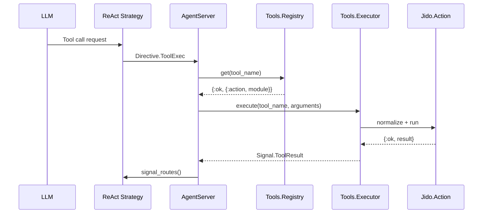

# Tool System Guide

This guide covers the tool system in Jido.AI, which bridges Jido.Actions and LLM tool calling.

## Table of Contents

- [Overview](#overview)
- [Architecture](#architecture)
- [Registry](#registry)
- [Executor](#executor)
- [ToolAdapter](#tooladapter)
- [Tool Behavior](#tool-behavior)
- [Creating Tools](#creating-tools)

## Overview

The tool system enables LLMs to execute Jido.Actions as tools. It provides:

1. **Unified Registry**: Single source of truth for tool discovery
2. **Type-Aware Storage**: Distinguishes between Actions and Tools
3. **Argument Normalization**: Converts JSON arguments to atom keys
4. **Consistent Execution**: Standardized error handling and telemetry

### Tool Flow



## Architecture

### Components

| Module | Purpose |
|--------|---------|
| `Jido.AI.Tools.Registry` | Unified storage and lookup |
| `Jido.AI.Tools.Executor` | Consistent execution with normalization |
| `Jido.AI.Tools.Tool` | Behavior for custom tools |
| `Jido.AI.ToolAdapter` | Converts Actions to ReqLLM format |

### Storage

```
┌─────────────────────────────────────────┐
│         Tools.Registry                 │
├─────────────────────────────────────────┤
│  "calculator" → {:action, Calculator}   │
│  "search"     → {:tool, Search}         │
│  "weather"    → {:action, Weather}       │
└─────────────────────────────────────────┘
```

## Registry

The `Jido.AI.Tools.Registry` provides unified storage for Actions and Tools.

### Starting the Registry

The registry auto-starts on first access. You can also start it explicitly:

```elixir
{:ok, _pid} = Jido.AI.Tools.Registry.start_link()
```

### Registration

```elixir
alias Jido.AI.Tools.Registry

# Auto-detect type (Action or Tool)
:ok = Registry.register(MyApp.Actions.Calculator)
:ok = Registry.register(MyApp.Tools.Search)

# Explicit registration
:ok = Registry.register_action(MyApp.Actions.Calculator)
:ok = Registry.register_tool(MyApp.Tools.Search)

# Batch registration
:ok = Registry.register_actions([
  MyApp.Actions.Calculator,
  MyApp.Actions.Search
])
```

### Lookup

```elixir
# Safe lookup
{:ok, {:action, module}} = Registry.get("calculator")
{:ok, {:tool, module}} = Registry.get("search")
{:error, :not_found} = Registry.get("unknown")

# Bang version (raises on not found)
{:action, module} = Registry.get!("calculator")
```

### Listing

```elixir
# List all registered tools
Registry.list_all()
# => [{"calculator", :action, Calculator}, {"search", :tool, Search}]

# List only actions
Registry.list_actions()
# => [{"calculator", Calculator}]

# List only tools
Registry.list_tools()
# => [{"search", Search}]
```

### ReqLLM Conversion

```elixir
# Convert all to ReqLLM.Tool structs
tools = Registry.to_reqllm_tools()
ReqLLM.stream_text(model, messages, tools: tools)
```

### Management

```elixir
# Unregister by name
:ok = Registry.unregister("calculator")

# Clear all (useful for testing)
:ok = Registry.clear()
```

## Executor

The `Jido.AI.Tools.Executor` provides consistent tool execution.

### Execution Flow

```elixir
def execute(tool_name, arguments, context \\ %{})
```

1. Lookup tool in Registry
2. Normalize arguments (string keys → atom keys)
3. Validate with tool's schema
4. Execute the tool
5. Return standardized result

### Argument Normalization

LLMs return tool call arguments with string keys (JSON format). The executor normalizes them:

```elixir
# Before (from LLM)
%{"a" => "1", "b" => "2", "operation" => "add"}

# After normalization (based on schema)
%{a: 1, b: 2, operation: "add"}
```

### Usage

```elixir
alias Jido.AI.Tools.Executor

# Execute a tool
{:ok, result} = Executor.execute("calculator", %{
  "a" => 5,
  "b" => 3,
  "operation" => "add"
})

# With context
{:ok, result} = Executor.execute("search", %{
  "query" => "Elixir programming"
}, %{agent_id: "agent_123"})
```

### Error Handling

The executor classifies errors:

```elixir
{:error, :not_found}     # Tool not in registry
{:error, :validation}    # Schema validation failed
{:error, :execution}     # Tool execution failed
```

## ToolAdapter

The `Jido.AI.ToolAdapter` converts Jido.Actions to ReqLLM.Tool format.

### From Actions

```elixir
alias Jido.AI.ToolAdapter

# Single action
tool = ToolAdapter.from_action(MyApp.Actions.Calculator)
# => %ReqLLM.Tool{name: "calculator", description: "...", parameters: %{...}}

# Multiple actions
tools = ToolAdapter.from_actions([
  MyApp.Actions.Calculator,
  MyApp.Actions.Search
])
```

### Lookup

```elixir
# Find action by tool name
{:ok, action} = ToolAdapter.lookup_action("calculator", actions_by_name)
```

### Tool Schema Extraction

The adapter extracts Zoi schemas for tool parameters:

```elixir
defmodule MyApp.Actions.Calculator do
  use Jido.Action,
    name: "calculator",
    description: "Performs calculations"

  @schema Zoi.struct(__MODULE__, %{
    a: Zoi.number() |> Zoi.default(0),
    b: Zoi.number() |> Zoi.default(0),
    operation: Zoi.string() |> Zoi.default("add")
  }, coerce: true)

  def run(params, _context), do: {:ok, calculate(params)}
end
```

The adapter converts this to ReqLLM.Tool format for the LLM.

## Tool Behavior

For more complex tools, implement the `Jido.AI.Tools.Tool` behavior instead of `Jido.Action`.

### Behavior Definition

```elixir
defmodule Jido.AI.Tools.Tool do
  @moduledoc """
  Behavior for custom tool implementations.

  Alternative to Jido.Action for tools that need:
  - Custom argument normalization
  - Specialized execution patterns
  - Tool-specific metadata
  """

  @callback name() :: String.t()
  @callback description() :: String.t()
  @callback parameters() :: map()
  @callback execute(arguments :: map(), context :: map()) :: {:ok, term()} | {:error, term()}
  @optional_callbacks [parameters: 0]
end
```

### Implementing Tool Behavior

```elixir
defmodule MyApp.Tools.CustomSearch do
  @moduledoc """
  Custom search tool with specialized behavior.
  """

  @behaviour Jido.AI.Tools.Tool

  @impl true
  def name, do: "custom_search"

  @impl true
  def description, do: "Searches with custom ranking"

  @impl true
  def parameters do
    %{
      "query" => %{type: "string", description: "Search query"},
      "limit" => %{type: "integer", description: "Result limit", default: 10}
    }
  end

  @impl true
  def execute(arguments, _context) do
    # Custom execution logic
    query = arguments["query"]
    limit = arguments["limit"] || 10

    results = perform_search(query, limit)
    {:ok, %{results: results}}
  end

  defp perform_search(query, limit) do
    # Implementation
  end
end
```

## Creating Tools

### Option 1: Jido.Action (Simple)

Use `Jido.Action` for simple tools:

```elixir
defmodule MyApp.Tools.Calculator do
  use Jido.Action,
    name: "calculator",
    description: "Performs basic arithmetic operations"

  @schema Zoi.struct(__MODULE__, %{
    a: Zoi.number(description: "First number") |> Zoi.required(),
    b: Zoi.number(description: "Second number") |> Zoi.required(),
    operation: Zoi.string(description: "Operation: add, subtract, multiply, divide")
      |> Zoi.default("add")
  }, coerce: true)

  def run(%{a: a, b: b, operation: op}, _context) do
    result = case op do
      "add" -> a + b
      "subtract" -> a - b
      "multiply" -> a * b
      "divide" -> a / b
      _ -> {:error, "Unknown operation: #{op}"}
    end

    {:ok, %{result: result}}
  end
end
```

### Option 2: Tool Behavior (Advanced)

Use `Jido.AI.Tools.Tool` for advanced tools:

```elixir
defmodule MyApp.Tools.AdvancedCalculator do
  @behaviour Jido.AI.Tools.Tool

  def name, do: "advanced_calculator"
  def description, do: "Advanced calculator with expression parsing"

  def execute(%{"expression" => expr}, _context) do
    case evaluate_expression(expr) do
      {:ok, result} -> {:ok, %{result: result}}
      {:error, reason} -> {:error, reason}
    end
  end

  defp evaluate_expression(expr) do
    # Custom evaluation logic
  end
end
```

### Registering Tools

```elixir
# In application startup
defmodule MyApp.Application do
  def start(_type, _args) do
    # Register tools
    Jido.AI.Tools.Registry.register(MyApp.Tools.Calculator)
    Jido.AI.Tools.Registry.register(MyApp.Tools.AdvancedCalculator)

    # ...
  end
end
```

## Tool Best Practices

1. **Use descriptive names**: Clear, action-oriented tool names
2. **Provide detailed descriptions**: Help LLMs understand when to use tools
3. **Validate input**: Use Zoi schemas for parameter validation
4. **Handle errors**: Return `{:error, reason}` for failures
5. **Return structured results**: Use maps with clear field names
6. **Add telemetry**: Emit events for monitoring

## Next Steps

- [Strategies Guide](./02_strategies.md) - Using tools in strategies
- [Directives Guide](./04_directives.md) - ToolExec directive
- [Skills Guide](./07_skills.md) - ToolCalling skill
