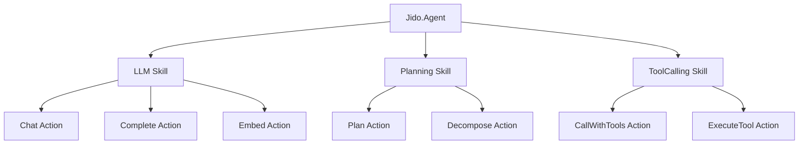
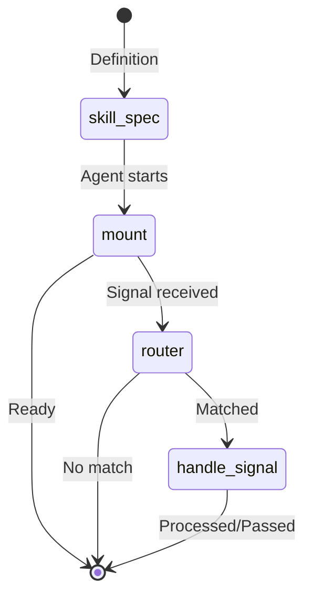

# Skills Guide

This guide covers the skill framework in Jido.AI, which provides modular capabilities for agents.

## Table of Contents

- [Overview](#overview)
- [Skill Architecture](#skill-architecture)
- [Available Skills](#available-skills)
- [Skill Lifecycle](#skill-lifecycle)
- [LLM Skill](#llm-skill)
- [Planning Skill](#planning-skill)
- [Reasoning Skill](#reasoning-skill)
- [ToolCalling Skill](#toolcalling-skill)
- [Streaming Skill](#streaming-skill)
- [Creating Custom Skills](#creating-custom-skills)

## Overview

Skills in Jido.AI provide modular capabilities that can be mounted on agents. Each skill:

- Contains related actions (capabilities)
- Implements lifecycle callbacks
- Has its own configuration schema
- Can route and handle signals
- Provides clean separation of concerns



## Skill Architecture

### Skill Structure

```
lib/jido_ai/skills/
├── llm/
│   ├── llm.ex                 # Main skill module
│   └── actions/
│       ├── chat.ex            # Chat action
│       ├── complete.ex        # Completion action
│       └── embed.ex           # Embedding action
├── planning/
│   ├── planning.ex            # Main skill module
│   └── actions/
│       ├── plan.ex
│       ├── decompose.ex
│       └── prioritize.ex
├── reasoning/
│   ├── reasoning.ex
│   └── actions/
│       ├── analyze.ex
│       ├── explain.ex
│       └── infer.ex
├── tool_calling/
│   ├── tool_calling.ex
│   └── actions/
│       ├── call_with_tools.ex
│       ├── execute_tool.ex
│       └── list_tools.ex
└── streaming/
    ├── streaming.ex
    └── actions/
        ├── start_stream.ex
        ├── process_tokens.ex
        └── end_stream.ex
```

### Skill Module

Each skill is a module that:

1. Uses `Jido.Skill`
2. Defines actions
3. Implements lifecycle callbacks
4. Provides a configuration schema

```elixir
defmodule Jido.AI.Skills.LLM do
  use Jido.Skill,
    name: "llm",
    description: "LLM capabilities for text generation and embeddings"

  # Actions
  defactions [
    Jido.AI.Skills.LLM.Actions.Chat,
    Jido.AI.Skills.LLM.Actions.Complete,
    Jido.AI.Skills.LLM.Actions.Embed
  ]

  # Lifecycle callbacks
  def skill_spec(config), do: # ...
  def router(config), do: # ...
  def handle_signal(signal, ctx), do: # ...
end
```

## Available Skills

| Skill | Module | Actions | Purpose |
|-------|--------|---------|---------|
| **LLM** | `Jido.AI.Skills.LLM` | Chat, Complete, Embed | Text generation and embeddings |
| **Planning** | `Jido.AI.Skills.Planning` | Plan, Decompose, Prioritize | Task planning and decomposition |
| **Reasoning** | `Jido.AI.Skills.Reasoning` | Analyze, Explain, Infer | Logical reasoning |
| **ToolCalling** | `Jido.AI.Skills.ToolCalling` | CallWithTools, ExecuteTool, ListTools | LLM tool calling |
| **Streaming** | `Jido.AI.Skills.Streaming` | StartStream, ProcessTokens, EndStream | Streaming responses |

## Skill Lifecycle

### Callbacks

```elixir
@callback skill_spec(config :: map()) :: Jido.Skill.Spec.t()
@callback router(config :: map()) :: [{Signal.type(), route()}]
@callback handle_signal(signal :: Signal.t(), ctx :: map()) :: {:ok, Signal.t()} | :pass
@callback mount(agent :: Agent.t(), config :: map()) :: {:ok, Agent.t()} | {:error, term()}
```

### Lifecycle Flow



### skill_spec/1

Returns the skill specification including actions and default state:

```elixir
def skill_spec(config) do
  %Jido.Skill.Spec{
    name: "llm",
    actions: [
      {Jido.AI.Skills.LLM.Actions.Chat, []},
      {Jido.AI.Skills.LLM.Actions.Complete, []},
      {Jido.AI.Skills.LLM.Actions.Embed, []}
    ],
    state: %{
      default_model: Keyword.get(config, :model, "anthropic:claude-haiku-4-5")
    }
  }
end
```

### router/1

Returns signal routing configuration:

```elixir
def router(_config) do
  [
    {"llm.chat", {:action, Jido.AI.Skills.LLM.Actions.Chat, :run}},
    {"llm.complete", {:action, Jido.AI.Skills.LLM.Actions.Complete, :run}},
    {"llm.embed", {:action, Jido.AI.Skills.LLM.Actions.Embed, :run}}
  ]
end
```

### handle_signal/2

Pre-process signals before action execution:

```elixir
def handle_signal(%Signal{type: "llm.chat"} = signal, ctx) do
  # Add model from skill state if not present
  data = Map.put_new(signal.data, :model, ctx.skill_state.default_model)
  {:ok, %Signal{signal | data: data}}
end

def handle_signal(_signal, _ctx), do: :pass
```

## LLM Skill

Provides LLM capabilities for text generation and embeddings.

### Actions

| Action | Description |
|--------|-------------|
| `Chat` | Chat-style interaction with system prompts |
| `Complete` | Simple text completion |
| `Embed` | Text embedding generation |

### Usage

```elixir
# Mount the skill on an agent
use Jido.Agent,
  name: "my_agent",
  skills: [
    {Jido.AI.Skills.LLM, model: "anthropic:claude-haiku-4-5"}
  ]

# Or use actions directly
alias Jido.AI.Skills.LLM.Actions.Chat

Chat.run(%{
  model: "anthropic:claude-haiku-4-5",
  prompt: "Hello!"
}, %{})
```

### Chat Action Schema

```elixir
@schema Zoi.struct(__MODULE__, %{
  model: Zoi.string(description: "Model identifier") |> Zoi.required(),
  prompt: Zoi.string(description: "User prompt") |> Zoi.required(),
  system_prompt: Zoi.string(description: "System prompt") |> Zoi.optional(),
  max_tokens: Zoi.integer(description: "Max tokens") |> Zoi.default(1024),
  temperature: Zoi.number(description: "Temperature") |> Zoi.default(0.7)
}, coerce: true)
```

## Planning Skill

Provides task planning and decomposition capabilities.

### Actions

| Action | Description |
|--------|-------------|
| `Plan` | Create a plan for a task |
| `Decompose` | Break down a task into subtasks |
| `Prioritize` | Prioritize tasks |

### Usage

```elixir
alias Jido.AI.Skills.Planning.Actions.Decompose

Decompose.run(%{
  task: "Build a web application"
}, %{})
# => {:ok, %{subtasks: ["Design database", "Create API", ...]}}
```

### Decompose Action Schema

```elixir
@schema Zoi.struct(__MODULE__, %{
  task: Zoi.string(description: "Task to decompose") |> Zoi.required(),
  max_depth: Zoi.integer(description: "Decomposition depth") |> Zoi.default(3),
  model: Zoi.string(description: "Model to use") |> Zoi.optional()
}, coerce: true)
```

## Reasoning Skill

Provides logical reasoning capabilities.

### Actions

| Action | Description |
|--------|-------------|
| `Analyze` | Analyze a problem |
| `Explain` | Explain a concept |
| `Infer` | Make inferences from data |

### Usage

```elixir
alias Jido.AI.Skills.Reasoning.Actions.Analyze

Analyze.run(%{
  problem: "Why is the sky blue?",
  analysis_type: :causal
}, %{})
# => {:ok, %{analysis: "The sky appears blue due to..."}}
```

## ToolCalling Skill

Provides LLM tool calling capabilities.

### Actions

| Action | Description |
|--------|-------------|
| `CallWithTools` | Send prompt to LLM with available tools |
| `ExecuteTool` | Direct tool execution |
| `ListTools` | List available tools |

### Usage

```elixir
alias Jido.AI.Skills.ToolCalling.Actions.CallWithTools

CallWithTools.run(%{
  model: "anthropic:claude-haiku-4-5",
  prompt: "What's 2 + 2?",
  tools: [Calculator],
  auto_execute: true
}, %{})
```

### CallWithTools Schema

```elixir
@schema Zoi.struct(__MODULE__, %{
  model: Zoi.string(description: "Model identifier") |> Zoi.required(),
  prompt: Zoi.string(description: "User prompt") |> Zoi.required(),
  tools: Zoi.list(Zoi.any(), description: "Action modules") |> Zoi.required(),
  system_prompt: Zoi.string(description: "System prompt") |> Zoi.optional(),
  max_iterations: Zoi.integer(description: "Max tool iterations") |> Zoi.default(10),
  auto_execute: Zoi.boolean(description: "Auto-execute tools") |> Zoi.default(true)
}, coerce: true)
```

## Streaming Skill

Provides streaming response capabilities.

### Actions

| Action | Description |
|--------|-------------|
| `StartStream` | Start a streaming LLM call |
| `ProcessTokens` | Process streaming tokens |
| `EndStream` | End a streaming session |

## Creating Custom Skills

### Step 1: Define the Skill Module

```elixir
defmodule MyApp.Skills.MySkill do
  use Jido.Skill,
    name: "my_skill",
    description: "My custom skill"

  # Define actions
  defactions [
    MyApp.Skills.MySkill.Action1,
    MyApp.Skills.MySkill.Action2
  ]

  # Skill specification
  def skill_spec(config) do
    %Jido.Skill.Spec{
      name: "my_skill",
      actions: [
        {MyApp.Skills.MySkill.Action1, Keyword.get(config, :action1_opts, [])},
        {MyApp.Skills.MySkill.Action2, Keyword.get(config, :action2_opts, [])}
      ],
      state: %{
        setting: Keyword.get(config, :setting, :default)
      }
    }
  end

  # Signal routing
  def router(_config) do
    [
      {"my_skill.action1", {:action, MyApp.Skills.MySkill.Action1, :run}},
      {"my_skill.action2", {:action, MyApp.Skills.MySkill.Action2, :run}}
    ]
  end

  # Optional: Signal preprocessing
  def handle_signal(%Signal{type: "my_skill." <> _} = signal, ctx) do
    # Preprocess signal
    {:ok, signal}
  end

  def handle_signal(_signal, _ctx), do: :pass
end
```

### Step 2: Define Actions

```elixir
defmodule MyApp.Skills.MySkill.Action1 do
  use Jido.Action,
    name: "my_action1",
    description: "My custom action"

  @schema Zoi.struct(__MODULE__, %{
    input: Zoi.string(description: "Input data") |> Zoi.required(),
    option: Zoi.string(description: "Optional parameter") |> Zoi.optional()
  }, coerce: true)

  def run(params, _context) do
    # Action logic
    result = process(params)
    {:ok, %{result: result}}
  end
end
```

### Step 3: Mount on Agent

```elixir
use Jido.Agent,
  name: "my_agent",
  skills: [
    {MyApp.Skills.MySkill, setting: :value}
  ]
```

## Skill Best Practices

1. **Related actions**: Group related actions in a skill
2. **Clear naming**: Use descriptive signal types like `skill_name.action`
3. **State isolation**: Each skill has its own state
4. **Error handling**: Return `{:error, reason}` from actions
5. **Schema validation**: Use Zoi schemas for all parameters
6. **Documentation**: Document actions and their usage

## Next Steps

- [Configuration Guide](./08_configuration.md) - Model aliases and providers
- [Tool System Guide](./06_tool_system.md) - Tool execution
- [Strategies Guide](./02_strategies.md) - Using skills with strategies
