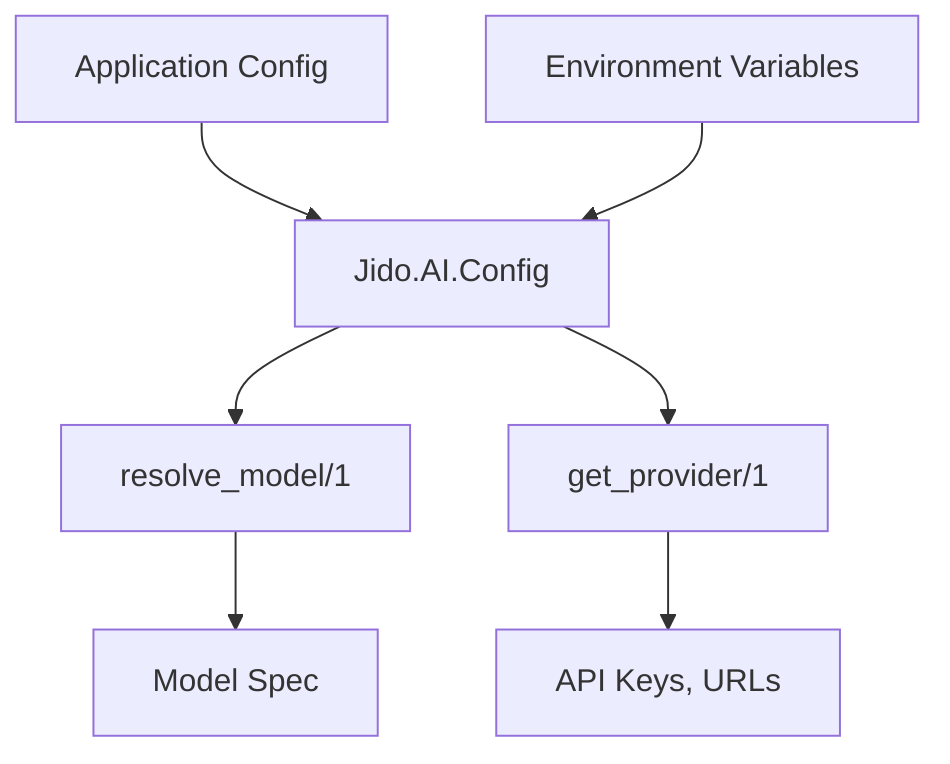
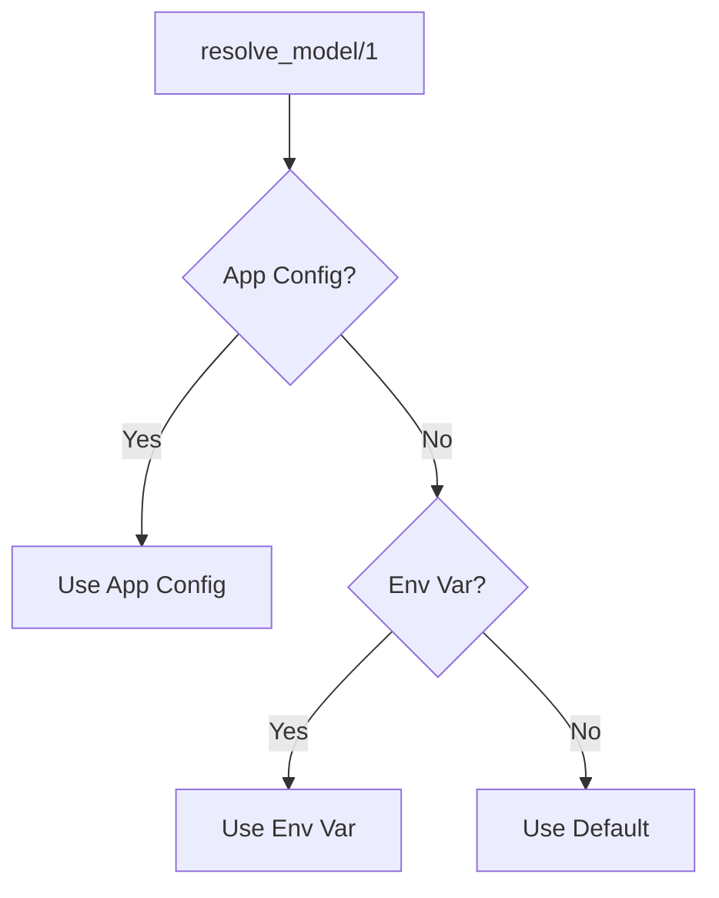

# Configuration Guide

This guide covers configuration in Jido.AI, including model aliases, provider setup, and environment variables.

## Table of Contents

- [Overview](#overview)
- [Model Aliases](#model-aliases)
- [Provider Configuration](#provider-configuration)
- [Environment Variables](#environment-variables)
- [Config Module](#config-module)
- [Resolution](#resolution)

## Overview

Jido.AI uses a configuration system based on ReqLLM for managing:

- **Model aliases**: Short names for specific models
- **Provider settings**: API keys, base URLs, timeouts
- **Environment-specific configs**: Development, test, production

### Configuration Architecture



## Model Aliases

Model aliases provide convenient shorthand for commonly used models.

### Available Aliases

| Alias | Default Model | Purpose |
|-------|---------------|---------|
| `:fast` | `anthropic:claude-haiku-4-5` | Fast, cost-effective operations |
| `:capable` | `anthropic:claude-3-5-sonnet-20241022` | Capable general-purpose model |
| `:reasoning` | `anthropic:claude-3-5-sonnet-20241022` | Complex reasoning tasks |
| `:planning` | `anthropic:claude-3-5-sonnet-20241022` | Planning and decomposition |

### Using Aliases

```elixir
# In strategies
use Jido.Agent,
  name: "my_agent",
  strategy: {
    Jido.AI.Strategies.ReAct,
    model: :fast,  # Use alias instead of full model spec
    tools: [Calculator]
  }

# In directives
directive = Directive.LLMStream.new!(%{
  id: "call_123",
  model_alias: :fast,
  context: context
})

# Programmatic resolution
{:ok, model} = Jido.AI.Config.resolve_model(:fast)
# => {:ok, "anthropic:claude-haiku-4-5"}
```

## Provider Configuration

### Supported Providers

| Provider | Prefix | Models |
|----------|--------|--------|
| **Anthropic** | `anthropic:` | Claude 3.5, Haiku, Opus |
| **OpenAI** | `openai:` | GPT-4, GPT-3.5 |
| **Google** | `google:` | Gemini Pro |
| **Mistral** | `mistral:` | Mistral Large, Mixtral |

### Configuration Structure

```elixir
# config/dev.exs
config :jido_ai, :providers,
  anthropic: [
    api_key: System.get_env("ANTHROPIC_API_KEY"),
    base_url: "https://api.anthropic.com",
    organization_id: nil
  ],
  openai: [
    api_key: System.get_env("OPENAI_API_KEY"),
    base_url: "https://api.openai.com/v1",
    organization_id: nil
  ]
```

### Provider Functions

```elixir
alias Jido.AI.Config

# Get provider configuration
{:ok, provider_config} = Config.get_provider(:anthropic)
# => {:ok, %{api_key: "...", base_url: "...", ...}}

# Get with defaults
config = Config.get_provider!(:anthropic)
```

## Environment Variables

### Required Variables

```bash
# Anthropic API Key (for Claude models)
export ANTHROPIC_API_KEY="sk-ant-..."

# OpenAI API Key (for GPT models)
export OPENAI_API_KEY="sk-..."

# Google API Key (for Gemini models)
export GOOGLE_API_KEY="..."

# Mistral API Key (for Mistral models)
export MISTRAL_API_KEY="..."
```

### Optional Variables

```bash
# Custom base URLs (for proxy/testing)
export ANTHROPIC_BASE_URL="https://api.anthropic.com"
export OPENAI_BASE_URL="https://api.openai.com/v1"

# Default model aliases (override defaults)
export JIDO_FAST_MODEL="anthropic:claude-haiku-4-5"
export JIDO_CAPABLE_MODEL="anthropic:claude-3-5-sonnet-20241022"
```

## Config Module

The `Jido.AI.Config` module provides configuration utilities.

### Model Resolution

```elixir
# Resolve model alias to full spec
Config.resolve_model(:fast)
# => {:ok, "anthropic:claude-haiku-4-5"}

# Direct model spec passes through
Config.resolve_model("anthropic:claude-3-5-sonnet-20241022")
# => {:ok, "anthropic:claude-3-5-sonnet-20241022"}

# Unknown alias falls back to default
Config.resolve_model(:unknown)
# => {:ok, "anthropic:claude-haiku-4-5"}
```

### Provider Configuration

```elixir
# Get provider config
Config.get_provider(:anthropic)
# => {:ok, %{api_key: "...", base_url: "...", organization_id: nil}}

# Bang version (raises on error)
config = Config.get_provider!(:anthropic)

# Validate provider has required fields
Config.validate_provider!(:anthropic)
# => :ok | {:error, :missing_api_key}
```

### Model Aliases Configuration

```elixir
# In your config files
config :jido_ai, :model_aliases,
  fast: "anthropic:claude-haiku-4-5",
  capable: "anthropic:claude-3-5-sonnet-20241022",
  reasoning: "anthropic:claude-3-5-sonnet-20241022",
  planning: "anthropic:claude-3-5-sonnet-20241022"
```

## Resolution

### Resolution Order

Model aliases are resolved in the following order:

1. **Application config**: `config :jido_ai, :model_aliases`
2. **Environment variables**: `JIDO_<ALIAS>_MODEL`
3. **Default values**: Built-in defaults



### In Directives

```elixir
# Directives support both model and model_alias
directive = Directive.LLMStream.new!(%{
  id: "call_123",
  model_alias: :fast,  # Resolved at execution time
  context: context
})

# Or use direct model
directive = Directive.LLMStream.new!(%{
  id: "call_123",
  model: "anthropic:claude-haiku-4-5",  # Used directly
  context: context
})
```

### In Strategies

```elixir
# Strategies accept aliases
use Jido.Agent,
  name: "my_agent",
  strategy: {
    Jido.AI.Strategies.ReAct,
    model: :fast,  # Alias
    tools: [Calculator]
  }

# Or full model specs
use Jido.Agent,
  name: "my_agent",
  strategy: {
    Jido.AI.Strategies.ReAct,
    model: "anthropic:claude-haiku-4-5",
    tools: [Calculator]
  }
```

## Full Configuration Example

```elixir
# config/config.exs
import Config

# Provider configuration
config :jido_ai, :providers,
  anthropic: [
    api_key: System.get_env("ANTHROPIC_API_KEY"),
    base_url: System.get_env("ANTHROPIC_BASE_URL", "https://api.anthropic.com")
  ],
  openai: [
    api_key: System.get_env("OPENAI_API_KEY"),
    base_url: System.get_env("OPENAI_BASE_URL", "https://api.openai.com/v1")
  ]

# Custom model aliases
config :jido_ai, :model_aliases,
  fast: System.get_env("JIDO_FAST_MODEL", "anthropic:claude-haiku-4-5"),
  capable: System.get_env("JIDO_CAPABLE_MODEL", "anthropic:claude-3-5-sonnet-20241022"),
  reasoning: "anthropic:claude-3-5-sonnet-20241022",
  planning: "anthropic:claude-3-5-sonnet-20241022",
  # Custom aliases
  embed: "openai:text-embedding-3-small"
```

## Configuration Best Practices

1. **Use aliases**: Prefer `:fast` over hardcoding model names
2. **Environment variables**: Store API keys in environment, not code
3. **Provider validation**: Validate provider config at startup
4. **Fallback models**: Always have a fallback for missing config
5. **Per-environment configs**: Different models for dev/test/prod

```elixir
# Good: Use alias
model: :fast

# Avoid: Hardcode model
model: "anthropic:claude-haiku-4-5-20250119"
```

## Testing Configuration

For tests, you can mock configurations:

```elixir
# config/test.exs
config :jido_ai, :model_aliases,
  fast: "mock:model",
  capable: "mock:model"

# Or use environment variables in test helper
System.put_env("ANTHROPIC_API_KEY", "test-key")
```

## Next Steps

- [Strategies Guide](./02_strategies.md) - Using model configuration in strategies
- [Directives Guide](./04_directives.md) - Model resolution in directives
