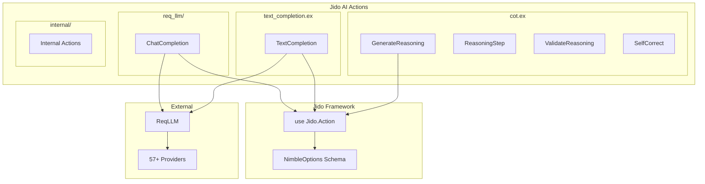
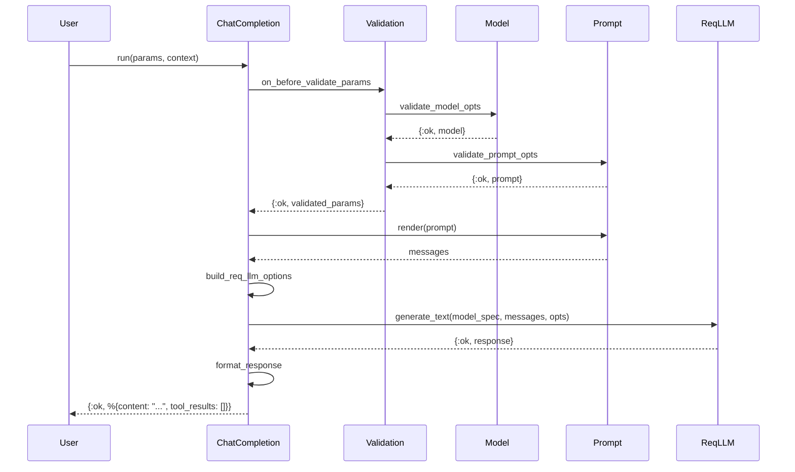
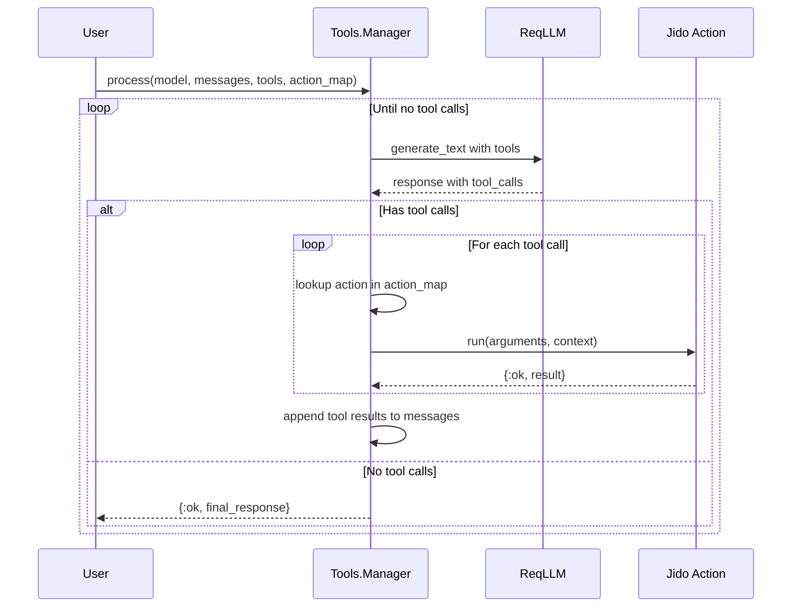

# Actions System

Actions are the primary interface for LLM operations in Jido AI. They use the Jido Action pattern for consistent parameter validation, error handling, and composability.

## Architecture



## Core Action Pattern

All actions use the `Jido.Action` behaviour:

```elixir
defmodule MyAction do
  use Jido.Action,
    name: "my_action",
    description: "Description of what this action does",
    schema: [
      # NimbleOptions schema for parameters
      input: [type: :string, required: true, doc: "Input text"],
      option: [type: :integer, default: 100, doc: "An option"]
    ]

  @impl true
  def run(params, context) do
    # Execute the action
    {:ok, result}
  end
end
```

## ChatCompletion Action

Location: `lib/jido_ai/actions/req_llm/chat_completion.ex`

The primary action for chat completion across all providers.

### Schema Definition

```elixir
use Jido.Action,
  name: "reqllm_chat_completion",
  description: "Chat completion action using ReqLLM",
  schema: [
    model: [
      type: {:custom, Jido.AI.Model, :validate_model_opts, []},
      required: true,
      doc: "The AI model to use"
    ],
    prompt: [
      type: {:custom, Jido.AI.Prompt, :validate_prompt_opts, []},
      required: true,
      doc: "The prompt to use for the response"
    ],
    tools: [
      type: {:list, :atom},
      required: false,
      doc: "List of Jido.Action modules for function calling"
    ],
    max_retries: [type: :integer, default: 0],
    temperature: [type: :float, default: 0.7],
    max_tokens: [type: :integer, default: 1000],
    top_p: [type: :float],
    stop: [type: {:list, :string}],
    timeout: [type: :integer, default: 60_000],
    stream: [type: :boolean, default: false],
    frequency_penalty: [type: :float],
    presence_penalty: [type: :float],
    json_mode: [type: :boolean, default: false],
    verbose: [type: :boolean, default: false]
  ]
```

### Usage Examples

```elixir
alias Jido.AI.Actions.ReqLlm.ChatCompletion
alias Jido.AI.{Model, Prompt}

# Basic usage
{:ok, model} = Model.from({:anthropic, [model: "claude-3-5-sonnet"]})
prompt = Prompt.new(:user, "What is the capital of France?")

{:ok, result} = ChatCompletion.run(%{model: model, prompt: prompt}, %{})
# => {:ok, %{content: "The capital of France is Paris.", tool_results: []}}

# With options
{:ok, result} = ChatCompletion.run(%{
  model: model,
  prompt: prompt,
  temperature: 0.2,
  max_tokens: 500
}, %{})

# With streaming
{:ok, stream} = ChatCompletion.run(%{
  model: model,
  prompt: prompt,
  stream: true
}, %{})

Enum.each(stream, fn chunk ->
  IO.write(chunk.content)
end)
```

### Multimodal Support (Images)

The ChatCompletion action supports multimodal inputs, allowing you to send images alongside text. You can provide images either as Base64-encoded Data URLs or as remote HTTP/HTTPS URLs.

```elixir
alias Jido.AI.Prompt.MessageItem

# Method 1: Base64 Encoded Image (Recommended for local files)
# Read image file
image_binary = File.read!("path/to/image.png")
base64_data = Base.encode64(image_binary)
# Create Data URL (supports image/png, image/jpeg, image/webp, image/gif)
image_data_url = "data:image/png;base64,#{base64_data}"

# Create multimodal message
message = MessageItem.new_multipart(:user, [
  MessageItem.text_part("Describe this image"),
  MessageItem.image_part(image_data_url)
])

# Create prompt with the message
prompt = Jido.AI.Prompt.new(%{messages: [message]})

# Run action
{:ok, result} = ChatCompletion.run(%{
  model: model, # Ensure model supports vision (e.g., gpt-4o, claude-3-5-sonnet)
  prompt: prompt
}, %{})

# Method 2: Remote Image URL
message = MessageItem.new_multipart(:user, [
  MessageItem.text_part("Describe this image"),
  MessageItem.image_part("https://example.com/image.png")
])

prompt = Jido.AI.Prompt.new(%{messages: [message]})
{:ok, result} = ChatCompletion.run(%{model: model, prompt: prompt}, %{})
```

### Implementation Flow



## TextCompletion Action

Location: `lib/jido_ai/actions/text_completion.ex`

A simpler action for basic text completion.

```elixir
use Jido.Action,
  name: "text_completion",
  description: "Generate text completion using ReqLLM",
  schema: [
    model: [type: {:custom, Jido.AI.Model, :validate_model_opts, []}, required: true],
    prompt: [type: {:custom, Jido.AI.Prompt, :validate_prompt_opts, []}, required: true],
    temperature: [type: :float, default: 0.7],
    max_tokens: [type: :integer, default: 1024]
  ]
```

### Usage

```elixir
alias Jido.AI.Actions.TextCompletion

{:ok, result, _directives} = TextCompletion.run(%{
  model: model,
  prompt: Prompt.new(:user, "Complete this: The quick brown fox")
}, %{})
```

## Chain-of-Thought Actions

Location: `lib/jido_ai/actions/cot.ex`

Specialized actions for CoT reasoning patterns.

### GenerateReasoning

Generates step-by-step reasoning for a problem:

```elixir
defmodule Jido.AI.Actions.CoT.GenerateReasoning do
  use Jido.Action,
    name: "generate_reasoning",
    schema: [
      model: [type: {:custom, Jido.AI.Model, :validate_model_opts, []}, required: true],
      problem: [type: :string, required: true],
      context: [type: :map, default: %{}],
      mode: [type: {:in, [:zero_shot, :few_shot, :structured]}, default: :zero_shot]
    ]
end
```

### ReasoningStep

Executes a single reasoning step:

```elixir
defmodule Jido.AI.Actions.CoT.ReasoningStep do
  use Jido.Action,
    name: "reasoning_step",
    schema: [
      model: [type: {:custom, Jido.AI.Model, :validate_model_opts, []}, required: true],
      step_description: [type: :string, required: true],
      previous_steps: [type: {:list, :map}, default: []],
      context: [type: :map, default: %{}]
    ]
end
```

### ValidateReasoning

Validates reasoning against expected outcomes:

```elixir
defmodule Jido.AI.Actions.CoT.ValidateReasoning do
  use Jido.Action,
    name: "validate_reasoning",
    schema: [
      reasoning: [type: :string, required: true],
      expected_outcome: [type: :string],
      criteria: [type: {:list, :string}, default: []]
    ]
end
```

### SelfCorrect

Self-correction for reasoning errors:

```elixir
defmodule Jido.AI.Actions.CoT.SelfCorrect do
  use Jido.Action,
    name: "self_correct",
    schema: [
      model: [type: {:custom, Jido.AI.Model, :validate_model_opts, []}, required: true],
      original_reasoning: [type: :string, required: true],
      feedback: [type: :string, required: true],
      max_iterations: [type: :integer, default: 3]
    ]
end
```

## Tool System Integration

### Schema Converter

Location: `lib/jido_ai/tools/schema_converter.ex`

Converts Jido Actions to JSON Schema for LLM function calling:

```elixir
alias Jido.AI.Tools.SchemaConverter

# Single action conversion
tool = SchemaConverter.action_to_tool(MyAction)
# => %{
#      name: "my_action",
#      description: "...",
#      parameters: %{type: "object", properties: %{...}}
#    }

# Build action lookup map
action_map = SchemaConverter.build_action_map([Action1, Action2])
# => %{"action1" => Action1, "action2" => Action2}
```

### Tool Manager

Location: `lib/jido_ai/tools/manager.ex`

Handles the function calling loop:

```elixir
alias Jido.AI.Tools.Manager

# Non-streaming tool loop
{:ok, final_response} = Manager.process(model, messages, tools, action_map)

# Streaming tool loop
{:ok, stream} = Manager.process_stream(model, messages, tools, action_map)
```

### Tool Loop Flow



## Custom Actions

### Creating a Custom Action

```elixir
defmodule MyApp.Actions.Summarize do
  use Jido.Action,
    name: "summarize",
    description: "Summarize text content",
    schema: [
      content: [type: :string, required: true, doc: "Content to summarize"],
      max_length: [type: :integer, default: 200, doc: "Maximum summary length"],
      style: [type: {:in, [:brief, :detailed]}, default: :brief]
    ]

  alias Jido.AI.Actions.ReqLlm.ChatCompletion
  alias Jido.AI.{Model, Prompt}

  @impl true
  def run(params, context) do
    {:ok, model} = Model.from({:openai, [model: "gpt-4o"]})

    prompt = Prompt.new(%{
      messages: [
        %{role: :system, content: build_system_prompt(params.style, params.max_length)},
        %{role: :user, content: params.content}
      ]
    })

    case ChatCompletion.run(%{model: model, prompt: prompt}, context) do
      {:ok, %{content: summary}} ->
        {:ok, %{summary: summary, original_length: String.length(params.content)}}

      {:error, reason} ->
        {:error, reason}
    end
  end

  defp build_system_prompt(:brief, max_length) do
    "Summarize the following in #{max_length} characters or less. Be concise."
  end

  defp build_system_prompt(:detailed, max_length) do
    "Provide a detailed summary in #{max_length} characters. Include key points."
  end
end
```

### Using Custom Actions

```elixir
{:ok, result} = MyApp.Actions.Summarize.run(%{
  content: "Long text to summarize...",
  max_length: 150,
  style: :brief
}, %{})

# => {:ok, %{summary: "Brief summary...", original_length: 500}}
```

## Lifecycle Hooks

Actions can implement lifecycle hooks:

```elixir
defmodule MyAction do
  use Jido.Action, name: "my_action", schema: [...]

  # Called before parameter validation
  @impl true
  def on_before_validate_params(params) do
    # Transform or validate params before NimbleOptions
    {:ok, params}
  end

  # Main execution
  @impl true
  def run(params, context) do
    {:ok, result}
  end
end
```

## Error Handling

Actions return standard Elixir result tuples:

```elixir
# Success
{:ok, result}
{:ok, result, directives}

# Failure
{:error, reason}
```

Example error handling:

```elixir
case ChatCompletion.run(params, context) do
  {:ok, %{content: content, tool_results: tools}} ->
    process_response(content, tools)

  {:error, %{status: 429}} ->
    # Rate limited
    :timer.sleep(1000)
    retry(params, context)

  {:error, reason} ->
    Logger.error("Chat completion failed: #{inspect(reason)}")
    {:error, reason}
end
```

## Best Practices

1. **Use validation hooks** for complex parameter transformation:

```elixir
def on_before_validate_params(params) do
  # Normalize model input
  case params[:model] do
    s when is_binary(s) ->
      {:ok, %{params | model: {:openai, [model: s]}}}
    _ ->
      {:ok, params}
  end
end
```

2. **Compose actions** for complex workflows:

```elixir
def run(params, context) do
  with {:ok, summary} <- Summarize.run(%{content: params.input}, context),
       {:ok, analysis} <- Analyze.run(%{text: summary}, context) do
    {:ok, %{summary: summary, analysis: analysis}}
  end
end
```

3. **Pass context through** for shared state:

```elixir
def run(params, context) do
  # Context can carry shared data like conversation history
  history = Map.get(context, :conversation_history, [])
  # ...
end
```

4. **Handle streaming appropriately**:

```elixir
case ChatCompletion.run(%{..., stream: true}, context) do
  {:ok, stream} ->
    # Process stream chunks
    Enum.reduce(stream, "", fn chunk, acc ->
      acc <> (chunk.content || "")
    end)

  {:error, reason} ->
    {:error, reason}
end
```
