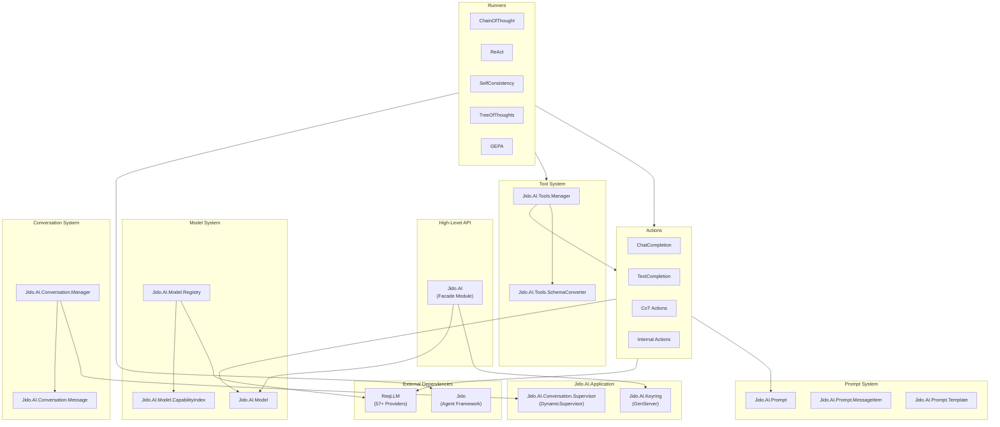

# Architecture Overview

Jido AI is an Elixir library that provides a structured approach to integrating Large Language Models (LLMs) into applications. It builds on the Jido agent framework and leverages ReqLLM for multi-provider LLM access.

## System Architecture



## Directory Structure

```
lib/jido_ai/
├── jido_ai.ex                 # Main facade module
├── application.ex             # OTP Application
├── keyring.ex                 # Configuration management (GenServer)
├── model.ex                   # Model struct and validation
├── prompt.ex                  # Prompt struct and rendering
├── actions/                   # Jido Actions for LLM operations
│   ├── req_llm/               # ReqLLM-based actions
│   │   └── chat_completion.ex # Chat completion action
│   ├── cot.ex                 # Chain-of-Thought actions
│   ├── text_completion.ex     # Simple text completion
│   └── internal/              # Internal helper actions
├── runner/                    # Advanced reasoning runners
│   ├── chain_of_thought/      # CoT runner and submodules
│   ├── react/                 # ReAct runner
│   ├── self_consistency/      # Self-Consistency runner
│   ├── tree_of_thoughts/      # Tree-of-Thoughts runner
│   ├── gepa/                  # GEPA evolutionary optimizer
│   └── program_of_thought/    # Program of Thought runner
├── conversation/              # Conversation management
│   ├── manager.ex             # ETS-backed conversation storage
│   ├── message.ex             # Message struct
│   └── supervisor.ex          # DynamicSupervisor
├── tools/                     # Tool/function calling
│   ├── manager.ex             # Tool execution loop
│   └── schema_converter.ex    # Action to JSON Schema
├── model/                     # Model registry and discovery
│   ├── registry.ex            # Unified model registry
│   ├── capability_index.ex    # Capability-based indexing
│   └── registry/              # Registry submodules
├── prompt/                    # Prompt system components
│   ├── message_item.ex        # Message struct
│   └── template.ex            # Template handling
├── context_window/            # Context window management
│   ├── context_window.ex      # Token counting & truncation
│   └── strategy.ex            # Truncation strategies
└── providers/                 # Provider configurations
```

## Core Components

### 1. Application Supervision Tree

The application starts two supervised processes:

```elixir
# lib/jido_ai/application.ex
def start(_type, _args) do
  children = [
    Jido.AI.Keyring,              # Configuration GenServer
    Jido.AI.Conversation.Supervisor  # DynamicSupervisor for conversations
  ]
  opts = [strategy: :one_for_one, name: Jido.AI.Supervisor]
  Supervisor.start_link(children, opts)
end
```

### 2. Keyring (Configuration Management)

The `Jido.AI.Keyring` GenServer manages configuration with hierarchical priority:

1. Session values (per-process overrides)
2. ReqLLM key resolution
3. Environment variables (via Dotenvy)
4. Application environment
5. Default values

```elixir
# Get API key
Jido.AI.api_key(:openai)

# Set session-specific override
Jido.AI.set_session_value(:temperature, 0.9)
```

### 3. Model System

Models are created via `Jido.AI.Model.from/1` which converts various input formats to `ReqLLM.Model` structs:

```elixir
# From tuple
{:ok, model} = Jido.AI.Model.from({:anthropic, [model: "claude-3-5-sonnet"]})

# From string
{:ok, model} = Jido.AI.Model.from("openai:gpt-4o")
```

The Model Registry integrates with ReqLLM's catalog of 2000+ models across 57+ providers.

### 4. Prompt System

Prompts are structured containers for messages with template support:

```elixir
prompt = Jido.AI.Prompt.new(%{
  messages: [
    %{role: :system, content: "You are a {{ role }}", engine: :liquid},
    %{role: :user, content: "Hello <%= @name %>", engine: :eex}
  ],
  params: %{role: "helpful assistant", name: "Alice"}
})

messages = Jido.AI.Prompt.render(prompt)
```

### 5. Actions

Actions are the primary interface for LLM operations, built using the Jido Action pattern:

```elixir
defmodule Jido.AI.Actions.ReqLlm.ChatCompletion do
  use Jido.Action,
    name: "reqllm_chat_completion",
    schema: [
      model: [type: {:custom, Jido.AI.Model, :validate_model_opts, []}, required: true],
      prompt: [type: {:custom, Jido.AI.Prompt, :validate_prompt_opts, []}, required: true],
      tools: [type: {:list, :atom}, required: false],
      # ... more options
    ]

  def run(params, _context) do
    # Execute LLM call via ReqLLM
  end
end
```

### 6. Runners

Runners implement advanced reasoning strategies by orchestrating multiple LLM calls:

| Runner | Strategy | Use Case |
|--------|----------|----------|
| ChainOfThought | Step-by-step reasoning | Complex problem solving |
| ReAct | Reason + Act cycles | Tool-using agents |
| SelfConsistency | Multiple paths + voting | High-reliability answers |
| TreeOfThoughts | Tree search exploration | Planning and puzzles |
| GEPA | Evolutionary optimization | Prompt optimization |

### 7. Tool System

The Tool Manager handles function calling loops:

```elixir
# Convert Jido Actions to tool schemas
tools = Jido.AI.Tools.SchemaConverter.actions_to_tools([MyAction1, MyAction2])

# Execute tool calling loop
{:ok, final_response} = Jido.AI.Tools.Manager.process(
  model, messages, tools, action_map
)
```

### 8. Conversation Management

Conversations are ETS-backed stateful containers:

```elixir
{:ok, conv_id} = Jido.AI.Conversation.Manager.create(model, system_prompt: "...")
:ok = Manager.add_message(conv_id, :user, "Hello")
{:ok, messages} = Manager.get_messages_for_llm(conv_id)
```

## Integration with Jido Framework

Jido AI extends the Jido agent framework:

- **Actions** use `use Jido.Action` for consistent parameter validation
- **Runners** implement `@behaviour Jido.Runner` for agent integration
- **Tool calling** converts Jido Actions to LLM function call schemas

```elixir
defmodule MyAgent do
  use Jido.Agent,
    name: "my_agent",
    runner: Jido.AI.Runner.ChainOfThought,
    actions: [MyAction1, MyAction2]
end
```

## External Dependencies

### ReqLLM

ReqLLM provides the HTTP layer for LLM provider communication:

- 57+ provider support (OpenAI, Anthropic, Google, etc.)
- Unified API across providers
- Automatic authentication via environment variables
- Streaming support

### Jido

The core agent framework provides:

- Action definition and validation
- Runner behavior and execution
- Agent state management
- Instruction queuing

## Data Flow Summary

1. **User Input** → Prompt creation with templates
2. **Model Selection** → Via Registry or direct specification
3. **Action Execution** → ChatCompletion or specialized actions
4. **ReqLLM Call** → Provider-specific HTTP request
5. **Response Processing** → Tool calls, streaming, or direct content
6. **Runner Orchestration** → Multiple cycles for advanced reasoning
7. **Conversation Storage** → Optional ETS persistence

See the [Data Flow Guide](data-flow.md) for detailed flow diagrams.
