# Data Flow

This guide explains how data flows through the Jido AI system, from user input to LLM response and back.

## High-Level Data Flow

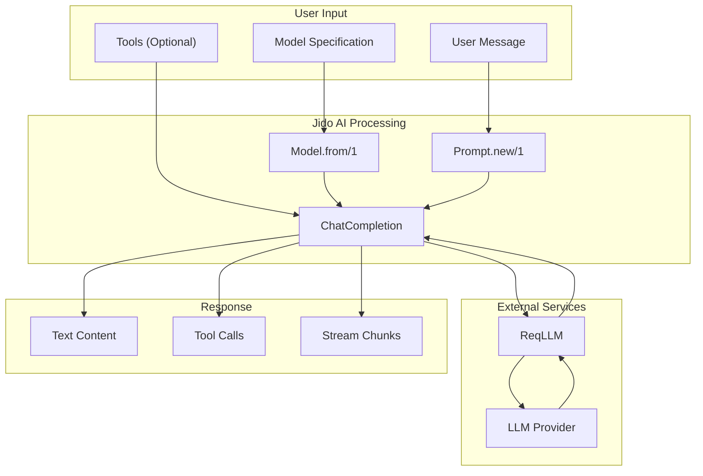

## Basic Chat Completion Flow

### 1. Model Creation

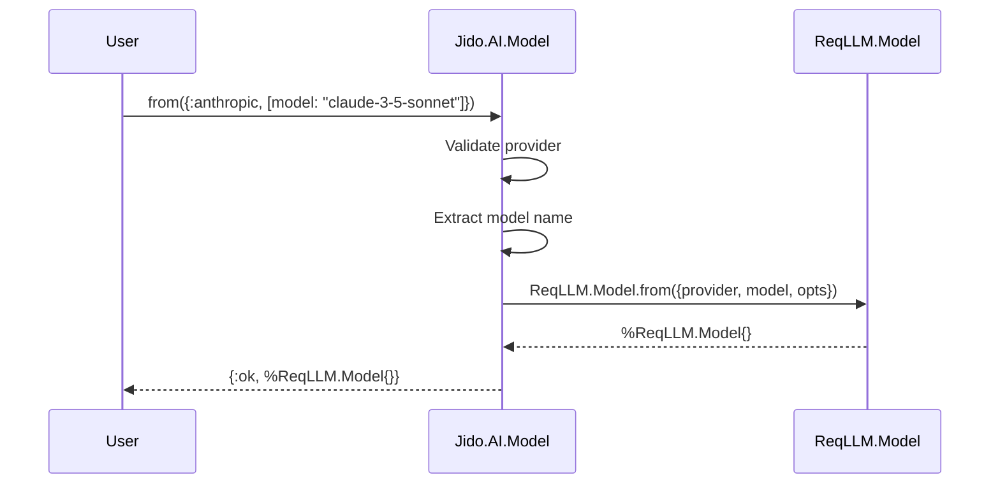

**Data transformations:**
- Input: `{:anthropic, [model: "claude-3-5-sonnet"]}`
- Internal: Provider atom + options keyword list
- Output: `%ReqLLM.Model{provider: :anthropic, model: "claude-3-5-sonnet", ...}`

### 2. Prompt Creation and Rendering

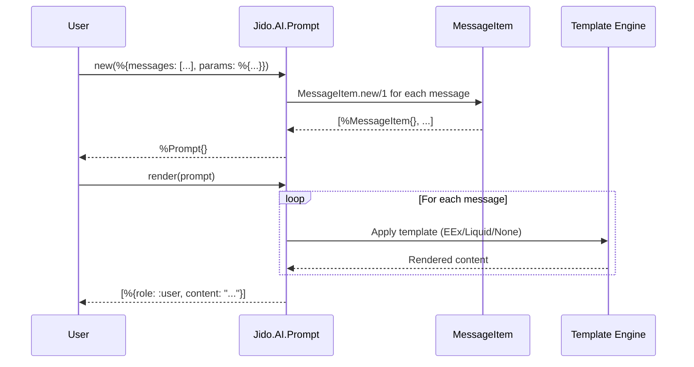

**Data transformations:**
- Input: `%{messages: [%{role: :user, content: "Hello <%= @name %>", engine: :eex}], params: %{name: "Alice"}}`
- Internal: `[%MessageItem{role: :user, content: "Hello <%= @name %>", engine: :eex}]`
- Rendered: `[%{role: :user, content: "Hello Alice"}]`

### 3. Action Execution

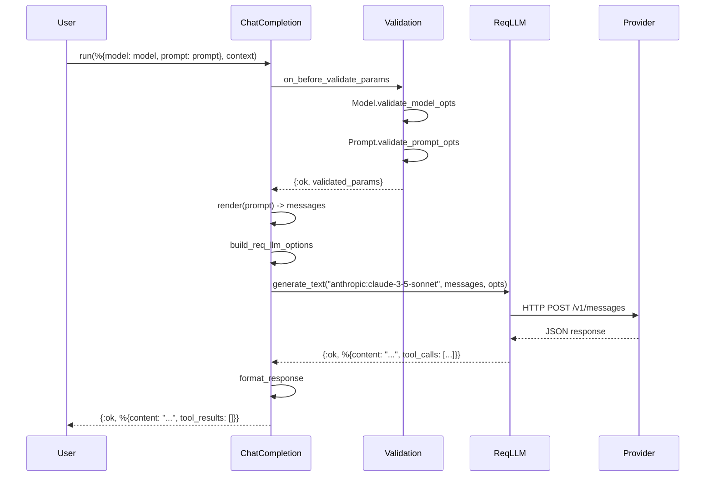

## Tool Calling Flow

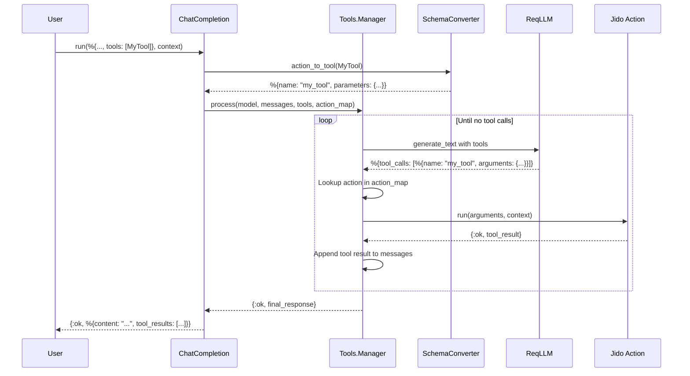

**Tool schema transformation:**
```elixir
# Jido Action schema
schema: [
  city: [type: :string, required: true, doc: "City name"],
  unit: [type: {:in, ["celsius", "fahrenheit"]}, default: "celsius"]
]

# Converted to JSON Schema
%{
  type: "function",
  function: %{
    name: "get_weather",
    description: "Get weather for a city",
    parameters: %{
      type: "object",
      properties: %{
        "city" => %{type: "string", description: "City name"},
        "unit" => %{type: "string", enum: ["celsius", "fahrenheit"]}
      },
      required: ["city"]
    }
  }
}
```

## Streaming Flow

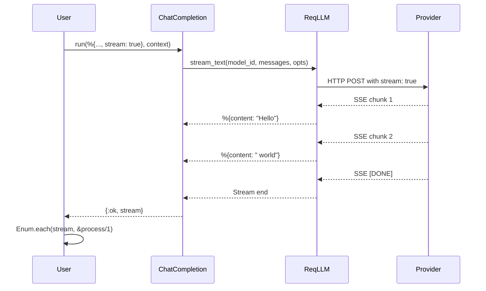

## Runner Flow (Chain-of-Thought)

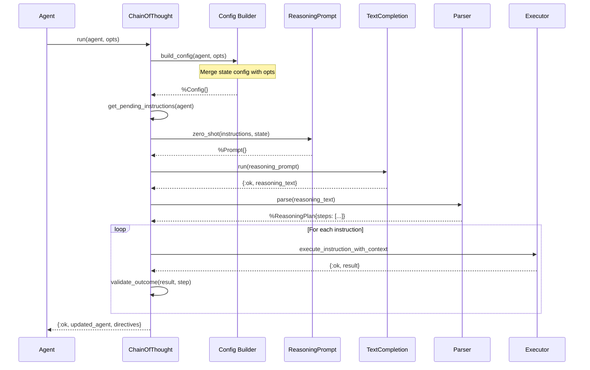

## Conversation Flow

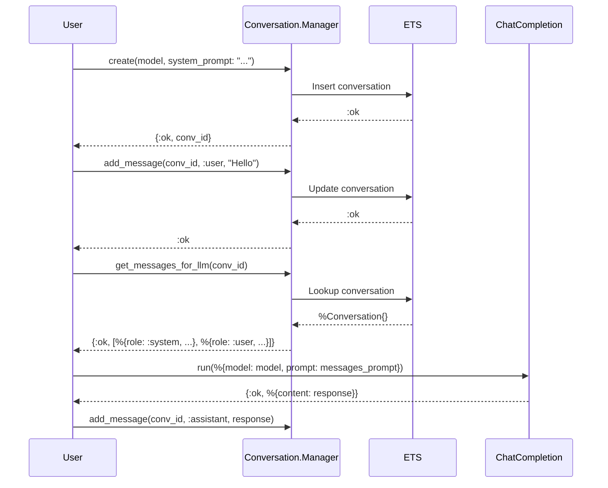

## Configuration Flow

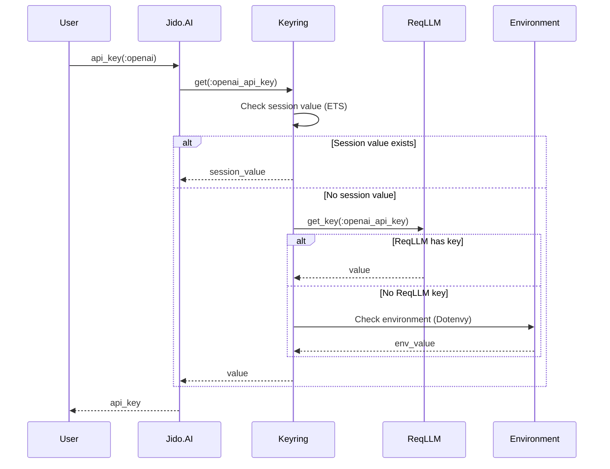

**Configuration priority:**
1. Session values (per-process overrides)
2. ReqLLM key resolution
3. Environment variables (via Dotenvy)
4. Application environment
5. Default values

## Context Window Management

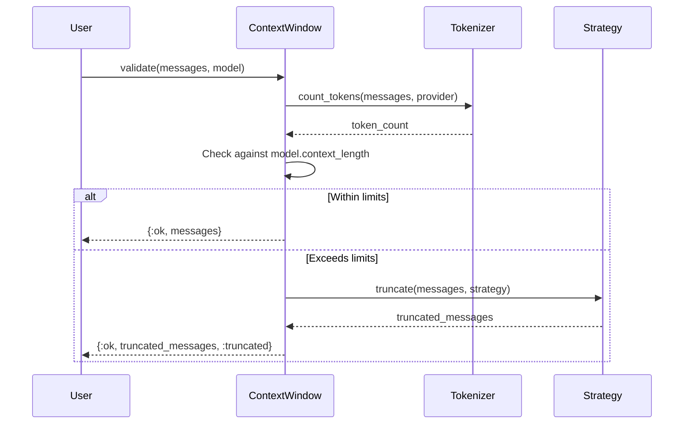

**Truncation strategies:**
- `:keep_recent` - Keep most recent messages
- `:keep_bookends` - Keep first and last messages
- `:sliding_window` - Fixed window size
- `:smart_truncate` - Intelligent content reduction

## Complete Request Lifecycle

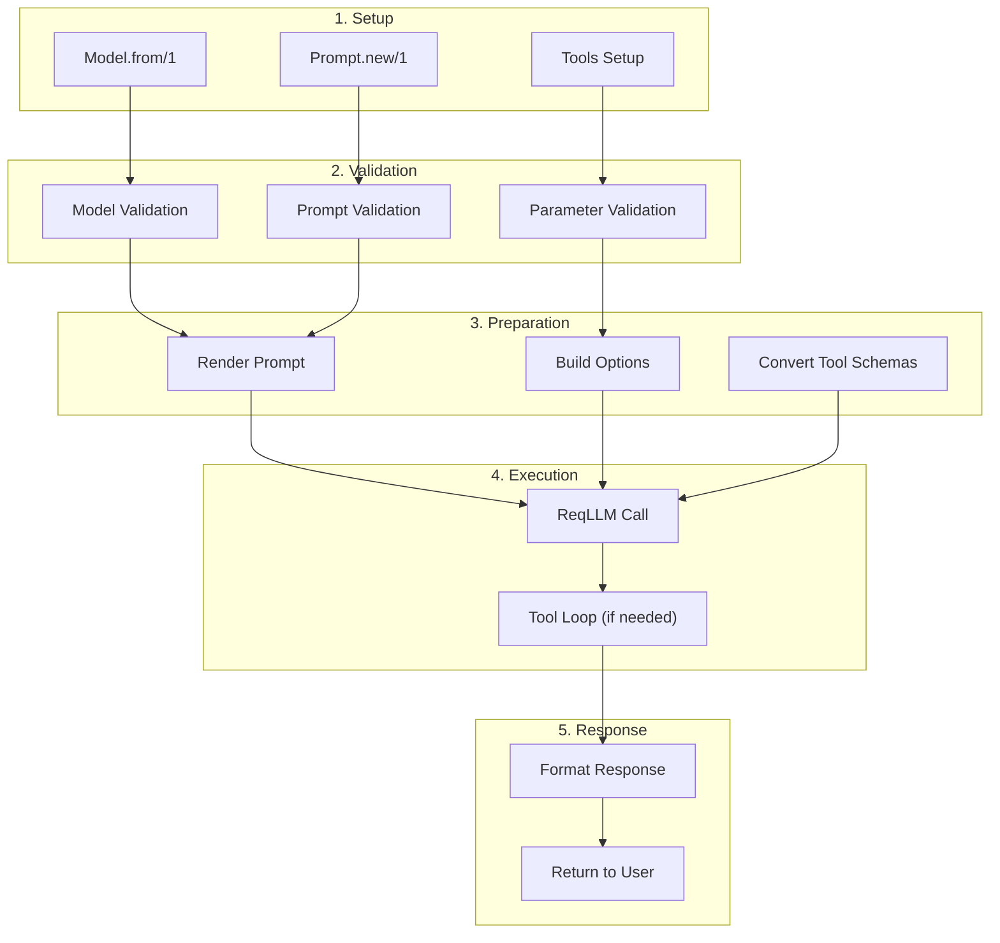

## Data Structures Summary

### Input → Internal → Output

| Stage | Data Structure |
|-------|----------------|
| Model Input | `{:provider, [model: "name"]}` or `"provider:model"` |
| Model Internal | `%ReqLLM.Model{}` |
| Prompt Input | `%{messages: [...], params: %{}}` |
| Prompt Internal | `%Jido.AI.Prompt{messages: [%MessageItem{}]}` |
| Messages Rendered | `[%{role: :user, content: "..."}]` |
| Action Params | `%{model: model, prompt: prompt, ...}` |
| ReqLLM Request | HTTP POST with JSON body |
| ReqLLM Response | `%{content: "...", tool_calls: [...]}` |
| Action Result | `{:ok, %{content: "...", tool_results: [...]}}` |

### Tool Data Flow

| Stage | Data Structure |
|-------|----------------|
| Jido Action | Module with `use Jido.Action` |
| Tool Schema | JSON Schema object |
| Tool Call | `%{name: "tool", arguments: %{...}}` |
| Tool Result | `{:ok, result}` from action |
| Tool Message | `%{role: :tool, content: result, tool_call_id: "..."}` |
