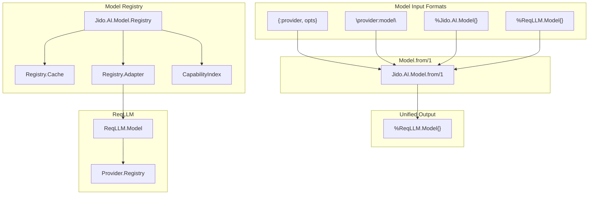
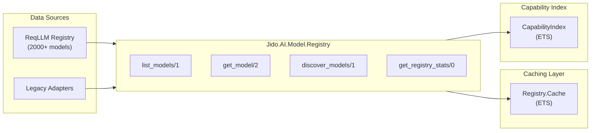
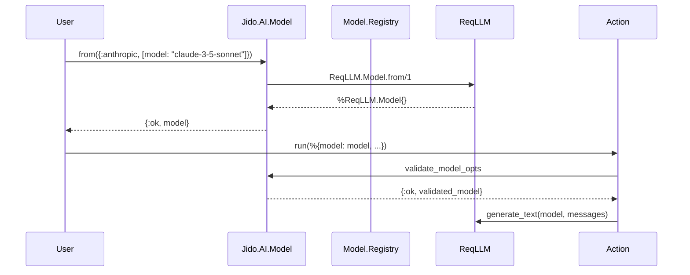

# Model System

The model system provides a unified interface for creating, validating, and discovering LLM models across 57+ providers through ReqLLM integration.

## Architecture



## Core Module: Jido.AI.Model

Location: `lib/jido_ai/model.ex`

### Struct Definition

```elixir
typedstruct do
  field(:id, String.t())
  field(:name, String.t())
  field(:provider, atom())
  field(:architecture, Architecture.t())
  field(:created, integer())
  field(:description, String.t())
  field(:endpoints, list(Endpoint.t()))

  # LLM call parameters
  field(:base_url, String.t())
  field(:api_key, String.t())
  field(:model, String.t())
  field(:temperature, float(), default: 0.7)
  field(:max_tokens, non_neg_integer(), default: 1024)
  field(:max_retries, non_neg_integer(), default: 0)

  # ReqLLM integration
  field(:reqllm_id, String.t())
  field(:capabilities, map())
  field(:modalities, map())
  field(:cost, map())
end
```

### Model Creation

The primary entry point is `Jido.AI.Model.from/1`:

```elixir
@spec from(term()) :: {:ok, ReqLLM.Model.t()} | {:error, String.t()}
def from(input) do
  case input do
    # Already a ReqLLM.Model struct
    %ReqLLM.Model{} = model ->
      {:ok, model}

    # Already a Jido.AI.Model struct - convert to ReqLLM.Model
    %__MODULE__{provider: provider, model: model_name} ->
      ReqLLM.Model.from("#{provider}:#{model_name}")

    # A provider tuple
    {provider, opts} when is_atom(provider) and is_list(opts) ->
      model_name = Keyword.get(opts, :model)
      if model_name do
        ReqLLM.Model.from({provider, model_name, opts})
      else
        {:error, "model option is required for provider #{provider}"}
      end

    # A string specification like "openai:gpt-4"
    model_spec when is_binary(model_spec) ->
      ReqLLM.Model.from(model_spec)

    other ->
      {:error, "Invalid model specification: #{inspect(other)}"}
  end
end
```

### Usage Examples

```elixir
# From provider tuple (most common)
{:ok, model} = Jido.AI.Model.from({:anthropic, [model: "claude-3-5-sonnet"]})

# From string specification
{:ok, model} = Jido.AI.Model.from("openai:gpt-4o")

# Pass-through for ReqLLM.Model
{:ok, model} = Jido.AI.Model.from(existing_reqllm_model)
```

## Model Registry

Location: `lib/jido_ai/model/registry.ex`

The registry provides model discovery and filtering across all providers.

### Registry Architecture



### Core Functions

#### list_models/1

Lists all available models, optionally filtered by provider:

```elixir
# All models across all providers
{:ok, models} = Jido.AI.Model.Registry.list_models()

# Models from specific provider
{:ok, anthropic_models} = Jido.AI.Model.Registry.list_models(:anthropic)
```

#### get_model/2

Gets detailed information for a specific model:

```elixir
{:ok, model} = Jido.AI.Model.Registry.get_model(:anthropic, "claude-3-5-sonnet")

# Access capabilities
model.capabilities.tool_call  # => true
model.pricing.prompt          # => "$3.00 / 1M tokens"
```

#### discover_models/1

Advanced filtering by capabilities, cost, and performance:

```elixir
# Find models with tool calling and large context
{:ok, models} = Jido.AI.Model.Registry.discover_models([
  capability: :tool_call,
  min_context_length: 128_000
])

# Find cost-effective text models
{:ok, models} = Jido.AI.Model.Registry.discover_models([
  modality: :text,
  max_cost_per_token: 0.0005,
  tier: :standard
])
```

### Supported Filters

| Filter | Type | Description |
|--------|------|-------------|
| `:capability` | atom | Required capability (`:tool_call`, `:reasoning`, etc.) |
| `:max_cost_per_token` | float | Maximum cost per token in USD |
| `:min_context_length` | integer | Minimum context window size |
| `:modality` | atom | Required modality (`:text`, `:image`, `:audio`) |
| `:tier` | atom | Performance tier (`:premium`, `:standard`, `:economy`) |
| `:provider` | atom | Filter by specific provider |

## Capability Index

Location: `lib/jido_ai/model/capability_index.ex`

The capability index provides O(1) lookup for capability-based filtering.

### Building the Index

```elixir
# Index is built automatically on first discover_models call
{:ok, models} = Jido.AI.Model.Registry.list_models()
Jido.AI.Model.CapabilityIndex.build(models)

# Query by capability
{:ok, model_ids} = Jido.AI.Model.CapabilityIndex.lookup_by_capability(:tool_call, true)
```

### Index Structure

The index stores model IDs grouped by capability in ETS for fast lookup:

```
{:tool_call, true} => ["anthropic:claude-3-5-sonnet", "openai:gpt-4o", ...]
{:reasoning, true} => ["anthropic:claude-3-opus", ...]
```

## Registry Cache

Location: `lib/jido_ai/model/registry/cache.ex`

The cache layer prevents repeated expensive calls to the ReqLLM registry.

### Cache Behavior

- **Production**: Models are cached per-provider in ETS
- **Test mode**: Caching disabled to prevent memory issues (tests call `list_models` many times)

```elixir
# Cache operations
Cache.get(:anthropic)          # Get cached models
Cache.put(:anthropic, models)  # Store models in cache
```

## Batch Operations

For fetching models from multiple providers concurrently:

```elixir
{:ok, results} = Jido.AI.Model.Registry.batch_get_models(
  [:openai, :anthropic, :google],
  max_concurrency: 5,
  timeout: 30_000
)

# Results is a list of {provider_id, {:ok, models} | {:error, reason}}
```

## Model Validation in Actions

Models are validated using NimbleOptions custom validators:

```elixir
# In action schema
schema: [
  model: [
    type: {:custom, Jido.AI.Model, :validate_model_opts, []},
    required: true,
    doc: "The AI model to use"
  ]
]
```

The `validate_model_opts/1` function delegates to `from/1`:

```elixir
def validate_model_opts(opts) do
  case from(opts) do
    {:ok, model} -> {:ok, model}
    {:error, reason} -> {:error, reason}
  end
end
```

## Provider Support

The model system supports all ReqLLM providers:

| Provider | Example Models |
|----------|----------------|
| `:anthropic` | claude-3-5-sonnet, claude-3-opus |
| `:openai` | gpt-4o, gpt-4-turbo |
| `:google` | gemini-1.5-pro, gemini-1.5-flash |
| `:mistral` | mistral-large, mixtral-8x7b |
| `:cohere` | command-r, command-r-plus |
| `:groq` | llama-3.1-70b, mixtral-8x7b |
| ... | 50+ more providers |

## Data Flow



## Best Practices

1. **Use tuple format** for most cases: `{:provider, [model: "name"]}`
2. **Cache expensive lookups**: Store discovered models when doing repeated filtering
3. **Filter early**: Use `discover_models/1` to narrow down before iteration
4. **Check capabilities**: Verify model supports needed features before use

```elixir
# Good: Filter first, then use
{:ok, models} = Registry.discover_models(capability: :tool_call)
model = Enum.find(models, &(&1.provider == :anthropic))

# Avoid: Listing all models repeatedly
models = Registry.list_models()  # 2000+ models
filtered = Enum.filter(models, &...)  # Expensive
```
