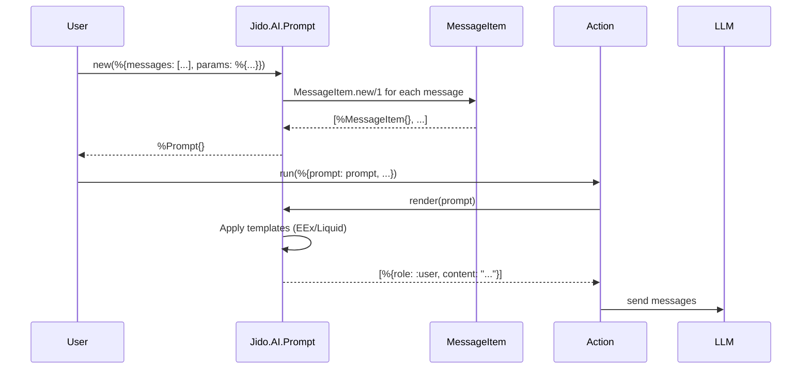

# Prompt System

The prompt system provides structured prompt management with template support, versioning, and LLM option configuration.

## Architecture

```mermaid
graph TB
    subgraph Input["Input"]
        Raw["Raw String"]
        Map["Map with Messages"]
        Existing["%Jido.AI.Prompt{}"]
    end

    subgraph Prompt["Jido.AI.Prompt"]
        New["new/1, new/3"]
        Messages["messages: [MessageItem]"]
        Params["params: map()"]
        Options["options: keyword()"]
        Schema["output_schema: NimbleOptions"]
        Version["version, history"]
    end

    subgraph MessageItem["MessageItem"]
        Role["role: atom"]
        Content["content: string"]
        Engine["engine: :none | :eex | :liquid"]
    end

    subgraph Rendering["Rendering"]
        Render["render/2"]
        RenderOpts["render_with_options/2"]
        ToText["to_text/2"]
    end

    subgraph Output["Output"]
        MsgList["[%{role: :user, content: \"...\"}]"]
    end

    Raw --> New
    Map --> New
    Existing --> Render

    New --> Prompt
    Prompt --> Messages
    Messages --> MessageItem

    Prompt --> Render
    Prompt --> RenderOpts
    Prompt --> ToText

    Render --> Output
```

## Core Module: Jido.AI.Prompt

Location: `lib/jido_ai/prompt.ex`

### Struct Definition

```elixir
typedstruct do
  # Unique identifier for the prompt
  field(:id, String.t(), default: Jido.Util.generate_id())

  # Version control
  field(:version, non_neg_integer(), default: 1)
  field(:history, list(map()), default: [])

  # Message list - each message may be templated
  field(:messages, list(MessageItem.t()), default: [])

  # Parameters for template interpolation
  field(:params, map(), default: %{})

  # Metadata for additional context
  field(:metadata, map(), default: %{})

  # LLM options (temperature, max_tokens, etc.)
  field(:options, keyword(), default: [])

  # Schema for validating LLM output
  field(:output_schema, NimbleOptions.t(), default: nil)
end
```

### MessageItem Structure

Location: `lib/jido_ai/prompt/message_item.ex`

```elixir
typedstruct do
  field(:role, atom())       # :system | :user | :assistant | :tool
  field(:content, String.t())
  field(:engine, atom())     # :none | :eex | :liquid
end
```

## Creating Prompts

### From Map with Messages

```elixir
prompt = Jido.AI.Prompt.new(%{
  messages: [
    %{role: :system, content: "You are a helpful assistant"},
    %{role: :user, content: "Hello"}
  ]
})
```

### From Role and Content

```elixir
prompt = Jido.AI.Prompt.new(:user, "Hello")

# With options
prompt = Jido.AI.Prompt.new(:system, "You are helpful",
  engine: :eex,
  params: %{name: "Assistant"}
)
```

### With Templates

```elixir
# EEx templates
prompt = Jido.AI.Prompt.new(%{
  messages: [
    %{role: :system, content: "You are a <%= @role %>", engine: :eex},
    %{role: :user, content: "Hello <%= @name %>", engine: :eex}
  ],
  params: %{role: "helpful assistant", name: "Alice"}
})

# Liquid templates
prompt = Jido.AI.Prompt.new(%{
  messages: [
    %{role: :system, content: "You are a {{ role }}", engine: :liquid},
    %{role: :user, content: "Hello {{ name }}", engine: :liquid}
  ],
  params: %{role: "helpful assistant", name: "Alice"}
})
```

## Rendering Prompts

### Basic Rendering

```elixir
messages = Jido.AI.Prompt.render(prompt)
# => [%{role: :system, content: "You are a helpful assistant"},
#     %{role: :user, content: "Hello Alice"}]
```

### With Parameter Overrides

```elixir
messages = Jido.AI.Prompt.render(prompt, %{name: "Bob"})
# Overrides the params.name value
```

### Render with Options

Combines messages with LLM options:

```elixir
prompt = Jido.AI.Prompt.new(:user, "Generate a story")
  |> Jido.AI.Prompt.with_temperature(0.8)
  |> Jido.AI.Prompt.with_max_tokens(500)

result = Jido.AI.Prompt.render_with_options(prompt)
# => %{
#      messages: [%{role: :user, content: "Generate a story"}],
#      temperature: 0.8,
#      max_tokens: 500
#    }
```

### To Text

For debugging or single-string APIs:

```elixir
text = Jido.AI.Prompt.to_text(prompt)
# => "[system] You are a helpful assistant\n[user] Hello Alice"
```

## Template Engines

### No Templating (`:none`)

Content is used as-is:

```elixir
%{role: :user, content: "Hello world", engine: :none}
# Renders to: "Hello world"
```

### EEx Templates (`:eex`)

Uses Elixir's EEx with `assigns`:

```elixir
%{role: :user, content: "Hello <%= @name %>", engine: :eex}
# With params: %{name: "Alice"} renders to: "Hello Alice"
```

### Liquid Templates (`:liquid`)

Uses the Solid library for Liquid templates:

```elixir
%{role: :user, content: "Hello {{ name }}", engine: :liquid}
# With params: %{name: "Alice"} renders to: "Hello Alice"
```

Note: Liquid params are converted from atoms to strings internally.

## LLM Options

### Setting Options

```elixir
prompt = Jido.AI.Prompt.new(:user, "Hello")
  |> Jido.AI.Prompt.with_temperature(0.7)
  |> Jido.AI.Prompt.with_max_tokens(1000)
  |> Jido.AI.Prompt.with_top_p(0.9)
  |> Jido.AI.Prompt.with_stop(["END", "STOP"])
  |> Jido.AI.Prompt.with_timeout(30_000)
```

### Bulk Options

```elixir
prompt = Jido.AI.Prompt.with_options(prompt,
  temperature: 0.8,
  max_tokens: 500,
  top_p: 0.9
)
```

## Adding Messages

### Single Message

```elixir
prompt = Jido.AI.Prompt.add_message(prompt, :assistant, "Hi there!")

# With template engine
prompt = Jido.AI.Prompt.add_message(prompt, :user, "My name is <%= @name %>",
  engine: :eex
)
```

### System Message Rules

- Only one system message is allowed
- System message must be first in the message list

```elixir
# Valid
prompt = Jido.AI.Prompt.new(%{
  messages: [
    %{role: :system, content: "System prompt"},
    %{role: :user, content: "Hello"}
  ]
})

# Invalid - will raise ArgumentError
prompt = Jido.AI.Prompt.new(%{
  messages: [
    %{role: :user, content: "Hello"},
    %{role: :system, content: "System prompt"}  # System must be first!
  ]
})
```

## Versioning

### Creating New Versions

```elixir
prompt = Jido.AI.Prompt.new(:user, "Hello")

# Create a new version with changes
v2 = Jido.AI.Prompt.new_version(prompt, fn p ->
  Jido.AI.Prompt.add_message(p, :assistant, "Hi there!")
end)

v2.version  # => 2
length(v2.history)  # => 1
```

### Retrieving Versions

```elixir
# Get current version
{:ok, current} = Jido.AI.Prompt.get_version(prompt, prompt.version)

# Get historical version
{:ok, v1} = Jido.AI.Prompt.get_version(v3, 1)
```

### Listing Versions

```elixir
versions = Jido.AI.Prompt.list_versions(prompt)
# => [3, 2, 1]  (most recent first)
```

### Comparing Versions

```elixir
{:ok, diff} = Jido.AI.Prompt.compare_versions(v3, 3, 1)
# => %{
#      added_messages: [%{role: :assistant, content: "..."}],
#      removed_messages: []
#    }
```

## Output Schema

Define expected LLM output structure:

```elixir
schema = NimbleOptions.new!([
  name: [type: :string, required: true],
  age: [type: :integer, required: true]
])

prompt = Jido.AI.Prompt.new(:user, "Generate a person")
  |> Jido.AI.Prompt.with_output_schema(schema)

# Or create inline
prompt = Jido.AI.Prompt.with_new_output_schema(prompt, [
  name: [type: :string, required: true],
  age: [type: :integer, required: true]
])
```

## Validation in Actions

Prompts are validated using NimbleOptions custom validators:

```elixir
# In action schema
schema: [
  prompt: [
    type: {:custom, Jido.AI.Prompt, :validate_prompt_opts, []},
    required: true
  ]
]
```

The validator handles both string and struct inputs:

```elixir
def validate_prompt_opts(prompt) when is_binary(prompt) do
  {:ok, new(:system, prompt)}
end

def validate_prompt_opts(%__MODULE__{} = prompt) do
  {:ok, prompt}
end
```

## Data Flow



## Best Practices

1. **Use templates for dynamic content**: Keep prompts reusable with parameters

```elixir
# Good: Template with parameters
prompt = Prompt.new(%{
  messages: [%{role: :system, content: "You help with <%= @topic %>", engine: :eex}],
  params: %{topic: "cooking"}
})

# Can reuse with different topics
render(prompt, %{topic: "programming"})
```

2. **Set LLM options on prompts**: Keep options with their prompts for consistency

```elixir
creative_prompt = Prompt.new(:user, "Write a story")
  |> Prompt.with_temperature(0.9)
  |> Prompt.with_max_tokens(2000)

factual_prompt = Prompt.new(:user, "What is 2+2?")
  |> Prompt.with_temperature(0.1)
```

3. **Use versioning for prompt development**: Track changes during iteration

```elixir
prompt = Prompt.new(:system, "v1 prompt")
v2 = Prompt.new_version(prompt, &Prompt.add_message(&1, :user, "Added context"))
# Can compare and roll back if needed
```

4. **Validate system message placement**: Always put system messages first

```elixir
# The system enforces this - attempting to add system message
# after other messages will raise ArgumentError
```
