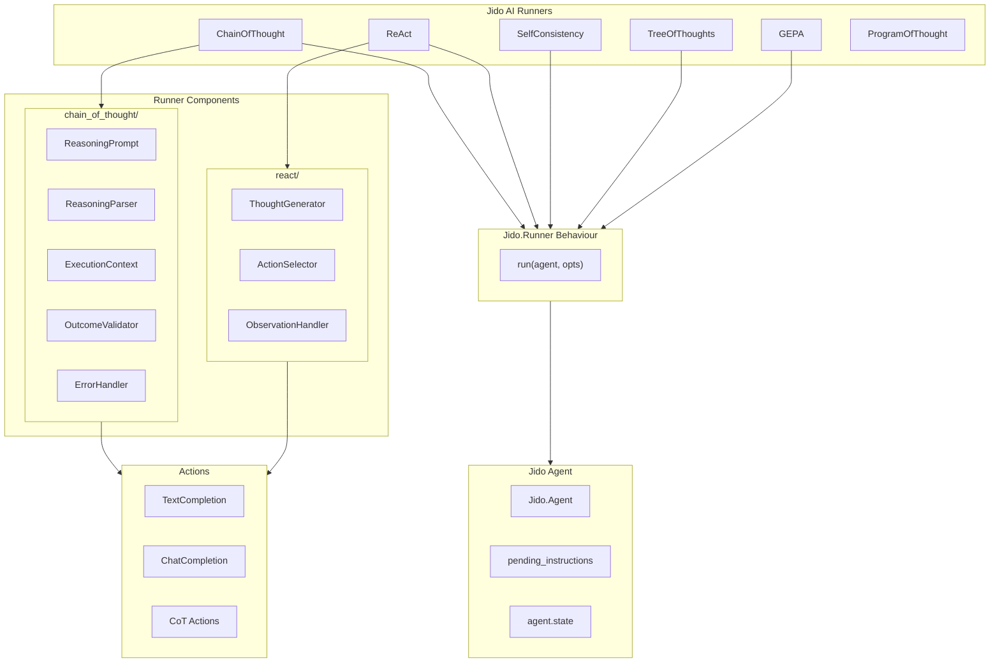
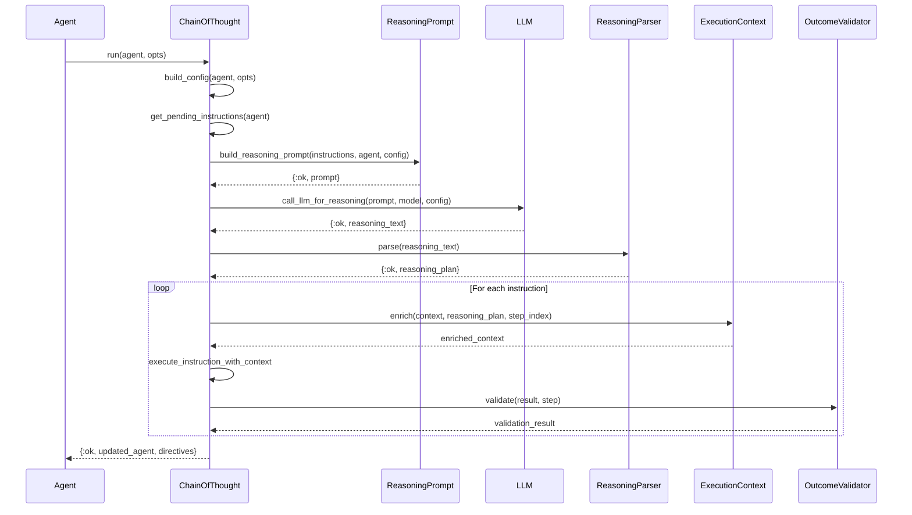
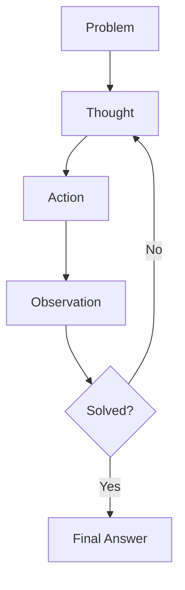
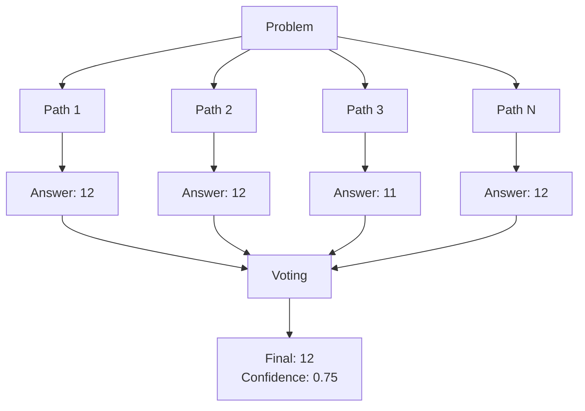
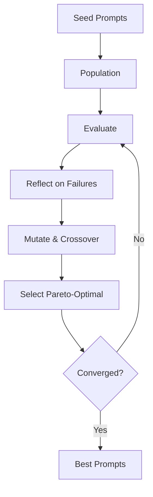

# Runners System

Runners implement advanced reasoning strategies by orchestrating multiple LLM calls. They integrate with the Jido agent framework through the `Jido.Runner` behaviour.

## Architecture



## Runner Behaviour

All runners implement the `Jido.Runner` behaviour:

```elixir
@behaviour Jido.Runner

@spec run(agent(), opts()) :: {:ok, agent(), directives()} | {:error, term()}
def run(agent, opts \\ [])
```

### Integration with Jido Agents

```elixir
defmodule MyAgent do
  use Jido.Agent,
    name: "reasoning_agent",
    runner: Jido.AI.Runner.ChainOfThought,
    actions: [MyAction1, MyAction2]
end

{:ok, agent} = MyAgent.new()
agent = Jido.Agent.enqueue(agent, MyAction, %{input: "complex task"})
{:ok, updated_agent, directives} = Jido.AI.Runner.ChainOfThought.run(agent)
```

## Chain-of-Thought Runner

Location: `lib/jido_ai/runner/chain_of_thought.ex`

Implements step-by-step reasoning with 8-15% accuracy improvement.

### Configuration

```elixir
typedstruct module: Config do
  field(:mode, atom(), default: :zero_shot)        # :zero_shot | :few_shot | :structured
  field(:max_iterations, pos_integer(), default: 1)
  field(:model, String.t() | nil, default: nil)
  field(:temperature, float(), default: 0.2)
  field(:enable_validation, boolean(), default: true)
  field(:fallback_on_error, boolean(), default: true)
end
```

### Execution Flow



### Submodules

#### ReasoningPrompt

Generates prompts for different reasoning modes:

```elixir
# Zero-shot
prompt = ReasoningPrompt.zero_shot(instructions, agent_state)

# Few-shot with examples
prompt = ReasoningPrompt.few_shot(instructions, agent_state)

# Structured task-specific
prompt = ReasoningPrompt.structured(instructions, agent_state)
```

#### ReasoningParser

Parses LLM output into structured reasoning plans:

```elixir
{:ok, plan} = ReasoningParser.parse(reasoning_text)

# ReasoningPlan structure
%ReasoningPlan{
  goal: "Solve the problem",
  analysis: "Step-by-step analysis...",
  steps: [
    %Step{number: 1, description: "First step", expected_outcome: "..."},
    %Step{number: 2, description: "Second step", expected_outcome: "..."}
  ],
  expected_results: "Final expected outcome",
  potential_issues: ["Edge case 1", "Edge case 2"]
}
```

#### OutcomeValidator

Validates execution results against reasoning predictions:

```elixir
validation = OutcomeValidator.validate(result, step, log_discrepancies: true)

# ValidationResult structure
%ValidationResult{
  matches_expectation: true,
  confidence: 0.85
}
```

#### ErrorHandler

Handles errors with retry logic and fallback:

```elixir
# With retry
ErrorHandler.with_retry(fn ->
  call_llm(...)
end, max_retries: 3, initial_delay_ms: 1000, backoff_factor: 2.0)

# Handle errors with strategy
ErrorHandler.handle_error(error, context,
  strategy: :fallback_direct,
  fallback_fn: fn -> Simple.run(agent) end
)
```

### Usage

```elixir
# Basic usage
{:ok, agent, directives} = ChainOfThought.run(agent)

# With configuration
{:ok, agent, directives} = ChainOfThought.run(agent,
  mode: :structured,
  max_iterations: 3,
  model: "gpt-4o",
  temperature: 0.3
)

# Via agent state
agent = Jido.Agent.set(agent, :cot_config, %{
  mode: :zero_shot,
  max_iterations: 2
})
{:ok, agent, directives} = ChainOfThought.run(agent)
```

## ReAct Runner

Location: `lib/jido_ai/runner/react/`

Implements Reason + Act cycles for tool-using agents.

### ReAct Loop



### Configuration

```elixir
%Config{
  max_iterations: 10,
  model: nil,
  temperature: 0.2,
  tools: [],
  stop_conditions: [:answer_found, :max_iterations]
}
```

### Usage

```elixir
{:ok, result} = ReAct.run(
  problem: "What is the weather in Tokyo?",
  tools: [WeatherTool, SearchTool],
  max_iterations: 5
)

# Result structure
%{
  answer: "The weather in Tokyo is 72°F and sunny.",
  thought_action_observations: [
    %{thought: "I need to check the weather", action: "weather", observation: "..."},
    %{thought: "Now I have the answer", action: "finish", observation: "..."}
  ],
  iterations: 2
}
```

## Self-Consistency Runner

Location: `lib/jido_ai/runner/self_consistency/`

Generates multiple reasoning paths and uses voting for reliability (+17.9% on GSM8K).

### Flow



### Configuration

```elixir
%Config{
  sample_count: 5,
  temperature: 0.7,
  diversity_threshold: 0.3,
  quality_threshold: 0.5,
  voting_strategy: :majority,  # :majority | :confidence_weighted
  min_consensus: 0.4,
  parallel: true
}
```

### Usage

```elixir
{:ok, result} = SelfConsistency.run(
  problem: "What is 15% of 80?",
  sample_count: 5,
  temperature: 0.7
)

# Result structure
%{
  answer: "12",
  confidence: 0.8,
  consensus: 0.8,
  paths: [...],
  votes: %{"12" => 4, "11.5" => 1}
}
```

## Tree of Thoughts Runner

Location: `lib/jido_ai/runner/tree_of_thoughts/`

Explores reasoning branches with lookahead and backtracking (+74% on Game of 24).

### Search Strategies


### Configuration

```elixir
%Config{
  search_strategy: :bfs,   # :bfs | :dfs | :best_first
  beam_width: 3,
  max_depth: 5,
  evaluation_strategy: :value,  # :value | :vote | :heuristic | :hybrid
  budget: 100,
  solution_check: nil,      # Custom solution checker function
  thought_fn: nil,          # Custom thought generation
  evaluation_fn: nil        # Custom evaluation
}
```

### Usage

```elixir
{:ok, result} = TreeOfThoughts.run(
  problem: "Make 24 using 4, 5, 6, 6",
  search_strategy: :bfs,
  beam_width: 3,
  max_depth: 4
)

# Result structure
%{
  answer: "(6-4)*(6+5) = 24",
  success: true,
  solution_path: [...],
  nodes_evaluated: 47,
  reason: :solution_found
}
```

## GEPA Runner

Location: `lib/jido_ai/runner/gepa/`

Genetic-Pareto prompt optimization using evolutionary algorithms (10-19% improvement, 35x fewer evaluations than RL).

### Evolution Flow



### Configuration

```elixir
%Config{
  population_size: 10,
  max_generations: 20,
  evaluation_budget: 200,
  seed_prompts: [],
  mutation_rate: 0.3,
  crossover_rate: 0.7,
  parallelism: 5,
  objectives: [:accuracy, :cost, :latency, :robustness],
  objective_weights: %{},
  enable_reflection: true,
  enable_crossover: true,
  convergence_threshold: 0.001
}
```

### Usage

```elixir
{:ok, result} = GEPA.run(
  test_inputs: ["What is 2+2?", "Explain photosynthesis"],
  population_size: 10,
  max_generations: 20,
  objectives: [:accuracy, :cost]
)

# Result structure
%{
  best_prompts: [%{prompt: "...", fitness: 0.85, objectives: %{...}}],
  pareto_frontier: [...],
  final_generation: 20,
  total_evaluations: 180,
  convergence_reason: :max_generations_reached
}
```

## Performance Comparison

| Runner | Accuracy Gain | Cost Multiplier | Use Case |
|--------|---------------|-----------------|----------|
| ChainOfThought | 8-15% | 3-4x | Complex reasoning |
| ReAct | N/A | Variable | Tool-using agents |
| SelfConsistency | 17.9% | 5-10x | High-reliability |
| TreeOfThoughts | 74% | 50-150x | Planning, puzzles |
| GEPA | 10-19% | Varies | Prompt optimization |

## Creating Custom Runners

```elixir
defmodule MyCustomRunner do
  @behaviour Jido.Runner

  @impl Jido.Runner
  def run(agent, opts \\ []) do
    # 1. Extract configuration
    config = build_config(opts)

    # 2. Get pending instructions
    instructions = agent.pending_instructions

    # 3. Execute custom logic
    case execute_custom_strategy(agent, instructions, config) do
      {:ok, result} ->
        # 4. Update agent state
        updated_agent = update_agent_state(agent, result)
        directives = build_directives(result)
        {:ok, updated_agent, directives}

      {:error, reason} ->
        {:error, reason}
    end
  end

  defp build_config(opts) do
    # Merge defaults with opts
    %{
      option1: Keyword.get(opts, :option1, default_value),
      option2: Keyword.get(opts, :option2, default_value)
    }
  end

  defp execute_custom_strategy(agent, instructions, config) do
    # Custom reasoning/execution logic
    {:ok, result}
  end

  defp update_agent_state(agent, result) do
    %{agent | state: Map.put(agent.state, :last_result, result)}
  end

  defp build_directives(result) do
    [{:custom_directive, result}]
  end
end
```

## Best Practices

1. **Choose the right runner** for your use case:
   - Simple reasoning: ChainOfThought
   - Tool usage: ReAct
   - High reliability: SelfConsistency
   - Complex planning: TreeOfThoughts
   - Prompt optimization: GEPA

2. **Configure fallbacks** for production:

```elixir
ChainOfThought.run(agent,
  fallback_on_error: true,  # Falls back to Simple runner
  enable_validation: true
)
```

3. **Monitor costs** - advanced runners multiply LLM calls:

```elixir
# TreeOfThoughts with budget control
TreeOfThoughts.run(problem: "...",
  budget: 50,  # Maximum node evaluations
  beam_width: 2  # Fewer thoughts per node
)
```

4. **Use appropriate temperatures**:
   - Low (0.1-0.3) for consistency and accuracy
   - High (0.7-0.9) for diversity in Self-Consistency
