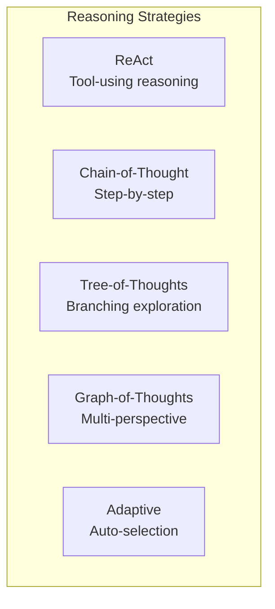
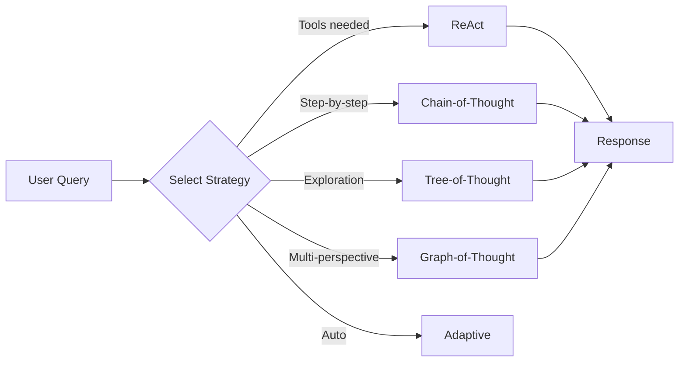

# Jido.AI Overview

**Jido.AI** is the AI integration layer for the Jido ecosystem, providing powerful tools for building reliable AI agents through advanced reasoning strategies.

## What is Jido.AI?

Jido.AI is a comprehensive framework that combines:

- **Multi-strategy reasoning** - ReAct, Chain-of-Thought, Tree-of-Thought, Graph-of-Thought, and more
- **Tool execution** - Seamless integration with Jido actions
- **State management** - Pure state machines for predictable behavior
- **Signal-driven architecture** - Event-based communication between components

## Who Should Use Jido.AI?

| Use Case | Recommended Features |
|----------|---------------------|
| **Building AI agents** | ReAct strategy, tool system, skills |
| **Complex reasoning tasks** | Tree-of-Thought, Graph-of-Thought |

## Key Concepts



## Quick Start

### 1. Basic Text Generation

```elixir
# Generate text with a model
{:ok, response} = ReqLLM.Generation.generate_text(
  "anthropic:claude-haiku-4-5",
  [%{role: :user, content: "What is 15 * 23?"}],
  temperature: 0.2
)
```

### 2. Using a Strategy

```elixir
# Create an agent with ReAct strategy
defmodule MyApp.CalculatorAgent do
  use Jido.Agent,
    name: "calculator_agent",
    strategy: {
      Jido.AI.Strategies.ReAct,
      tools: [MyApp.Actions.Calculator],
      model: :fast
    }
end

# Start the agent and send a query
{:ok, pid} = CalculatorAgent.start_link()
{:ok, agent} = CalculatorAgent.ask(pid, "What is 15 * 23?")
```

## Architecture Overview



## Choosing the Right Approach

### For Simple Questions

**Use**: Direct LLM call

```elixir
# Simple question - no need for complex strategies
ReqLLM.Generation.generate_text(model, messages)
```

### For Questions Requiring Tools

**Use**: ReAct strategy with appropriate tools

```elixir
# Calculator agent
use Jido.Agent,
  strategy: {Jido.AI.Strategies.ReAct, tools: [Calculator]}
```

### For Complex Reasoning

**Use**: Tree-of-Thought or Graph-of-Thought

```elixir
# Complex reasoning needs exploration
use Jido.Agent,
  strategy: {Jido.AI.Strategies.TreeOfThoughts, branching_factor: 3}
```

## Next Steps

- [Strategies Guide](./02_strategies.md) - Learn about reasoning strategies
