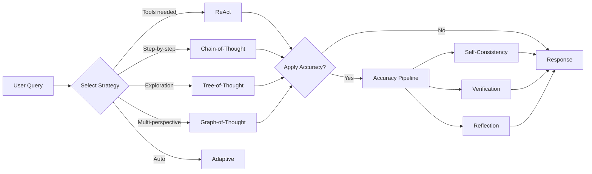

# Jido.AI Overview

**Jido.AI** is the AI integration layer for the Jido ecosystem, providing powerful tools for building accurate, reliable AI agents through advanced reasoning strategies and accuracy improvement techniques.

## What is Jido.AI?

Jido.AI is a comprehensive framework that combines:

- **Multi-strategy reasoning** - ReAct, Chain-of-Thought, Tree-of-Thought, Graph-of-Thought, and more
- **Accuracy improvement algorithms** - Self-consistency, search, verification, reflection
- **Tool execution** - Seamless integration with Jido actions
- **State management** - Pure state machines for predictable behavior
- **Signal-driven architecture** - Event-based communication between components

## Who Should Use Jido.AI?

| Use Case | Recommended Features |
|----------|---------------------|
| **Building AI agents** | ReAct strategy, tool system, skills |
| **Improving LLM accuracy** | Self-consistency, verification, reflection |
| **Complex reasoning tasks** | Tree-of-Thought, Graph-of-Thought, MCTS |
| **Cost optimization** | Adaptive self-consistency, difficulty estimation |
| **Production systems** | Pipeline, telemetry, calibration |

## Key Concepts

```mermaid
graph TB
    subgraph "Reasoning Strategies"
        ReAct[ReAct<br/>Tool-using reasoning]
        CoT[Chain-of-Thought<br/>Step-by-step]
        ToT[Tree-of-Thoughts<br/>Branching exploration]
        GoT[Graph-of-Thoughts<br/>Multi-perspective]
        Adaptive[Adaptive<br/>Auto-selection]
    end

    subgraph "Accuracy Algorithms"
        SC[Self-Consistency<br/>Multiple candidates]
        ASC[Adaptive SC<br/>Dynamic N]
        Search[Search Algorithms<br/>MCTS, Beam]
        Verify[Verification<br/>LLM, Code, Tests]
        Reflect[Reflection<br/>Iterative improvement]
    end

    subgraph "Pipeline"
        Pipeline[Accuracy Pipeline<br/>Orchestration]
        Budget[Compute Budget<br/>Resource management]
        Calibrate[Calibration<br/>Quality control]
    end

    ReAct --> Pipeline
    CoT --> Pipeline
    ToT --> Pipeline
    GoT --> Pipeline

    SC --> Pipeline
    ASC --> Pipeline
    Search --> Pipeline
    Verify --> Pipeline
    Reflect --> Pipeline

    Pipeline --> Budget
    Pipeline --> Calibrate
```

## Quick Start

### 1. Basic Text Generation

```elixir
# Generate text with a model
{:ok, response} = ReqLLM.Generation.generate_text(
  "anthropic:claude-haiku-4-5",
  [%{role: :user, content: "What is 15 * 23?"}],
  temperature: 0.2
)
```

### 2. Using a Strategy

```elixir
# Create an agent with ReAct strategy
defmodule MyApp.CalculatorAgent do
  use Jido.Agent,
    name: "calculator_agent",
    strategy: {
      Jido.AI.Strategies.ReAct,
      tools: [MyApp.Actions.Calculator],
      model: :fast
    }
end

# Start the agent and send a query
{:ok, pid} = CalculatorAgent.start_link()
{:ok, agent} = CalculatorAgent.ask(pid, "What is 15 * 23?")
```

### 3. Self-Consistency for Accuracy

```elixir
# Use self-consistency to improve accuracy
alias Jido.AI.Accuracy.SelfConsistency

{:ok, best_answer, metadata} = SelfConsistency.run(
  "What is 15 * 23?",
  num_candidates: 5,
  aggregator: :majority_vote
)

# best_answer contains the most common answer
# metadata contains voting information
```

### 4. Full Accuracy Pipeline

```elixir
# Use the complete accuracy pipeline
alias Jido.AI.Accuracy.Pipeline

{:ok, pipeline} = Pipeline.new(%{
  stages: [:generation, :verification, :reflection, :calibration],
  generator: fn query ->
    # Your LLM generation function
    ReqLLM.Generation.generate_text("anthropic:claude-3-5-sonnet-20241022", query)
  end
})

{:ok, result} = Pipeline.run(pipeline, "What is 15 * 23?")
```

## Architecture Overview



## Choosing the Right Approach

### For Simple Questions

**Use**: Direct LLM call or basic self-consistency

```elixir
# Simple question - no need for complex strategies
ReqLLM.Generation.generate_text(model, messages)
```

### For Questions Requiring Tools

**Use**: ReAct strategy with appropriate tools

```elixir
# Calculator agent
use Jido.Agent,
  strategy: {Jido.AI.Strategies.ReAct, tools: [Calculator]}
```

### For Complex Reasoning

**Use**: Tree-of-Thought or Graph-of-Thought

```elixir
# Complex reasoning needs exploration
use Jido.Agent,
  strategy: {Jido.AI.Strategies.TreeOfThoughts, branching_factor: 3}
```

### For Maximum Accuracy

**Use**: Accuracy pipeline with verification and reflection

```elixir
# Maximum accuracy for critical applications
{:ok, pipeline} = Pipeline.new(%{
  stages: [:generation, :verification, :reflection, :calibration]
})
```

### For Cost-Effective Accuracy

**Use**: Adaptive self-consistency with difficulty estimation

```elixir
# Adaptive compute based on difficulty
{:ok, result} = AdaptiveSelfConsistency.run(query,
  min_candidates: 3,
  max_candidates: 20
)
```

## Next Steps

- [Strategies Guide](./02_strategies.md) - Learn about reasoning strategies
- [Self-Consistency Guide](./03_self_consistency.md) - Improve accuracy through multiple candidates
- [Search Algorithms Guide](./05_search_algorithms.md) - Systematic exploration techniques
- [Verification Guide](./06_verification.md) - Validate and verify responses
- [Pipeline Guide](./12_pipeline.md) - Orchestrate complete accuracy workflows
