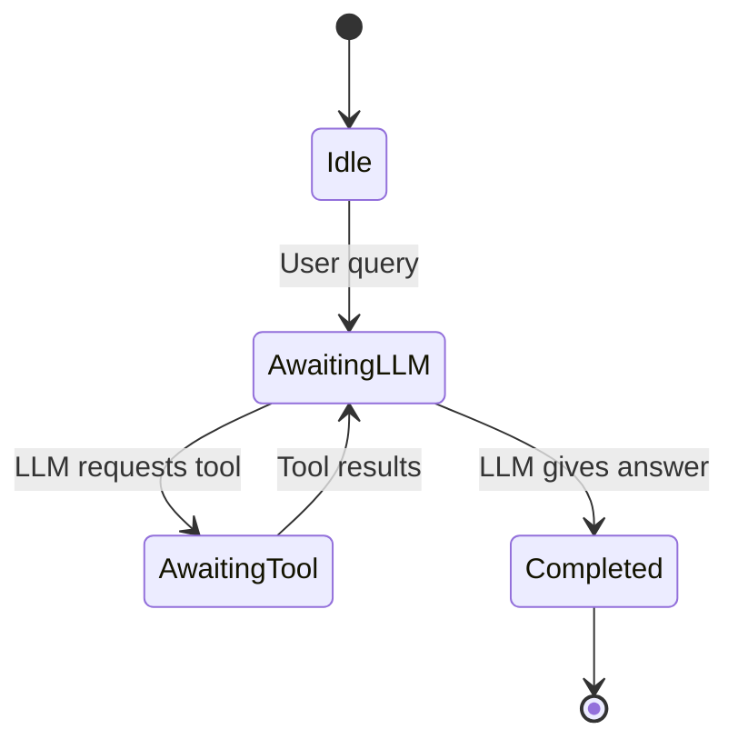
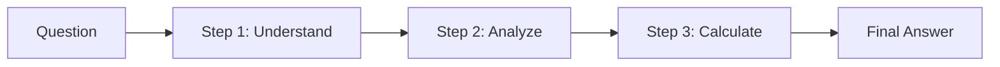
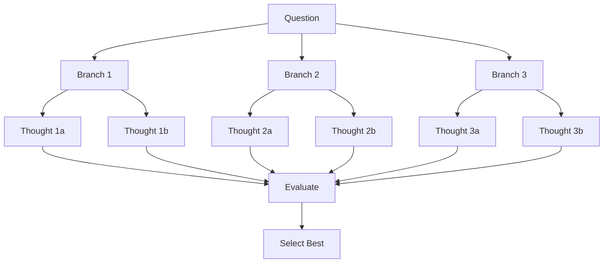
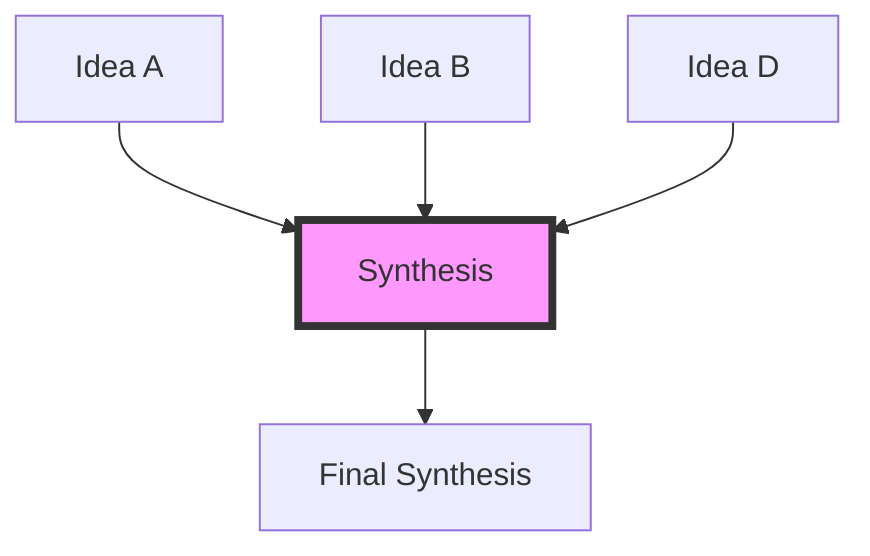
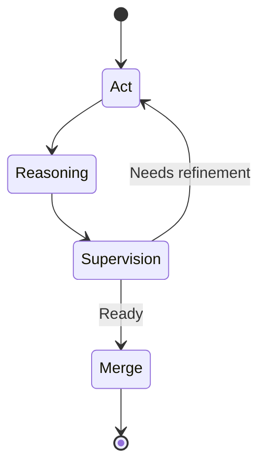
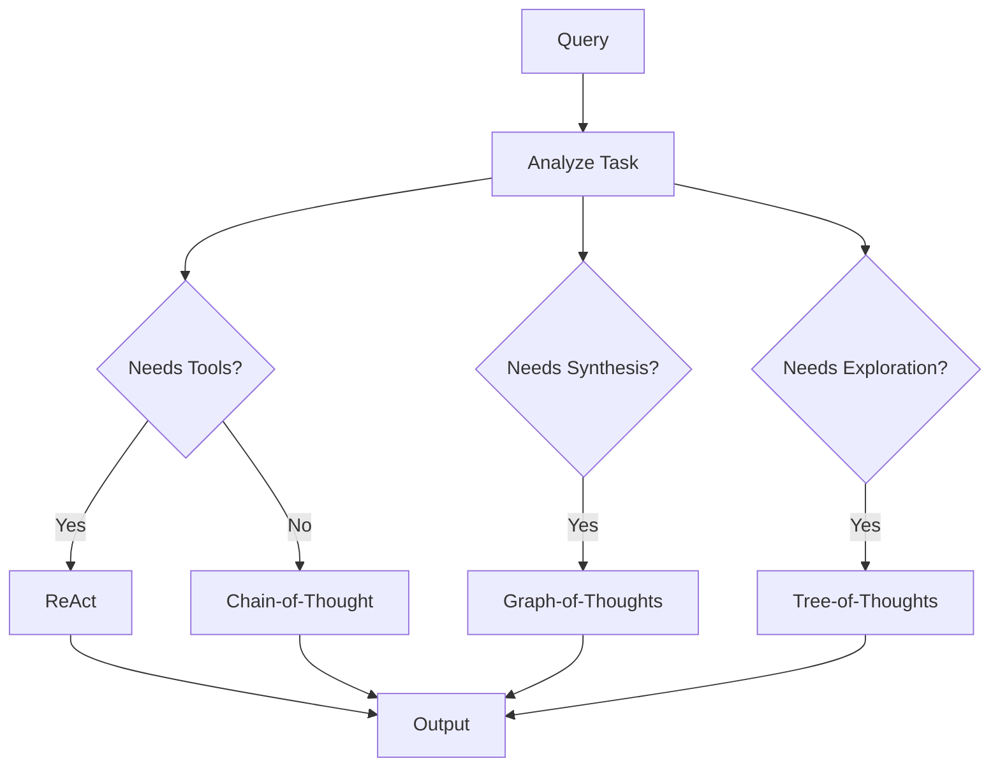
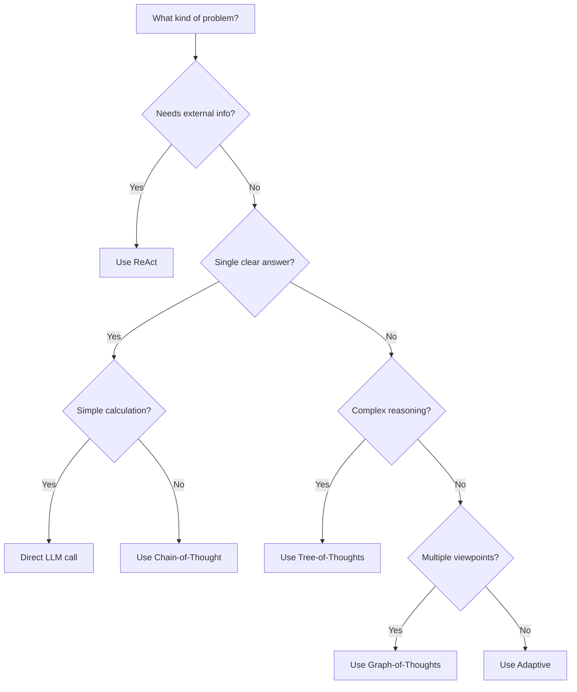

# Reasoning Strategies Guide

This guide covers the reasoning strategies available in Jido.AI for building intelligent agents.

## Overview

Reasoning strategies implement different patterns for how an AI agent thinks and solves problems. Each strategy has strengths for different types of tasks.

## Strategy Comparison

| Strategy | Best For | Complexity | Tools | Cost |
|----------|----------|------------|-------|------|
| **ReAct** | Tool-using tasks | Medium | ✓ | Medium |
| **Chain-of-Thought** | Math, logic | Low | ✗ | Low |
| **Tree-of-Thoughts** | Puzzles, planning | High | ✗ | High |
| **Graph-of-Thoughts** | Multi-perspective | High | ✗ | High |
| **TRM** | Iterative refinement | Medium | ✗ | Medium |
| **Adaptive** | Unknown task type | Variable | ✓ | Variable |

## ReAct Strategy

**ReAct** (Reason-Act) is a strategy where the agent reasons step-by-step and can use external tools.

### When to Use

- Tasks requiring external information (APIs, databases)
- Multi-step problems needing tool use
- When answers require computation or verification

### How It Works



### Example

```elixir
defmodule MyApp.CalculatorAgent do
  use Jido.Agent,
    name: "calculator_agent",
    strategy: {
      Jido.AI.Strategies.ReAct,
      tools: [
        MyApp.Actions.Calculator,
        MyApp.Actions.Search
      ],
      model: :fast,
      max_iterations: 10
    }
end

# Start and use
{:ok, pid} = MyApp.CalculatorAgent.start_link()
{:ok, response} = MyApp.CalculatorAgent.ask(pid, "What is 15 * 23 + 100?")
```

### Configuration

| Option | Type | Default | Description |
|--------|------|---------|-------------|
| `:tools` | `[module()]` | **Required** | List of Jido.Action modules |
| `:model` | `String.t()` | `:fast` | Model to use |
| `:system_prompt` | `String.t()` | Default | Custom system prompt |
| `:max_iterations` | `integer()` | 10 | Maximum reasoning steps |

## Chain-of-Thought Strategy

**Chain-of-Thought** breaks problems into sequential steps, showing reasoning explicitly.

### When to Use

- Mathematical problems
- Logic puzzles
- Step-by-step explanations
- Common sense reasoning

### How It Works



### Example

```elixir
defmodule MyApp.MathAgent do
  use Jido.Agent,
    name: "math_agent",
    strategy: {
      Jido.AI.Strategies.ChainOfThought,
      model: :fast
    }
end

# The agent will show its reasoning
{:ok, response} = MyApp.MathAgent.ask(pid, """
  Roger has 5 tennis balls. He buys 2 more cans of 3 tennis balls each.
  How many tennis balls does he have now?
""")
```

### When Chain-of-Thought Works Best

| Task Type | Good Fit? | Reason |
|-----------|-----------|--------|
| Arithmetic | ✓ | Steps are clear |
| Word problems | ✓ | Requires decomposition |
| Creative writing | ✗ | No single correct path |
| Open-ended questions | ✗ | Too many possibilities |

## Tree-of-Thoughts Strategy

**Tree-of-Thoughts** explores multiple reasoning paths in parallel and selects the best.

### When to Use

- Problems with multiple valid approaches
- When you want to explore alternatives
- Puzzles and optimization problems
- Creative tasks needing variety

### How It Works



### Example

```elixir
defmodule MyApp.PlanningAgent do
  use Jido.Agent,
    name: "planning_agent",
    strategy: {
      Jido.AI.Strategies.TreeOfThoughts,
      branching_factor: 3,
      max_depth: 4,
      traversal_strategy: :best_first
    }
end

# Explores multiple planning approaches
{:ok, response} = MyApp.PlanningAgent.ask(pid, """
  Plan a 3-day trip to Tokyo with a budget of $1000.
""")
```

### Traversal Strategies

| Strategy | Description | When to Use |
|----------|-------------|-------------|
| `:bfs` | Breadth-first: explore all options at each depth | When thoroughness matters |
| `:dfs` | Depth-first: explore each branch fully | When depth is limited |
| `:best_first` | Always explore highest-scoring thought first | When evaluation is reliable |

### Configuration

| Option | Type | Default | Description |
|--------|------|---------|-------------|
| `:branching_factor` | `integer()` | 3 | Thoughts per step |
| `:max_depth` | `integer()` | 4 | Maximum reasoning depth |
| `:traversal_strategy` | `atom()` | `:best_first` | How to traverse |

## Graph-of-Thoughts Strategy

**Graph-of-Thoughts** allows thoughts to have multiple parents, enabling synthesis of different perspectives.

### When to Use

- Problems requiring multiple viewpoints
- Synthesis and consensus tasks
- Complex causal reasoning
- When ideas need to merge

### How It Works



### Example

```elixir
defmodule MyApp.ConsensusAgent do
  use Jido.Agent,
    name: "consensus_agent",
    strategy: {
      Jido.AI.Strategies.GraphOfThoughts,
      branching_factor: 3,
      max_depth: 4,
      aggregation_method: :weighted_vote
    }
end

# Synthesizes multiple perspectives
{:ok, response} = MyApp.ConsensusAgent.ask(pid, """
  What are the pros and cons of remote work vs office work?
""")
```

### Aggregation Methods

| Method | Description |
|--------|-------------|
| `:majority_vote` | Most common answer wins |
| `:weighted_vote` | Votes weighted by thought quality |

## TRM Strategy

**TRM** (Thought-Refine-Merge) iteratively refines thoughts through supervision.

### When to Use

- Tasks needing iterative improvement
- When initial thoughts need refinement
- Supervised reasoning scenarios

### TRM States



### Example

```elixir
defmodule MyApp.RefineAgent do
  use Jido.Agent,
    name: "refine_agent",
    strategy: {
      Jido.AI.Strategies.TRM,
      max_refinements: 3,
      supervision_mode: :automatic
    }
end
```

## Adaptive Strategy

**Adaptive** automatically selects the best strategy based on task characteristics.

### When to Use

- When task type is unknown
- For general-purpose agents
- When you want automatic optimization

### How It Works



### Keyword Detection

| Strategy | Trigger Keywords |
|----------|-----------------|
| ReAct | use, call, execute, tool, function |
| GoT | combine, synthesize, merge, perspectives |
| ToT | explore, alternatives, options, branches |
| TRM | refine, improve, iterate |
| CoT | Default (no keywords match) |

### Example

```elixir
defmodule MyApp.SmartAgent do
  use Jido.Agent,
    name: "smart_agent",
    strategy: {
      Jido.AI.Strategies.Adaptive,
      strategies: [:react, :cot, :tot, :got],
      model: :fast,
      tools: [MyApp.Actions.Search, MyApp.Actions.Database]
    }
end

# Automatically chooses appropriate strategy
{:ok, response} = MyApp.SmartAgent.ask(pid, "Use the search tool to find...")
```

## Recommendation Guide

### Decision Tree



### Quick Reference

| If you want... | Use... |
|----------------|--------|
| Tool use with reasoning | ReAct |
| Show reasoning steps | Chain-of-Thought |
| Explore alternatives | Tree-of-Thoughts |
| Synthesize perspectives | Graph-of-Thoughts |
| Automatic selection | Adaptive |
| Iterative refinement | TRM |

## Next Steps
