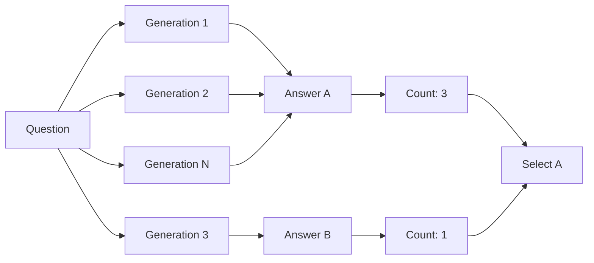
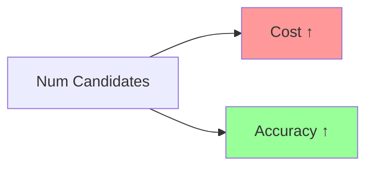

# Self-Consistency Guide

**Self-Consistency** is a powerful technique that improves LLM accuracy by generating multiple candidate answers and selecting the most consistent one.

## The Self-Consistency Algorithm

Self-Consistency is an ensemble technique introduced by Wang et al. (2022) in "Self-Consistency Improves Chain of Thought Reasoning in Large Language Models." The core insight is that while LLMs can make mistakes in single-shot generation, they are more likely to arrive at correct answers when the same reasoning path is sampled multiple times and the most consistent answer is selected.

### Theoretical Foundation

The algorithm rests on two key observations about LLM behavior:

1. **Path Diversity**: LLMs with temperature > 0 can generate different reasoning paths for the same question due to the probabilistic nature of sampling
2. **Convergence on Truth**: When multiple reasoning paths are sampled, correct reasoning tends to converge on the same final answer, while incorrect reasoning diverges

Mathematically, if we sample N reasoning paths from the LLM's output distribution P(answer|question), the probability that the majority vote selects the correct answer increases with N as long as P(correct) > 0.5.

### Algorithm Mechanics

```
Input: Question Q, integer N (num candidates)
Output: Answer A

1. For i = 1 to N:
   a. Generate reasoning path Ri and answer Ai by sampling from LLM
      with temperature T > 0
   b. Store (Ri, Ai)

2. Aggregate answers by counting frequencies:
   Count[A] = number of times answer A appears

3. Select A* = argmax Count[A]  # Most frequent answer

4. Return A*
```

### Time and Space Complexity

| Aspect | Complexity | Notes |
|--------|------------|-------|
| Time | O(N × C) | N = candidates, C = LLM generation time |
| Space | O(N × L) | L = average response length |
| Parallelizability | O(N) speedup | All N generations can run in parallel |

### Key Properties

| Property | Value |
|----------|-------|
| **Accuracy Gain** | +15-30% over single-shot for math/reasoning |
| **Compute Cost** | N× single-shot cost |
| **Optimal N** | 5-10 for most tasks |
| **Temperature** | 0.5-0.8 for diversity |
| **Best For** | Math, logic, factual questions with discrete answers |

### Relationship to Other Techniques

Self-consistency is closely related to several other ensemble methods:

- **Majority Voting**: Self-consistency is essentially majority voting over LLM samples
- **Ensemble Methods**: Like bagging in ML, but applied to generations from the same model
- **Tree of Thoughts**: Can be viewed as a special case where each path is independent

### Limitations

1. **Cost**: Requires N LLM calls per question
2. **Discrete Answers**: Works best for questions with clear, discrete answers
3. **No Reuse**: Each question requires new generations
4. **Temperature Sensitivity**: Too low = no diversity, too high = too much noise

## What is Self-Consistency?

Self-consistency leverages the fact that while LLMs can make mistakes, they're more likely to be correct when they consistently produce the same answer across multiple generations.

### The Core Idea



### When to Use Self-Consistency

| Scenario | Good Fit? | Reason |
|----------|-----------|--------|
| Math problems | ✓ | Clear correct answer |
| Factual questions | ✓ | Verifiable facts |
| Code generation | ✓ | Functional correctness |
| Creative writing | ✗ | No "correct" answer |
| Opinion questions | ✗ | Subjective |
| Open-ended tasks | ✗ | Multiple valid responses |

## Basic Usage

### Simple Example

```elixir
alias Jido.AI.Accuracy.SelfConsistency

# Generate 5 candidates and select by majority vote
{:ok, best_answer, metadata} = SelfConsistency.run(
  "What is 15 * 23?",
  num_candidates: 5,
  aggregator: :majority_vote
)

# best_answer: "345"
# metadata: %{
#   candidates: ["345", "345", "345", "345", "350"],
#   vote_counts: %{"345" => 4, "350" => 1},
#   winner: "345",
#   confidence: 0.8
# }
```

### With Custom Generator

```elixir
# Use a custom generation function
{:ok, best, metadata} = SelfConsistency.run(
  "Solve: x^2 + 5x + 6 = 0",
  generator: fn prompt ->
    ReqLLM.Generation.generate_text("anthropic:claude-3-5-sonnet-20241022", [
      %{role: :system, content: "You are a math expert. Solve step by step."},
      %{role: :user, content: prompt}
    ], temperature: 0.7)
  end,
  num_candidates: 7
)
```

## Aggregation Methods

The way you combine candidate answers affects results.

### Majority Vote

Selects the most common answer. Best for:
- Questions with discrete answers
- Multiple choice problems
- Fact-based queries

```elixir
{:ok, best, _} = SelfConsistency.run(
  "What is the capital of France?",
  aggregator: :majority_vote,  # Default
  num_candidates: 5
)
```

### Weighted Voting

Weights votes by candidate quality/score. Best for:
- When you can score candidates
- When some generations are clearly better

```elixir
{:ok, best, _} = SelfConsistency.run(
  "Explain quantum entanglement",
  aggregator: :weighted,
  num_candidates: 5,
  scorer: fn candidate ->
    # Score by explanation quality
    score_explanation(candidate)
  end
)
```

### Best of N

Selects the single best candidate. Best for:
- Open-ended questions
- When you have a reliable scoring function
- Creative tasks

```elixir
{:ok, best, _} = SelfConsistency.run(
  "Write a haiku about programming",
  aggregator: :best_of_n,
  num_candidates: 5,
  scorer: fn candidate ->
    # Score by creativity and structure
    score_haiku(candidate)
  end
)
```

## Temperature Sampling

Different temperatures produce diverse candidates:

```elixir
alias Jido.AI.Accuracy.SelfConsistency

# Use temperature range for diversity
{:ok, best, _} = SelfConsistency.run(
  "What are the economic impacts of AI?",
  num_candidates: 5,
  temperature_range: {0.3, 1.0},  # Sample across this range
  aggregator: :best_of_n
)
```

### Temperature Guidelines

| Range | Effect | Use Case |
|-------|--------|----------|
| 0.0 - 0.3 | Focused, consistent | Facts, math, code |
| 0.3 - 0.7 | Balanced | General reasoning |
| 0.7 - 1.0 | Creative, diverse | Brainstorming, creative tasks |
| 1.0+ | Very diverse | Exploring alternatives |

## Advanced Configuration

### Full Options

```elixir
{:ok, best, metadata} = SelfConsistency.run(
  query,
  # Generation options
  num_candidates: 10,
  temperature_range: {0.0, 1.0},
  max_concurrency: 3,

  # Aggregation options
  aggregator: :majority_vote,
  scorer: nil,

  # Model options
  model: "anthropic:claude-3-5-sonnet-20241022",
  system_prompt: "You are an expert in this domain.",
  max_tokens: 1024,

  # Custom generator (overrides default)
  generator: nil
)
```

### Parameter Recommendations

| Parameter | Range | Recommendation |
|-----------|-------|----------------|
| `num_candidates` | 3-20 | Start with 5, increase for difficult tasks |
| `temperature_range` | {0.0, 1.0} | Use wider range for creative tasks |
| `max_concurrency` | 1-10 | Based on rate limits and API costs |

## Performance Considerations

### Cost vs Accuracy



| Candidates | Relative Cost | Expected Accuracy Gain |
|------------|---------------|------------------------|
| 1 | 1x | Baseline |
| 3 | 3x | +10-20% |
| 5 | 5x | +15-25% |
| 10 | 10x | +20-30% |
| 20+ | 20x+ | Diminishing returns |

### Optimization Tips

```elixir
# For cost-sensitive applications
{:ok, best, _} = SelfConsistency.run(
  query,
  num_candidates: 3,  # Minimum for benefit
  aggregator: :majority_vote
)

# For accuracy-critical applications
{:ok, best, _} = SelfConsistency.run(
  query,
  num_candidates: 10,
  aggregator: :weighted,
  scorer: &quality_scorer/1
)

# For balanced approach
{:ok, best, _} = SelfConsistency.run(
  query,
  num_candidates: 5,
  aggregator: :majority_vote
)
```

## Common Patterns

### Math Problems

```elixir
{:ok, answer, _} = SelfConsistency.run(
  "A rectangle has perimeter 26 and area 40. Find its dimensions.",
  num_candidates: 7,
  aggregator: :majority_vote,
  temperature_range: {0.0, 0.3}
)
```

### Code Generation

```elixir
{:ok, code, _} = SelfConsistency.run(
  "Write a function to find the longest palindrome substring",
  num_candidates: 5,
  aggregator: :best_of_n,
  scorer: fn code ->
    # Test the code
    case test_function(code) do
      {:ok, _} -> 1.0
      {:error, _} -> 0.0
    end
  end
)
```

### Multiple Choice

```elixir
question = """
  Which sorting algorithm has the best average-case time complexity?
  A) Bubble Sort
  B) Quick Sort
  C) Merge Sort
  D) Insertion Sort
"""

{:ok, answer, _} = SelfConsistency.run(
  question,
  num_candidates: 5,
  aggregator: :majority_vote,
  temperature_range: {0.0, 0.2}
)
# Most likely to return "C) Merge Sort" consistently
```

## Troubleshooting

### All Candidates Different

**Problem**: No consensus emerges

**Solutions**:
1. Increase `num_candidates`
2. Narrow `temperature_range`
3. Try different `aggregator`
4. Check if question is ambiguous

```elixir
# Narrow temperature for more consistency
{:ok, best, _} = SelfConsistency.run(
  query,
  num_candidates: 7,
  temperature_range: {0.0, 0.3}  # Lower, tighter range
)
```

### Wrong Answer Wins

**Problem**: Majority vote selects incorrect answer

**Solutions**:
1. Use `:weighted` aggregator with scoring
2. Increase `num_candidates`
3. Improve prompt clarity
4. Use chain-of-thought prompting

```elixir
{:ok, best, _} = SelfConsistency.run(
  "Think step by step: #{complex_query}",
  aggregator: :weighted,
  scorer: fn ans ->
    # Check for reasoning quality
    if String.contains?(ans, "because"), do: 0.8, else: 0.5
  end
)
```

### Slow Performance

**Problem**: Too many candidates take too long

**Solutions**:
1. Reduce `num_candidates`
2. Increase `max_concurrency` (within rate limits)
3. Use [Adaptive Self-Consistency](./04_adaptive_self_consistency.md)

## When Self-Consistency Shines

### Ideal Use Cases

1. **Mathematical Reasoning**
   ```elixir
   SelfConsistency.run("What is 247 * 13?", num_candidates: 5)
   ```

2. **Factual Questions**
   ```elixir
   SelfConsistency.run("Who won the Nobel Prize in Physics in 2023?")
   ```

3. **Logic Puzzles**
   ```elixir
   SelfConsistency.run("If all Bloops are Razzles and all Razzles are Lazzles...")
   ```

4. **Code Debugging**
   ```elixir
   SelfConsistency.run("Find the bug in this code: #{code}")
   ```

### Poor Use Cases

1. **Creative Writing** - No "correct" answer
2. **Opinion Questions** - Subjective
3. **Open-Ended Problems** - Many valid approaches

## Next Steps

- [Adaptive Self-Consistency](./04_adaptive_self_consistency.md) - Dynamic candidate selection
- [Verification Guide](./06_verification.md) - Combine with verification for better results
- [Pipeline Guide](./12_pipeline.md) - Integrate into complete workflows
