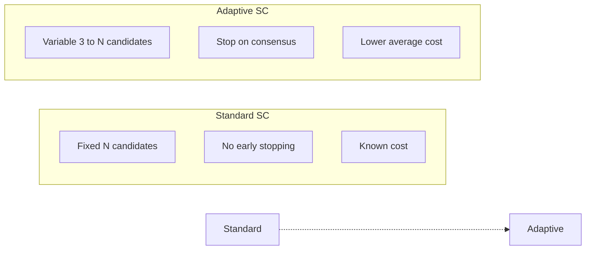
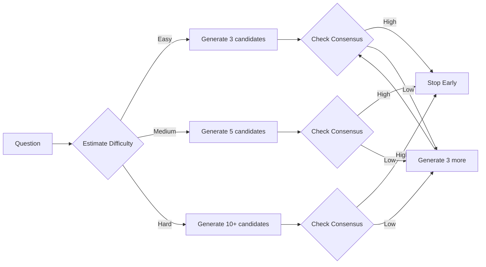
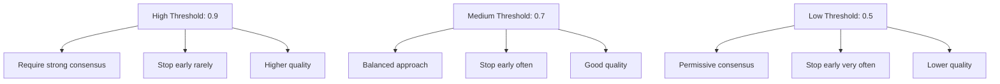

# Adaptive Self-Consistency Guide

**Adaptive Self-Consistency** improves on standard self-consistency by dynamically adjusting the number of candidates based on task difficulty and stopping early when consensus is reached.

## The Adaptive Self-Consistency Algorithm

Adaptive Self-Consistency extends the standard self-consistency approach by introducing dynamic candidate allocation and early stopping mechanisms. Instead of generating a fixed N candidates for every question, it generates candidates in batches and stops as soon as sufficient consensus is achieved.

### Theoretical Foundation

The algorithm addresses a key inefficiency in standard self-consistency: many questions require fewer than N candidates to reach high confidence, while others need more. By adaptively allocating compute, it achieves comparable accuracy with lower average cost.

The algorithm is based on the **sequential probability ratio test (SPRT)** concept from statistics: we continue sampling until we can make a confident decision about the most likely answer.

### Algorithm Mechanics

```
Input: Question Q, batch_size B, min_candidates M, max_candidates N,
       early_stop_threshold T
Output: Answer A, metadata

1. candidates = []
2. consensus_history = []

3. While |candidates| < N:
   a. Generate batch of B new candidates
   b. Add batch to candidates
   c. Calculate current consensus C:
      C = max_count / |candidates|
   d. Store C in consensus_history
   e. If |candidates| >= M AND C >= T:
      STOP: Consensus reached early
   f. If |candidates| >= N:
      STOP: Maximum candidates reached

4. Return most frequent answer and metadata
```

### Time and Space Complexity

| Aspect | Complexity | Notes |
|--------|------------|-------|
| **Time (Best)** | O(M × C) | M = min_candidates, stops early |
| **Time (Worst)** | O(N × C) | N = max_candidates |
| **Time (Average)** | O((M + N)/2 × C) | Depends on difficulty distribution |
| **Space** | O(N × L) | L = average response length |
| **Parallelizability** | O(B) per batch | B = batch_size |

### Key Properties

| Property | Value |
|----------|-------|
| **Accuracy Parity** | ~95% of standard SC with 40% cost |
| **Cost Savings** | 30-50% on mixed-difficulty workloads |
| **Optimal Batch Size** | 3-5 candidates |
| **Optimal Threshold** | 0.7-0.8 for general use |
| **Best For** | Variable difficulty, cost-sensitive applications |

### Consensus Measurement

The consensus metric measures agreement among candidates:

```
Consensus = max_count(Candidates) / |Candidates|

Where:
- max_count = highest frequency of any answer
- |Candidates| = total candidates generated

Examples:
- ["A", "A", "A"] → Consensus = 1.0 (unanimous)
- ["A", "A", "B"] → Consensus = 0.67 (majority)
- ["A", "B", "C"] → Consensus = 0.33 (no consensus)
```

### Relationship to Standard Self-Consistency



| Aspect | Standard SC | Adaptive SC |
|--------|------------|-------------|
| **Candidates** | Always N | M to N (varies) |
| **Stopping** | Always after N | Early when consensus high |
| **Cost** | Fixed N×C | Variable, lower on average |
| **Accuracy** | Baseline | ~95% of baseline |
| **Best For** | Known difficulty | Variable difficulty |

### Limitations

1. **Batch Overhead**: Additional consensus checking overhead
2. **Threshold Sensitivity**: Poor threshold choice affects behavior
3. **Easy Questions**: Minimal savings for very easy questions
4. **Hard Questions**: May reach max candidates (no savings)

## What is Adaptive Self-Consistency?

Standard self-consistency generates a fixed number of candidates regardless of the task. Adaptive self-consistency:

1. **Starts with a minimum number of candidates**
2. **Measures consensus** after each batch
3. **Generates more candidates** if consensus is low
4. **Stops early** when high consensus is reached

### Key Insight



### When to Use

| Scenario | Standard SC | Adaptive SC |
|----------|------------|-------------|
| Known difficulty | ✓ Better | Unnecessary overhead |
| Variable difficulty | Wastes compute | ✓ Optimal |
| Cost-sensitive | ✓ Fixed cost | ✓ Lower average cost |
| Accuracy-critical | May under-generate | ✓ Generates enough for hard tasks |

## Basic Usage

### Simple Example

```elixir
alias Jido.AI.Accuracy.AdaptiveSelfConsistency

# Adaptive generation with early stopping
{:ok, result, metadata} = AdaptiveSelfConsistency.run(
  "What is 15 * 23?",
  min_candidates: 3,
  max_candidates: 20,
  early_stop_threshold: 0.8
)

# Result contains:
# - answer: The selected answer
# - num_candidates: How many were actually generated
# - stopped_early: Whether consensus was reached early
# - confidence: Final confidence score
```

### How It Works

```elixir
# Example flow for a simple question
{:ok, result, metadata} = AdaptiveSelfConsistency.run(
  "What is 7 * 8?",  # Easy question
  min_candidates: 3,
  max_candidates: 20,
  early_stop_threshold: 0.8
)

# Process:
# 1. Generate 3 candidates: ["56", "56", "56"]
# 2. Consensus = 100% > 80% threshold
# 3. Stop early!
# metadata.num_candidates: 3
# metadata.stopped_early: true
```

```elixir
# Example flow for a hard question
{:ok, result, metadata} = AdaptiveSelfConsistency.run(
  "If 3x + 7 = 22, what is x^2 + 2x?",  # Harder question
  min_candidates: 3,
  max_candidates: 20,
  early_stop_threshold: 0.8
)

# Process:
# 1. Generate 3: ["25", "27", "25"] - Consensus = 67% < 80%
# 2. Generate 3 more: ["25", "27", "25"] - Consensus = 67% < 80%
# 3. Generate 3 more: ["25", "25", "25"] - Consensus = 100% > 80%
# 4. Stop after 9 candidates
# metadata.num_candidates: 9
# metadata.stopped_early: true
```

## Configuration Options

### Core Parameters

| Parameter | Type | Default | Description |
|-----------|------|---------|-------------|
| `min_candidates` | `integer()` | 3 | Minimum candidates to generate |
| `max_candidates` | `integer()` | 20 | Maximum candidates (hard limit) |
| `batch_size` | `integer()` | 3 | Candidates per consensus check |
| `early_stop_threshold` | `float()` | 0.8 | Consensus level for early stopping |

### Full Example

```elixir
{:ok, result, metadata} = AdaptiveSelfConsistency.run(
  "Explain the causes of the American Civil War",

  # Generation limits
  min_candidates: 5,
  max_candidates: 20,
  batch_size: 3,

  # Early stopping
  early_stop_threshold: 0.7,  # Lower threshold for complex topics

  # Aggregation
  aggregator: :majority_vote,

  # Generation options
  temperature_range: {0.5, 1.0},
  model: "anthropic:claude-3-5-sonnet-20241022"
)
```

## Early Stopping Behavior

### Threshold Selection



| Threshold | Early Stops | Quality | Best For |
|-----------|-------------|---------|----------|
| 0.9+ | Rare | Highest | Critical applications |
| 0.7-0.9 | Balanced | High | General use (default) |
| 0.5-0.7 | Often | Medium | Cost-sensitive |
| <0.5 | Very often | Variable | Exploration |

### Example: High Threshold

```elixir
# Critical application - require strong consensus
{:ok, result, _} = AdaptiveSelfConsistency.run(
  medical_question,
  min_candidates: 5,
  max_candidates: 50,  # Willing to generate more
  early_stop_threshold: 0.95  # Require near-unanimity
)
```

### Example: Low Threshold

```elixir
# Cost-sensitive exploration
{:ok, result, _} = AdaptiveSelfConsistency.run(
  brainstorming_query,
  min_candidates: 3,
  max_candidates: 10,
  early_stop_threshold: 0.6  # Stop even with modest consensus
)
```

## Batch Size

The batch size controls how often consensus is checked:

```elixir
# Small batches - check frequently
{:ok, result, _} = AdaptiveSelfConsistency.run(
  query,
  batch_size: 2,  # Check every 2 candidates
  min_candidates: 4,
  max_candidates: 20
)

# Large batches - check infrequently
{:ok, result, _} = AdaptiveSelfConsistency.run(
  query,
  batch_size: 5,  # Check every 5 candidates
  min_candidates: 5,
  max_candidates: 20
)
```

### Batch Size Trade-offs

| Batch Size | Pros | Cons |
|------------|------|------|
| Small (2-3) | Early stopping works better | More frequent overhead |
| Medium (4-5) | Good balance | **Recommended** |
| Large (8+) | Less overhead | May generate unnecessary candidates |

## Understanding Metadata

The metadata returned tells you about the generation process:

```elixir
{:ok, result, metadata} = AdaptiveSelfConsistency.run(
  "What is 123 * 456?",
  min_candidates: 3,
  max_candidates: 15,
  batch_size: 3,
  early_stop_threshold: 0.8
)

# metadata:
# %{
#   num_candidates: 6,           # Total candidates generated
#   batches: 2,                   # Number of consensus checks
#   stopped_early: true,          # Whether early stop occurred
#   final_confidence: 0.83,       # Final consensus level
#   consensus_history: [          # Consensus at each check
#     0.67,                       # After batch 1: 2/3 agreed
#     0.83                        # After batch 2: 5/6 agreed - stopped
#   ],
#   winner: "56088",              # Selected answer
#   vote_distribution: %{
#     "56088" => 5,
#     "56089" => 1
#   }
# }
```

## Cost Optimization

Adaptive self-consistency is designed to be cost-efficient:

### Cost Comparison

```elixir
# Standard: Always generates 10 candidates
standard_cost = 10 * cost_per_generation

# Adaptive: Generates 3-10 candidates based on difficulty
# Easy question: 3 candidates = 30% of standard cost
# Medium question: 5-7 candidates = 50-70% of standard cost
# Hard question: 10 candidates = same as standard
```

### Average Savings

For a typical workload with mixed difficulty:

| Distribution | Standard SC | Adaptive SC | Savings |
|--------------|-------------|-------------|---------|
| 30% easy | 10 candidates each | 3 candidates each | **~70%** |
| 50% medium | 10 candidates each | 5-7 candidates each | **~40%** |
| 20% hard | 10 candidates each | 10 candidates each | 0% |
| **Overall** | **10 avg** | **~5.5 avg** | **~45%** |

## When to Use Adaptive SC

### Ideal Scenarios

1. **Variable Difficulty Workloads**
   ```elixir
   # Questions of unknown difficulty
   AdaptiveSelfConsistency.run(user_query, adaptive_opts)
   ```

2. **Cost-Sensitive Applications**
   ```elixir
   # Want to minimize API calls while maintaining quality
   AdaptiveSelfConsistency.run(query,
     min_candidates: 3,
     max_candidates: 15,
     early_stop_threshold: 0.75
   )
   ```

3. **Interactive Applications**
   ```elixir
   # Need responses quickly but want quality when needed
   AdaptiveSelfConsistency.run(query,
     batch_size: 2,  # Check early and often
     min_candidates: 3,
     max_candidates: 10
   )
   ```

### When Standard SC is Better

1. **Known difficulty** - Can set optimal fixed number
2. **Very simple tasks** - Always use 3-5 candidates
3. **Maximum accuracy needed** - Always use maximum candidates

## Combining with Difficulty Estimation

```elixir
# Use difficulty estimation to inform adaptive SC
alias Jido.AI.Accuracy.DifficultyEstimator

# First, estimate difficulty
{:ok, difficulty} = DifficultyEstimator.estimate(query)

# Then configure adaptive SC based on difficulty
opts = case difficulty.level do
  :easy -> %{min_candidates: 3, max_candidates: 5, early_stop_threshold: 0.7}
  :medium -> %{min_candidates: 5, max_candidates: 10, early_stop_threshold: 0.8}
  :hard -> %{min_candidates: 7, max_candidates: 20, early_stop_threshold: 0.9}
end

{:ok, result, _} = AdaptiveSelfConsistency.run(query, opts)
```

## Recommendations

### Configuration Presets

```elixir
# Cost-optimized preset
cost_opts = [
  min_candidates: 3,
  max_candidates: 10,
  batch_size: 3,
  early_stop_threshold: 0.7
]

# Balanced preset (recommended)
balanced_opts = [
  min_candidates: 3,
  max_candidates: 20,
  batch_size: 3,
  early_stop_threshold: 0.8
]

# Quality-optimized preset
quality_opts = [
  min_candidates: 5,
  max_candidates: 30,
  batch_size: 5,
  early_stop_threshold: 0.9
]
```

## Next Steps

- [Self-Consistency Guide](./03_self_consistency.md) - Basic self-consistency
- [Difficulty Estimation Guide](./11_difficulty_estimation.md) - Pre-estimate to optimize settings
- [Pipeline Guide](./12_pipeline.md) - Integrate into complete workflows
