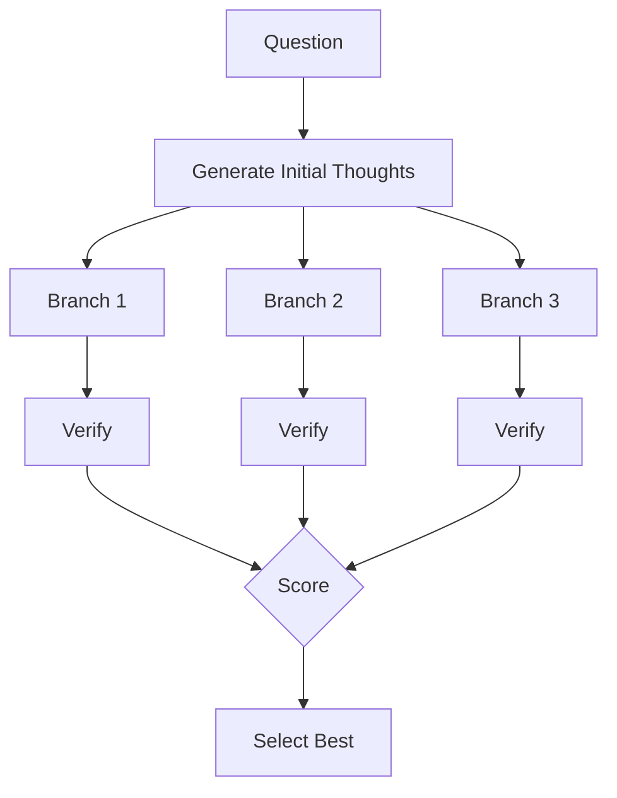
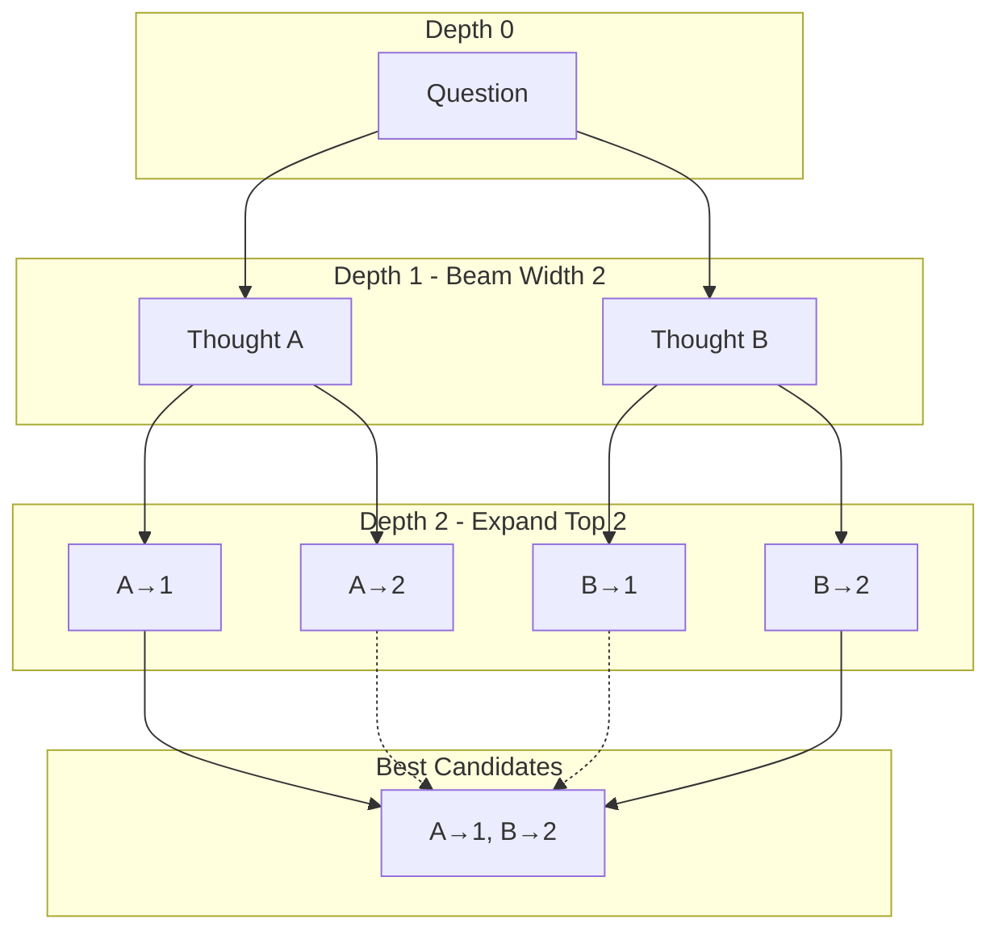
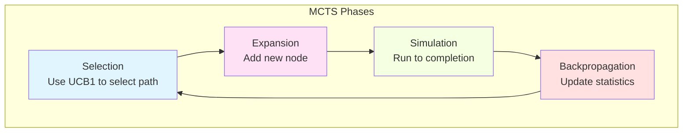
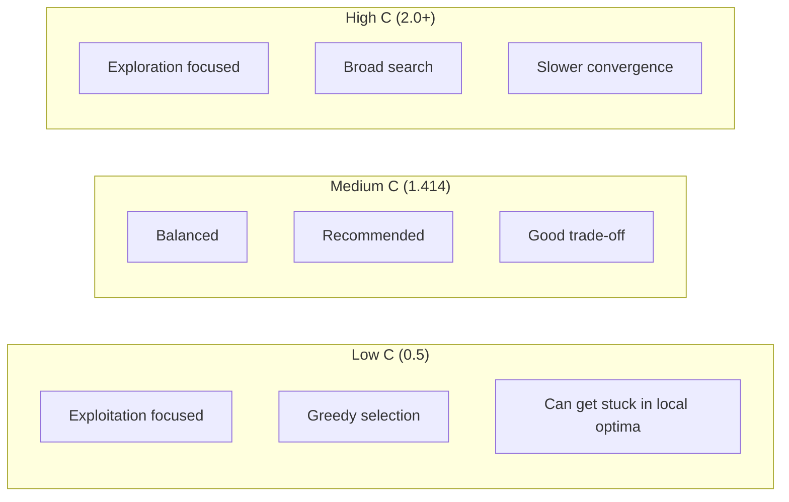
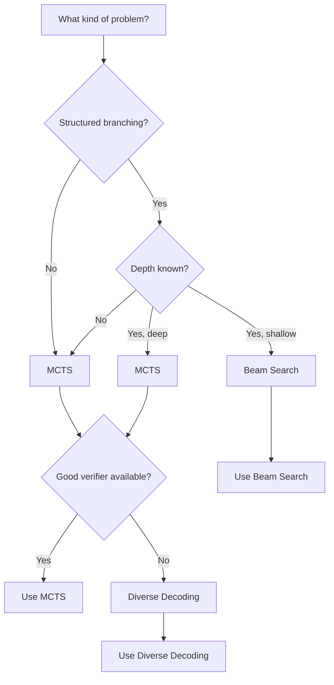

# Search Algorithms Guide

Search algorithms systematically explore the reasoning space to find optimal solutions. Jido.AI provides several search strategies for different problem types.

## Overview

Search algorithms explore multiple reasoning paths and select the best one based on verification scores.



## Algorithm Comparison

| Algorithm | Best For | Exploration | Memory | Speed |
|-----------|----------|-------------|--------|-------|
| **Beam Search** | Focused exploration | Systematic | Low | Fast |
| **MCTS** | Complex reasoning | Intelligent | Medium | Medium |
| **Diverse Decoding** | Creative tasks | Randomized | Low | Fast |

## Beam Search

Beam search maintains a fixed-size "beam" of top candidates at each depth, expanding and selecting the best.

### When to Use

- Problems with clear branching structure
- When you need systematic exploration
- Memory-constrained environments
- When depth is limited

### How It Works



### Example

```elixir
alias Jido.AI.Accuracy.BeamSearch

# Simple beam search
{:ok, best_path} = BeamSearch.search(
  "What is the square root of 144?",
  # Generator function
  fn thought ->
    ReqLLM.Generation.generate_text("anthropic:claude-haiku-4-5", [
      %{role: :user, content: "Continue reasoning: #{thought}"}
    ])
  end,
  # Verifier function
  fn candidate ->
    # Score the candidate
    String.contains?(candidate, "12") && !String.contains?(candidate, "maybe")
  end,
  beam_width: 3,
  depth: 2
)
```

### Configuration

| Parameter | Type | Default | Description |
|-----------|------|---------|-------------|
| `beam_width` | `integer()` | 5 | Number of candidates to keep |
| `depth` | `integer()` | 3 | Maximum expansion depth |
| `branching_factor` | `integer()` | 2 | Candidates per beam position |

### When to Use Beam Search

| Scenario | Recommendation |
|----------|----------------|
| Multi-step math | ✓ Good |
| Planning with limited steps | ✓ Good |
| Very deep exploration | ✗ Better with MCTS |
| Highly branching | ✗ Memory intensive |

## Monte Carlo Tree Search (MCTS)

MCTS uses intelligent exploration based on simulation results, balancing exploration and exploitation.

### When to Use

- Complex reasoning with many branches
- When evaluation is expensive
- Problems requiring deep exploration
- Game-like scenarios

### How It Works



### Example

```elixir
alias Jido.AI.Accuracy.MCTS

# MCTS search with LLM generation and verification
{:ok, best} = MCTS.search(
  "Solve: x^2 + 5x + 6 = 0 for x",
  # Generator: produces next reasoning step
  fn thought ->
    {:ok, response} = ReqLLM.Generation.generate_text(
      "anthropic:claude-3-5-sonnet-20241022",
      [%{role: :user, content: "Next step: #{thought}"}]
    )
    response.message.content
  end,
  # Verifier: scores the result
  fn result ->
    cond do
      String.contains?(result, "x = -2") -> 1.0
      String.contains?(result, "x = -3") -> 1.0
      String.contains?(result, "x = 2 or x = 3") -> 0.5
      true -> 0.0
    end
  end,
  simulations: 100,
  exploration_constant: 1.414
)
```

### Configuration

| Parameter | Type | Default | Description |
|-----------|------|---------|-------------|
| `simulations` | `integer()` | 100 | Number of MCTS simulations |
| `exploration_constant` | `float()` | 1.414 | UCB1 exploration weight (√2) |
| `max_depth` | `integer()` | 10 | Maximum tree depth |

### Exploration Constant

The exploration constant (C) controls the balance:



| C Value | Effect | Best For |
|---------|--------|----------|
| 0.5 - 1.0 | Exploit-focused | Well-understood problems |
| 1.414 (√2) | Balanced | **Most problems (default)** |
| 2.0+ | Explore-focused | Highly uncertain problems |

### When to Use MCTS

| Scenario | Recommendation |
|----------|----------------|
| Game playing | ✓ Excellent |
| Complex reasoning | ✓ Good |
| Limited branching | ✓ Works well |
| Very shallow problems | ✗ Overkill |
| Simple lookup | ✗ Overkill |

## Diverse Decoding

Diverse decoding uses random sampling with temperature to explore the solution space broadly.

### When to Use

- Creative brainstorming
- Exploring alternative solutions
- When diversity matters more than optimality
- Open-ended problems

### Example

```elixir
alias Jido.AI.Accuracy.DiverseDecoding

# Generate diverse candidates and select best
{:ok, best} = DiverseDecoding.search(
  "Propose 5 innovative features for a productivity app",
  # Generator with temperature
  fn ->
    ReqLLM.Generation.generate_text(
      "anthropic:claude-3-5-sonnet-20241022",
      [%{role: :user, content: "Innovative idea:"}],
      temperature: 0.9  # High temperature for diversity
    )
  end,
  num_samples: 10,
  selector: fn candidates ->
    # Select most creative
    Enum.max_by(candidates, &creativity_score/1)
  end
)
```

### Configuration

| Parameter | Type | Default | Description |
|-----------|------|---------|-------------|
| `num_samples` | `integer()` | 10 | Number of samples to generate |
| `temperature` | `float()` | 0.8 | Sampling temperature |
| `top_p` | `float()` | 0.9 | Nucleus sampling parameter |

## Algorithm Selection Guide

### Decision Tree



### Quick Reference

| If you want... | Use... |
|----------------|--------|
| Systematic, controlled exploration | Beam Search |
| Intelligent exploration with learning | MCTS |
| Maximum depth with limited resources | Beam Search |
| Creative, diverse alternatives | Diverse Decoding |
| Game-like scenarios | MCTS |

## Performance Comparison

### Resource Usage

```mermaid
graph LR
    subgraph "Beam Search"
        B1[O(depth × beam_width)]
    end

    subgraph "MCTS"
        M1[O(simulations × depth)]
    end

    subgraph "Diverse Decoding"
        D1[O(num_samples)]
    end
```

| Algorithm | Time | Memory | API Calls |
|-----------|------|--------|-----------|
| Beam Search | Low | Low | beam × depth |
| MCTS | Medium | Medium | simulations |
| Diverse Decoding | Low | Low | num_samples |

## Combining with Verification

Search algorithms work best with good verifiers:

```elixir
# Using LLM outcome verifier with search
alias Jido.AI.Accuracy.{MCTS, LLMOutcomeVerifier}

verifier = LLMOutcomeVerifier.new!(%{
  model: "anthropic:claude-haiku-4-5",
  score_range: {0, 1}
})

{:ok, best} = MCTS.search(
  query,
  generator: llm_generator,
  verifier: fn candidate ->
    {:ok, result} = LLMOutcomeVerifier.verify(verifier, candidate, %{
      prompt: query,
      context: %{}
    })
    result.score
  end
)
```

## Best Practices

1. **Start with Beam Search** for most problems
2. **Use MCTS** for complex, game-like scenarios
3. **Diverse Decoding** for creative exploration
4. **Always include verification** to guide search
5. **Tune parameters** based on problem characteristics

## Next Steps

- [Self-Consistency Guide](./03_self_consistency.md) - Alternative to search algorithms
- [Verification Guide](./06_verification.md) - Building good verifiers
- [Pipeline Guide](./12_pipeline.md) - Combining algorithms in workflows
