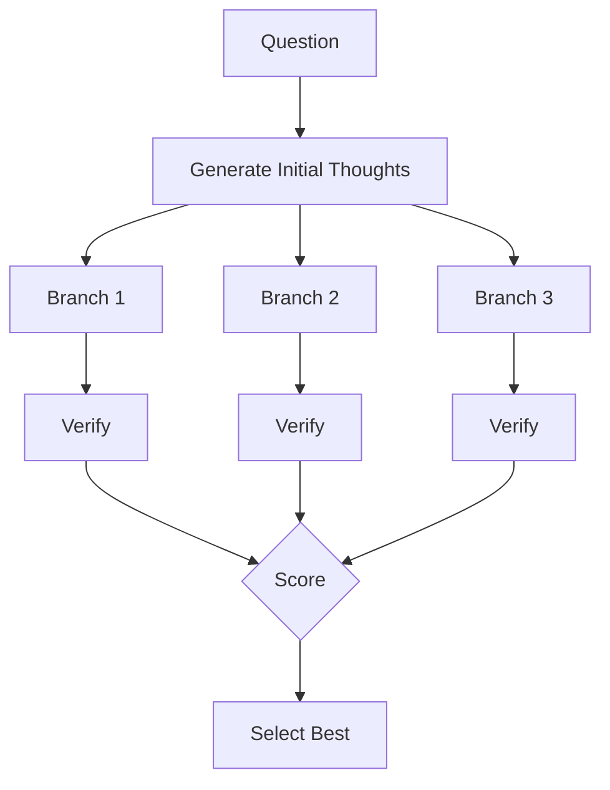
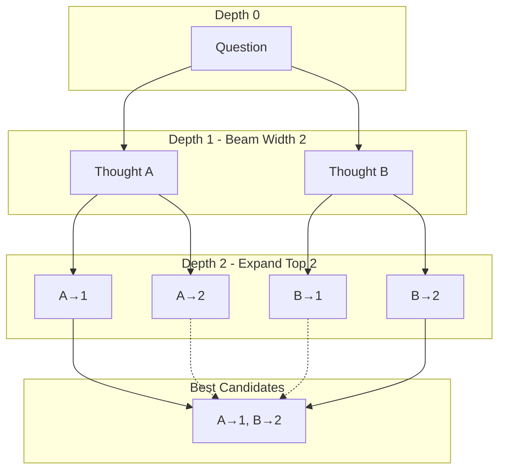
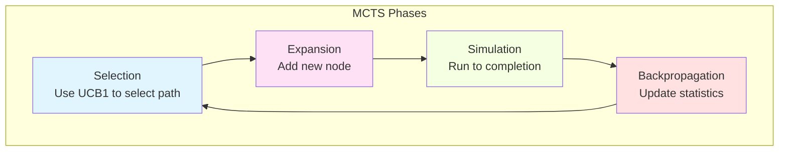
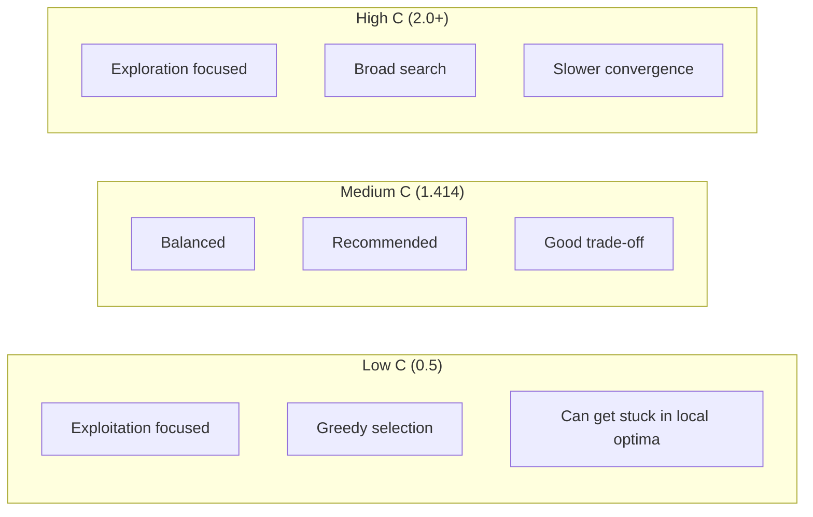
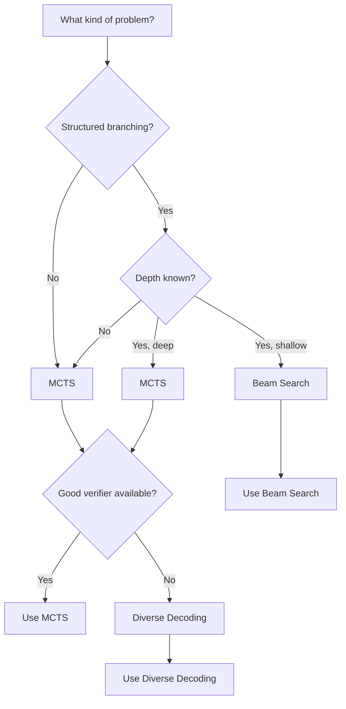
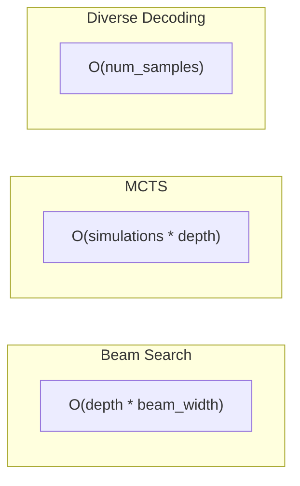

# Search Algorithms Guide

Search algorithms systematically explore the reasoning space to find optimal solutions. Jido.AI provides several search strategies for different problem types.

## Search Algorithms Overview

Search algorithms explore multiple reasoning paths and select the best one based on verification scores. Unlike single-shot generation or self-consistency's independent sampling, search algorithms explicitly model the reasoning process as a tree or graph structure and explore it strategically.

### The Role of Search in LLM Reasoning

Search algorithms address a fundamental limitation of LLMs: they generate responses in a single left-to-right pass without backtracking. Search introduces:

- **Explicit Exploration**: Multiple reasoning paths are considered
- **Backtracking**: Dead ends can be abandoned
- **Lookahead**: Future verification scores guide exploration
- **Pruning**: Low-potential paths are discarded early

### Algorithm Comparison

| Algorithm | Origin | Best For | Exploration | Memory | Speed |
|-----------|--------|----------|-------------|--------|-------|
| **Beam Search** | NLP/ASR (1977) | Focused exploration | Systematic | Low | Fast |
| **MCTS** | Game AI (2006) | Complex reasoning | Intelligent | Medium | Medium |
| **Diverse Decoding** | ML sampling | Creative tasks | Randomized | Low | Fast |

---

## Beam Search Algorithm

### Theoretical Foundation

Beam Search is a heuristic search algorithm developed in the context of speech recognition and natural language processing. It maintains a fixed-size "beam" of the most promising partial solutions at each step, pruning less promising branches to control computational cost.

Unlike breadth-first search (which expands all nodes) or depth-first search (which follows one path), beam search balances exploration and exploitation by keeping only the top-k candidates at each level.

### Algorithm Mechanics

```
Input: Initial state S, beam_width k, depth d, branch_factor b
Output: Best final state

1. beam = [S]  # Initial beam with starting state

2. For level = 1 to d:
   a. candidates = []
   b. For each state in beam:
      i. Generate b successors by applying expansion
      ii. Score each successor with verifier
      iii. Add to candidates
   c. Sort candidates by score (descending)
   d. beam = top k candidates  # Keep only beam_width
   e. If beam is empty: return error

3. Return highest-scoring state in beam
```

### Time and Space Complexity

| Aspect | Complexity |
|--------|------------|
| **Time** | O(d × k × b × E) |
| **Space** | O(k × L) |
| **Parallelizability** | O(k × b) |

Where d = depth, k = beam_width, b = branch_factor, E = evaluation cost, L = path length

### Key Properties

| Property | Value |
|----------|-------|
| **Completeness** | No (can miss optimal solution) |
| **Optimality** | No (heuristic) |
| **Beam Width Trade-off** | k=1 → greedy, k=∞ → BFS |
| **Best Depth** | 3-5 for most LLM tasks |
| **Memory Efficient** | Yes, compared to full BFS |

### When to Use Beam Search

- Problems with clear branching structure
- When you need systematic exploration
- Memory-constrained environments
- When depth is limited
- Multi-step math problems
- Planning with limited steps

---

## Monte Carlo Tree Search (MCTS) Algorithm

### Theoretical Foundation

Monte Carlo Tree Search was introduced by Coulom (2006) and famously powered AlphaGo's victory in 2016. MCTS combines random sampling (Monte Carlo) with tree search to intelligently explore decision spaces without requiring domain-specific heuristics.

The algorithm builds a search tree incrementally through four phases:
1. **Selection**: Traverse tree using UCB1 (Upper Confidence Bound) to select promising node
2. **Expansion**: Add new child node to tree
3. **Simulation**: Run random/rollout from new node to estimate value
4. **Backpropagation**: Update statistics up the path to root

### Algorithm Mechanics

```
Input: Initial state S, simulations N, exploration_constant C
Output: Best action

1. root = create_node(S)

2. For i = 1 to N:
   a. node = select(root, C)  # UCB1 selection
   b. node = expand(node)      # Add child if not terminal
   c. reward = simulate(node)  # Rollout to terminal
   d. backpropagate(node, reward)  # Update statistics

3. Return child of root with highest visit count

# UCB1 Formula:
UCB1(node) = (value / visits) + C × sqrt(ln(parent_visits) / visits)
```

### Time and Space Complexity

| Aspect | Complexity |
|--------|------------|
| **Time** | O(N × d × S) |
| **Space** | O(N × d) |
| **Parallelizability** | O(N) with root parallelization |

Where N = simulations, d = average depth, S = simulation cost

### Key Properties

| Property | Value |
|----------|-------|
| **Asymptotic Optimality** | Yes (with enough simulations) |
| **Anytime** | Yes (can stop early) |
| **Exploration Constant C** | 1.414 (√2) is theoretically optimal |
| **Convergence** | O(log N) regret bound |
| **Best For** | Game-like scenarios, complex reasoning |

### UCB1 Exploration Formula

The UCB1 (Upper Confidence Bound 1) formula balances exploitation and exploitation:

```
UCB1 = (wins / visits) + C × sqrt(ln(parent_visits) / visits)

├─ Exploitation term: wins / visits
│  └─ Average reward from this node
│
└─ Exploration term: C × sqrt(ln(parent_visits) / visits)
   └─ Encourages trying less-visited nodes
```

| C Value | Effect |
|---------|--------|
| 0.5 | Exploit-focused (greedy) |
| 1.414 | Balanced (theoretically optimal) |
| 2.0+ | Explore-focused |

### When to Use MCTS

- Complex reasoning with many branches
- When evaluation is expensive
- Problems requiring deep exploration
- Game-like scenarios
- When you need intelligent path selection

---

## Diverse Decoding Algorithm

### Theoretical Foundation

Diverse Decoding uses Maximal Marginal Relevance (MMR) to balance relevance and diversity when sampling from the LLM. Unlike beam search's focused exploration or MCTS's intelligent search, diverse decoding explicitly samples from different regions of the output distribution.

The algorithm is based on the observation that LLMs can produce diverse outputs with temperature > 0, and that exploring diverse alternatives can reveal better solutions than greedy decoding.

### Algorithm Mechanics

```
Input: Query Q, num_candidates N, lambda λ, similarity_threshold T
Output: Best candidate

1. Generate N candidates using temperature sampling
2. Score all candidates with verifier
3. Apply MMR to select diverse top-K:

   For each candidate i:
     MMR(i) = λ × relevance(i) - (1-λ) × max_similarity(i, selected)

4. Select candidate with highest MMR
5. Return selected candidate

# Where:
# relevance(i) = verifier score of candidate i
# max_similarity(i, selected) = highest similarity to any selected candidate
# lambda = relevance/diversity tradeoff (0.5 = balanced)
```

### MMR (Maximal Marginal Relevance) Formula

```
MMR(candidate, selected_set) = λ × relevance - (1-λ) × max_sim

Where:
- relevance: How good the candidate is (verifier score)
- max_sim: Maximum similarity to any already-selected candidate
- lambda: Tradeoff parameter
  - λ = 1.0 → Pure relevance (ignore diversity)
  - λ = 0.5 → Balanced (default)
  - λ = 0.0 → Pure diversity (maximize difference)
```

### Time and Space Complexity

| Aspect | Complexity |
|--------|------------|
| **Time** | O(N × G + N² × S) |
| **Space** | O(N × L) |
| **Parallelizability** | O(N) |

Where N = num_candidates, G = generation cost, S = similarity cost

### Key Properties

| Property | Value |
|----------|-------|
| **Completeness** | N/A (sampling-based) |
| **Diversity Guarantee** | Yes, via MMR |
| **Lambda Sensitivity** | High - determines behavior |
| **Best For** | Creative tasks, brainstorming |

### Similarity Metrics

| Metric | Description | Use Case |
|--------|-------------|----------|
| **Cosine** | Embedding cosine similarity | Semantic diversity |
| **Jaccard** | Token overlap Jaccard | Lexical diversity |
| **Levenshtein** | Edit distance | Structural diversity |
| **BERTScore** | Contextual similarity | Semantic nuance |

### When to Use Diverse Decoding

- Creative brainstorming
- Exploring alternative solutions
- When diversity matters more than optimality
- Open-ended problems
- Content generation (ideas, options)

---

## Overview

Search algorithms explore multiple reasoning paths and select the best one based on verification scores.



## Algorithm Comparison

| Algorithm | Best For | Exploration | Memory | Speed |
|-----------|----------|-------------|--------|-------|
| **Beam Search** | Focused exploration | Systematic | Low | Fast |
| **MCTS** | Complex reasoning | Intelligent | Medium | Medium |
| **Diverse Decoding** | Creative tasks | Randomized | Low | Fast |

## Beam Search

Beam search maintains a fixed-size "beam" of top candidates at each depth, expanding and selecting the best.

### When to Use

- Problems with clear branching structure
- When you need systematic exploration
- Memory-constrained environments
- When depth is limited

### How It Works



### Example

```elixir
alias Jido.AI.Accuracy.BeamSearch

# Simple beam search
{:ok, best_path} = BeamSearch.search(
  "What is the square root of 144?",
  # Generator function
  fn thought ->
    ReqLLM.Generation.generate_text("anthropic:claude-haiku-4-5", [
      %{role: :user, content: "Continue reasoning: #{thought}"}
    ])
  end,
  # Verifier function
  fn candidate ->
    # Score the candidate
    String.contains?(candidate, "12") && !String.contains?(candidate, "maybe")
  end,
  beam_width: 3,
  depth: 2
)
```

### Configuration

| Parameter | Type | Default | Description |
|-----------|------|---------|-------------|
| `beam_width` | `integer()` | 5 | Number of candidates to keep |
| `depth` | `integer()` | 3 | Maximum expansion depth |
| `branching_factor` | `integer()` | 2 | Candidates per beam position |

### When to Use Beam Search

| Scenario | Recommendation |
|----------|----------------|
| Multi-step math | ✓ Good |
| Planning with limited steps | ✓ Good |
| Very deep exploration | ✗ Better with MCTS |
| Highly branching | ✗ Memory intensive |

## Monte Carlo Tree Search (MCTS)

MCTS uses intelligent exploration based on simulation results, balancing exploration and exploitation.

### When to Use

- Complex reasoning with many branches
- When evaluation is expensive
- Problems requiring deep exploration
- Game-like scenarios

### How It Works



### Example

```elixir
alias Jido.AI.Accuracy.MCTS

# MCTS search with LLM generation and verification
{:ok, best} = MCTS.search(
  "Solve: x^2 + 5x + 6 = 0 for x",
  # Generator: produces next reasoning step
  fn thought ->
    {:ok, response} = ReqLLM.Generation.generate_text(
      "anthropic:claude-3-5-sonnet-20241022",
      [%{role: :user, content: "Next step: #{thought}"}]
    )
    response.message.content
  end,
  # Verifier: scores the result
  fn result ->
    cond do
      String.contains?(result, "x = -2") -> 1.0
      String.contains?(result, "x = -3") -> 1.0
      String.contains?(result, "x = 2 or x = 3") -> 0.5
      true -> 0.0
    end
  end,
  simulations: 100,
  exploration_constant: 1.414
)
```

### Configuration

| Parameter | Type | Default | Description |
|-----------|------|---------|-------------|
| `simulations` | `integer()` | 100 | Number of MCTS simulations |
| `exploration_constant` | `float()` | 1.414 | UCB1 exploration weight (√2) |
| `max_depth` | `integer()` | 10 | Maximum tree depth |

### Exploration Constant

The exploration constant (C) controls the balance:



| C Value | Effect | Best For |
|---------|--------|----------|
| 0.5 - 1.0 | Exploit-focused | Well-understood problems |
| 1.414 (√2) | Balanced | **Most problems (default)** |
| 2.0+ | Explore-focused | Highly uncertain problems |

### When to Use MCTS

| Scenario | Recommendation |
|----------|----------------|
| Game playing | ✓ Excellent |
| Complex reasoning | ✓ Good |
| Limited branching | ✓ Works well |
| Very shallow problems | ✗ Overkill |
| Simple lookup | ✗ Overkill |

## Diverse Decoding

Diverse decoding uses random sampling with temperature to explore the solution space broadly.

### When to Use

- Creative brainstorming
- Exploring alternative solutions
- When diversity matters more than optimality
- Open-ended problems

### Example

```elixir
alias Jido.AI.Accuracy.DiverseDecoding

# Generate diverse candidates and select best
{:ok, best} = DiverseDecoding.search(
  "Propose 5 innovative features for a productivity app",
  # Generator with temperature
  fn ->
    ReqLLM.Generation.generate_text(
      "anthropic:claude-3-5-sonnet-20241022",
      [%{role: :user, content: "Innovative idea:"}],
      temperature: 0.9  # High temperature for diversity
    )
  end,
  num_samples: 10,
  selector: fn candidates ->
    # Select most creative
    Enum.max_by(candidates, &creativity_score/1)
  end
)
```

### Configuration

| Parameter | Type | Default | Description |
|-----------|------|---------|-------------|
| `num_samples` | `integer()` | 10 | Number of samples to generate |
| `temperature` | `float()` | 0.8 | Sampling temperature |
| `top_p` | `float()` | 0.9 | Nucleus sampling parameter |

## Algorithm Selection Guide

### Decision Tree



### Quick Reference

| If you want... | Use... |
|----------------|--------|
| Systematic, controlled exploration | Beam Search |
| Intelligent exploration with learning | MCTS |
| Maximum depth with limited resources | Beam Search |
| Creative, diverse alternatives | Diverse Decoding |
| Game-like scenarios | MCTS |

## Performance Comparison

### Resource Usage



| Algorithm | Time | Memory | API Calls |
|-----------|------|--------|-----------|
| Beam Search | Low | Low | beam × depth |
| MCTS | Medium | Medium | simulations |
| Diverse Decoding | Low | Low | num_samples |

## Combining with Verification

Search algorithms work best with good verifiers:

```elixir
# Using LLM outcome verifier with search
alias Jido.AI.Accuracy.{MCTS, LLMOutcomeVerifier}

verifier = LLMOutcomeVerifier.new!(%{
  model: "anthropic:claude-haiku-4-5",
  score_range: {0, 1}
})

{:ok, best} = MCTS.search(
  query,
  generator: llm_generator,
  verifier: fn candidate ->
    {:ok, result} = LLMOutcomeVerifier.verify(verifier, candidate, %{
      prompt: query,
      context: %{}
    })
    result.score
  end
)
```

## Best Practices

1. **Start with Beam Search** for most problems
2. **Use MCTS** for complex, game-like scenarios
3. **Diverse Decoding** for creative exploration
4. **Always include verification** to guide search
5. **Tune parameters** based on problem characteristics

## Next Steps

- [Self-Consistency Guide](./03_self_consistency.md) - Alternative to search algorithms
- [Verification Guide](./06_verification.md) - Building good verifiers
- [Pipeline Guide](./12_pipeline.md) - Combining algorithms in workflows
