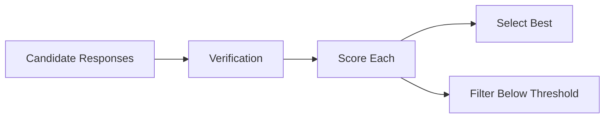
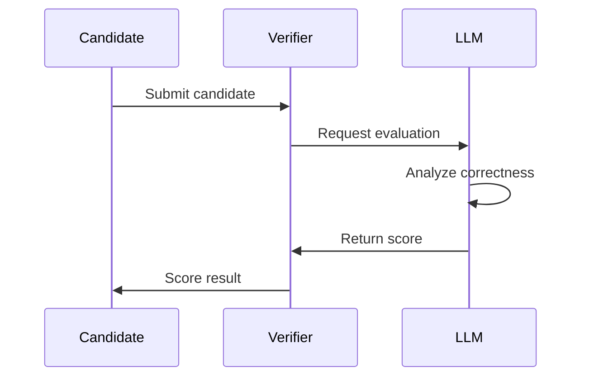
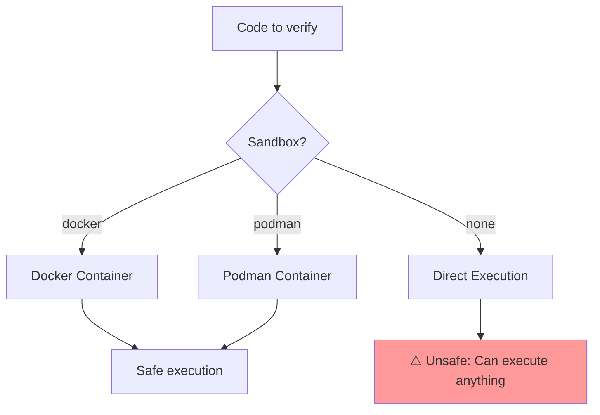

# Verification Guide

Verification is the process of validating and scoring candidate responses to ensure accuracy and quality.

## Overview

Verification provides automated assessment of LLM responses, enabling:
- Selection of best candidates
- Quality filtering
- Confidence estimation
- Error detection



## Verifier Types

| Verifier | Best For | Requires | Speed |
|----------|----------|----------|-------|
| **LLM Outcome** | General validation | LLM call | Slow |
| **Deterministic** | Math, logic | None | Fast |
| **Code Execution** | Code problems | Execution env | Medium |
| **Static Analysis** | Code review | Parser | Fast |
| **Unit Test** | Code validation | Test suite | Medium |

## LLM Outcome Verifier

Uses an LLM to evaluate response quality and correctness.

### When to Use

- Nuanced questions without clear answers
- Explaining concepts
- Open-ended reasoning
- When other verifiers don't apply

### How It Works



### Example

```elixir
alias Jido.AI.Accuracy.LLMOutcomeVerifier

# Create verifier
verifier = LLMOutcomeVerifier.new!(%{
  model: "anthropic:claude-haiku-4-5",
  score_range: {0, 100},
  temperature: 0.2
})

# Verify a candidate
{:ok, result} = LLMOutcomeVerifier.verify(verifier, "The answer is 42.", %{
  prompt: "What is the meaning of life?",
  context: %{}
})

# result.score: 75
# result.reasoning: "The answer is plausible but..."
```

### Configuration

| Parameter | Type | Default | Description |
|-----------|------|---------|-------------|
| `model` | `String.t()` | from Config | Model for verification |
| `score_range` | `{number(), number()}` | `{0, 1}` | Min/max scores |
| `temperature` | `float()` | 0.3 | Sampling temperature |
| `max_retries` | `integer()` | 2 | Retry failed verifications |

### Prompt Template

The verifier uses a structured prompt:

```
You are an expert evaluator. Score the following response to the question.

Question: {prompt}

Response: {candidate}

Provide:
1. A score from {min} to {max}
2. Brief reasoning

Format your response as JSON: {{"score": N, "reasoning": "..."}}
```

## Deterministic Verifier

Verifies answers using deterministic checks (exact match, patterns, etc.).

### When to Use

- Math problems with numeric answers
- Facts with known values
- Multiple choice questions
- When ground truth is available

### Example

```elixir
alias Jido.AI.Accuracy.DeterministicVerifier

# Exact match verification
verifier = DeterministicVerifier.new!(%{
  check_type: :exact_match,
  expected: "Paris"
})

{:ok, result} = DeterministicVerifier.verify(verifier, "Paris", %{})
# result.score: 1.0
# result.passed?: true

# Numeric range verification
verifier = DeterministicVerifier.new!(%{
  check_type: :numeric_range,
  min: 40,
  max: 45
})

{:ok, result} = DeterministicVerifier.verify(verifier, "42", %{})
# result.score: 1.0

# Pattern verification
verifier = DeterministicVerifier.new!(%{
  check_type: :pattern_match,
  pattern: ~r/\d{3}-\d{3}-\d{4}/  # Phone number
})

{:ok, result} = DeterministicVerifier.verify(verifier, "555-123-4567", %{})
# result.score: 1.0
```

### Check Types

| Type | Description | Example |
|------|-------------|---------|
| `:exact_match` | Exact string match | "Paris" == "Paris" |
| `:numeric_range` | Number within range | 42 in [40, 45] |
| `:pattern_match` | Regex pattern match | Phone numbers |
| `:contains` | Contains substring | Answer contains key term |

## Code Execution Verifier

Executes code to verify correctness.

### When to Use

- Programming problems
- Algorithm verification
- Code debugging
- When execution is safe

### Example

```elixir
alias Jido.AI.Accuracy.CodeExecutionVerifier

# Create verifier with sandbox
verifier = CodeExecutionVerifier.new!(%{
  sandbox: :docker,  # or :none for unsafe execution
  timeout: 5000
})

# Verify code by running it
{:ok, result} = CodeExecutionVerifier.verify(verifier, """
def add(a, b):
    return a + b

print(add(2, 3))
""", %{
  language: :python
})

# result.score: 1.0 if output is "5"
# result.output: "5"
# result.passed?: true
```

### Safety



| Sandbox | Safety | Use Case |
|---------|--------|----------|
| `:docker` | High | Production systems |
| `:podman` | High | Production systems |
| `:none` | None | Trusted environments only |

## Static Analysis Verifier

Analyzes code without executing it using static analysis.

### When to Use

- Code review tasks
- Syntax verification
- Style checking
- When execution is not possible

### Example

```elixir
alias Jido.AI.Accuracy.StaticAnalysisVerifier

verifier = StaticAnalysisVerifier.new!(%{
  language: :elixir,
  checks: [:syntax, :format, :complexity]
})

{:ok, result} = StaticAnalysisVerifier.verify(verifier, """
defmodule Math do
  def add(a, b), do: a + b
end
""", %{})

# result.score: 1.0
# result.issues: []
# result.passed?: true
```

### Available Checks

| Check | Description |
|-------|-------------|
| `:syntax` | Valid syntax |
| `:format` | Proper formatting |
| `:complexity` | Reasonable complexity |
| `:security` | Security issues |

## Unit Test Verifier

Runs unit tests against code to verify correctness.

### When to Use

- Function verification
- API testing
- When tests are available

### Example

```elixir
alias Jido.AI.Accuracy.UnitTestVerifier

verifier = UnitTestVerifier.new!(%{
  test_framework: :exunit,
  timeout: 5000
})

{:ok, result} = UnitTestVerifier.verify(verifier, """
defmodule Calculator do
  def add(a, b), do: a + b
end
""", %{
  tests: [
    ~s/test "add/2 returns sum" do/,
    ~s/assert Calculator.add(2, 3) == 5/
  ]
})
```

## Combining Verifiers

For robust verification, combine multiple verifiers:

```elixir
alias Jido.AI.Accuracy.{LLMOutcomeVerifier, DeterministicVerifier, CompositeVerifier}

# Create composite verifier
verifier = CompositeVerifier.new!(%{
  verifiers: [
    {DeterministicVerifier, %{check_type: :numeric_range, min: 40, max: 45}},
    {LLMOutcomeVerifier, %{model: :fast, score_range: {0, 1}}}
  ],
  aggregation: :average  # or :min, :max, :weighted
})

# Verify - all verifiers run
{:ok, result} = CompositeVerifier.verify(verifier, "42", %{
  prompt: "What is 6 * 7?"
})

# result.score: Average of all verifier scores
# result.individual_scores: [1.0, 0.9]
```

## Verification in Search

Verifiers guide search algorithms:

```elixir
alias Jido.AI.Accuracy.{BeamSearch, DeterministicVerifier}

# Use verifier with beam search
verifier = DeterministicVerifier.new!(%{
  check_type: :exact_match,
  expected: "345"
})

{:ok, best} = BeamSearch.search(
  "What is 15 * 23?",
  generator: &llm_generate/1,
  verifier: fn candidate ->
    {:ok, result} = DeterministicVerifier.verify(verifier, candidate, %{})
    result.score
  end
)
```

## Building Custom Verifiers

Create custom verifiers for specific use cases:

```elixir
defmodule MyApp.DomainVerifier do
  @behaviour Jido.AI.Accuracy.Verifier

  def new(opts) do
    struct(__MODULE__, opts)
  end

  def verify(verifier, candidate, context) do
    # Custom verification logic
    score = calculate_score(verifier, candidate, context)

    {:ok, %{
      score: score,
      passed?: score >= verifier.threshold,
      details: %{
        verifier: :domain_custom,
        timestamp: System.system_time()
      }
    }}
  end

  defp calculate_score(verifier, candidate, context) do
    # Your scoring logic
    cond do
      domain_check?(candidate) -> 1.0
      partial_check?(candidate) -> 0.5
      true -> 0.0
    end
  end
end
```

## Best Practices

1. **Use deterministic verification when possible** - fastest and most reliable
2. **Combine verification methods** - multiple approaches increase confidence
3. **Cache verification results** - for repeated candidates
4. **Handle edge cases** - malformed responses, timeouts, etc.
5. **Score calibration** - ensure scores are meaningful across verifiers

## Next Steps

- [Self-Consistency Guide](./03_self_consistency.md) - Use verification with aggregation
- [Search Algorithms Guide](./05_search_algorithms.md) - Verification-guided search
- [Pipeline Guide](./12_pipeline.md) - Verification stages in pipelines
