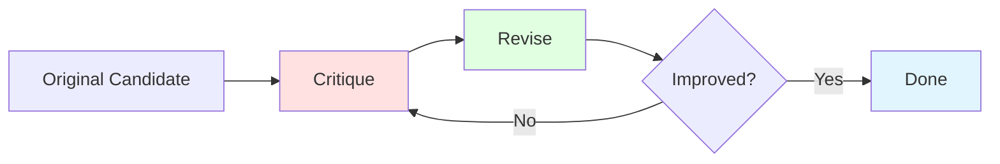
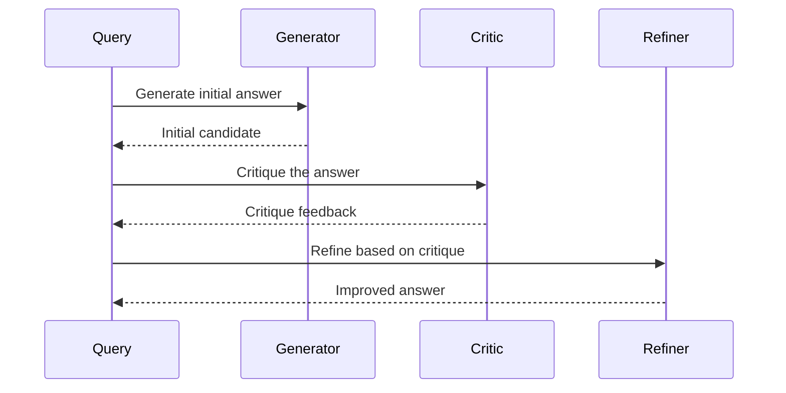
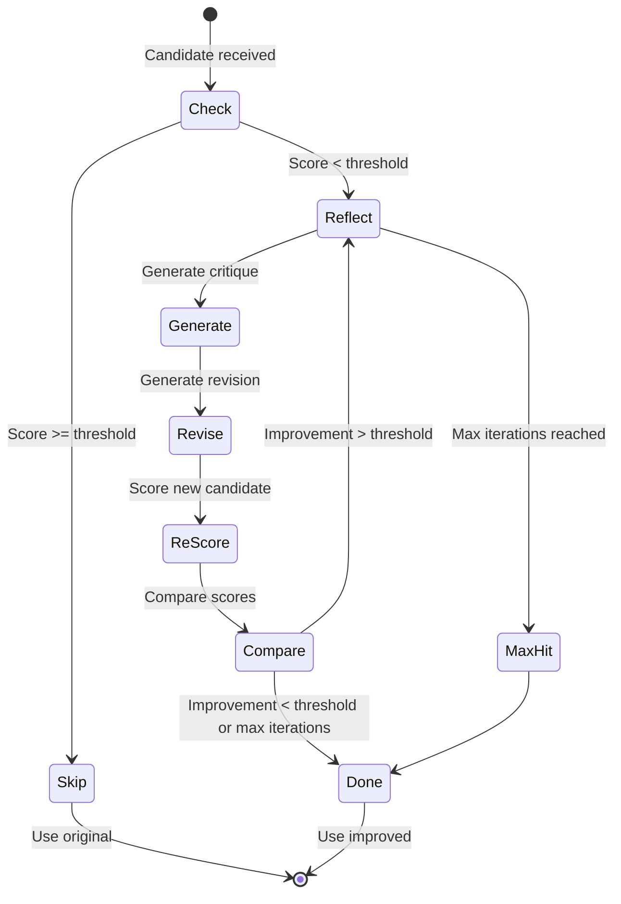

# Reflection and Self-Refine Guide

Reflection improves candidate answers through iterative critique and revision cycles.

## Overview

Reflection identifies low-quality candidates and improves them through targeted refinement:



## When to Use Reflection

| Scenario | Good Fit? | Reason |
|----------|-----------|--------|
| Initial low-quality responses | ✓ | Can be improved |
| Complex reasoning | ✓ | Benefits from iteration |
| Simple factual questions | ✗ | Unnecessary overhead |
| Time-critical responses | ✗ | Adds latency |

## Self-Refine

Single-pass self-improvement through critique and refinement.

### When to Use

- Quick improvements with minimal overhead
- When latency matters
- Single refinement iteration is sufficient

### Example

```elixir
alias Jido.AI.Accuracy.SelfRefine

# Create self-refine strategy
refine = SelfRefine.new!(%{
  model: "anthropic:claude-3-5-sonnet-20241022",
  temperature: 0.7
})

# Run self-refinement
{:ok, result} = SelfRefine.run(
  "What is 15 * 23?",
  strategy: refine
)

# result.original: Original candidate
# result.refined_candidate: Improved candidate
# result.improvement: Score increase
```

### How It Works



### Configuration

| Parameter | Type | Default | Description |
|-----------|------|---------|-------------|
| `model` | `String.t()` | from Config | Model for generation/critique/refine |
| `temperature` | `float()` | 0.7 | Sampling temperature |
| `timeout` | `integer()` | 30000 | Timeout in ms |

## Reflection Stage

Multi-iteration reflection with configurable stopping conditions.

### When to Use

- Candidates need significant improvement
- Multiple refinement iterations may help
- Quality scoring is available

### Example

```elixir
alias Jido.AI.Accuracy.ReflectionStage

stage = ReflectionStage.new(%{
  min_score_threshold: 0.7,
  max_iterations: 3,
  convergence_threshold: 0.1
})

# Reflect on a low-scoring candidate
{:ok, improved} = ReflectionStage.reflect(
  stage,
  original_candidate,
  scorer: fn candidate ->
    # Score the candidate (0-1)
    score_candidate(candidate)
  end,
  generator: fn prompt, critique ->
    # Generate refinement based on critique
    ReqLLM.Generation.generate_text(model, [
      %{role: :system, content: "Improve the answer based on critique."},
      %{role: :user, content: "Original: #{prompt}\nCritique: #{critique}"}
    ])
  end
)
```

### Configuration

| Parameter | Type | Default | Description |
|-----------|------|---------|-------------|
| `min_score_threshold` | `float()` | 0.7 | Skip reflection if score above this |
| `max_iterations` | `integer()` | 3 | Maximum refinement iterations |
| `convergence_threshold` | `float()` | 0.1 | Stop if improvement below this |

### Reflection Flow



## Reflection Loop

Complete reflection system with critique and revision components.

### When to Use

- Building custom reflection workflows
- Need access to intermediate critiques
- Want to control the reflection process

### Example

```elixir
alias Jido.AI.Accuracy.ReflectionLoop

loop = ReflectionLoop.new(%{
  max_iterations: 3,
  improvement_threshold: 0.1
})

# Run full reflection loop
{:ok, result} = ReflectionLoop.run(
  loop,
  "Explain quantum computing",
  critic: &MyCritic.critique/1,
  reviser: &MyReviser.revise/2,
  scorer: &MyScorer.score/1
)

# result.final_answer: Improved answer
# result.critiques: List of critiques
# result.iterations: Number of iterations
```

## Critique and Revision Components

### Critiquers

```elixir
alias Jido.AI.Accuracy.Critiquers.LLMCritiquer

critic = LLMCritiquer.new!(%{
  model: "anthropic:claude-haiku-4-5",
  critique_as: :constructive  # or :critical, :balanced
})

{:ok, critique} = LLMCritiquer.critique(critic, "Paris is the capital of Germany.", %{
  question: "What is the capital of Germany?"
})

# critique.feedback: "The answer is incorrect. Berlin is the capital..."
# critique.score: 0.2
```

### Revisers

```elixir
alias Jido.AI.Accuracy.Revisers.LLMReviser

reviser = LLMReviser.new!(%{
  model: "anthropic:claude-3-5-sonnet-20241022",
  revision_strategy: :targeted  # or :full
})

{:ok, revision} = LLMReviser.revise(reviser, "Paris is the capital.", %{
  original: "Paris is the capital of Germany.",
  critique: "The answer is incorrect. Berlin is the capital..."
})

# revision.revised: "Berlin is the capital of Germany."
```

## Using Reflection with Self-Consistency

Combine reflection with self-consistency for better candidates:

```elixir
alias Jido.AI.Accuracy.{SelfConsistency, ReflectionStage}

# Generate candidates with reflection
{:ok, best, metadata} = SelfConsistency.run(
  "What are the implications of AI for healthcare?",
  num_candidates: 5,
  generator: fn query ->
    # Generate initial candidate
    {:ok, initial} = generate_initial(query)

    # Reflect on it
    stage = ReflectionStage.new(%{min_score_threshold: 0.6})
    {:ok, reflected} = ReflectionStage.reflect(stage, initial,
      scorer: &score_candidate/1,
      generator: &generate_refinement/2
    )

    {:ok, reflected.final_answer}
  end
)
```

## Best Practices

### When Reflection Helps Most

| Candidate Quality | Reflection Impact | Recommendation |
|------------------|-------------------|----------------|
| High (0.8+) | Minimal | Skip reflection |
| Medium (0.5-0.8) | Moderate | 1-2 iterations |
| Low (<0.5) | Significant | 2-3 iterations |

### Configuration Tips

```elixir
# For cost-sensitive: lower threshold
stage = ReflectionStage.new(%{
  min_score_threshold: 0.5,  # Only reflect on poor candidates
  max_iterations: 1
})

# For quality-focused: higher threshold
stage = ReflectionStage.new(%{
  min_score_threshold: 0.8,  # Reflect on most candidates
  max_iterations: 3,
  convergence_threshold: 0.05  # Keep trying to improve
})

# Balanced approach
stage = ReflectionStage.new(%{
  min_score_threshold: 0.7,
  max_iterations: 2,
  convergence_threshold: 0.1
})
```

## Next Steps

- [Critique and Revision Guide](./08_critique_revision.md) - Detailed critique/revision
- [Pipeline Guide](./12_pipeline.md) - Reflection stages in pipelines
- [Calibration Guide](./10_confidence_calibration.md) - Calibrating confidence scores
