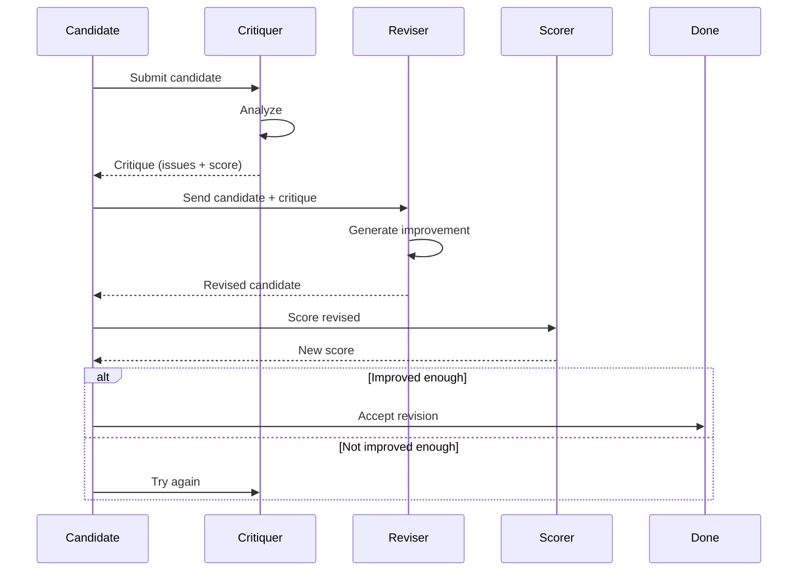

# Critique and Revision Guide

Critique and revision components provide detailed analysis and improvement of candidate responses.

## Overview

The critique-revision pattern analyzes responses for quality issues and generates targeted improvements.


## Critique Component

Analyzes a candidate response to identify issues and provide feedback.

### LLM Critiquer

```elixir
alias Jido.AI.Accuracy.Critiquers.LLMCritiquer

# Create critic
critic = LLMCritiquer.new!(%{
  model: "anthropic:claude-haiku-4-5",
  critique_as: :constructive
})

# Generate critique
{:ok, critique} = LLMCritiquer.critique(critic, "42", %{
  question: "What is 15 * 23?",
  expected: "345"
})

# critique.feedback: "The answer is incorrect..."
# critique.score: 0.0
# critique.issues: ["wrong calculation", "no reasoning shown"]
```

### Critique Styles

| Style | Description | Best For |
|-------|-------------|----------|
| `:constructive` | Helpful, actionable feedback | Learning, improvement |
| `:critical` | Direct criticism | Error detection |
| `:balanced` | Mix of positive and negative | General use |

### Example with Different Styles

```elixir
# Constructive critique
constructive = LLMCritiquer.new!(%{
  model: :fast,
  critique_as: :constructive
})

# Critical critique
critical = LLMCritiquer.new!(%{
  model: :fast,
  critique_as: :critical
})

# Balanced critique
balanced = LLMCritiquer.new!(%{
  model: :fast,
  critique_as: :balanced
})
```

## Tool Critiquer

Specialized critic for tool-using responses (ReAct agents).

```elixir
alias Jido.AI.Accuracy.Critiquers.ToolCritiquer

critic = ToolCritiquer.new!(%{
  model: :fast
})

# Critique a tool-using response
{:ok, critique} = ToolCritiquer.critique(critic, """
I used the calculator to compute 15 * 23 = 345
""", %{
  question: "What is 15 * 23?",
  tools_used: [:calculator]
})

# critique.tool_use_correct: true
# critique.result_correct: true
# critique.feedback: "Tool usage was correct..."
```

### Tool Critique Aspects

| Aspect | What It Checks |
|--------|---------------|
| Tool selection | Was the right tool chosen? |
| Tool parameters | Were parameters correct? |
| Result interpretation | Was result interpreted correctly? |
| Efficiency | Was the tool use necessary? |

## Revision Component

Generates improved versions based on critique feedback.

### LLM Reviser

```elixir
alias Jido.AI.Accuracy.Revisers.LLMReviser

# Create reviser
reviser = LLMReviser.new!(%{
  model: "anthropic:claude-3-5-sonnet-20241022",
  revision_strategy: :targeted
})

# Generate revision
{:ok, revision} = LLMReviser.revise(reviser, "Paris", %{
  original: "The capital of Germany is Paris.",
  critique: "Incorrect. Berlin is the capital of Germany."
})

# revision.revised: "Berlin is the capital of Germany."
# revision.changes: ["Corrected city name"]
# revision.improvement: 1.0
```

### Revision Strategies

| Strategy | Description | Best For |
|----------|-------------|----------|
| `:full` | Complete rewrite | Severely flawed responses |
| `:targeted` | Fix specific issues | Mostly correct responses |
| `:minimal` | Small corrections | Minor issues |

### Example with Different Strategies

```elixir
# Full rewrite
full = LLMReviser.new!(%{
  model: :capable,
  revision_strategy: :full
})

# Targeted fixes
targeted = LLMReviser.new!(%{
  model: :capable,
  revision_strategy: :targeted
})

# Minimal corrections
minimal = LLMReviser.new!(%{
  model: :capable,
  revision_strategy: :minimal
})
```

## Targeted Reviser

Specialized reviser that focuses on specific issues.

```elixir
alias Jido.AI.Accuracy.Revisers.TargetedReviser

reviser = TargetedReviser.new!(%{
  model: :capable,
  focus_areas: [:factual_accuracy, :reasoning_quality]
})

{:ok, revision} = TargetedReviser.revise(reviser, candidate, %{
  critique: critique,
  focus_areas: [:factual_accuracy]
})
```

## Complete Critique-Revision Workflow



### Example Workflow

```elixir
alias Jido.AI.Accuracy.{Critiquers.LLMCritiquer, Revisers.LLMReviser}

def critique_and_revise(candidate, question) do
  critic = LLMCritiquer.new!(%{model: :fast, critique_as: :constructive})
  reviser = LLMReviser.new!(%{model: :capable, revision_strategy: :targeted})

  # Critique
  {:ok, critique} = LLMCritiquer.critique(critic, candidate, %{question: question})

  # Decide if revision needed
  if critique.score < 0.8 do
    # Revise
    {:ok, revision} = LLMReviser.revise(reviser, candidate, %{
      original: candidate,
      critique: critique.feedback
    })

    {:improved, revision.revised, critique.score, revision.improvement}
  else
    {:good_enough, candidate, critique.score, 0}
  end
end
```

## Iterative Critique-Revision

Multiple rounds of critique and revision:

```elixir
def iterative_improvement(initial, question, max_iterations \\ 3) do
  critic = LLMCritiquer.new!(%{model: :fast, critique_as: :constructive})
  reviser = LLMReviser.new!(%{model: :capable, revision_strategy: :targeted})

  improve(initial, question, critic, reviser, 0, max_iterations)
end

defp improve(candidate, question, critic, reviser, iteration, max) do
  # Critique
  {:ok, critique} = LLMCritiquer.critique(critic, candidate, %{question: question})

  # Check if good enough
  if critique.score >= 0.9 or iteration >= max_iterations
    {:ok, candidate, critique.score, iteration}
  else
    # Revise
    {:ok, revision} = LLMReviser.revise(reviser, candidate, %{
      original: candidate,
      critique: critique.feedback
    })

    # Continue improving
    improve(revision.revised, question, critic, reviser, iteration + 1, max)
  end
end
```

## Combining with Other Techniques

### With Self-Consistency

```elixir
# Critique and revise before aggregation
{:ok, candidates} = generate_candidates(query, 5)

# Critique and revise each
improved = Enum.map(candidates, fn candidate ->
  {:ok, critique} = LLMCritiquer.critique(critic, candidate, %{})
  if critique.score < 0.7 do
    {:ok, revision} = LLMReviser.revise(reviser, candidate, %{critique: critique})
    revision.revised
  else
    candidate
  end
end)

# Now aggregate improved candidates
best = aggregate_by_majority(improved)
```

### With Verification

```elixir
# Use verification to guide critique
{:ok, verification} = Verifier.verify(candidate, %{})

# Generate targeted critique based on verification
{:ok, critique} = LLMCritiquer.critique(critic, candidate, %{
  verification_issues: verification.issues
})
```

## Best Practices

1. **Match critique style to use case** - constructive for learning, critical for error detection
2. **Use targeted revision when possible** - more efficient than full rewrites
3. **Set appropriate thresholds** - don't revise good candidates
4. **Limit iterations** - avoid infinite loops
5. **Track improvements** - measure if revision actually helps

## Next Steps

- [Reflection Guide](./07_reflection.md) - Iterative reflection patterns
- [Verification Guide](./06_verification.md) - Using verification with critique
- [Pipeline Guide](./12_pipeline.md) - Complete workflows
