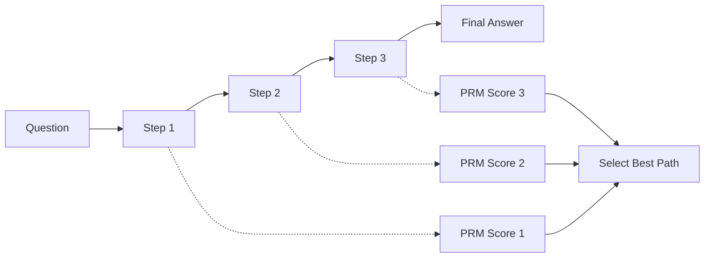

# Process Reward Model (PRM) Guide

Process Reward Models evaluate intermediate reasoning steps, not just final answers.

## Overview

Unlike outcome reward models that score only the final answer, PRMs evaluate each step of reasoning, providing granular feedback.



## When to Use PRM

| Scenario | PRM Benefit | Outcome Model Comparison |
|----------|------------|------------------------|
| Multi-step reasoning | ✓ Evaluates each step | Only evaluates final answer |
| Error detection | ✓ Identifies where reasoning fails | Can't locate error |
| Guiding search | ✓ Provides per-step guidance | Only end-point guidance |
| Simple questions | ✗ Overkill | ✓ Sufficient |

## LLM PRM

Uses an LLM to score each reasoning step.

### Basic Usage

```elixir
alias Jido.AI.Accuracy.PRMS.LLMPrm

# Create PRM
prm = LLMPrm.new!(%{
  model: "anthropic:claude-haiku-4-5",
  score_range: {0, 1}
})

# Classify a reasoning step
{:ok, classification} = LLMPrm.classify_step(prm,
  "First, I'll multiply 15 by 23 to get 345.",
  %{
    question: "What is 15 * 23?",
    step_number: 1
  }
)

# classification.score: 0.9
# classification.label: :good
# classification.reasoning: "Correct approach to multiplication"
```

### Step Classification

```elixir
# Steps can be classified as:
:good      # Correct reasoning
:bad       # Incorrect reasoning
:neutral   # Uncertain or irrelevant
:partial   # Partially correct
```

### Full Example with Multi-Step Reasoning

```elixir
alias Jido.AI.Accuracy.PRMS.LLMPrm

prm = LLMPrm.new!(%{
  model: :fast,
  score_range: {0, 1}
})

# Evaluate a chain of reasoning
reasoning_steps = [
  "First, I recognize this as a quadratic equation.",
  "I'll use the quadratic formula: x = (-b ± √(b²-4ac)) / 2a",
  "For x² + 5x + 6 = 0, we have a=1, b=5, c=6",
  "Plugging in: x = (-5 ± √(25-24)) / 2",
  "x = (-5 ± 1) / 2",
  "So x = -2 or x = -3"
]

# Classify each step
classifications = Enum.map(reasoning_steps, fn step ->
  {:ok, cls} = LLMPrm.classify_step(prm, step, %{
    question: "Solve: x² + 5x + 6 = 0",
    context: "quadratic equation solving"
  })
  cls
end)

# Find problematic steps
problematic = Enum.filter(classifications, fn cls ->
  cls.label in [:bad, :partial]
end)

# Overall path score
overall_score = Enum.map(classifications, & &1.score)
  |> Enum.sum()
  |> Kernel./(length(classifications))
```

## PRM Aggregation

Combining step scores into overall assessment.

```elixir
alias Jido.AI.Accuracy.PRM

# Average score
{:ok, result} = PRM.aggregate_scores(classifications,
  method: :average
)

# Minimum score (conservative)
{:ok, result} = PRM.aggregate_scores(classifications,
  method: :min
)

# Weighted average (recent steps weighted more)
{:ok, result} = PRM.aggregate_scores(classifications,
  method: :weighted,
  weights: [0.1, 0.2, 0.3, 0.4]
)
```

### Aggregation Methods

| Method | Description | Best For |
|--------|-------------|----------|
| `:average` | Simple average of all scores | General use |
| `:min` | Take minimum score | Conservative (any bad step fails) |
| `:max` | Take maximum score | Optimistic |
| `:weighted` | Weighted average | When later steps matter more |
| `:product` | Product of all scores | Strict (any zero fails) |

## Using PRM with Search

PRMs guide search algorithms by evaluating reasoning paths:

```elixir
alias Jido.AI.Accuracy.{MCTS, LLMPrm}

prm = LLMPrm.new!(%{model: :fast})

# Search with PRM-guided node evaluation
{:ok, best_path} = MCTS.search(
  "If 3x + 7 = 22, what is x² + 2x?",
  generator: &generate_next_step/1,
  # Use PRM to score partial paths
  verifier: fn path ->
    scores = Enum.map(path.steps, fn step ->
      {:ok, cls} = LLMPrm.classify_step(prm, step, %{
        question: path.question
      })
      cls.score
    end)

    # Aggregate step scores
    Enum.sum(scores) / length(scores)
  end,
  simulations: 50
)
```

## PRM in Pipeline

Integrate PRM into accuracy pipelines:

```elixir
alias Jido.AI.Accuracy.Pipeline

{:ok, pipeline} = Pipeline.new(%{
  stages: [
    {:generation, %{
      generator: &my_generator/1,
      num_candidates: 3
    }},
    {:prm_scoring, %{
      prm: LLMPrm.new!(%{model: :fast}),
      threshold: 0.6  # Filter candidates below this
    }},
    {:aggregation, %{
      method: :weighted
    }}
  ]
})
```

## Best Practices

1. **Use for complex reasoning** - multi-step math, logic problems
2. **Set appropriate thresholds** - not all steps need to be perfect
3. **Combine with outcome verification** - PRM + final check is powerful
4. **Consider cost** - PRM requires additional LLM calls per step
5. **Cache classifications** - repeated steps can be cached

## Next Steps

- [Search Algorithms Guide](./05_search_algorithms.md) - PRM-guided search
- [Verification Guide](./06_verification.md) - Combining process and outcome verification
- [Pipeline Guide](./12_pipeline.md) - Complete PRM workflows
