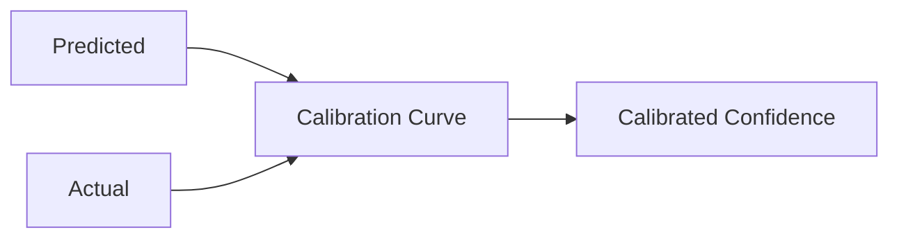
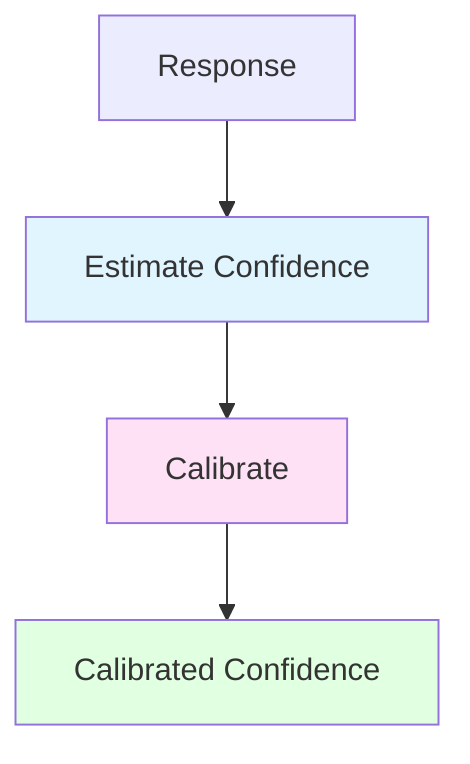
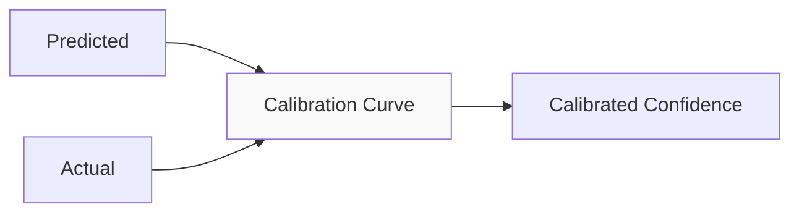
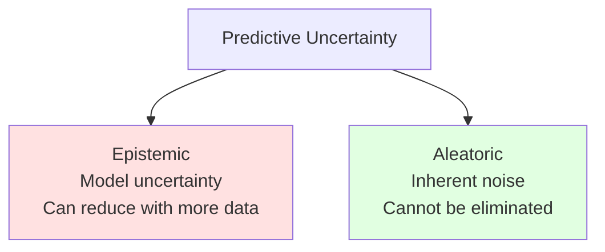

# Confidence Estimation and Calibration Guide

Confidence estimation and calibration ensure that AI systems express appropriate uncertainty levels.

## The Confidence Calibration Problem

LLMs often express **misaligned confidence**—they can be highly confident in incorrect answers and underconfident in correct ones. Calibration is the process of adjusting predicted confidence to match actual accuracy rates.

### Theoretical Foundation

A well-calibrated model satisfies:
```
P(correct | predicted_confidence = p) = p
```

For example, if a model predicts 80% confidence on 100 answers, approximately 80 should be correct.

**Key Insight**: Raw LLM confidence (from logprobs or verbal expressions) is systematically misaligned and requires calibration.

### Calibration Curve



- **Perfect calibration**: Points fall on diagonal
- **Overconfidence**: Points fall below diagonal (common in LLMs)
- **Underconfidence**: Points fall above diagonal

### Calibration Methods

| Method | Description | Best For |
|--------|-------------|----------|
| **Temperature Scaling** | Single parameter scaling | Probabilistic outputs |
| **Platt Scaling** | Logistic regression | Small datasets |
| **Isotonic Regression** | Monotonic piecewise function | Large datasets |
| **Bin-based** | Map confidence bins to accuracy | Simple cases |

### Time and Space Complexity

| Aspect | Complexity |
|--------|------------|
| **Estimation** | O(E) | E = estimator cost |
| **Calibration** | O(N × log N) | N = calibration samples |
| **Inference** | O(1) | Lookup |

## Overview

Confidence estimation predicts how likely a response is correct, while calibration ensures predicted confidence matches actual accuracy.



## When to Use

| Scenario | Need Confidence |
|----------|-----------------|
| Medical diagnosis | ✓ High certainty required |
- Financial predictions | ✓ Risk assessment |
- Uncertain queries | ✓ Express uncertainty |
- Simple facts | ✗ Usually unnecessary |

## Confidence Estimation

### Ensemble Confidence Estimator

```elixir
alias Jido.AI.Accuracy.ConfidenceEstimator

# Use ensemble method
estimator = ConfidenceEstimator.new!(%{
  method: :ensemble
})

{:ok, estimate} = ConfidenceEstimator.estimate(estimator, "42", %{
  query: "What is 6 * 7?",
  candidates: ["42", "42", "42", "43", "41"]
})

# estimate.confidence: 0.8  # 4/5 candidates agree
# estimate.method: :ensemble
# estimate.details: %{agreement: 0.8, dispersion: 0.2}
```

### Attention-Based Confidence

```elixir
# Uses token attention weights for confidence
estimator = ConfidenceEstimator.new!(%{
  method: :attention
})

{:ok, estimate} = ConfidenceEstimator.estimate(estimator, response, %{
  query: query,
  attention_weights: weights  # From LLM response
})

# Higher attention on key tokens = higher confidence
```

### Methods Comparison

| Method | Description | Accuracy | Speed |
|--------|-------------|----------|-------|
| `:ensemble` | Agreement across candidates | High | Medium |
| `:attention` | Token attention weights | Medium | Fast |
| `:entropy` | Response entropy | Low | Fast |
| `:verifier` | Verification score | High | Slow |

## Calibration

Calibration adjusts predicted confidence to match actual accuracy rates.



### Calibration Gate

```elixir
alias Jido.AI.Accuracy.CalibrationGate

# Create calibration gate
gate = CalibrationGate.new(%{
  min_confidence: 0.8,
  threshold: 0.75,
  calibration_method: :isotonic
})

# Check if response meets confidence threshold
case CalibrationGate.check(gate, response, %{
  query: query,
  estimated_confidence: 0.85
}) do
  {:ok, :pass} ->
    # Confidence is sufficient
    {:ok, response}

  {:ok, :fail, metadata} ->
    # Confidence too low - may want to use other methods
    {:error, :low_confidence, metadata}
end
```

### Calibration Methods

| Method | Description | Best For |
|--------|-------------|----------|
| `:isotonic` | Monotonic regression | Large datasets |
| `: Platt` | Logistic regression | Small datasets |
| `:temperature` | Temperature scaling | Probabilistic outputs |

## Selective Generation

Use confidence to trigger selective generation (more compute for uncertain queries):

```elixir
alias Jido.AI.Accuracy.SelectiveGeneration

selector = SelectiveGeneration.new(%{
  confidence_threshold: 0.7,
  high_confidence_strategy: :direct,
  low_confidence_strategy: :self_consistency
})

case SelectiveGeneration.select(selector, query, confidence_estimator) do
  {:ok, :high_confidence} ->
    # Use direct generation
    generate_direct(query)

  {:ok, :low_confidence} ->
    # Use self-consistency for better accuracy
    SelfConsistency.run(query, num_candidates: 7)
end
```

## Uncertainty Quantification

For complex uncertainty estimation:

```elixir
alias Jido.AI.Accuracy.UncertaintyQuantification

uq = UncertaintyQuantification.new(%{
  method: :ensemble_variance,
  num_samples: 10
})

{:ok, uncertainty} = UncertaintyQuantification.quantify(uq, query, %{
  model: "anthropic:claude-3-5-sonnet-20241022",
  temperature_range: {0.3, 1.0}
})

# uncertainty.mean: Expected response
# uncertainty.variance: Uncertainty level
# uncertainty.entropy: Predictive entropy
# uncertainty.epistemic: Model uncertainty
# uncertainty.aleatoric: Data uncertainty
```

### Uncertainty Types



## Best Practices

1. **Always calibrate** - Raw confidence estimates are often misaligned
2. **Track calibration metrics** - ECE, reliability diagrams
3. **Use uncertainty to guide behavior** - More compute when uncertain
4. **Report uncertainty to users** - Transparency about confidence
5. **Validate on held-out data** - Ensure calibration generalizes

## Next Steps

- [Adaptive Self-Consistency](./04_adaptive_self_consistency.md) - Adaptive compute based on confidence
- [Pipeline Guide](./12_pipeline.md) - Calibration stages in pipelines
