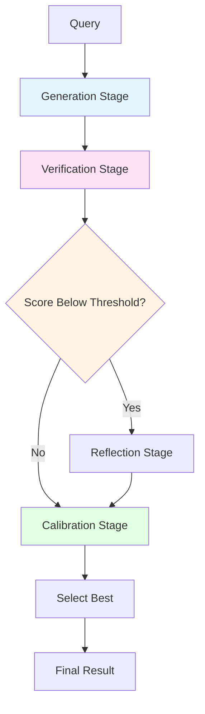

# Accuracy Pipeline Guide

The Accuracy Pipeline orchestrates all accuracy improvement techniques into configurable workflows.

## Overview

The pipeline provides end-to-end accuracy improvement by coordinating generation, verification, reflection, and calibration stages.



## When to Use the Pipeline

| Scenario | Pipeline Benefit |
|----------|-----------------|
| Production systems | Complete, tested workflow |
| Variable difficulty | Adapts processing to query complexity |
| Accuracy-critical | Multiple improvement techniques |
| Cost-sensitive | Optimizes resource usage |

## Basic Pipeline Usage

### Simple Pipeline

```elixir
alias Jido.AI.Accuracy.Pipeline

# Create a basic pipeline
{:ok, pipeline} = Pipeline.new(%{
  stages: [:generation, :verification],
  generator: fn query ->
    ReqLLM.Generation.generate_text("anthropic:claude-3-5-sonnet-20241022", [
      %{role: :user, content: query}
    ])
  end,
  num_candidates: 3
})

# Run the pipeline
{:ok, result} = Pipeline.run(pipeline, "What is 15 * 23?")

# result.best_answer: "345"
# result.metadata: %{num_candidates: 3, verification_scores: [...]}
```

### Advanced Pipeline

```elixir
# Full pipeline with all stages
{:ok, pipeline} = Pipeline.new(%{
  stages: [
    {:generation, %{
      generator: &my_generator/1,
      num_candidates: 5
    }},
    {:verification, %{
      verifier: LLMOutcomeVerifier.new!(%{model: :fast}),
      threshold: 0.6
    }},
    {:reflection, %{
      min_score_threshold: 0.7,
      max_iterations: 2
    }},
    {:calibration, %{
      method: :temperature_scaling,
      min_confidence: 0.8
    }}
  ],
  budget: %{
    max_tokens: 10_000,
    max_duration_ms: 30_000
  }
})
```

## Pipeline Stages

### Generation Stage

Generates candidate responses.

```elixir
stage = GenerationStage.new(%{
  generator: fn query ->
    ReqLLM.Generation.generate_text(model, [
      %{role: :system, content: "You are a helpful assistant."},
      %{role: :user, content: query}
    ])
  end,
  num_candidates: 5,
  temperature_range: {0.0, 1.0}
})
```

### Verification Stage

Scores candidate responses.

```elixir
stage = VerificationStage.new(%{
  verifier: verifier,
  threshold: 0.6,  # Filter candidates below this
  keep_all: false  # or true to keep all with scores
})
```

### Reflection Stage

Improves low-scoring candidates.

```elixir
stage = ReflectionStage.new(%{
  min_score_threshold: 0.7,
  max_iterations: 2,
  convergence_threshold: 0.1
})
```

### Calibration Stage

Adjusts confidence scores.

```elixir
stage = CalibrationStage.new(%{
  method: :temperature_scaling,
  min_confidence: 0.8,
  fallback: :reject  # or :keep, :refine
})
```

## Preset Configurations

```elixir
alias Jido.AI.Accuracy.Presets

# Cost-optimized preset
{:ok, pipeline} = Presets.cost_optimized(%{
  generator: &my_generator/1
})

# Balanced preset (recommended)
{:ok, pipeline} = Presets.balanced(%{
  generator: &my_generator/1
})

# Quality-optimized preset
{:ok, pipeline} = Presets.quality_optimized(%{
  generator: &my_generator/1
})
```

### Preset Comparison

| Preset | Candidates | Reflection | Best For |
|--------|------------|------------|----------|
| `:cost_optimized` | 3-5 | 1 iteration | Cost-sensitive |
| `:balanced` | 5-7 | 2 iterations | **General use** |
| `:quality_optimized` | 10+ | 3 iterations | Accuracy-critical |

## Pipeline Result

```elixir
{:ok, result} = Pipeline.run(pipeline, query)

# result.best_answer: The selected best answer
# result.confidence: Confidence score
# result.metadata: %{
#   num_candidates: 5,
#   verification_passed: 3,
#   reflection_iterations: 1,
#   calibration_applied: true,
#   total_tokens: 1250,
#   duration_ms: 3500
# }
```

## Compute Budgeting

Control resource usage:

```elixir
{:ok, pipeline} = Pipeline.new(%{
  stages: [:generation, :verification],
  budget: %{
    max_tokens: 5000,
    max_duration_ms: 10_000,
    max_cost_usd: 0.10
  }
})

# The pipeline will stop if budget is exceeded
case Pipeline.run(pipeline, complex_query) do
  {:ok, result} ->
    # Success within budget
  {:error, :budget_exceeded, metadata} ->
    # Ran out of resources
    IO.puts("Exceeded budget: #{metadata.limit}")
end
```

## Telemetry

Pipelines emit telemetry for monitoring:

```elixir
# Attach telemetry handler
:telemetry.attach(
  "pipeline-monitor",
  [:jido, :ai, :pipeline, :complete],
  &handle_pipeline_event/4,
  nil
)

def handle_pipeline_event(event, measurements, metadata, config) do
  IO.puts("""
  Pipeline completed in #{measurements.duration}ms
  Candidates: #{metadata.num_candidates}
  Final score: #{metadata.final_score}
  """)
end
```

## Best Practices

1. **Start simple** - Begin with generation + verification
2. **Add stages incrementally** - Reflection, calibration as needed
3. **Monitor costs** - Use budgets to control spending
4. **Track metrics** - Use telemetry to optimize
5. **Use presets** - Presets are well-tuned starting points

## Complete Example

```elixir
defmodule MyApp.AccuracyService do
  alias Jido.AI.Accuracy.Pipeline

  def answer(query) do
    {:ok, pipeline} = Pipeline.new(%{
      stages: [
        {:generation, %{
          generator: &generate/1,
          num_candidates: 5
        }},
        {:verification, %{
          verifier: LLMOutcomeVerifier.new!(%{model: :fast}),
          threshold: 0.6
        }},
        {:reflection, %{
          min_score_threshold: 0.7,
          max_iterations: 1
        }}
      ],
      budget: %{
        max_tokens: 3000,
        max_duration_ms: 10_000
      }
    })

    case Pipeline.run(pipeline, query) do
      {:ok, result} ->
        {:ok, result.best_answer, result.metadata}

      {:error, reason} ->
        # Fallback to direct generation
        {:ok, fallback} = generate_direct(query)
        {:ok, fallback, %{method: :direct}}
    end
  end

  defp generate(query) do
    ReqLLM.Generation.generate_text("anthropic:claude-3-5-sonnet-20241022", [
      %{role: :user, content: query}
    ])
  end
end
```

## Next Steps

- [Overview Guide](./01_overview.md) - System overview
- [Strategies Guide](./02_strategies.md) - Reasoning strategies
- [Self-Consistency Guide](./03_self_consistency.md) - Individual techniques
