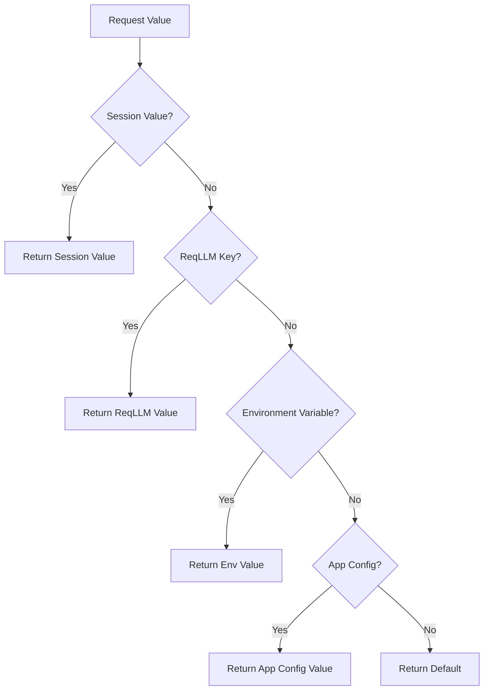

# Configuration

Jido AI provides flexible configuration management through the `Jido.AI.Keyring` module and convenience functions in the `Jido.AI` facade. Configuration values are resolved through a hierarchical priority system.

## Configuration Priority

Values are resolved in this order (highest priority first):

1. **Session values** - Per-process overrides via `Keyring.set_session_value/3`
2. **ReqLLM integration** - Via `ReqLLM.get_key/1`
3. **Environment variables** - Via `.env` files and system environment
4. **Application config** - Under `:jido_ai, :keyring`
5. **Default values** - Fallback when no value found

## Environment Variables

### Setting API Keys

The most common way to configure API keys is through environment variables:

```bash
# OpenAI
export OPENAI_API_KEY="sk-your-openai-key"

# Anthropic
export ANTHROPIC_API_KEY="your-anthropic-key"

# Google
export GOOGLE_API_KEY="your-google-key"

# Azure
export AZURE_API_KEY="your-azure-key"
export AZURE_API_BASE="https://your-resource.openai.azure.com"
```

### .env Files

Jido AI automatically loads environment variables from `.env` files:

```bash
# .env
OPENAI_API_KEY=sk-your-key
ANTHROPIC_API_KEY=your-anthropic-key
```

Environment files are loaded from:
- `.env` in the project root
- `envs/.env`
- `envs/.{environment}.env` (e.g., `.dev.env`, `.test.env`)
- `envs/.{environment}.overrides.env`

## Jido.AI Facade Functions

The `Jido.AI` module provides convenient functions for accessing configuration:

### Getting API Keys

```elixir
# Get API key for a provider
api_key = Jido.AI.api_key(:openai)
api_key = Jido.AI.api_key(:anthropic)
```

### Getting Model Names

```elixir
# Get default model name for a provider
model = Jido.AI.model_name(:openai)     # => "gpt-4o"
model = Jido.AI.model_name(:anthropic)  # => "claude-3-5-sonnet-20241022"
model = Jido.AI.model_name(:azure)      # => "gpt-4o"
model = Jido.AI.model_name(:ollama)     # => "llama3.2"
```

### Getting Provider Config

```elixir
# Get complete configuration for a provider
config = Jido.AI.provider_config(:openai)
# => %{api_key: "sk-...", model: "gpt-4o", ...}
```

### Getting Any Config Value

```elixir
# Get any configuration key with optional default
value = Jido.AI.config(:max_tokens, 1000)
value = Jido.AI.config(:temperature, 0.7)

# Alias for config/2
value = Jido.AI.get(:my_setting)
value = Jido.AI.get(:my_setting, "default")
```

### Listing Available Keys

```elixir
# List all configured keys
keys = Jido.AI.list_keys()
# => [:openai_api_key, :anthropic_api_key, ...]
```

## Session Values

Session values provide per-process configuration overrides, useful for testing or multi-tenant scenarios.

### Setting Session Values

```elixir
# Set a session value for the current process
Jido.AI.set_session_value(:openai_api_key, "test-key")

# Using Keyring directly
Jido.AI.Keyring.set_session_value(:my_key, "override_value")

# For a specific process
Jido.AI.Keyring.set_session_value(:my_key, "value", some_pid)
```

### Getting Session Values

```elixir
# Get session value for current process
value = Jido.AI.get_session_value(:my_key)

# Using Keyring directly
value = Jido.AI.Keyring.get_session_value(:my_key)

# For a specific process
value = Jido.AI.Keyring.get_session_value(:my_key, some_pid)
```

### Clearing Session Values

```elixir
# Clear a specific session value
Jido.AI.clear_session_value(:my_key)

# Clear all session values for current process
Jido.AI.clear_all_session_values()

# Clear for a specific process
Jido.AI.Keyring.clear_session_value(:my_key, some_pid)
Jido.AI.Keyring.clear_all_session_values(some_pid)
```

## Application Configuration

Configure Jido AI in your `config/config.exs`:

```elixir
config :jido_ai,
  openai_api_key: System.get_env("OPENAI_API_KEY"),
  anthropic_api_key: System.get_env("ANTHROPIC_API_KEY"),
  default_provider: :openai,
  default_temperature: 0.7

config :jido_ai, :keyring,
  custom_key: "custom_value"
```

## ReqLLM Integration

Jido AI integrates with ReqLLM for enhanced API key resolution:

```elixir
# Get API key with ReqLLM integration
api_key = Jido.AI.api_key_with_reqllm(:openai)

# With per-request override
options = %{api_key: "sk-override"}
api_key = Jido.AI.api_key_with_reqllm(:openai, options)
```

### Listing Available Providers

```elixir
# List all providers with their configuration status
providers = Jido.AI.list_available_providers()
# => [
#   %{provider: :openai, source: :configured},
#   %{provider: :anthropic, source: :configured},
#   %{provider: :google, source: :not_configured},
#   ...
# ]
```

## Keyring API

The `Jido.AI.Keyring` module provides the low-level configuration API:

### Getting Values

```elixir
alias Jido.AI.Keyring

# Get a value (checks session, ReqLLM, environment, app config)
value = Keyring.get(:my_key)
value = Keyring.get(:my_key, "default")

# Get environment-only value (skips session)
value = Keyring.get_env_value(:my_key)
value = Keyring.get_env_value(:my_key, "default")
```

### Checking Values

```elixir
# Check if a value exists and is non-empty
Keyring.has_value?("sk-abc123")  # => true
Keyring.has_value?("")          # => false
Keyring.has_value?(nil)         # => false
```

### Direct Environment Access

```elixir
# Get an environment variable directly
value = Keyring.get_env_var("OPENAI_API_KEY")
value = Keyring.get_env_var("MY_VAR", "default")
```

## Configuration Flow



## Testing Configuration

In tests, use session values to override configuration:

```elixir
defmodule MyTest do
  use ExUnit.Case

  setup do
    # Set test values
    Jido.AI.set_session_value(:openai_api_key, "test-key")

    on_exit(fn ->
      # Clean up
      Jido.AI.clear_all_session_values()
    end)
  end

  test "uses test API key" do
    assert Jido.AI.api_key(:openai) == "test-key"
  end
end
```

## LiveBook Support

Jido AI supports LiveBook-prefixed environment variables. Keys prefixed with `lb_` are automatically recognized:

```elixir
# In LiveBook
System.put_env("LB_OPENAI_API_KEY", "livebook-key")

# Jido AI resolves it automatically
Jido.AI.api_key(:openai)  # => "livebook-key"
```
