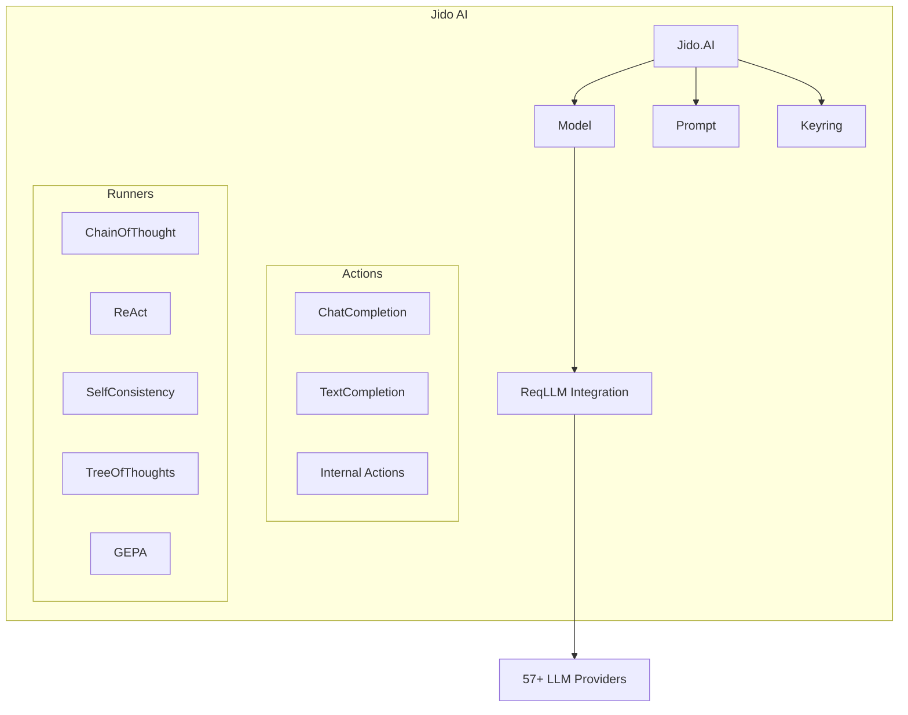

# Getting Started with Jido AI

Jido AI is an Elixir library that provides a unified interface for working with Large Language Models (LLMs) from multiple providers. Built on top of [ReqLLM](https://hex.pm/packages/req_llm), it supports 57+ providers including OpenAI, Anthropic, Google, and many more.

## Installation

Add `jido_ai` to your list of dependencies in `mix.exs`:

```elixir
def deps do
  [
    {:jido_ai, "~> 0.5.3"}
  ]
end
```

Then fetch dependencies:

```bash
mix deps.get
```

## Configuration

### Environment Variables

The simplest way to configure API keys is through environment variables:

```bash
export OPENAI_API_KEY="sk-your-key-here"
export ANTHROPIC_API_KEY="your-anthropic-key"
```

### Application Config

You can also configure keys in your `config/config.exs`:

```elixir
config :jido_ai,
  openai_api_key: System.get_env("OPENAI_API_KEY"),
  anthropic_api_key: System.get_env("ANTHROPIC_API_KEY")
```

## Quick Start

### Creating a Model

Models represent an LLM configuration. Use `Jido.AI.Model.from/1` to create models:

```elixir
# From a tuple with provider and options
{:ok, model} = Jido.AI.Model.from({:openai, [model: "gpt-4o"]})

# From a string identifier
{:ok, model} = Jido.AI.Model.from("anthropic:claude-3-5-sonnet-20241022")

# Using provider defaults
{:ok, model} = Jido.AI.Model.from(:openai)
```

### Creating Prompts

Prompts define the messages to send to the LLM:

```elixir
# Simple user message
prompt = Jido.AI.Prompt.new(:user, "What is the capital of France?")

# With system context
prompt = Jido.AI.Prompt.new(%{
  messages: [
    %{role: :system, content: "You are a helpful geography assistant."},
    %{role: :user, content: "What is the capital of France?"}
  ]
})
```

### Running Chat Completions

Use the `ChatCompletion` action to generate responses:

```elixir
alias Jido.AI.Actions.ReqLlm.ChatCompletion
alias Jido.AI.{Model, Prompt}

# Create model and prompt
{:ok, model} = Model.from({:openai, [model: "gpt-4o"]})
prompt = Prompt.new(:user, "What is 2 + 2?")

# Run the completion
{:ok, result, _directives} = ChatCompletion.run(%{
  model: model,
  prompt: prompt
})

IO.puts(result.content)
# => "2 + 2 equals 4."
```

## Architecture Overview



## Key Concepts

### Models

Models encapsulate provider configuration and are created via `Jido.AI.Model.from/1`. They support various input formats for flexibility.

See [Models Guide](models.md) for details.

### Prompts

Prompts define the conversation messages sent to LLMs. They support templating with EEx and Liquid engines.

See [Prompts Guide](prompts.md) for details.

### Configuration

The `Jido.AI.Keyring` manages API keys and configuration with support for environment variables, application config, and session overrides.

See [Configuration Guide](configuration.md) for details.

### Runners

Runners implement advanced reasoning patterns like Chain-of-Thought and ReAct. They integrate with Jido agents to enhance instruction execution.

See [Runners Guide](runners/overview.md) for details.

## Next Steps

- [Models Guide](models.md) - Learn about model creation and configuration
- [Prompts Guide](prompts.md) - Master prompt templating and rendering
- [Configuration Guide](configuration.md) - Configure API keys and settings
- [Chat Completion Guide](chat-completion.md) - Detailed chat completion usage
- [Runners Overview](runners/overview.md) - Advanced reasoning patterns
