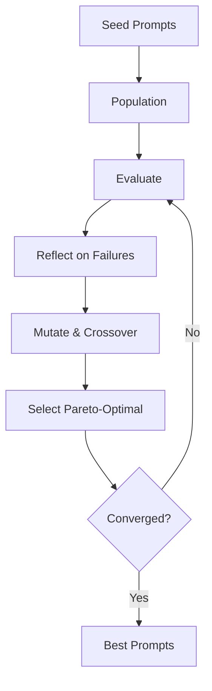

# GEPA Runner

The `Jido.AI.Runner.GEPA` runner implements Genetic-Pareto Prompt Optimization using evolutionary algorithms guided by LLM reflection. It achieves 10-19% performance gains with 35x fewer evaluations than reinforcement learning methods.

## Overview

GEPA treats prompt optimization as an evolutionary search problem:



## Key Features

- **Multi-Objective Optimization**: Balances accuracy, cost, latency, and robustness
- **LLM-Guided Evolution**: Uses language feedback for targeted improvements
- **Sample Efficient**: 35x fewer evaluations than RL methods
- **Pareto Frontier**: Maintains diverse high-performing solutions

## Basic Usage

```elixir
alias Jido.AI.Runner.GEPA

# Define test inputs
test_inputs = [
  "What is 2 + 2?",
  "Explain photosynthesis",
  "Write a haiku about coding"
]

{:ok, result} = GEPA.run(
  test_inputs: test_inputs,
  population_size: 10,
  max_generations: 20
)

IO.puts("Best prompt: #{hd(result.best_prompts).prompt}")
IO.puts("Fitness: #{hd(result.best_prompts).fitness}")
```

## Configuration Options

### Population Parameters

| Option | Type | Default | Description |
|--------|------|---------|-------------|
| `population_size` | integer | 10 | Prompts per generation |
| `max_generations` | integer | 20 | Evolution cycles |
| `evaluation_budget` | integer | 200 | Hard limit on evaluations |
| `seed_prompts` | list(string) | [] | Initial prompt templates |

### Evaluation Parameters

| Option | Type | Default | Description |
|--------|------|---------|-------------|
| `test_inputs` | list | required | Test inputs for evaluation |
| `expected_outputs` | list | nil | Expected outputs for accuracy |
| `model` | string | nil | LLM model for evaluation |

### Evolution Parameters

| Option | Type | Default | Description |
|--------|------|---------|-------------|
| `mutation_rate` | float | 0.3 | Probability of mutation |
| `crossover_rate` | float | 0.7 | Probability of crossover |
| `parallelism` | integer | 5 | Concurrent evaluations |

### Multi-Objective Parameters

| Option | Type | Default | Description |
|--------|------|---------|-------------|
| `objectives` | list(atom) | all four | Objectives to optimize |
| `objective_weights` | map | %{} | Weights for objectives |

### Advanced Options

| Option | Type | Default | Description |
|--------|------|---------|-------------|
| `enable_reflection` | boolean | true | Use LLM reflection |
| `enable_crossover` | boolean | true | Use crossover operator |
| `convergence_threshold` | float | 0.001 | Minimum improvement |

## Objectives

Available optimization objectives:

| Objective | Description |
|-----------|-------------|
| `:accuracy` | Correctness of responses |
| `:cost` | Token/API cost efficiency |
| `:latency` | Response time |
| `:robustness` | Consistency across inputs |
| `:conciseness` | Response brevity |
| `:completeness` | Response thoroughness |

```elixir
{:ok, result} = GEPA.run(
  test_inputs: inputs,
  objectives: [:accuracy, :cost],  # Only optimize these
  objective_weights: %{
    accuracy: 0.7,  # Prioritize accuracy
    cost: 0.3
  }
)
```

## Result Structure

```elixir
%{
  best_prompts: [
    %{
      prompt: "Think step by step. First analyze...",
      fitness: 0.85,
      objectives: %{
        accuracy: 0.9,
        cost: 0.2,
        latency: 150,
        robustness: 0.8
      }
    },
    # ... more prompts
  ],
  pareto_frontier: [
    # Prompts representing different trade-offs
  ],
  final_generation: 20,
  total_evaluations: 180,
  history: [...],  # Per-generation metrics
  convergence_reason: :max_generations_reached,
  duration_ms: 45000
}
```

## Seed Prompts

Provide initial prompts to guide evolution:

```elixir
{:ok, result} = GEPA.run(
  test_inputs: inputs,
  seed_prompts: [
    "Think step by step",
    "Break down the problem into parts",
    "Consider multiple approaches before answering"
  ],
  population_size: 15
)
```

## With Jido Agent

```elixir
defmodule OptimizerAgent do
  use Jido.Agent,
    name: "optimizer_agent",
    runner: Jido.AI.Runner.GEPA,
    actions: [EvaluatePrompt]
end

{:ok, agent} = OptimizerAgent.new()

# Store configuration in agent state
agent = Jido.Agent.set(agent, :gepa_config, %{
  population_size: 15,
  max_generations: 30,
  test_inputs: test_data
})

{:ok, optimized_agent, directives} = GEPA.run(agent)

# Access results from agent state
best_prompts = optimized_agent.state.gepa_best_prompts
pareto_frontier = optimized_agent.state.gepa_pareto_frontier
```

## Agent State Updates

After optimization, the agent state contains:

| Key | Description |
|-----|-------------|
| `gepa_best_prompts` | Best prompts from final generation |
| `gepa_pareto_frontier` | Pareto-optimal solutions |
| `gepa_history` | Metrics per generation |
| `gepa_config` | Configuration used |
| `gepa_last_run` | Run metadata |

## Directives

The runner returns directives:

```elixir
{:ok, agent, directives} = GEPA.run(agent)

Enum.each(directives, fn
  {:optimization_complete, summary} ->
    IO.puts("Optimization complete!")
    IO.puts("Best fitness: #{hd(summary.best_prompts).fitness}")

  {:best_prompt, %{prompt: prompt, fitness: fitness}} ->
    IO.puts("Top prompt (fitness #{fitness}): #{prompt}")
end)
```

## Pareto Frontier

The Pareto frontier contains prompts representing different trade-offs:

```elixir
{:ok, result} = GEPA.run(test_inputs: inputs)

IO.puts("Pareto frontier solutions:")
Enum.each(result.pareto_frontier, fn solution ->
  IO.puts("---")
  IO.puts("Prompt: #{String.slice(solution.prompt, 0..50)}...")
  IO.puts("Accuracy: #{solution.objectives.accuracy}")
  IO.puts("Cost: #{solution.objectives.cost}")
end)
```

## Convergence

The optimizer can converge for different reasons:

```elixir
{:ok, result} = GEPA.run(test_inputs: inputs)

case result.convergence_reason do
  :max_generations_reached ->
    IO.puts("Completed all #{result.final_generation} generations")

  :budget_exhausted ->
    IO.puts("Evaluation budget exhausted")

  :convergence_detected ->
    IO.puts("Early convergence at generation #{result.final_generation}")
end
```

## Performance Characteristics

| Metric | Value |
|--------|-------|
| Accuracy improvement | 10-19% |
| Sample efficiency | 35x better than RL |
| Duration | Minutes to hours |
| Cost | population_size x generations x inputs |

## Best Practices

1. **Start small**: Begin with 10 population, 20 generations
2. **Use seed prompts**: Guide evolution with known good prompts
3. **Choose relevant objectives**: Don't optimize all six at once
4. **Provide diverse test inputs**: Cover different use cases
5. **Monitor convergence**: Check if more generations help

## Example: Optimizing a Task Prompt

```elixir
alias Jido.AI.Runner.GEPA

# Test inputs covering different scenarios
test_inputs = [
  "Summarize this article about AI",
  "Extract key points from the text",
  "What are the main arguments?",
  "Identify the author's conclusion"
]

# Seed prompts to start evolution
seed_prompts = [
  "Read carefully and summarize",
  "Extract the main ideas",
  "Analyze the content systematically"
]

{:ok, result} = GEPA.run(
  test_inputs: test_inputs,
  seed_prompts: seed_prompts,
  population_size: 15,
  max_generations: 25,
  objectives: [:accuracy, :conciseness],
  mutation_rate: 0.4,
  parallelism: 5
)

IO.puts("Optimization complete!")
IO.puts("Generations: #{result.final_generation}")
IO.puts("Evaluations: #{result.total_evaluations}")
IO.puts("Duration: #{result.duration_ms}ms")
IO.puts("")
IO.puts("Best prompt:")
IO.puts(hd(result.best_prompts).prompt)
IO.puts("")
IO.puts("Pareto frontier size: #{length(result.pareto_frontier)}")
```

## See Also

- [Runners Overview](overview.md)
- [Chain of Thought](chain-of-thought.md) - Single-path reasoning
- [Self-Consistency](self-consistency.md) - Multi-path voting
