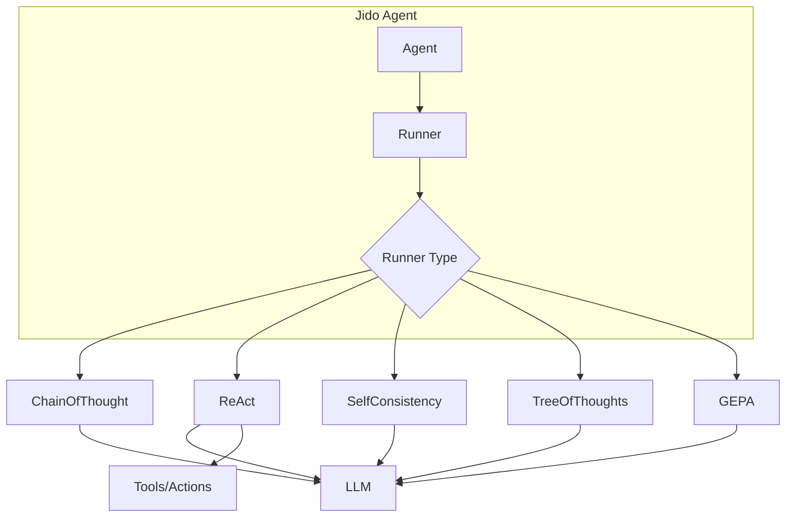

# Runners Overview

Runners in Jido AI implement advanced reasoning patterns that enhance agent instruction execution. They integrate with the Jido agent system to provide step-by-step reasoning, iterative problem-solving, and multi-path exploration.

## Available Runners

| Runner | Pattern | Use Case | Accuracy Gain | Cost Multiplier |
|--------|---------|----------|---------------|-----------------|
| [ChainOfThought](chain-of-thought.md) | Zero-shot CoT | General reasoning | 8-15% | 3-4x |
| [ReAct](react.md) | Reasoning + Acting | Information gathering | 27.4% | 10-20x |
| [SelfConsistency](self-consistency.md) | Multi-path voting | Mission-critical decisions | 17.9% | 5-10x |
| [TreeOfThoughts](tree-of-thoughts.md) | Tree search | Complex planning | 70% | 50-150x |
| [GEPA](gepa.md) | Evolutionary optimization | Prompt improvement | 10-19% | Variable |

## Architecture



## Basic Usage

Runners implement the `Jido.Runner` behaviour and are used with Jido agents:

```elixir
defmodule MyAgent do
  use Jido.Agent,
    name: "reasoning_agent",
    runner: Jido.AI.Runner.ChainOfThought,
    actions: [MyAction]
end

# Create agent and run with reasoning
{:ok, agent} = MyAgent.new()
agent = Jido.Agent.enqueue(agent, MyAction, %{input: "complex task"})
{:ok, updated_agent, directives} = Jido.AI.Runner.ChainOfThought.run(agent)
```

### Direct Runner Usage

Runners can also be called directly without an agent:

```elixir
# ReAct for information gathering
{:ok, result} = Jido.AI.Runner.ReAct.run(
  question: "What is the capital of the country where the Eiffel Tower is located?",
  tools: [search_tool],
  max_steps: 10
)

# Self-Consistency for reliable answers
{:ok, result} = Jido.AI.Runner.SelfConsistency.run(
  problem: "What is 15% of 80?",
  sample_count: 5,
  temperature: 0.7
)

# Tree of Thoughts for complex planning
{:ok, result} = Jido.AI.Runner.TreeOfThoughts.run(
  problem: "Make 24 using 4, 5, 6, 6",
  search_strategy: :bfs,
  beam_width: 3
)
```

## Choosing a Runner

### ChainOfThought
Best for: **General reasoning tasks**
- Complex multi-step problems
- Tasks requiring explanation
- When you need transparent reasoning
- Cost-sensitive applications

### ReAct
Best for: **Information gathering**
- Multi-source research
- Iterative investigation
- Tasks requiring external tools
- Real-world knowledge queries

### SelfConsistency
Best for: **Mission-critical decisions**
- High-stakes answers
- Mathematical reasoning
- Logic problems
- When accuracy is paramount

### TreeOfThoughts
Best for: **Complex planning**
- Algorithmic problems
- Game solving (puzzles, planning)
- Exhaustive search required
- When cost is not a primary concern

### GEPA
Best for: **Prompt optimization**
- Improving existing prompts
- Finding optimal prompt variations
- Multi-objective optimization
- When you have evaluation data

## Runner Comparison

### Performance vs Cost

```
Accuracy Gain
     ^
     |                              ToT
 70% +                               *
     |
 30% +              ReAct *
     |
 20% +    SC *
     |
 15% + CoT *
     |
     +----+----+----+----+----+----+----> Cost
          3x   5x   10x  20x  50x  150x
```

### When to Use Each

| Scenario | Recommended Runner |
|----------|-------------------|
| Quick reasoning with explanation | ChainOfThought |
| Research with multiple sources | ReAct |
| Important calculation | SelfConsistency |
| Puzzle or game solving | TreeOfThoughts |
| Prompt engineering | GEPA |
| Real-time application | ChainOfThought |
| Batch processing | Any (based on accuracy needs) |

## Configuration

All runners accept configuration options:

```elixir
# Via agent state
agent = Jido.Agent.set(agent, :cot_config, %{
  mode: :zero_shot,
  model: "gpt-4o",
  temperature: 0.2
})

# Via run options
{:ok, agent, directives} = Runner.run(agent,
  mode: :structured,
  max_iterations: 3
)
```

## Error Handling

Runners provide graceful fallback to direct execution:

```elixir
{:ok, agent, directives} = ChainOfThought.run(agent,
  fallback_on_error: true  # Falls back to simple execution if reasoning fails
)
```

## Combining Runners

For complex applications, you can combine runner patterns:

```elixir
# Use ReAct for research, then SelfConsistency for final answer
{:ok, research_result} = ReAct.run(question: "...", tools: tools)

{:ok, final_result} = SelfConsistency.run(
  problem: "Based on #{research_result.answer}, what is...?",
  sample_count: 5
)
```

## Performance Tips

1. **Start simple**: Begin with ChainOfThought before trying more expensive runners
2. **Match to task**: Use the right runner for the task complexity
3. **Budget constraints**: Consider cost multipliers for production
4. **Parallel where possible**: SelfConsistency and ToT can parallelize LLM calls
5. **Cache results**: For repeated similar queries, cache intermediate results

## Further Reading

- [Chain of Thought](chain-of-thought.md)
- [ReAct](react.md)
- [Self-Consistency](self-consistency.md)
- [Tree of Thoughts](tree-of-thoughts.md)
- [GEPA](gepa.md)
