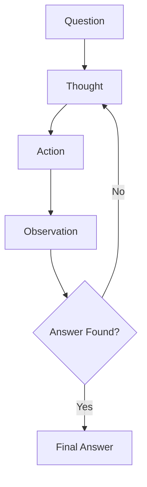

# ReAct Runner

The `Jido.AI.Runner.ReAct` runner implements the ReAct (Reasoning + Acting) pattern that interleaves reasoning with action execution. It shows +27.4% improvement on HotpotQA benchmark for multi-hop reasoning tasks.

## Overview

ReAct enables multi-source research and information gathering by iterating through a thought-action-observation loop:



## The ReAct Loop

1. **Thought**: Generate reasoning about what to do next
2. **Action**: Select and execute a tool based on the thought
3. **Observation**: Capture and process the result
4. **Repeat**: Continue until answer found or max steps reached

## Basic Usage

```elixir
alias Jido.AI.Runner.ReAct

{:ok, result} = ReAct.run(
  question: "What is the capital of the country where the Eiffel Tower is located?",
  tools: [search_tool, wikipedia_tool],
  max_steps: 10
)

IO.puts(result.answer)
# => "Paris"
```

## Configuration Options

| Option | Type | Default | Description |
|--------|------|---------|-------------|
| `question` | string | required | The question to answer |
| `tools` | list | required | Available tools/actions |
| `max_steps` | integer | 10 | Maximum reasoning steps |
| `temperature` | float | 0.7 | Temperature for thought generation |
| `thought_template` | string | default | Custom thought prompt template |
| `thought_fn` | function | nil | Custom thought function (testing) |
| `context` | map | %{} | Additional context for tools |

## Tools

Tools are Jido.Action modules that the runner can call:

```elixir
defmodule MyTools.Search do
  use Jido.Action,
    name: "search",
    description: "Search the web for information",
    schema: [
      query: [type: :string, required: true]
    ]

  def run(%{query: query}, _context) do
    # Perform search
    {:ok, %{results: ["Result 1", "Result 2"]}}
  end
end

defmodule MyTools.Calculator do
  use Jido.Action,
    name: "calculator",
    description: "Perform mathematical calculations",
    schema: [
      expression: [type: :string, required: true]
    ]

  def run(%{expression: expr}, _context) do
    # Evaluate expression
    {:ok, %{result: 42}}
  end
end

{:ok, result} = ReAct.run(
  question: "What is the population of France divided by 2?",
  tools: [MyTools.Search, MyTools.Calculator]
)
```

## Result Structure

```elixir
%{
  answer: "The answer to the question",
  steps: 5,
  trajectory: [
    %{
      step_number: 1,
      thought: "I need to search for information",
      action: "search",
      action_input: "population of France",
      observation: "France has a population of ~67 million",
      final_answer: nil
    },
    %{
      step_number: 2,
      thought: "Now I need to divide by 2",
      action: "calculator",
      action_input: "67000000 / 2",
      observation: "33500000",
      final_answer: nil
    },
    %{
      step_number: 3,
      thought: "I have the answer",
      action: nil,
      action_input: nil,
      observation: nil,
      final_answer: "33.5 million"
    }
  ],
  success: true,
  reason: :answer_found,
  metadata: %{
    max_steps: 10,
    temperature: 0.7,
    tools_used: %{"search" => 1, "calculator" => 1}
  }
}
```

## Step-by-Step Execution

Execute one step at a time for fine-grained control:

```elixir
# Initialize state
state = %{
  question: "What year was Elixir created?",
  tools: [search_tool],
  trajectory: [],
  step_number: 0,
  max_steps: 10,
  temperature: 0.7,
  thought_template: "...",
  thought_fn: nil,
  context: %{}
}

# Execute single step
case ReAct.execute_step(state) do
  {:continue, updated_state, step} ->
    IO.inspect(step)
    # Continue with updated_state

  {:finish, final_state, final_step} ->
    IO.puts("Answer: #{final_step.final_answer}")

  {:error, reason} ->
    IO.puts("Error: #{inspect(reason)}")
end
```

## Custom Thought Template

Customize the reasoning prompt:

```elixir
custom_template = """
You are a research assistant answering: {question}

Available tools:
{tools}

Previous work:
{trajectory}

Think carefully about what to do next.

Format:
Thought: <your reasoning>
Action: <tool_name>
Action Input: <input for tool>

Or if you have the answer:
Thought: <final reasoning>
Final Answer: <the answer>
"""

{:ok, result} = ReAct.run(
  question: "...",
  tools: tools,
  thought_template: custom_template
)
```

## Error Handling

### Max Steps Reached

When the loop doesn't find an answer within max_steps:

```elixir
{:ok, result} = ReAct.run(question: "...", tools: [], max_steps: 3)

if result.success do
  IO.puts("Answer: #{result.answer}")
else
  case result.reason do
    :max_steps_reached ->
      IO.puts("Could not find answer within #{result.steps} steps")
      IO.inspect(result.trajectory)

    :answer_found ->
      # Should not happen with success: false
      :ok
  end
end
```

### Tool Errors

Tool errors are recorded as observations:

```elixir
# If a tool fails, the observation shows the error
%{
  step_number: 2,
  thought: "I need to search",
  action: "search",
  action_input: "query",
  observation: "Error executing search: {:error, :rate_limited}",
  final_answer: nil
}
```

## Performance Characteristics

| Metric | Value |
|--------|-------|
| Accuracy improvement | +27.4% (HotpotQA) |
| Cost multiplier | 10-20x |
| Latency | Depends on steps |
| Best for | Multi-hop reasoning |

## Best Practices

1. **Design good tools**: Clear names and descriptions help the LLM choose correctly
2. **Set reasonable max_steps**: Start with 10, adjust based on task complexity
3. **Provide context**: Use the context parameter for shared state
4. **Handle errors gracefully**: Tools should return informative error messages
5. **Review trajectory**: Log trajectories for debugging and improvement

## Example: Research Task

```elixir
defmodule ResearchTools.WikiSearch do
  use Jido.Action,
    name: "wiki_search",
    description: "Search Wikipedia for information about a topic"
  # ...
end

defmodule ResearchTools.WebSearch do
  use Jido.Action,
    name: "web_search",
    description: "Search the web for recent information"
  # ...
end

{:ok, result} = ReAct.run(
  question: "When was the company that created Elixir founded?",
  tools: [
    ResearchTools.WikiSearch,
    ResearchTools.WebSearch
  ],
  max_steps: 15,
  context: %{api_key: "..."}
)

# Trajectory shows the reasoning process:
# Step 1: Search for Elixir programming language
# Step 2: Found it was created by José Valim at Plataformatec
# Step 3: Search for when Plataformatec was founded
# Step 4: Found answer -> Final Answer: 2006
```

## See Also

- [Runners Overview](overview.md)
- [Chain of Thought](chain-of-thought.md) - Simpler reasoning
- [Self-Consistency](self-consistency.md) - For higher confidence
