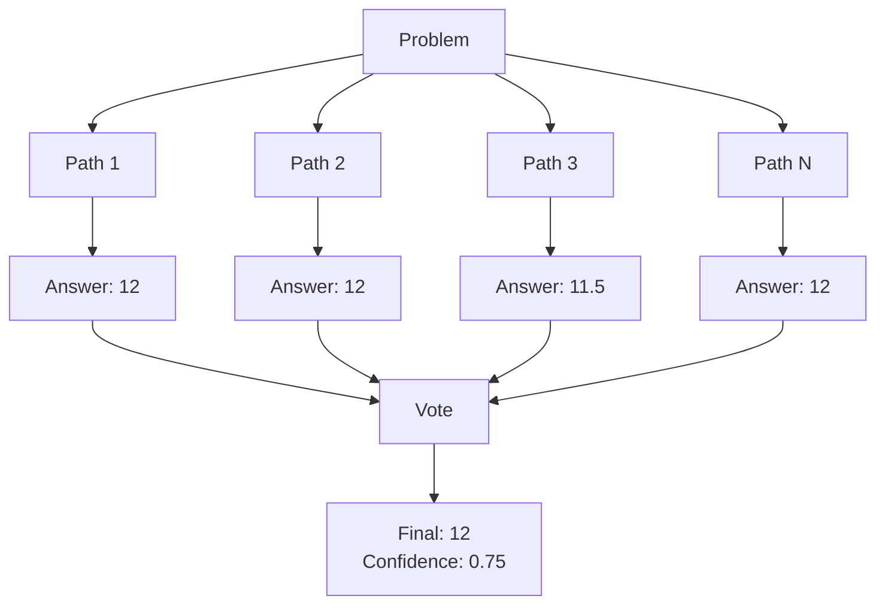

# Self-Consistency Runner

The `Jido.AI.Runner.SelfConsistency` runner implements Self-Consistency Chain-of-Thought reasoning. It generates multiple independent reasoning paths and selects the most reliable answer through voting, showing +17.9% accuracy improvement on GSM8K.

## Overview

Self-Consistency improves reliability by:
1. Generating multiple diverse reasoning paths
2. Extracting and normalizing answers
3. Using voting to select the most common answer
4. Filtering low-quality paths before voting



## Basic Usage

```elixir
alias Jido.AI.Runner.SelfConsistency

{:ok, result} = SelfConsistency.run(
  problem: "What is 15% of 80?",
  sample_count: 5,
  temperature: 0.7
)

IO.puts("Answer: #{result.answer}")
IO.puts("Confidence: #{result.confidence}")
IO.inspect(result.votes)
# => %{"12" => 4, "11.5" => 1}
```

## Configuration Options

| Option | Type | Default | Description |
|--------|------|---------|-------------|
| `problem` | string | required | The problem to solve |
| `sample_count` | integer | 5 | Number of reasoning paths |
| `temperature` | float | 0.7 | Temperature for diversity |
| `diversity_threshold` | float | 0.3 | Minimum diversity between paths |
| `quality_threshold` | float | 0.5 | Minimum quality to include path |
| `voting_strategy` | atom | `:majority` | Voting mechanism |
| `min_consensus` | float | 0.4 | Minimum agreement required |
| `reasoning_fn` | function | nil | Custom reasoning function |
| `parallel` | boolean | true | Use parallel execution |

## Result Structure

```elixir
%{
  answer: "12",
  confidence: 0.8,
  consensus: 0.8,
  paths: [
    %{
      reasoning: "Step 1: 15% = 0.15. Step 2: 0.15 * 80 = 12",
      answer: "12",
      confidence: 0.9,
      quality_score: 0.85
    },
    %{
      reasoning: "15/100 * 80 = 1200/100 = 12",
      answer: "12",
      confidence: 0.85,
      quality_score: 0.82
    },
    # ... more paths
  ],
  votes: %{"12" => 4, "11.5" => 1},
  metadata: %{
    sample_count: 5,
    paths_generated: 5,
    paths_after_quality: 5,
    paths_after_diversity: 4
  }
}
```

## Voting Strategies

### Majority Voting (`:majority`)

Simple vote counting - the most common answer wins:

```elixir
{:ok, result} = SelfConsistency.run(
  problem: "What is 2 + 2?",
  voting_strategy: :majority
)
```

### Confidence-Weighted (`:confidence_weighted`)

Votes are weighted by path confidence:

```elixir
{:ok, result} = SelfConsistency.run(
  problem: "What is the derivative of x^2?",
  voting_strategy: :confidence_weighted
)
```

## Quality and Diversity Filtering

### Quality Threshold

Paths below the quality threshold are filtered out:

```elixir
{:ok, result} = SelfConsistency.run(
  problem: "Solve: 2x + 5 = 15",
  quality_threshold: 0.6  # Only include high-quality paths
)
```

### Diversity Threshold

Prevents near-duplicate paths from dominating:

```elixir
{:ok, result} = SelfConsistency.run(
  problem: "What is 3 * 7?",
  diversity_threshold: 0.4  # Higher = more diverse paths required
)
```

## Parallel Execution

By default, reasoning paths are generated in parallel:

```elixir
# Parallel (default) - faster
{:ok, result} = SelfConsistency.run(
  problem: "...",
  parallel: true
)

# Sequential - for debugging or rate limiting
{:ok, result} = SelfConsistency.run(
  problem: "...",
  parallel: false
)
```

## Consensus Requirements

Set minimum consensus for accepting an answer:

```elixir
{:ok, result} = SelfConsistency.run(
  problem: "Important calculation",
  min_consensus: 0.6  # 60% agreement required
)

# Low consensus triggers error
case result do
  {:ok, %{consensus: c}} when c >= 0.6 ->
    IO.puts("High confidence answer")

  {:error, {:insufficient_consensus, actual_consensus}} ->
    IO.puts("Only #{actual_consensus * 100}% agreement - not reliable")
end
```

## Sample Count Tuning

More samples increase reliability but cost more:

```elixir
# Quick check (lower cost)
{:ok, result} = SelfConsistency.run(
  problem: "...",
  sample_count: 3
)

# High reliability (higher cost)
{:ok, result} = SelfConsistency.run(
  problem: "Mission-critical calculation",
  sample_count: 10
)
```

## Custom Reasoning Function

For testing or custom LLM integration:

```elixir
custom_reasoning = fn i ->
  # Custom reasoning generation
  "Path #{i}: The answer is #{12 + rem(i, 2)}"
end

{:ok, result} = SelfConsistency.run(
  problem: "Test problem",
  reasoning_fn: custom_reasoning,
  sample_count: 5
)
```

## Error Handling

### Insufficient Valid Paths

If too many paths fail:

```elixir
case SelfConsistency.run(problem: "...") do
  {:ok, result} ->
    IO.puts("Answer: #{result.answer}")

  {:error, :insufficient_valid_paths} ->
    IO.puts("Could not generate enough valid reasoning paths")
end
```

### No Valid Answers

If answers cannot be extracted:

```elixir
case SelfConsistency.run(problem: "...") do
  {:ok, result} ->
    IO.puts("Answer: #{result.answer}")

  {:error, :no_valid_answers_extracted} ->
    IO.puts("Could not extract answers from reasoning paths")
end
```

### Insufficient Consensus

If agreement is too low:

```elixir
case SelfConsistency.run(problem: "...", min_consensus: 0.7) do
  {:ok, result} ->
    IO.puts("Confident answer: #{result.answer}")

  {:error, {:insufficient_consensus, consensus}} ->
    IO.puts("Low agreement (#{consensus * 100}%) - answer unreliable")
end
```

## Performance Characteristics

| Metric | Value |
|--------|-------|
| Accuracy improvement | +17.9% (GSM8K) |
| Cost multiplier | 5-10x (based on sample_count) |
| Latency | Parallelized |
| Best for | Mathematical reasoning, logic |

## Best Practices

1. **Start with 5 samples**: Good balance of cost and reliability
2. **Use higher samples for critical decisions**: 7-10 for important answers
3. **Set appropriate consensus**: 0.4-0.6 for most tasks
4. **Enable parallel execution**: Much faster for multiple samples
5. **Review vote distribution**: High variance suggests ambiguous problems

## Example: Mathematical Problem

```elixir
{:ok, result} = SelfConsistency.run(
  problem: """
  A store has a 20% off sale. An item originally costs $75.
  If there's an additional $10 coupon, what's the final price?
  """,
  sample_count: 7,
  temperature: 0.7,
  quality_threshold: 0.5,
  min_consensus: 0.5
)

IO.puts("Answer: #{result.answer}")
IO.puts("Confidence: #{Float.round(result.confidence, 2)}")
IO.puts("Vote distribution:")
Enum.each(result.votes, fn {answer, count} ->
  IO.puts("  #{answer}: #{count} votes")
end)
```

## See Also

- [Runners Overview](overview.md)
- [Chain of Thought](chain-of-thought.md) - Single-path reasoning
- [Tree of Thoughts](tree-of-thoughts.md) - Structured search
