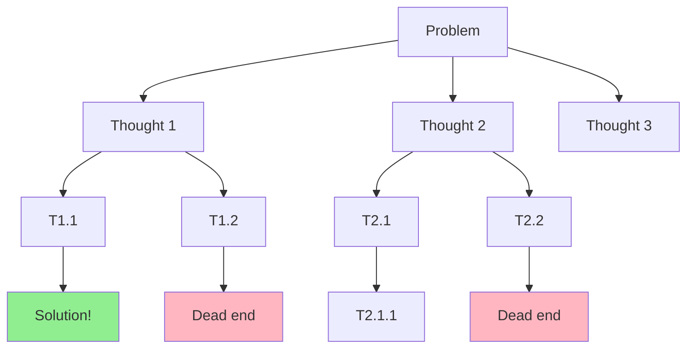

# Tree of Thoughts Runner

The `Jido.AI.Runner.TreeOfThoughts` runner implements Tree-of-Thoughts (ToT) reasoning with systematic exploration of reasoning branches. It shows +74% success rate improvement on the Game of 24 benchmark.

## Overview

ToT explores multiple reasoning branches with lookahead and backtracking:



## Search Strategies

### BFS (Breadth-First Search)

Explores level-by-level, good for finding optimal solutions:

```elixir
{:ok, result} = TreeOfThoughts.run(
  problem: "Make 24 using 4, 5, 6, 6",
  search_strategy: :bfs,
  beam_width: 3,
  max_depth: 4
)
```

### DFS (Depth-First Search)

Explores deeply first, memory efficient:

```elixir
{:ok, result} = TreeOfThoughts.run(
  problem: "Solve the puzzle",
  search_strategy: :dfs,
  max_depth: 6
)
```

### Best-First Search

Always expands the highest-value node (like A*):

```elixir
{:ok, result} = TreeOfThoughts.run(
  problem: "Find optimal solution",
  search_strategy: :best_first,
  budget: 100
)
```

## Basic Usage

```elixir
alias Jido.AI.Runner.TreeOfThoughts

{:ok, result} = TreeOfThoughts.run(
  problem: "Make 24 using 4, 5, 6, 6",
  search_strategy: :bfs,
  beam_width: 3,
  max_depth: 4,
  evaluation_strategy: :value
)

IO.puts("Answer: #{result.answer}")
IO.puts("Success: #{result.success}")
IO.puts("Nodes evaluated: #{result.nodes_evaluated}")
```

## Configuration Options

| Option | Type | Default | Description |
|--------|------|---------|-------------|
| `problem` | string | required | Problem to solve |
| `initial_state` | map | %{} | Starting state |
| `search_strategy` | atom | `:bfs` | Search algorithm |
| `beam_width` | integer | 3 | Thoughts per node |
| `max_depth` | integer | 5 | Maximum tree depth |
| `evaluation_strategy` | atom | `:value` | How to evaluate thoughts |
| `budget` | integer | 100 | Maximum nodes to evaluate |
| `solution_check` | function | nil | Custom solution checker |
| `thought_fn` | function | nil | Custom thought generation |
| `evaluation_fn` | function | nil | Custom evaluation |

## Result Structure

```elixir
%{
  answer: "(6-4)*(6+5) = 2*12 = 24",
  success: true,
  solution_path: [
    %TreeNode{thought: "Problem: Make 24...", depth: 0},
    %TreeNode{thought: "Try (6-4) = 2", depth: 1},
    %TreeNode{thought: "(6+5) = 11", depth: 2},
    %TreeNode{thought: "2 * 12 = 24", depth: 3, state: %{answer: "24"}}
  ],
  tree: %Tree{...},
  search_steps: 15,
  nodes_evaluated: 47,
  reason: :solution_found,
  metadata: %{
    tree_size: 47,
    max_depth_reached: 4,
    budget: 100,
    budget_used: 47
  }
}
```

## Evaluation Strategies

### Value (`:value`)

Direct value estimation of each thought:

```elixir
{:ok, result} = TreeOfThoughts.run(
  problem: "...",
  evaluation_strategy: :value
)
```

### Vote (`:vote`)

Multiple evaluations with voting:

```elixir
{:ok, result} = TreeOfThoughts.run(
  problem: "...",
  evaluation_strategy: :vote
)
```

### Heuristic (`:heuristic`)

Domain-specific heuristic evaluation:

```elixir
{:ok, result} = TreeOfThoughts.run(
  problem: "...",
  evaluation_strategy: :heuristic
)
```

### Hybrid (`:hybrid`)

Combination of strategies:

```elixir
{:ok, result} = TreeOfThoughts.run(
  problem: "...",
  evaluation_strategy: :hybrid
)
```

## Custom Solution Checker

Define when a node is considered a solution:

```elixir
solution_check = fn node ->
  # Check if node state contains answer "24"
  node.state[:answer] == "24"
end

{:ok, result} = TreeOfThoughts.run(
  problem: "Make 24 using 4, 5, 6, 6",
  solution_check: solution_check
)
```

## Budget Management

Control computational cost:

```elixir
# Small budget - faster but may miss solutions
{:ok, result} = TreeOfThoughts.run(
  problem: "...",
  budget: 50
)

# Large budget - more thorough but slower
{:ok, result} = TreeOfThoughts.run(
  problem: "Complex puzzle",
  budget: 200
)
```

## Termination Reasons

The search can terminate for different reasons:

```elixir
{:ok, result} = TreeOfThoughts.run(problem: "...")

case result.reason do
  :solution_found ->
    IO.puts("Found solution: #{result.answer}")

  :budget_exhausted ->
    IO.puts("Budget exhausted. Best node: #{inspect(result.solution_path)}")

  :frontier_exhausted ->
    IO.puts("Explored all possibilities. No solution found.")

  :max_depth_reached ->
    IO.puts("Reached maximum depth without solution.")
end
```

## Custom Thought Generation

Provide custom thought generation for testing:

```elixir
thought_fn = fn opts ->
  problem = opts[:problem]
  depth = opts[:depth]

  # Generate custom thoughts based on problem and depth
  ["Approach A at depth #{depth}", "Approach B at depth #{depth}"]
end

{:ok, result} = TreeOfThoughts.run(
  problem: "...",
  thought_fn: thought_fn
)
```

## Custom Evaluation

Provide custom evaluation function:

```elixir
evaluation_fn = fn thoughts, opts ->
  # Score each thought
  Enum.map(thoughts, fn thought ->
    # Return score 0.0-1.0
    if String.contains?(thought, "promising") do
      0.8
    else
      0.3
    end
  end)
end

{:ok, result} = TreeOfThoughts.run(
  problem: "...",
  evaluation_fn: evaluation_fn
)
```

## Performance Characteristics

| Metric | Value |
|--------|-------|
| Accuracy improvement | +74% (Game of 24) |
| Cost multiplier | 50-150x |
| Best for | Planning, puzzles |
| Memory usage | Depends on strategy |

### Strategy Comparison

| Strategy | Memory | Optimality | Speed |
|----------|--------|------------|-------|
| BFS | High | Optimal | Medium |
| DFS | Low | Not guaranteed | Fast |
| Best-First | Medium | Good | Fast |

## Best Practices

1. **Start with BFS**: Most reliable for finding optimal solutions
2. **Use budget wisely**: Set based on problem complexity
3. **Tune beam_width**: 3-5 for most problems
4. **Custom solution check**: Define clear success criteria
5. **Monitor tree size**: Large trees indicate difficult problems

## Example: Puzzle Solving

```elixir
alias Jido.AI.Runner.TreeOfThoughts

# Define solution checker
solution_check = fn node ->
  Map.get(node.state, :result) == 24
end

{:ok, result} = TreeOfThoughts.run(
  problem: """
  Make 24 using the numbers 4, 5, 6, 6.
  You can use +, -, *, / operations.
  Each number must be used exactly once.
  """,
  search_strategy: :bfs,
  beam_width: 4,
  max_depth: 5,
  budget: 100,
  solution_check: solution_check
)

if result.success do
  IO.puts("Solution found!")
  IO.puts("Answer: #{result.answer}")
  IO.puts("Steps: #{length(result.solution_path)}")

  IO.puts("\nSolution path:")
  Enum.each(result.solution_path, fn node ->
    IO.puts("  #{node.thought}")
  end)
else
  IO.puts("No solution found. Reason: #{result.reason}")
  IO.puts("Best attempt: #{inspect(result.solution_path)}")
end
```

## When to Use

Use Tree of Thoughts when:
- Problem requires exhaustive exploration
- Multiple valid solution paths exist
- Planning or scheduling tasks
- Puzzle or game solving
- Cost is not the primary concern

Do not use when:
- Simple queries (use basic CoT)
- Cost-sensitive applications
- Real-time requirements (<1s)

## See Also

- [Runners Overview](overview.md)
- [Chain of Thought](chain-of-thought.md) - Simpler, faster
- [Self-Consistency](self-consistency.md) - Multi-path voting
