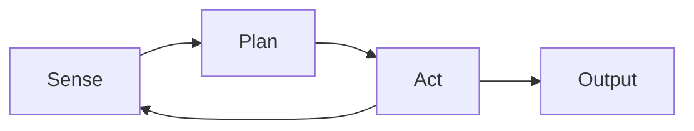
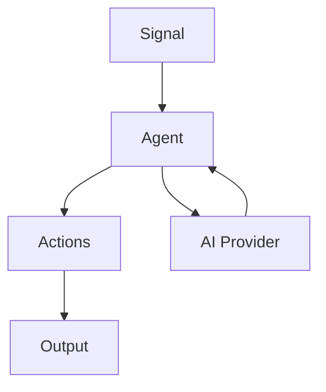

# Jido: An Introduction to Autonomous Agents in Elixir

## 1. Title & Welcome
- Title: "Jido: An Introduction to Autonomous Agents in Elixir"
- Speaker introduction
- Animated GIF of agents in action for engagement

## 2. Agenda
- What are autonomous agents?
- Two mental models for understanding agents
- Why Elixir is perfect for agents
- Jido overview and core concepts
- Live demos with Livebooks
- Q&A and how to get involved

## 3. Why Should We Care About Agents?
### Real-World Examples
- Roomba navigating your house
- CI/CD pipelines responding to code changes
- Trading bots reacting to market conditions
- Chatbots handling customer support

### The Pain Without Agents
- Hard-coded scripts that break easily
- Brittle cron jobs with no adaptability
- Manual processes that don't scale

## 4. Mental Model #1: The Sense-Plan-Act Loop



- **Sense**: Gather information from environment
- **Plan**: Decide what to do based on current state
- **Act**: Execute the decision
- Loop continues based on new environmental state

## 5. Mental Model #2: ETL Data Pipeline
- **Extract**: Input data from sources
- **Transform**: Process and analyze data
- **Load**: Output results or take actions
- Think `Enum.map/3` but with decision-making in between

## 6. Transition: Why Elixir?
"Whether we think in loops or pipelines, we need a runtime that loves concurrency..."

## 7. Elixir + BEAM: Built for Agents
### Actor Model Alignment
- Lightweight processes (actors) map perfectly to agent components
- Message passing for inter-agent communication
- Built-in `Agent` module for stateful processes

### Fault Tolerance
- Supervision trees for resilient agent systems
- "Let it crash" philosophy for self-healing agents

### Massive Concurrency
- Millions of processes for complex agent networks
- No shared state concerns

## 8. Enter Jido
### Origin Story
- Grew out of trading bot platform (late 2024)
- Inspired by Eliza OS ecosystem
- 1.0 release: December 30, 2024

### Core Philosophy
- **Data-driven core**: Everything is data structures
- **No magic**: Explicit, inspectable operations  
- **Ecosystem-first**: Build compatible, composable tools

**Key Principle: You don't need LLMs for agents!**

## 9. Installation
```elixir
# Core packages
{:jido, "~> 1.0"}
{:jido_ai, "~> 1.0"}  # Optional: for LLM integration
```

## 10. Core Concept: Signals
- Event envelopes that carry data through the system
- Define what happened, when, and relevant context
- Trigger agent responses and state changes

## 11. Core Concept: Actions  
- Command pattern implementation
- Discrete, testable building blocks
- Rich metadata for introspection and chaining

## 12. Core Concept: AI Integration
- Optional LLM providers (OpenAI, Anthropic, etc.)
- Tool calling and structured outputs
- Modeled after Vercel AI SDK

## 13. Core Concept: Agent Types
### Stateless Agents
- Pure functions: Signal → [Actions]
- Easy to test and reason about

### Stateful Agents  
- GenServer-wrapped agents
- Handle complex workflows and memory
- Signal-driven communication

## 14. How the Pieces Fit Together


## 15. Demo Transition
"Let's see this in action with two practical examples..."

## 16. Demo #1: Calculator Agent Livebook
- Building a stateless agent
- Signal → Action flow
- Data inspection and debugging

## 17. Demo #2: Weather Agent Livebook  
- LLM-powered agent
- External API integration
- Stateful agent patterns

## 18. Roadmap & Getting Involved
- Upcoming features
- Community contributions welcome
- Package ecosystem growth

## 19. Thank You & Q&A
- Links to documentation and repos
- Community channels

---

## Presentation Notes
- **Target Time**: 35-40 minutes + 10 min Q&A
- **Theory/Practice Balance**: 40% theory, 60% applied
- **Font Size**: ≥28pt for virtual viewing
- **Fallback**: Pre-record demo GIFs in case of technical issues
- **Engagement**: Share repo links at start of demos
