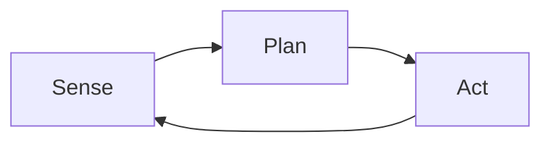

# Jido

### An Introduction to Autonomous Agents in Elixir


<!--
Notes:
- Quick wave, intro, encourage questions in chat.
-->

---
layout: image-right
image: https://pbs.twimg.com/profile_images/1915872662544408576/L23Sh_sm_400x400.jpg
---

# Who am I?

- Engineering Leader & Entrepreneur
- 20+ years in Open Source
- 8 years with Elixir

<br />

- github.com/mikehostetler
- x.com/mikehostetler


---
layout: default
class: center
---

# What we'll cover

1. What are autonomous agents?  
2. Two mental models for agents
3. Why Elixir is the perfect runtime  
4. Meet Jido: concepts & philosophy  
5. Live demos in Livebook  
6. Q & A

<!--
Notes:
- Keep this slide up for ~45 s while outlining flow.
-->

---
layout: center
---

# Why Should We Care About Agents?

<!--
Notes:
- Agents have been around a long time
- LLM's breathed new life into agents
- Agentic software is here to stay
- This isn't just about LLM's
-->

---

# Sense, Plan, Act

<div v-click="1">



</div>

<v-click at="2">

<br />

* **Sense** – gather data from environment  
* **Plan** – decide what to do based on current state  
* **Act** – execute the decision  
* Loop continues based on new environmental state

</v-click>

<!--

-->

---


# Data Pipeline


<br />

- **Extract**: Input data from sources
- **Transform**: Process and analyze data  
- **Load**: Output results or take actions

---
layout: center
---

# Why Elixir?

"Whether we think in loops or pipelines, we need a runtime that *loves* concurrency…"

---

# Elixir + BEAM: Built for Agents

<v-click at="1">

<h3>Actor Model Alignment</h3>

- Lightweight processes map perfectly to agent components  
- Message passing for inter-agent communication  

</v-click>
<br />
<v-click at="2">

<h3>Fault Tolerance</h3>

- Supervision trees for resilient agent systems  
- "Let it crash" philosophy for self-healing agents

</v-click>

<br />
<v-click at="3">

<h3>Massive Concurrency</h3>

- Millions of processes for complex agent networks  
- No shared state concerns

</v-click>

---
layout: two-cols-header 
---

# Enter Jido

::left::

### Origin Story

<br />

- Trading Bot platform (late 2024)  
- Inspired by Eliza OS 
- 1.0 release: December 30, 2024

::right::

### Core Philosophy

<br />

- **Data-driven core**: Everything is data structures  
- **No magic**: Explicit, inspectable operations  
- **Ecosystem-first**: Build compatible, composable tools

---
layout: statement
---

**Key Principle:** *You don't need LLMs for agents!*

---

# Installing Jido

```elixir
# mix.exs
def deps do
  [
    {:jido, "~> 1.2"},
    {:jido_ai, github: "agentjido/jido_ai", branch: "refactor/models"},

    # Optional, included via :jido
    {:jido_action, github: "agentjido/jido_action"},
    {:jido_signal, github: "agentjido/jido_signal"}
  ]
end
```

_Full Hex releases for version 1.5 coming soon!_

---

# Core Concept: Signals

- Event envelopes that carry data through the system  
- Elixir Struct, based on the Cloud Events spec
- Used in all agent communication

<br />

```elixir
{:ok, signal} = Jido.Signal.new(%{
  type: "user.created", 
  source: "/auth", 
  data: %{id: "123"}
})
```
---

# Core Concept: Actions

- Command pattern implementation  
- Discrete, testable building blocks  
- May include side effects
- _Everything is an action_

<br />

```elixir
defmodule GreetUser do
  use Jido.Action,
    name: "greet_user",
    description: "Greets a user by name",
    schema: [
      name: [type: :string, required: true]
    ]

  def run(%{name: name}, _ctx) do
    {:ok, %{message: "Hello, #{name}!"}}
  end
end
```

---

# Aside: AI Integration

- LLM providers (OpenAI, Anthropic, etc.)  
- Tool calling and structured outputs  
- Modeled after Vercel AI SDK

<br />

```elixir
{:ok, text} = Jido.AI.generate_text(
  "openai:gpt-4o", # Model Spec
  "Say hello then call my greet tool", # Prompt
  tools: [GreetUser] # Available Tools for the LLM
)

# As an Action
Jido.Tools.AI.GenerateText.run/2
```
---

# Core Concept: Stateless Agents

- Pure data structures
- Easy to test and reason about

```elixir
def HelloAgent do
  use Jido.Agent, 
    name: "HelloAgent"
    schema: [
      name: [type: :string, required: true]
    ],
    actions: [GreetUser]
end

{:ok, agent} = HelloAgent.new("agent_id", %{name: "John"})

agent = 
  %HelloAgent{
    id: "agent_id",               # Unique identifier
    state: %{name: "John"},       # Current validated state
    pending_instructions: queue,  # Erlang queue of pending actions
    actions: [GreetUser],         # List of allowed action modules
    dirty_state?: false,          # State modification tracking
    result: nil                   # Last execution result
  }
```

---

# Working with Stateless Agents

```elixir

# First Agent Example
{:ok, agent} = HelloAgent.new("agent_id", %{name: "John"})

{:ok, agent} = HelloAgent.set(agent, %{name: "Jane"}) # Sense

{:ok, agent} = HelloAgent.plan(agent, GreetUser) # Plan

{:ok, agent} = HelloAgent.run(agent, timeout: 10_000) # Act

# First Agent Example
{:ok, agent} = HelloAgent.new("new_agent_id", %{name: "John"}) # Create the Agent

{:ok, agent} = HelloAgent.cmd(agent, GreetUser, %{name: "Mike"}) # Sense, Plan & Act
```

---

# Stateful Agents

- Agent structs wrapped in a GenServer
- Signal-driven communication

```elixir
def HelloAgent do
  use Jido.Agent, 
    name: "HelloAgent"
    schema: [
      name: [type: :string, required: true]
    ],
    actions: [GreetUser]
end

{:ok, pid} = HelloAgent.start_link()

{:ok, result} = Jido.Agent.Server.call(pid, %Signal{type: "greet_user", data: %{name: "John"}})
```

---
layout: center
---

# Demo Time

"Let's see this in action with two practical examples..."

---
layout: center
---

# Live Demo: Calculator Agent

---
layout: center
---

# Live Demo: Weather Agent Revisited

---

# Roadmap & Getting Involved

<br />

## Upcoming

- v1.5 Hex Release
- Enhanced AI provider support  
- More Sensors / Skills / Tools

## How to Contribute

- GitHub: Issues & PRs welcome  
- Discord: https://discord.gg/eFwHxrxA

---
layout: center
---

# Thank You!

**Documentation & Repos:**  
https://github.com/agentjido

**Questions?**

<!--
Notes:
- Leave slide up during Q&A. Share demo links in chat.
-->
