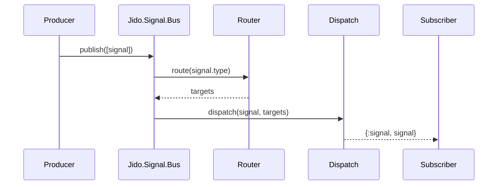

### Slide 1: What is a Signal?

Content:
- CloudEvents-compliant envelope for events, commands, and state changes
- Rich metadata + dispatch config for delivery across processes/systems

Code:
```elixir
# source: projects/jido_signal/guides/getting-started.md
{:ok, signal} = Jido.Signal.new(%{
  type: "user.created",
  source: "/auth/registration",
  data: %{user_id: "123", email: "user@example.com"}
})
```

Notes:
- Signals standardize message structure beyond tuples
- Built around CloudEvents v1.0.2 with Jido extensions
- Works locally (pids) and across systems (PubSub, HTTP, webhooks)

### Slide 2: Core Signal fields and defaults

Content:
- `new/1` fills `id`, `time`, `specversion`, and `source`
- Required: `type`; optional: `subject`, `datacontenttype`, `dataschema`, `data`

Code:
```elixir
# source: projects/jido_signal/test/jido_signal/signal/signal_test.exs
{:ok, signal} = Jido.Signal.new(%{type: "example.event"})
assert is_binary(signal.id)
assert String.length(signal.id) == 36
assert signal.source == "Elixir.JidoTest.SignalTest"
assert signal.type == "example.event"
assert signal.specversion == "1.0.2"
assert String.contains?(signal.time, "T")
```

Notes:
- `source` defaults from caller module; override in attrs
- `id` is UUIDv7 for ordering elsewhere in system

### Slide 3: Define a custom Signal module

Content:
- Use `use Jido.Signal` with type, defaults, and data schema
- `new/2` validates data via NimbleOptions

Code:
```elixir
# source: projects/jido_signal/lib/jido_signal.ex
defmodule MySignal do
  use Jido.Signal,
    type: "my.custom.signal",
    default_source: "/my/service",
    datacontenttype: "application/json",
    schema: [
      user_id: [type: :string, required: true],
      message: [type: :string, required: true]
    ]
end

{:ok, signal} = MySignal.new(%{user_id: "123", message: "Hello"})
```

Notes:
- `schema` errors are formatted via `Jido.Signal.Error`
- You can override runtime fields in `new/2` options

### Slide 4: Dispatch basics (sync vs async)

Content:
- Dispatch a signal to a PID with `:sync` or `:async`
- Multiple destinations supported via list of configs

Code:
```elixir
# source: projects/jido_signal/guides/getting-started.md
config = {:pid, [target: pid, delivery_mode: :sync]}
:ok = Jido.Signal.Dispatch.dispatch(signal, config)

config = {:pid, [target: pid, delivery_mode: :async]}
:ok = Jido.Signal.Dispatch.dispatch(signal, config)
# Process receives: {:signal, signal}
```

Notes:
- Adapters: :pid, :named, :pubsub, :logger, :console, :http, :webhook, :noop
- For large fanout, use `dispatch_batch/3`

### Slide 5: Subscriber process (receive {:signal, signal})

Content:
- A simple `GenServer` can receive signals via `handle_info`
- Use `{:pid, target: pid, delivery_mode: :async}` in subscription

Code:
```elixir
# source: projects/jido_signal/README.md
defmodule MySubscriber do
  use GenServer
  def start_link(_opts), do: GenServer.start_link(__MODULE__, %{})
  def init(state), do: {:ok, state}
  def handle_info({:signal, signal}, state) do
    IO.puts("Received: #{signal.type}")
    {:noreply, state}
  end
end
```

Notes:
- `handle_info/2` pattern is the default for the :pid adapter
- Keep handlers fast; offload heavy work if needed

### Slide 6: Start Bus, subscribe, publish

Content:
- Supervise `Jido.Signal.Bus` and subscribe with a path pattern
- Publish signals; bus routes to matching subscribers

Code:
```elixir
# source: projects/jido_signal/README.md
children = [
  {Jido.Signal.Bus, name: :my_app_bus}
]
Supervisor.start_link(children, strategy: :one_for_one)

alias Jido.Signal.Bus
{:ok, sub_pid} = MySubscriber.start_link([])
{:ok, _id} = Bus.subscribe(:my_app_bus, "user.*", dispatch: {:pid, target: sub_pid})
{:ok, sig} = Jido.Signal.new(%{type: "user.created", source: "/auth", data: %{id: "123"}})
Bus.publish(:my_app_bus, [sig])
```

Notes:
- Paths support exact, `*` (one segment), `**` (multi)
- Bus returns recorded signals on publish

### Slide 7: Persistent subscriptions (ack + reconnect)

Content:
- Durable delivery with `persistent?: true`
- Acknowledge processed signals with `Bus.ack/3`

Code:
```elixir
# source: projects/jido_signal/test/jido_signal/signal/bus_test.exs
{:ok, sub_id} = Bus.subscribe(bus, "test.signal", persistent?: true)
{:ok, signal} = Jido.Signal.new(%{type: "test.signal", source: "/test", data: %{value: 1}})
{:ok, _} = Bus.publish(bus, [signal])
assert_receive {:signal, %Jido.Signal{type: "test.signal"}}
:ok = Bus.ack(bus, sub_id, 1)
```

Notes:
- Persistent worker per subscription manages in-flight and pending signals
- `Bus.reconnect/3` hands off to a new client pid

### Slide 8: Define routes with Router

Content:
- Trie-based router with priority and pattern functions
- Targets can be actions or dispatch configs

Code:
```elixir
# source: projects/jido_signal/test/jido_signal/signal/router_test.exs
routes = [
  {"user.created", :add},
  {"user.*.updated", :multiply},
  {"order.**.completed", :subtract},
  {"user.format", :format_user, 100},
  {"user.enrich", fn s -> Map.has_key?(s.data, :email) end, :enrich_user_data, 90}
]
{:ok, router} = Jido.Signal.Router.new(routes)
```

Notes:
- More specific paths win; then priority; then registration order
- Validation catches invalid paths and matchers

### Slide 9: Routing results and matching

Content:
- Route returns list of targets or error when none match
- Helper `matches?/2` for pattern checks

Code:
```elixir
# source: projects/jido_signal/test/jido_signal/signal/router_test.exs
signal = %Jido.Signal{ id: Jido.Signal.ID.generate!(), source: "/test",
  type: "user.123.updated", data: %{value: 10}}
assert {:ok, [:multiply]} = Jido.Signal.Router.route(router, signal)
```

Notes:
- Use router in front of bus or standalone for mapping types to handlers
- Pattern fns must be fast and side-effect free

### Slide 10: Dispatch adapter example — PubSub

Content:
- Broadcast signals to Phoenix.PubSub topics
- Multiple subscribers receive same signal

Code:
```elixir
# source: projects/jido_signal/test/jido_signal/signal/dispatch_pubsub_test.exs
Phoenix.PubSub.subscribe(@test_pubsub, topic)
assert :ok = Jido.Signal.Dispatch.PubSub.deliver(signal, [target: @test_pubsub, topic: topic])
assert_receive ^signal, 1000
```

Notes:
- Validate opts first via `validate_opts/1` to catch bad target/topic
- Topics are free-form strings; organize by domain

### Slide 11: Replay recent history from the Bus

Content:
- `replay/4` filters by pattern and timestamp
- Returns recorded signals for analysis or backfill

Code:
```elixir
# source: projects/jido_signal/test/jido_signal/signal/bus_test.exs
{:ok, replayed} = Bus.replay(bus, "test.signal.1")
assert hd(replayed).signal.type == "test.signal.1"

{:ok, all_replayed} = Bus.replay(bus, "**")
assert length(all_replayed) == 2
```

Notes:
- Useful for warming new consumers and debugging
- Combine with snapshots for consistent analysis

### Slide 12: Snapshots (point-in-time views)

Content:
- Create, list, read, delete snapshots by path
- Data stored immutably for stable reads

Code:
```elixir
# source: projects/jido_signal/test/jido_signal/signal/bus_test.exs
{:ok, snapshot} = Bus.snapshot_create(bus, "test.signal.1")
{:ok, read_snapshot} = Bus.snapshot_read(bus, snapshot.id)
assert read_snapshot.path == "test.signal.1"
assert map_size(read_snapshot.signals) == 1
```

Notes:
- IDs are opaque; keep refs in state for later reads
- Cleanup old snapshots to control memory

### Slide 13: Journal — causality and conversations

Content:
- Record signals and causal links; query effects and causes
- Group by `subject` (conversation) and trace chains

Code:
```elixir
# source: projects/jido_signal/test/jido_signal/signal/journal_test.exs
journal = Jido.Signal.Journal.new()
s1 = Jido.Signal.new!(type: "test.event", source: "/test")
s2 = Jido.Signal.new!(type: "test.event", source: "/test")
{:ok, journal} = Jido.Signal.Journal.record(journal, s1)
{:ok, journal} = Jido.Signal.Journal.record(journal, s2, s1.id)
effects = Jido.Signal.Journal.get_effects(journal, s1.id)
assert hd(effects).id == s2.id
```

Notes:
- Guards against cycles and invalid temporal order
- Adapter pluggable (ETS, in-memory)

### Slide 14: Serialization for transport/storage

Content:
- `serialize/2` to binary; `deserialize/2` back to Signals
- Supports JSON and Erlang term serializer (MessagePack available)

Code:
```elixir
# source: projects/jido_signal/lib/jido_signal.ex
signal = %Jido.Signal{type: "example.event", source: "/example"}
{:ok, bin} = Jido.Signal.serialize(signal)
{:ok, parsed} = Jido.Signal.deserialize(bin)
```

Notes:
- Choose serializer via opts; defaults from config
- Works for single signal or list of signals

### Slide 15: Testing patterns — Bus publish/subscribe

Content:
- Start a Bus, subscribe, publish, assert receives
- Wildcards enable broad coverage tests

Code:
```elixir
# source: projects/jido_signal/test/jido_signal/signal/bus_test.exs
start_supervised!({Jido.Signal.Bus, name: bus})
{:ok, _subscription} = Jido.Signal.Bus.subscribe(bus, "test.signal")
{:ok, sig} = Jido.Signal.new(%{type: "test.signal", source: "/test", data: %{value: 1}})
{:ok, _} = Jido.Signal.Bus.publish(bus, [sig])
assert_receive {:signal, %Jido.Signal{type: "test.signal"}}
```

Notes:
- Use unique bus names per test to avoid cross-talk
- Tag `:capture_log` to keep output clean

### Slide 16: End-to-end flow (diagram)

Content:
- Creation → Bus → Router → Dispatch → Subscriber
- Pattern-driven fanout and adapter-based delivery

Code:


Notes:
- Keep dispatch async to avoid blocking publishers
- Add middleware (logging, auth) at the Bus level
- Use snapshots/journal for observability
